# [**[会赚钱的软路由]Openwrt下挂docker版甜糖CDN N1/贝壳云/ARM设备 -保姆级原创教程**](https://www.right.com.cn/forum/thread-4048219-1-1.html)

 

帖子后面有各种问题的解决方法，一定要看到最后。 环境： U盘或硬盘（大于等于32G的U盘或其它存储设备。要求是能在N1的usb2.0上稳定运行并且U盘的写入速度大于宽带的上传速度。上传大的建议上硬盘，U盘一般写入速度普遍7-10m/s） Arm设备（刷好带docker的openwrt固件） 旁路由或普通接入设备挂甜糖方案：一个能使用upnp或DMZ的主路由+arm甜糖设备（未配置网络的解决方法：当upnp不生效的时候可以看教程后面通过端口转发的解决方法，如果是小白的直接用dmz指定挂甜糖的ip） 主路由或单臂上挂甜糖的方案：arm主路由或单臂路由设备即可（未配置网络的解决方法：由于主路由或单臂路由上挂甜糖，upnp是没有办给自己建立端口映射的，请按照后面的端口转发教程）主路由或单臂上挂甜糖的方案必须走端口转发的步骤  **一般f大的固件都是自带docker的，可以直接走我的教程，不需要自己初始化docker，本教程不支持U盘启动的openwrt。**** ** 附上电信宽带挂了几天终于有收益了，以下是50m上传一天的收益,100颗星星等于1RMB，满10RMB可提现： 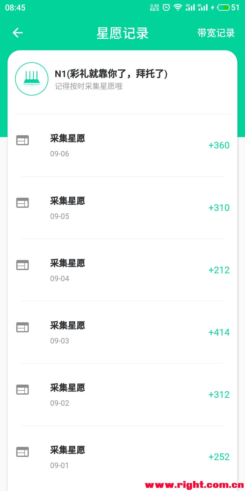 基础教程开始（以N1盒子为例）  0.打开upnp（通用步骤） 注意这里的打开upnp是指打开你的宽带拨号的路由器的upnp。每个人的路由器不一样的就不做演示了。一般百度都能找得到。  1.U盘挂载（通用步骤）  将U盘插入到N1上，然后进入N1后台-系统-挂载点进行设置，请看下面图片教程将U盘挂载到/mnt/ssd1（这一步主要是想让大家的存储设备都挂载到/mnt/ssd1这个路径上，小白不要乱修改路径，采用uuid挂载的好处在于不会因为热插拔或重启设备导致挂载路径发生改变） 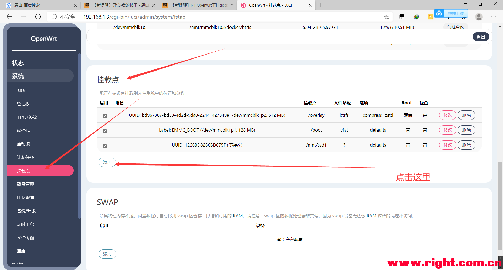 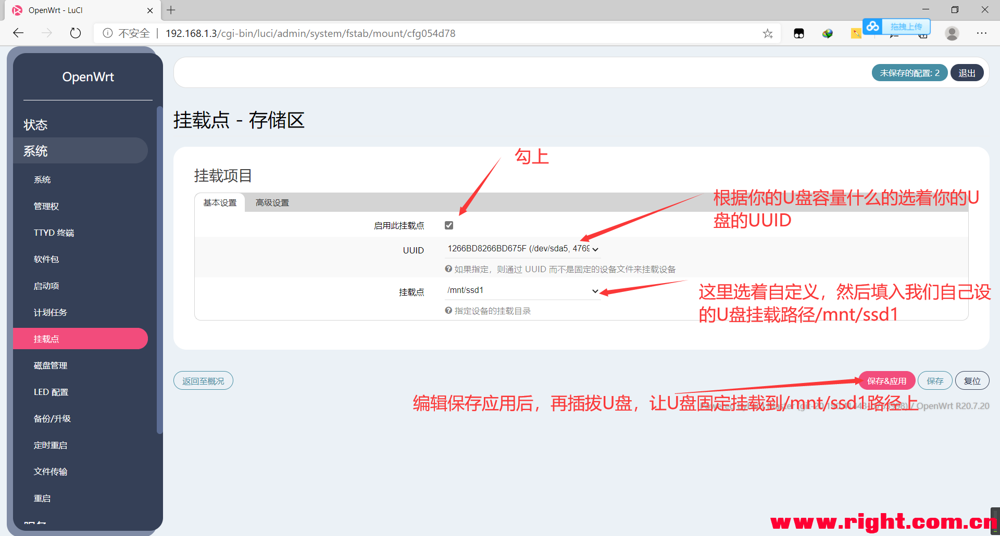  本帖隐藏的内容2.重启设备    3.下载docker镜像并运行新容器（通用步骤） 利用putty或N1的Openwrt固件自带的TTYD终端连接N1的SSH。 按顺序执行以下命令：    （下载慢的，请挂上梯-子来下载）docker run -v /mnt/ssd1:/mnts -d --name ttnode --net=host -i -t --privileged=true --restart=always 744287383/linux-arm64-ttnode /start.sh        #第一次执行命令需要下载镜像。如果下载镜像非常慢的，请按下CTRL+C来中断下载，然后再次执行这条命令重新下载  #/mnt/ssd1为硬盘的挂载路径，:/mnts这个冒号和路径的不能改动，ttnode为容器的名字。                                            *复制代码*#第一次执行命令需要下载镜像。如果下载镜像非常慢的，请按下CTRL+C来中断下载，然后再次执行这条命令重新下载，直到下载变快。 （这一步容易出现的错误有两点，第一点是：提示无法连接链接 检查docker是否运行， 第一点解决方法：出现这个问题大多数是因为你的openwrt是U盘启动的，没有把openwrt写入emmc中。还有一种可能是你的docker没启动，大多数是前者的问题 第二点是：提示docker的存储空间不足， 第二点解决方法：导致这个问题出现的原因是你走了docker初始化的那个教程。大多数固件自带的docker已经是在运行的了，不需要再初始化。重新刷一次固件直接走本教程就好） 出现报错了，要把错误信息复制到百度翻译，这样你就知道报错是什么原因了。  执行完之后是这样子的，不太一样也没关系，只要不报错就好： 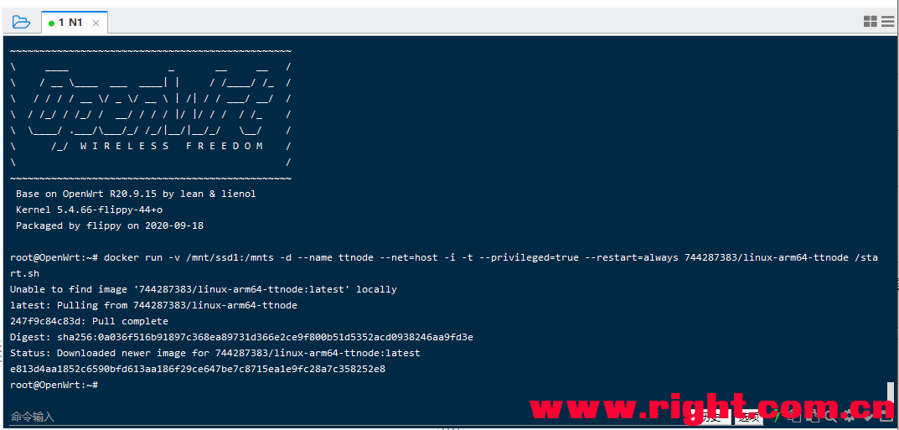  执行到这里，你的甜糖服务端就算是挂起来了，需要等待5分钟后才能绑定设备。   4.手机甜糖客户端APP绑定N1设备（通用步骤） 手机甜糖客户端APP下载：[hide] https://cloud.189.cn/t/bUFn2ebqeQJz（苹果用户请去AppStore搜索“甜糖”下载即可。）  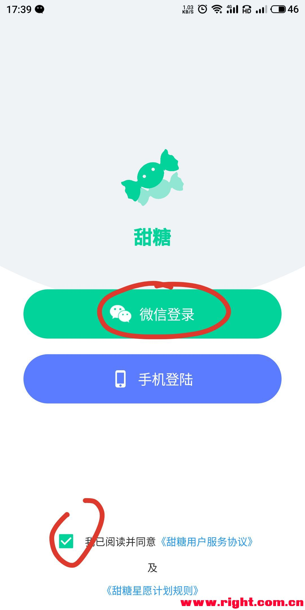 在个人信息中完成手机号绑定后，并且填上内部邀请码123463，只有填上我的邀请码才能获取结算的收益。  绑定设备  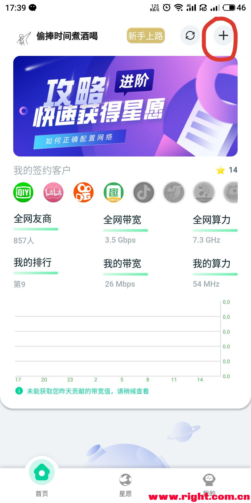 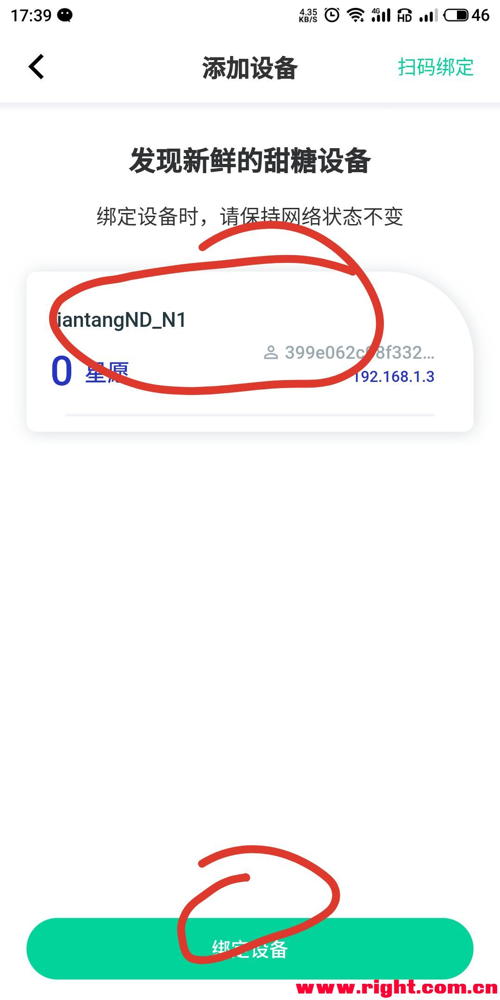 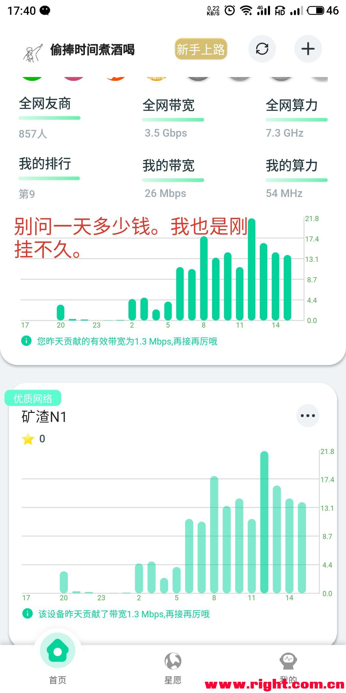  U盘需要一直插在N1上，因为甜糖需要将缓存写入U盘。 需要等待20分钟后绑定的设备的状态才能从获取状态信息变成优质网络。如有发现重启设备uid发生变化的请使用进阶教程。。 如果你绑定的设备出现 未配置网络 的字样，请看下面的解决方法 ↓↓↓↓ 欢迎加入我们的QQ交流群：976784785 1104134068 1038849085 教程都走到这里了，你该不会是想白嫖吧？？？赶紧填上邀请码123463加群。 未配置网络的解决方法（端口转发）：禁止搬运 这个方法是给那些upnp不能生效但又不想用DMZ导致端口全开的人使用。（小白直接用dmz得了） 这个方法很好的解决了DMZ把所有端口都给了甜糖设备的问题，所以upnp不生效也可以通过这个方法解决单宽带多开问题。 疑惑解答：经过测试，如果缓存的文件没有动过手脚的话，这三个端口号是不会发生改变的。即使容器删掉再建都不会变（ip不变，mac不变下），所以不要去动缓存文件哟，会导致端口发生变化哟。 运行下面的命令： docker exec -it ttnode /bin/bash                                        #该命令是进入ttnode容器的命令。ttnode是容器名称*复制代码*ifconfig                                                       #可以查看容器eth0的ip*复制代码*apt install lsof                                          #该命令是安装lsof工具命令*复制代码*lsof -Pnl +M -i4                                          #这是查看程序占用端口的命令*复制代码*  下面的是看图片操作：   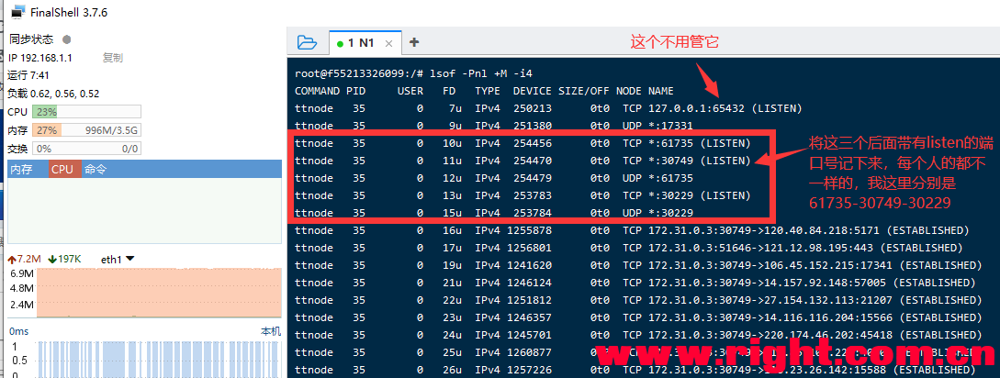   注意：端口转发是在宽带拨号的那个路由器上进行的操作，每个路由器的端口转发的界面都不一样，这是以opewnrt为例。  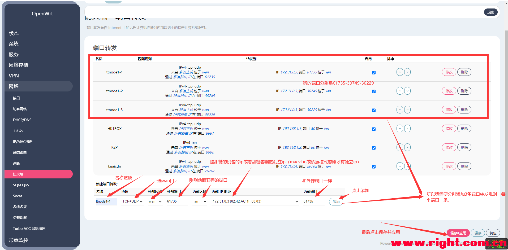  这里的内网ip，如果你走的是基础教程，那么内网ip填你跑甜糖的设备的ip，如果你走的是进阶教程，那么内网ip填写你执行创建容器命令上面的ip 特别提醒：由于甜糖客户端App等下状态非常缓慢，做完端口转发后甜糖没有那么快从未配置网络变成优质节点。所以需要等待一个小时左右才出结果。 感谢某位群友提供的思路。    教程到此结束，以下内容是解决一些问题的方法以及进阶玩法  更换存储设备 因为有些人用U盘挂上了想要更换成硬盘挂上，又不会用docker。所以跟着下面教程。  1.插上硬盘，然后按照本教程的步骤1完成硬盘的挂载先。 2.重启甜糖容器  甜糖容器限制内存的方法（防止机器跑死）： 看图吧，不想码字了。 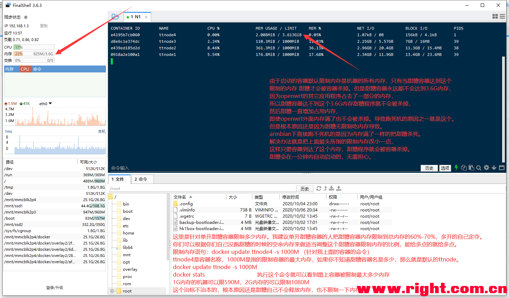 命令：(图片命令打错了，请复制下面的命令 图片命令的-s 改成-m 没有说明的参数不要改)docker update ttnode --memory-swap -1 -m 1080M                                                           #内存大小根据图片里说的自己定夺。*复制代码*docker stats*复制代码*还有一种方法就是挂载swap当虚拟内存，自己折腾，小白勿扰。建议缓存盘不要给太大，很占运行内存的。   甜糖手机客户端app无法搜索到局域网设备解决办法： 连接N1的ssh执行以下命令： docker exec -it ttnode /bin/bash                                #进入容器的命令，ttnode是容器名。修改成自己的容器的名字*复制代码*/usr/node/ttnode -p /mnts                                      #执行甜糖的命令*复制代码*执行结果如下： 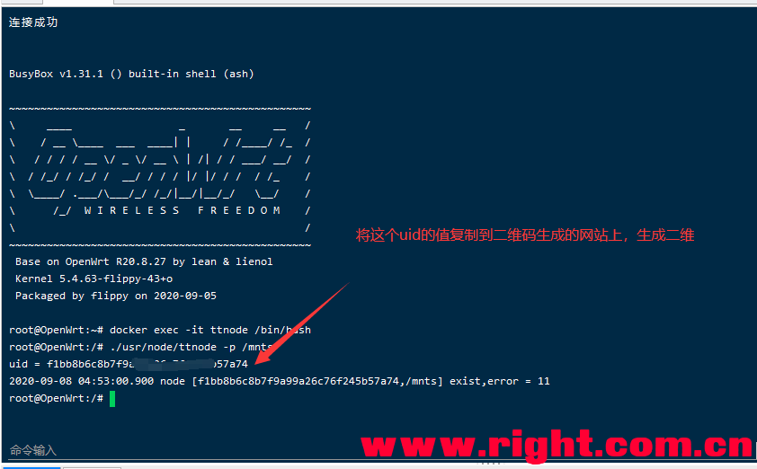  将得到的uid复制粘贴到这个二维码生成的网站，二维码生成后请用甜糖客户端app扫码绑定设备：[二维码生成请点击这里](http://2v.dedecms.com/)  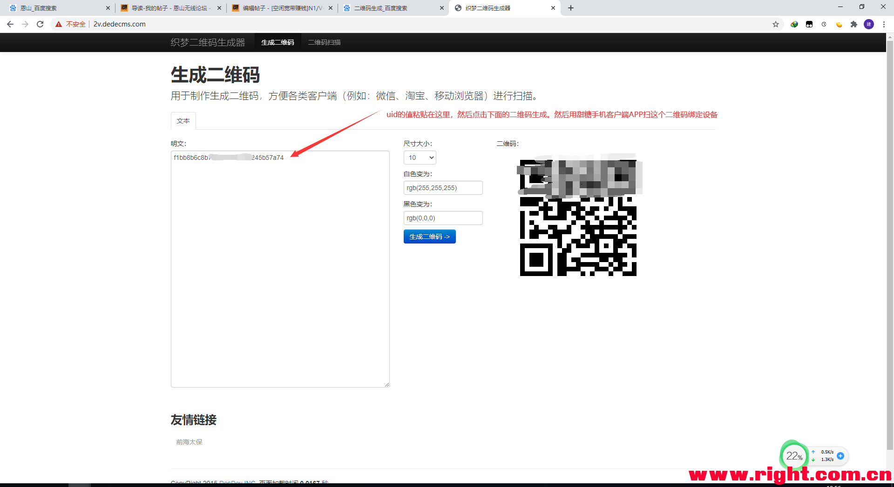   甜糖多开进阶篇：（这下面开始不是小白教程了，小白就不要折腾了） macvlan模式多开： 看得懂就玩，看不懂就算了。（填了我的邀请码并且上传大于50M的可以手把手教，其它的自己群里讨论）。本帖隐藏的内容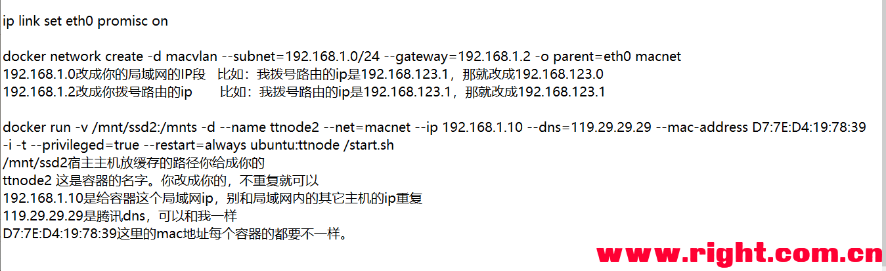  ip link set eth0 promisc on                                                  #如果lan口没有取消桥接的请用br-lan替换掉命令中eth0，不是openwrt系统的请用ifconfig查看网口名称*复制代码*docker network create -d macvlan --subnet=192.168.1.0/24 --gateway=192.168.1.2 -o parent=eth0 macnet                           #如果lan口没有取消桥接的请用br-lan替换掉命令中eth0，不是openwrt系统的请用ifconfig查看网口名称*复制代码*docker run -v /mnt/ssd1:/mnts -d --name ttnode --net=macnet --ip 192.168.1.254 --dns=119.29.29.29 -i -t --privileged=true --restart=always 744287383/linux-arm64-ttnode /start.sh         *复制代码*桥接模式多开： 经过测试，主路由和单臂路由上挂甜糖不能用macvlan的方式多开甜糖，解决方法：采用docker桥接模式+端口转发的方式多开甜糖。（楼主正在用的方式）docker network create --subnet=172.111.0.0/24 macnet                #创建172.111.0网段网络。单拨用户福利：创建多个网段的网络，在不同网段的网络下，每个网段网络里创建一个甜糖容器，可以解决单ip多开上传被评分的问题（多个容器从平分上传关系转换成了多个容器竞争上传的关系）*复制代码*docker run -v /mnt/ssd1:/mnts -d --net=macnet --ip 172.111.0.2 --dns=119.29.29.29 --name ttnode -i -t --privileged=true --restart=always 744287383/linux-arm64-ttnode /start.sh    *复制代码*这里需要选成接受转发容器里才有网络：  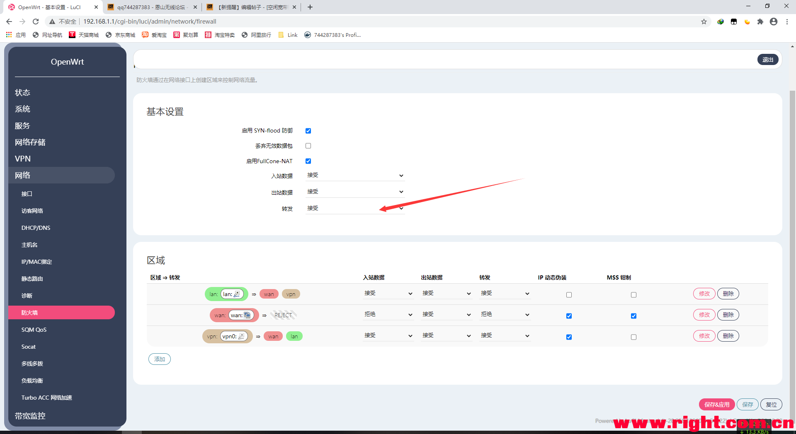  由于桥接模式的容器流量都是走docker0接口或其它br-*****的接口。我们甚至可以使用SQM进行限速SQM Qos插件进行甜糖容器限速.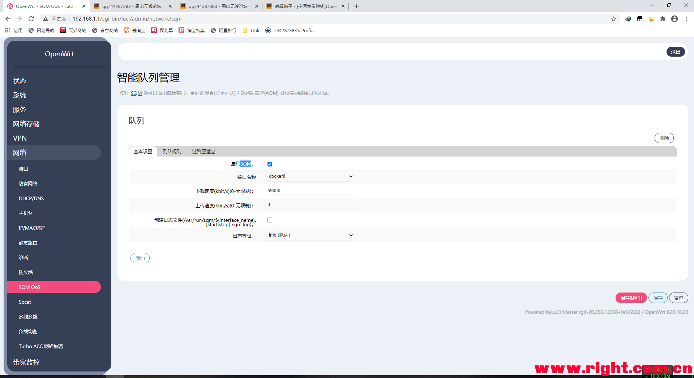  Docker甜糖限速方案： 方案1：通过macvlan方式创建的甜糖容器具有独立ip，拨号路由可以通过ip限速。（挂甜糖的设备作为旁路由或直接接入的设备的时候使用的方案） 方案2：同过桥接模式创建的甜糖容器上网的流量都是经过docker0或br-*****的接口，只需SQM QOS对docker0进行限速。（挂甜糖的设备作为单臂路由或主路由的时候使用的方案） 其它方案：有些高级的路由器可以让某些数据包优先通过的也可以使用，这样就不用平常玩游戏视频什么的流量优先级会变高，就会优先转发这些数据。 参考文献：（感谢以下文章的作者）  docker容器共享缓存方法： 只需要再创建命令上再加一个-v得参数映射cache文件夹，例如我新创建一个容器共享进阶教程中的那个容器的缓存（旧缓存的路径 /mnt/ssd1/.yfnode/cahe）： docker run -v /mnt/ssd1/ttnode2:/mnts -v /mnt/ssd1/.yfnode/cache:/mnts/.yfnode/cache -d --name ttnode2 --net=macnet --ip 172.111.0.3 --dns=119.29.29.29 -i -t --privileged=true --restart=always 744287383/linux-arm64-ttnode /start.sh #-v /mnt/ssd1/ttnode2:/mnts  中的 /mnt/ssd1/ttnode2路径为新容器放置缓存和配置的路径（/mnt/ssd1下的ttnode2文件加中） # -v /mnt/ssd1/.yfnode/cache:/mnts/.yfnode/cache 中的/mnt/ssd1/.yfnode/cache是第一份缓存的cache文件夹！ #冒号后面的路径不要修改*复制代码* 甜糖定时自动收菜脚本： 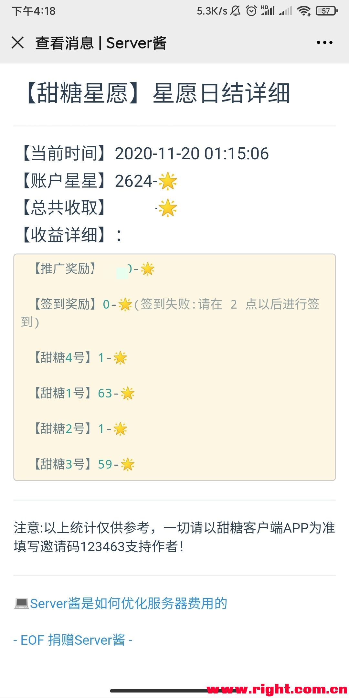   [下载请点击这里](https://wwa.lanzous.com/isSWEish09c)  下载地址：https://wwa.lanzous.com/isSWEish09c （为了程序安全，请不要私下转发本程序，请推送本帖链接下载。） 使用方法：server酱那张图可以看怎么获取自己的sckey（需要绑定微信，需要gihub账号登录，地址：http://sc.ftqq.com/）（有问题可以进群找三只松鼠问，有空就给你回答） 比如我把ttnodeConfig.py和sendTTnodeMSG.py两个文件放在了/root目录下 那么我先运行 python /root/ttnodeConfig.py    按照提示输入手机号码和验证码和sckey。 然后我再运行 python /root/sendTTnodeMSG.py  ,然后查看微信时候有消息推送。 有推送证明已经成功了。  op的请把下面的定时规则添加到计划任务。其它armbian或其它linux的请运行crontab -e 把下面的规则添加进去。30 2 * * *的意思是每天的2点30分执行这个命令，可以自行修改时间。 30 2 * * * python /root/sendTTnodeMSG.py  以上命令由于环境不一样，命令不一样，如果提示python 命令找不到的，请把上面命令中的python改成python3  openwrt（f大）:这个固件是自带python环境的。（如果没有urlib3，请运行pip install urlib3或pip3 install urlib3） armbian：需要自己安装python3和pip和urllib3，百度一般都能找得到。  运行date命令，查看一下系统时间和北京时间是否一致。不一致需要自己百度修改时区和时间。否则定时任务时间点不对。  **感谢热心网友提供的armbian下搭建python3环境的命令：（热心网友小贤恩山ID：**y2k008**）** apt-get update && apt-get install -y python3-pip && pip3 install urllib3    #理论适用于具有apt安装包管理工具的所有linux。需要把系统时间改成和本地一样，不然定时任务时间对不上*复制代码*安装好环境了之后，就走上面的教程，上面教程的命令上面的需要把python改成python3 甜糖定时自动收菜Docker版：（重启容器会自动更新最新的脚本程序） docker run -d --net=host --name autottnode -i -t --privileged=true --restart=always 744287383/automation-ttnode               #支持x86和arm64,自带python环境有点大。不过只占存储空间大而已，内存只占几M*复制代码*docker exec -it autottnode /bin/bash -c "python3 /root/AutomationTTnode/ttnodeConfig.py"                                  #输入手机验证码和sckey设置配置。*复制代码*docker exec -it autottnode /bin/bash -c "python3 /root/AutomationTTnode/sendTTnodeMSG.py"                          #手动一键收菜*复制代码*docker exec -it autottnode /bin/bash -c "crontab -e"                         #自定义收菜时间（重启容器会恢复默认时间）。默认是2.30分自动收取*复制代码* ** 赞赏码(开发维护不易,请赏杯茶水费) **   [[N1盒子\] N1 F大OpenWrt下Docker Centos7_宝塔自启动分享](https://www.right.com.cn/forum/thread-3773137-1-1.html) [[N1盒子\] [2020-8-15]★41+版N1_OP_U盘直刷包，及贝壳云_OP_线刷包](https://www.right.com.cn/forum/thread-981406-1-1.html) [[N1盒子\] 【0814更新】【白嫖盒子】新玩法，甜糖星愿计划armbian方案出炉啦，更省心更好用~](https://www.right.com.cn/forum/thread-4044876-1-1.html) [万能百度](http://www.baidu.com/)   本帖隐藏的内容谢谢各位的支持。   Docker常用命令：docker pull 镜像名称                              #拉去镜像*复制代码*docker ps -a                                     #查看容器列表*复制代码*docker stats                                     #查看运行中容器对硬件资源的占用情况。*复制代码*docker exec -it 容器名称 /bin/bash                #进入容器命令*复制代码*exit                                              #退出容器命令*复制代码*docker rm -f 容器名称                             #强制删除容器*复制代码*docker images                                    #镜像列表 *复制代码*docker image rm -f 镜像id                         #强制删除镜像*复制代码*docker network ls                                #查看网络模式*复制代码*docker network rm 网络名称                      #删除网络模式*复制代码*docker restart 容器名称                            #重启容器*复制代码*docker stop 容器名称                               #暂停容器*复制代码*

[本主题由 longlo 于 2020-11-4 17:17 加入](https://www.right.com.cn/forum/forum.php?mod=misc&action=viewthreadmod&tid=4048219)