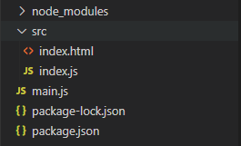
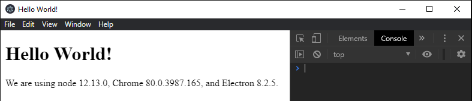
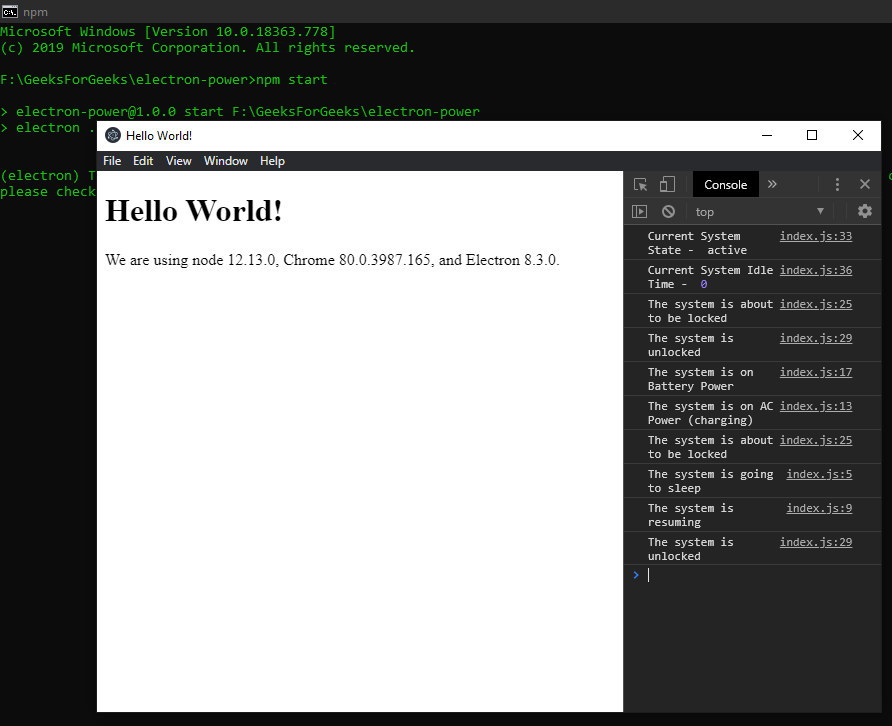

Monitor System Power States in ElectronJS

- Last Updated : 29 May, 2020

**[ElectronJS](https://www.geeksforgeeks.org/introduction-to-electronjs/)** is an Open Source Framework used for building Cross-Platform native desktop applications using web technologies such as HTML, CSS, and JavaScript which are capable of running on Windows, macOS, and Linux operating systems. It combines the Chromium engine and **[NodeJS](https://www.geeksforgeeks.org/introduction-to-nodejs/)** into a Single Runtime.

One such System behavior that can directly affect the execution of a native desktop application is System Power and changes in its state. For example, the developers would like to know when the system switches from charging to battery power and vice-versa so that they can automatically adjust the brightness of the system via the application to consume less battery power. Similarly, when the system is about to be suspended or shut-down, the application can be made aware and take necessary action such as exit cleanly, etc. Electron provides us with a way by which we can monitor the System Power State Changes using the built-in **powerMonitor** Module. This tutorial will demonstrate how to monitor these system power states using the **powerMonitor** Module Instance methods and events.

We assume that you are familiar with the prerequisites as covered in the above-mentioned link. For Electron to work, **[node](https://www.geeksforgeeks.org/introduction-to-nodejs/)** and **[npm](https://www.geeksforgeeks.org/node-js-npm-node-package-manager/)** need to be pre-installed in the system.

**System Power State Changes in ElectronJS:** The **powerMonitor** Module is part of the **Main Process**. To import and use this Module in the **Renderer Process**, we will be using Electron **remote** module. For more details on the remote module, Refer this [link](https://www.electronjs.org/docs/api/remote). The **powerMonitor** Module cannot be used until the **ready** event of the **app** module is emitted and the application is ready to create **BrowserWindow** Instances. For more Information, Refer this [link](https://www.electronjs.org/docs/api/app#appwhenready).

- **Project Structure:**
  

**Example:** We will start by building the Electron Application for Monitoring System Power State Changes by following the given steps.


- Step 1:

   

  Navigate to an Empty Directory to setup the project, and run the following command,

  ```
  npm init
  ```

  To generate the **package.json** file. Install **[Electron](https://www.geeksforgeeks.org/introduction-to-electronjs/)** using npm if it is not installed.

  ```
  npm install electron --save
  ```

  This command will also create the **package-lock.json** file and install the required **node_modules** dependencies. Once Electron has been successfully installed, Open the **package.json** file and perform the necessary changes under the **scripts** key.
  **package.json:**

  ```
  {
    "name": "electron-power",
    "version": "1.0.0",
    "description": "Power State Changes in Electron ",
    "main": "main.js",
    "scripts": {
      "start": "electron ."
    },
    "keywords": [
      "electron"
    ],
    "author": "Radhesh Khanna",
    "license": "ISC",
    "dependencies": {
      "electron": "^8.3.0"
    }
  }
  ```

- Step 2: 

  Create a

   

  main.js

   

  file according to the project structure. This file is the

   

  Main Process

   

  and acts as an entry point into the application. Copy the Boilerplate code for the

   

  main.js

   

  file as given in the following

   

  link

  . We have modified the code to suit our project needs.

  **main.js:**

  *filter_none*

  

  

  *brightness_4*

  ```js
  const { app, BrowserWindow } = require('electron') 
    
  function createWindow () { 
    // Create the browser window. 
    const win = new BrowserWindow({ 
      width: 800, 
      height: 600, 
      webPreferences: { 
        nodeIntegration: true
      } 
    }) 
    
    // Load the index.html of the app. 
    win.loadFile('src/index.html') 
    
    // Open the DevTools. 
    win.webContents.openDevTools() 
  } 
    
  // This method will be called when Electron has finished 
  // initialization and is ready to create browser windows. 
  // Some APIs can only be used after this event occurs. 
  // This method is equivalent to 'app.on('ready', function())' 
  // The powerMonitor Module cannot be used until this event is emitted. 
  app.whenReady().then(createWindow) 
    
  // Quit when all windows are closed. 
  app.on('window-all-closed', () => { 
    // On macOS it is common for applications and their menu bar 
    // to stay active until the user quits explicitly with Cmd + Q 
    if (process.platform !== 'darwin') { 
      app.quit() 
    } 
  }) 
    
  app.on('activate', () => { 
      // On macOS it's common to re-create a window in the  
      // app when the dock icon is clicked and there are no  
      // other windows open. 
    if (BrowserWindow.getAllWindows().length === 0) { 
      createWindow() 
    } 
  }) 
    
  // In this file, you can include the rest of your  
  // app's specific main process code. You can also  
  // put them in separate files and require them here. 
  ```

  

- Step 3:

   

  Create the

   

  index.html

   

  file and the

   

  index.js

   

  file within the

   

  src

   

  directory according to the project structure. We will also copy the Boilerplate code for the

   

  index.html

   

  file from the above-mentioned link. We have modified the code to suit our project needs.

  **index.html:**

  *filter_none*

  

  

  *brightness_4*

  ```html
  <!DOCTYPE html> 
  <html> 
    <head> 
      <meta charset="UTF-8"> 
      <title>Hello World!</title> 
      <!-- https://electronjs.org/docs/tutorial 
                             /security#csp-meta-tag -->
      <meta http-equiv="Content-Security-Policy" 
            content="script-src 'self' 'unsafe-inline';" /> 
    </head> 
    <body> 
      <h1>Hello World!</h1> 
      We are using node  
      <script> 
          document.write(process.versions.node) 
      </script>, Chrome  
      <script> 
          document.write(process.versions.chrome) 
      </script>, and Electron  
      <script> 
          document.write(process.versions.electron) 
      </script>. 
    
      <!-- Adding Individual Renderer Process JS File -->
      <script src="index.js"></script> 
    </body> 
  </html> 
  ```

  **Output:** At this point, our application is set up and we can launch the application to check the GUI Output. To launch the Electron Application, run the Command:

  ```
  npm start
  ```

  

- Step 4:

   

  We are going to monitor the System Power State Changes throughout the Application without binding this module to any HTML DOM element.

  index.js:

   

  Add the following snippet in that file.

  *filter_none*

  

  

  *brightness_4*

  ```js
  const electron = require('electron'); 
  // Importing powerMonitor from Main Process  
  // Using remote Module 
  const powerMonitor = electron.remote.powerMonitor; 
    
  powerMonitor.on('suspend', () => { 
      console.log('The system is going to sleep'); 
  }); 
    
  powerMonitor.on('resume', () => { 
      console.log('The system is resuming'); 
  }); 
    
  powerMonitor.on('on-ac', () => { 
      console.log('The system is on AC Power (charging)'); 
  }); 
    
  powerMonitor.on('on-battery', () => { 
      console.log('The system is on Battery Power'); 
  }); 
    
  powerMonitor.on('shutdown', () => { 
      console.log('The system is Shutting Down'); 
  }); 
    
  powerMonitor.on('lock-screen', () => { 
      console.log('The system is about to be locked'); 
  }); 
    
  powerMonitor.on('unlock-screen', () => { 
      console.log('The system is unlocked'); 
  }); 
    
  const state = powerMonitor.getSystemIdleState(4); 
  console.log('Current System State - ', state); 
    
  const idle = powerMonitor.getSystemIdleTime(); 
  console.log('Current System Idle Time - ', idle); 
  ```

  **Explanation:** A detailed Explanation of all the Instance events of the **powerMonitor** module used in the code are explained below. For more detailed Information, Refer this [link](https://www.electronjs.org/docs/api/power-monitor#events).

  - **suspend: Event** Emitted when the System is about to be Suspended or going into Sleep Mode.
  - **resume: Event** Emitted when the System is resuming from Suspended State or Sleep Mode.
  - **on-ac: Event** This Instance Event is supported in **Windows** only. This event is emitted when the system power state changes to AC Power and the system is being operated on electricity such as when charging laptops. To switch between AC and Battery power simply plug/unplug the charger of the laptop as done in the Output.
  - **on-battery: Event** This Instance Event is supported in **Windows** only. This event is emitted when the system power state changes to Battery Power and the system is being operated on battery. To switch between AC and Battery power simply plug/unplug the charger of the laptop as done in the Output.
  - **shutdown: Event** This Instance Event is supported in **Linux** and **macOS** only. This event is emitted when the System is about to restart or shut down. If the event handler invokes **e.preventDefault()** method from the global **event** object, Electron will make an attempt to delay the System from shutting down in order for the application to exit cleanly. When this method is called, the applications should exit immediately using the **app.quit()** method as used in the **main.js** file to stop all background processes and close any open **BrowserWindow** Instances. For more detailed Information on the **app.quit()** method and all the Instance events associated with it, Refer this [link](https://www.electronjs.org/docs/api/app#appquit).
  - **lock-screen: Event** This Instance Event is supported in **Windows** and **macOS** only. This event is emitted when the system is about to lock the screen. On **Windows**, this functionality is triggered by **Windows+L**.
  - **unlock-screen: Event** This Instance Event is supported in **Windows** and **macOS** only. This event is emitted as soon as the Systems screen is Unlocked.

  A detailed Explanation of all the Instance methods of the **powerMonitor** module used in the code are explained below. For more detailed Information, Refer this [link](https://www.electronjs.org/docs/api/power-monitor#methods).

  - **powerMonitor.getSystemIdleState(idleThreshold)** This method is used to calculate the System **idle** state and it returns the systems current State based on the **idleThreshold** value provided. The **idleThreshold** value is the amount of time (in seconds) before the system can be considered to be in Idle State. This method returns a **String** value representing the current State of the System. Return Values can be **active**, **idle**, **locked** or **unknown**. In the above code, we have taken 4s as the **idleThreshold** and we should get **active** as the return value.
    **Note** – The Return value **locked** is available on select System environments only.
  - **powerMonitor.getSystemIdleTime()** This method is used to calculate the time in seconds for which the system has been in idle state. It does not take in any parameters. It returns an **Integer** value representing the system idle time in seconds.

**Note** – The **powerMonitor** module does not control the System behaviour such as Preventing the System from going to sleep, etc and is not to be confused with the **powerSaveBlocker** module.

**Output:**

Video Player

<video class="wp-video-shortcode" id="video-419055-1_html5" width="665" height="373" preload="metadata" src="https://media.geeksforgeeks.org/wp-content/uploads/20200518233936/Output-1-Final.mp4?_=1" style="box-sizing: border-box; margin: 0px; padding: 0px; border: 0px; font-size: 17px; vertical-align: baseline; display: inline-block; max-width: 100%; font-family: Helvetica, Arial; width: 665px; height: 373px;"></video>

00:00

00:28

Since putting the system into Sleep mode and reviving it cannot be recorded, here is the following output for those Instance events. For the system to go into Sleep Mode, the system performs the lock-screen operation. Similarly, when reviving the system from sleep mode, the system needs to be unlocked for access.
**Output:**
