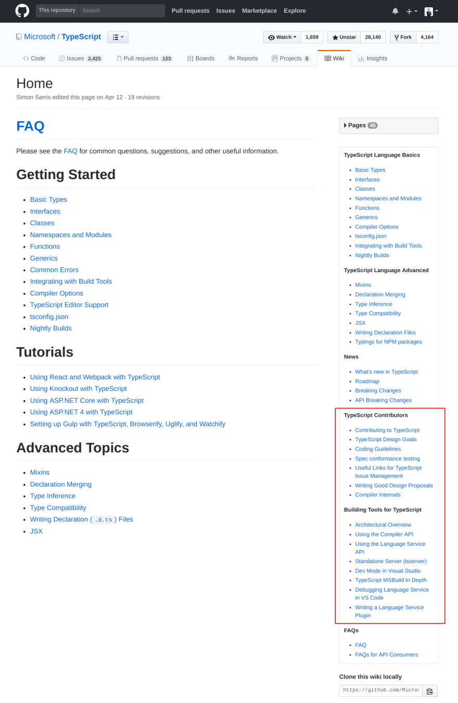

# [Learn how to contribute to the TypeScript compiler on GitHub through a real-world example](https://dev.to/remojansen/learn-how-to-contribute-to-the-typescript-compiler-on-github-through-a-real-world-example-4df0)

[#typescript](https://dev.to/t/typescript) [#opensource](https://dev.to/t/opensource) [#compilers](https://dev.to/t/compilers) [#javascript](https://dev.to/t/javascript)

[Remo H. Jansen](https://dev.to/remojansen)Jan 9, 2018 ・*Updated on Jan 19, 2018* ・13 min read

A few days ago I managed to send my first PR to the TypeScript project on GitHub. This is something that I've been trying to do for a very long time but unfortunately, it felt way too complicated for me.

I decided to write this post because I'm 100% sure that there are a lot of people out there feeling just like me. I'm going to try to describe how I personally found a way to contribute. My goal is to hopefully help others to contribute as well.

Please note that I'm not an expert in the TypeScript compiler internals. Please correct me using the comments below if I say is wrong.

## Prerequisites

I'm going to assume a few things in this article:

- You understand [Git](https://git-scm.com/) and have already installed it on your machine.
- You understand [TypeScript](https://www.typescriptlang.org/index.html) and have been using it for a while.
- You understand the [GitHub Flow](https://guides.github.com/introduction/flow/) and you already have a [GitHub](https://github.com/) account.

## A real-world example

I'm going to use a real-world issue and its contribution as a reference during this post. Please refer to the following links if you want to see the original issue and contribution:

- The [original issue](https://github.com/Microsoft/TypeScript/issues/20026) on GitHub.
- The [original contribution](https://github.com/Microsoft/TypeScript/commit/73e3e8d790410c982ea80fd786cb046b0b861989) on GitHub

## About the learning curve

As I've already said, contributing to TypeScript is something that I've been trying to do for a very long time but unfortunately, it felt way too complicated for me. In this section, I'm going to try to describe my own personal learning journey.

I personally believe that contributing to an open source project like TypeScript is not something that we can achieve in just a few days. There is a long learning curve ahead of us but everybody can contribute with the right amount of effort and perseverance.

My own personal learning curve started a few years ago when I created my first GitHub account and I started to work on my own side projects. These projects were just learning exercises and demo apps but it helped me to get familiar with GitHub and Git.

Back then I had a strong interest in TypeScript and I was writing [a book about it](https://www.amazon.co.uk/Learning-TypeScript-Remo-H-Jansen/dp/1783985542/). This lead me to visit a lot the TypeScript roadmap, the TypeScript issues and other TypeScript projects like DefinitelyTyped on GitHub. I read hundreds of issues, PR, and comments over an extended period of time.

After some time, I started contributing to [DefinitelyTyped](https://github.com/DefinitelyTyped/DefinitelyTyped). I started by reporting issues but I ended up sending some PRs.
My very first PRs were documentation changes, dependencies upgrades, and some very simple bug fixes. Eventually, I ended up creating new type definitions and documenting my experience in [another article](http://blog.wolksoftware.com/contributing-to-definitelytyped).

Using both TypeScript and GitHub lead me to understand TypeScript, Git, and GitHub very well but I was still unable to contribute the TypeScript compiler. The main problem was that I was working on some libraries like [InversifyJS](https://github.com/inversify/InversifyJS) and some web applications with React and Node.js but these projects are very different from the TypeScript compiler.

### How can I learn about the TypeScript compiler?

Contributing to a compiler can be a bit scary at first because a compiler sounds like a very advanced computer science topic for someone like me (I don't have a CS degree).

However, we are lucky because the TypeScript compiler is actually a "very simple" compiler because it doesn't need to deal with things like hardware architecture or memory management (The JavaScript runtime takes care of these things). If you always wanted to learn how a compiler works, contributing to TypeScript is actually a very friendly way to do so.

I personally started to learn about compiler by watching many [Anders Hejlsberg](https://en.wikipedia.org/wiki/Anders_Hejlsberg) interviews online. He always talks about things like "rewriting the TypeScript emitter as a tree-based transformation emitter". I didn't get everything he said at first but listening to his interviews over the years have led me to gain some basic knowledge about the architecture of the TypeScript compiler.

I watched a lot of videos and read a lot of documents. I don't remember all of them but these are the ones that stuck in my memory:

- [Syntaxation](https://www.youtube.com/watch?v=Nlqv6NtBXcA) by Douglas Crockford describes how to implement a parser from scratch and provides a very good understanding of what is an abstract syntax tree (AST) and how it is generated.
- [Hidden Gems of TypeScript compiler](https://www.youtube.com/watch?v=WkJagE7b5U0) by Vincent Ogloblinsky describes how the TypeScript compiler works in a very clear and practical way.
- [Anders Hejlsberg @ Build 2017](https://www.youtube.com/watch?v=jBddlEWNsps) is one of the many Anders Hejlsberg interviews about TypeScript.
- [Modern Compiler Construction](https://channel9.msdn.com/Blogs/Seth-Juarez/Anders-Hejlsberg-on-Modern-Compiler-Construction) by Anders Hejlsberg provides some interesting insights about the TypeScript compiler but it doesn't too much into implementation details.
- [Grammatically Rooting Oneself With Parse Trees](https://dev.to/vaidehijoshi/grammatically-rooting-oneself-with-parse-trees-16a)
- [Architectural Overview](https://github.com/Microsoft/TypeScript/wiki/Architectural-Overview)
- [Compiler Internals](https://github.com/Microsoft/TypeScript/wiki/Compiler-Internals)
- [TypeScript Compiler Internals](https://basarat.gitbooks.io/typescript/docs/compiler/overview.html) by [Basarat Ali Syed](https://twitter.com/basarat).
- "TypeScript Contributors" and "Building Tools for TypeScript" sections in the [TypeScript wiki](https://github.com/Microsoft/TypeScript/wiki).

[](https://res.cloudinary.com/practicaldev/image/fetch/s--Ce9KEfKS--/c_limit%2Cf_auto%2Cfl_progressive%2Cq_auto%2Cw_880/https://thepracticaldev.s3.amazonaws.com/i/z0j7yplnkwpyciqqhmff.png)

About a year ago I did [a small experiment](https://github.com/remojansen/TsUML) in a hackathon at the Global Microsoft MVP summit in Redmond. I tried to create an extension to transform TypeScript code into a UML diagram.

I never fully finished the experiment but it was my first direct contact with the TypeScript AST and language service tools. I found this small experiment very useful and I would recommend playing with the language services as a learning exercise.

Once you manage to understand the different phases of the compilation process and what each one of them does, you should be ready to start trying to pick an issue.

## How can I find something to do?

The TypeScript project managers have created a milestone for [issues that are recommended for the community](https://github.com/Microsoft/TypeScript/milestone/2). Some of this issues are labeled as ["good first issue"](https://github.com/Microsoft/TypeScript/issues?q=is%3Aopen+is%3Aissue+label%3A"good+first+issue"). You should try to go through this issues and find one that you can understand.

[](https://res.cloudinary.com/practicaldev/image/fetch/s--lvOpuGmx--/c_limit%2Cf_auto%2Cfl_progressive%2Cq_auto%2Cw_880/https://thepracticaldev.s3.amazonaws.com/i/6bcjsdg00nlrva2bulij.png)

### What can I do if everything seems too complicated?

I visited the community milestone a lot of times for many months and I left it disappointed many times because I didn't feel able to help. I continued learning and visiting this page until one day I saw an issue that felt like something that I could do.

After your first PR your level of confidence will grow a lot and it won't be long until you find your next opportunity for a new PR.

## About issue #20026

The issue that I selected for my very first contribution was the issue number [#20026](https://github.com/Microsoft/TypeScript/issues/20026).

In this particular issue, someone suggested that when we try to invoke a `null` or `undefined` variable:

```
null()
```


We get an `Object is possibly 'null'` error. This error is not very user friendly and it would be much better if the one of the following errors was used instead:

```
Cannot invoke an object which is possibly 'null'.
Cannot invoke an object which is possibly 'undefined'.
Cannot invoke an object which is possibly 'null' or 'undefined'.
```


I was able to understand the requirement of the issue and also I thought that I would be able to find where the error `Object is possibly 'null'` is thrown and change it for one of the others errors when the expression is a `function` call.

For the first time, I found an issue that didn't sound too complicated so I decided to give it a go.

## How can I contribute?

After finding an issue of our interest we can start working on it. We need to go through the following steps:

1. Setting up the project
2. Implementing and testing your change
3. Sending a PR

### 1.Setting up the project

- Create a fork of the TypeScript project.

  > Please refer to the [GitHub documentation](https://help.github.com/articles/fork-a-repo/) if you need additional help about how to fork a repository.

- Clone your fork

```
git clone https://github.com/YOUR_GITHUB_USER_NAME_GOES_HERE/TypeScript.git
```


> Please refer to the [GitHub documentation](https://help.github.com/articles/cloning-a-repository/) if you need additional help about how to clone a repository.

- Install jake (requires [node.js](https://nodejs.org/en/download/))

```
npm install -g jake
```


- Install the project dependencies

```
npm install
```


- Run the tests

```
jake runtests-parallel
```


If all the tests worked successfully you should be ready to start working on your contribution.

I recommend you to work on a new branch. In my case a created an branch with the name of the issue that I was working on:

```
git checkout -b issue-20026
```


### 2. Implementing and testing your change

Our first PR will most likely be a bug fix, not a new feature. The best way to fix a bug is to start by writing a test that reproduces the bug.

So I started by trying to find the existing tests. I opened the `tests` folder but I was unable to find something that looked like a unit test.

The TypeScript tests are a bit strange because they use Mocha in a very abstracted way. We don't need to write test fixtures or tests cases, instead we write a TypeScript code snippet which is expected to work in certain way or to throw a certain compilation error. The testing tools will then generate some outputs and a test case will be created automatically for each of these outputs.

In order to write a test, we need to create a new file under the tests folder (`/tests/cases/compiler/`) with a unique name. The `CONTRIBUTING.md` file provides some advice about the name uniqueness:

> Note that filenames here must be distinct from all other compiler test case names, so you may have to work a bit to find a unique name if it's something common.

The file should contain the TypeScript code that you wish to test. In my case, I created a file named [`nullableFunctionError.ts`](https://github.com/Microsoft/TypeScript/blob/73e3e8d790410c982ea80fd786cb046b0b861989/tests/cases/compiler/nullableFunctionError.ts).

#### /tests/cases/compiler/nullableFunctionError.ts

My `nullableFunctionError.ts` contains the following TypeScript code:

```
// @strictNullChecks: true

null();
undefined();
let f: null | undefined;
f();
```


The preceding code snippet uses three function calls: `null();`, `undefined();` and `f();`. Each of these calls should trigger each of the new errors expected by the issue #20026.

As you may have already noticed, the code snippet doesn't contain any kind of assertion. The TypeScript project uses the previous compilation output as the tests assertion.

We can execute the test using the following command to execute a test:

```
jake runtests tests=nullableFunctionError
```


The TypeScript compiler will then generate the following files as output:

- `nullableFunctionError.errors.txt`
- `nullableFunctionError.js`
- `nullableFunctionError.symbols`
- `nullableFunctionError.types`

These files are stored in source control under the `/tests/baselines/reference/` directory. When the tests are executed, the files are re-generated under the `/tests/baselines/local/` directory. The files under both directories are then compared to check if the compiler behaviour has changed.

You can use the following command to compare the two versions:

```
jake diff
```


And the following command to accept the changes:

```
jake baseline-accept
```


Because this is a new test, there are not previous versions of the files and we need to accept the new files using `jake baseline-accept`.

Don't worry too much about using `jake baseline-accept` by mistake because you will be able to rollback the changes using Git if you need to do so.

In my case, the `nullableFunctionError.errors.txt` contained the following content:

```
tests/cases/compiler/nullableFunctionError.ts(1,1): error TS2531: Object is possibly 'null'.
tests/cases/compiler/nullableFunctionError.ts(2,1): error TS2531: Object is possibly 'null'.
tests/cases/compiler/nullableFunctionError.ts(4,1): error TS2531: Object is possibly 'null'.


==== tests/cases/compiler/nullableFunctionError.ts (3 errors) ====
    null();
    ~~~~
!!! error TS2721: Object is possibly 'null'.
    undefined();
    ~~~~~~~~~
!!! error TS2722: Object is possibly 'null'.
    let f: null | undefined;
    f();
    ~
!!! error TS2723: Object is possibly 'null'.
```


As we can see the three errors are `Object is possibly 'null'.` but they should be:

```
Cannot invoke an object which is possibly 'null'.
Cannot invoke an object which is possibly 'undefined'.
Cannot invoke an object which is possibly 'null' or 'undefined'.
```


This was correct because I didn't change anything in the TypeScript compiler. At this point, I needed to figure out what needed to be changed so the correct errors were displayed.

I already had a test in place and I would be able to know if my changes were correct by checking the contents of the `nullableFunctionError.errors.txt` file. Also, there was already [58656 existing tests](https://travis-ci.org/Microsoft/TypeScript/jobs/326657578#L628) that will let me know if I changed something else by mistake. This is a very obvious example of the benefits of [TDD](https://en.wikipedia.org/wiki/Test-driven_development).

### /src/compiler/diagnosticMessages.json

The first thing I tried to do was to figure out where the current error message was coming from. I ended up adding three new errors to a file named [diagnosticMessages.json](https://github.com/Microsoft/TypeScript/blob/73e3e8d790410c982ea80fd786cb046b0b861989/src/compiler/diagnosticMessages.json):

```
"Cannot invoke an object which is possibly 'null'.": {
    "category": "Error",
    "code": 2721
},
"Cannot invoke an object which is possibly 'undefined'.": {
    "category": "Error",
    "code": 2722
},
"Cannot invoke an object which is possibly 'null' or 'undefined'.": {
    "category": "Error",
    "code": 2723
},
```


### /src/compiler/checker.ts

The next step was to throw the new three errors that I created in the `diagnosticMessages.json` file.

This step was an intense learning exercise because I had very little domain knowledge about the TypeScript compiler. My only option was to try to gain some knowledge through trial, error, and experimentation.

I managed to figured out that I could run all the tests using the following command:

```
jake runtests-parallel
```


I could also run just my test using the following command:

```
jake runtests tests=nullableFunctionError
```


I could also debug my tests using the following command and the chrome debugging tools:

```
jake runtests-browser tests=nullableFunctionError browser=chrome
```


I found all this information in the `CONTRIBUTING.md` file.

Because the errors were type errors, I was able to guess that I should implement some changes in the checker.

Once more, I started by searching were the `TS2723: Object is possibly 'null'` error was used within the type checker. I ended up looking at the `checkNonNullType` and the `checkNonNullExpression` functions.

The three new errors are only relevant for function calls but the function `checkNonNullType` was used in many cases, not only for function calls.

After some time experimenting, I figured out that I need to pass the three new errors as optional arguments to `checkNonNullExpression` and pass them to `checkNonNullType`:

```
function checkNonNullExpression(
    node: Expression | QualifiedName,
    nullDiagnostic?: DiagnosticMessage,
    undefinedDiagnostic?: DiagnosticMessage,
    nullOrUndefinedDiagnostic?: DiagnosticMessage,
) {
    return checkNonNullType(
        checkExpression(node),
        node,
        nullDiagnostic,
        undefinedDiagnostic,
        nullOrUndefinedDiagnostic
    );
}
```


The `checkNonNullType` would then also take the three new errors as optional arguments and use them when appropriate:

```
function checkNonNullType(
    type: Type,
    node: Node,
    nullDiagnostic?: DiagnosticMessage,
    undefinedDiagnostic?: DiagnosticMessage,
    nullOrUndefinedDiagnostic?: DiagnosticMessage
): Type {
    const kind = (strictNullChecks ? getFalsyFlags(type) : type.flags) & TypeFlags.Nullable;
    if (kind) {
        error(node, kind & TypeFlags.Undefined ? kind & TypeFlags.Null ?
            (nullOrUndefinedDiagnostic || Diagnostics.Object_is_possibly_null_or_undefined) :
            (undefinedDiagnostic || Diagnostics.Object_is_possibly_undefined) :
            (nullDiagnostic || Diagnostics.Object_is_possibly_null)
        );
        const t = getNonNullableType(type);
        return t.flags & (TypeFlags.Nullable | TypeFlags.Never) ? unknownType : t;
    }
    return type;
}
```


The final change was to provide the three new errors as arguments `checkNonNullExpression` when a function call was used. I tried to search for things like `invoke` or `call` in the source code I managed to figure out that the `resolveCallExpression` function was what I was looking for.

```
function resolveCallExpression(node: CallExpression, candidatesOutArray: Signature[]): Signature {
    // ...

    const funcType = checkNonNullExpression(
        node.expression,
        Diagnostics.Cannot_invoke_an_object_which_is_possibly_null,
        Diagnostics.Cannot_invoke_an_object_which_is_possibly_undefined,
        Diagnostics.Cannot_invoke_an_object_which_is_possibly_null_or_undefined
    );
    // ...
```


I executed the tests and I found unexpected results because my tests was not executed using non-nullable types. I figured this out thanks to the chrome debugger. The code that lead me to identify the problem can be found in the `checkNonNullType` function:

```
const kind = (strictNullChecks ? getFalsyFlags(type) : type.flags) & TypeFlags.Nullable;
```


I found how to enable non-nullable files in the `CONTRIBUTING.md` file:

> These files support metadata tags in the format // @metaDataName: value. The supported names and values are the same as those supported in the compiler itself.

The solution was to add the flag `// @strictNullChecks: true` to the test file `nullableFunctionError.ts`. I executed the tests once more and the following files were generated as expected.

#### /tests/cases/compiler/nullableFunctionError.errors.txt

Contains a list of the errors detected by the compiler. This time the errors were correct:

```
tests/cases/compiler/nullableFunctionError.ts(1,1): error TS2721: Cannot invoke an object which is possibly 'null'.
tests/cases/compiler/nullableFunctionError.ts(2,1): error TS2722: Cannot invoke an object which is possibly 'undefined'.
tests/cases/compiler/nullableFunctionError.ts(4,1): error TS2723: Cannot invoke an object which is possibly 'null' or 'undefined'.


==== tests/cases/compiler/nullableFunctionError.ts (3 errors) ====
    null();
    ~~~~
!!! error TS2721: Cannot invoke an object which is possibly 'null'.
    undefined();
    ~~~~~~~~~
!!! error TS2722: Cannot invoke an object which is possibly 'undefined'.
    let f: null | undefined;
    f();
    ~
!!! error TS2723: Cannot invoke an object which is possibly 'null' or 'undefined'.
```


#### /tests/cases/compiler/nullableFunctionError.js

Contains the input (TypeScript) and the output (JavaScript) code:

```
//// [nullableFunctionError.ts]
null();
undefined();
let f: null | undefined;
f();


//// [nullableFunctionError.js]
null();
undefined();
var f;
f();
```


#### /tests/cases/compiler/nullableFunctionError.symbols

Contains a list of the Symbols created by the compiler:

```
=== tests/cases/compiler/nullableFunctionError.ts ===
null();
undefined();
>undefined : Symbol(undefined)

let f: null | undefined;
>f : Symbol(f, Decl(nullableFunctionError.ts, 2, 3))

f();
>f : Symbol(f, Decl(nullableFunctionError.ts, 2, 3))
```


#### /tests/cases/compiler/nullableFunctionError.types

Contains a list of the types detected by the compiler:

```
=== tests/cases/compiler/nullableFunctionError.ts ===
null();
>null() : any
>null : null

undefined();
>undefined() : any
>undefined : undefined

let f: null | undefined;
>f : null | undefined
>null : null

f();
>f() : any
>f : null | undefined
```


### 3. Sending a PR

At this point, I was almost ready to finish my PR. I accepted the new baseline files:

```
jake baseline-accept
```


And I executed all the existing test:

```
jake runtests-parallel
```


If your tests passed locally, it is highly likely that you will not experience any issues in the CI build.

[](https://res.cloudinary.com/practicaldev/image/fetch/s--En7cXT-L--/c_limit%2Cf_auto%2Cfl_progressive%2Cq_auto%2Cw_880/https://thepracticaldev.s3.amazonaws.com/i/f2owuvtd3paw8juj64fe.png)

If you experience any issues the TypeScript team should be able to help you, don't be afraid to ask for help!

Please refer to the [GitHub documentation](https://help.github.com/articles/creating-a-pull-request/) if you need additional help about how to create a PR.

#### Signing the CLA

The TypeScript projects requires contributors to sign a Contribution License Agreement (CLA).

The `CONTRIBUTING.md` file contains some guidelines about this:

> You will need to complete a Contributor License Agreement (CLA). Briefly, this agreement testifies that you are granting us permission to use the submitted change according to the terms of the project's license and that the work being submitted is under appropriate copyright. Please submit a Contributor License Agreement (CLA) before submitting a pull request. You may visit [https://cla.microsoft.com](https://cla.microsoft.com/) to sign digitally.

## Summary

In this article, we have learned how we can contribute to TypeScript on GitHub through a real-world example.

I hope you enjoyed this post and it will help you to send your first PR to the TypeScript project.

Happy coding!