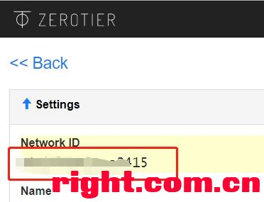
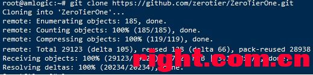
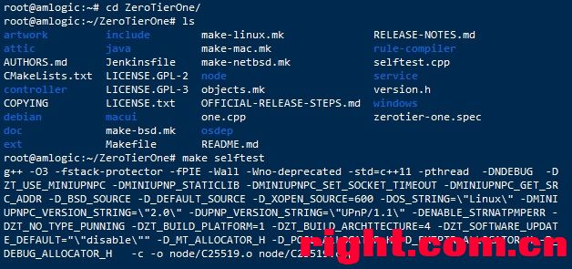
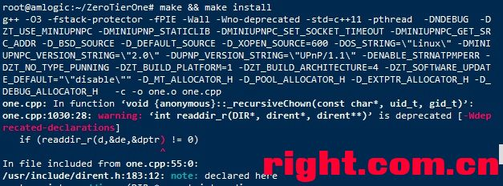
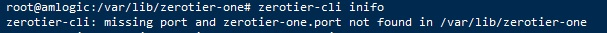
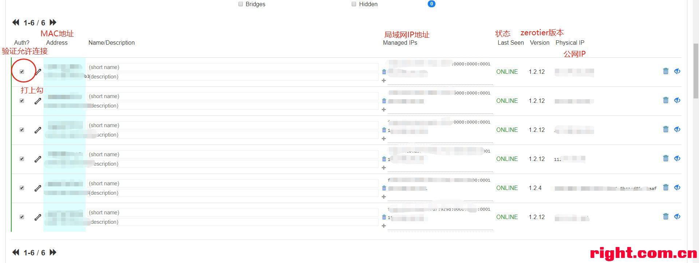
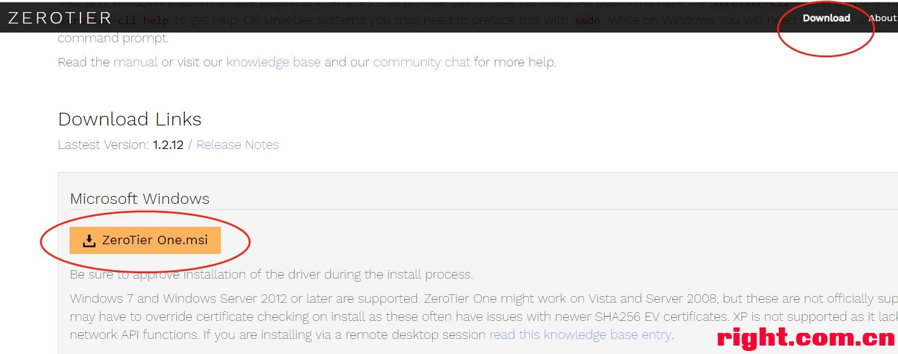
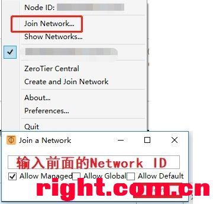
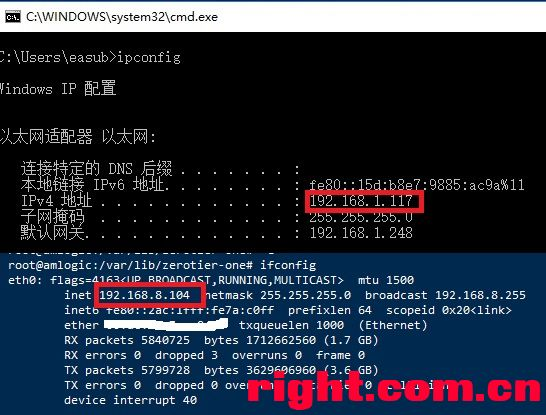
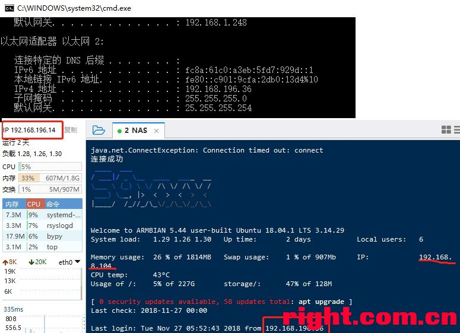

https://www.right.com.cn/forum/thread-364716-1-1.html

前言：通过zerotier可以把不同局域网或外网的服务器连接在同一个局域网中，相当于内网穿透，这个可以不需要公网ip，前提是都能访问外网
下面开始了：
准备：
1、在家里的N1盒子  我使用的是Ubuntu 18.04.1 LTS 3.14.29（其他版本可以试下）
2、公司内网普通PC电脑（或者内网服务器或者公网服务器都行）
开始：
一、首先，先去官网注册一个账号，用来创建局域网，详细看这个吧，这个没什么好说的
[点我飞机直达](https://www.appinn.com/zerotier-one/)

二、注册创建完后，记下这个**Network ID**

三、ssh登录N1或者接入hdmi电脑直接打开终端也行
1、先把zerotier源码拉下来
root@amlogic:~# git clone https://github.com/zerotier/ZeroTierOne.git

2、然后进入ZeroTierOne目录，开始编译安装
root@amlogic:~# cd ZeroTierOne/
root@amlogic:~/ZeroTierOne# ls

root@amlogic:~/ZeroTierOne# make selftest

等待结束后，继续输入
root@amlogic:~/ZeroTierOne# make && make install

结束后安装完毕

3、接下来检查下是否安装成功
root@amlogic:/var/lib/zerotier-one# zerotier-cli inifo

貌似报错了，去谷歌翻译一下：
**缺少端口和/ var / lib / zerotier-one中找不到的zerotier-one.port**

4、嫑慌，其实就是编译的时候没有安装服务，咱们继续
把zerotier服务拷贝到amlogic系统服务目录中，然后重新加载下，再启动zerotier服务
root@amlogic:~/ZeroTierOne# cp debian/zerotier-one.service /etc/systemd/system
root@amlogic:~/ZeroTierOne# systemctl daemon-reload
root@amlogic:~/ZeroTierOne# systemctl start zerotier-one

emmm...没报错，应该是成功了

5、好了，接下重新检查下
root@amlogic:/var/lib/zerotier-one# zerotier-cli info

好了，此时显示在线，已经成功安装了，接下来就是加入之前创建的局域网，记得之前的**Network ID**吧
root@amlogic:/var/lib/zerotier-one# zerotier-cli join XXXXXXXXXX
（XXXXXXXXXX就是之前的**Network ID**）

提示加入成功，此时已经成功加入了局域网，我们还差一步就是去官网创建网络管理那里允许接入

6、登录进入创建的网络管理处，验证通过（允许接入局域网）

7、前面就是N1成功加入zerotier的案例，下面以windows10为例，加入同一局域网
下载安装windows版ZeroTier One

8、安装完成后，打开（托盘处打开），选择加入网络，输入前面的Network ID，点击join即可

9、见证奇迹的一刻，尝试下在公司内网ssh登录家里的N1

10、教程到此结束，还有mac、ios、Android的版本，就不一一说明了，自行去官网瞅瞅
最后送上一枚Android版的，[点我飞机直达](https://pan.baidu.com/s/1MLhi7xLtyLB0g8hzeAlXiA)
提取码: mdyv