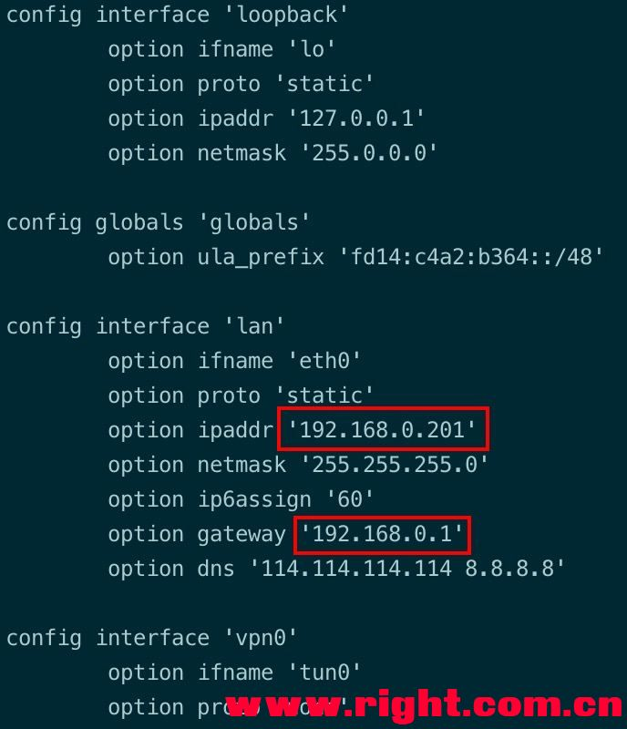
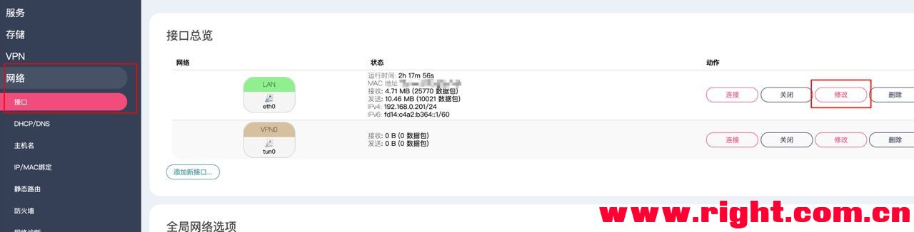
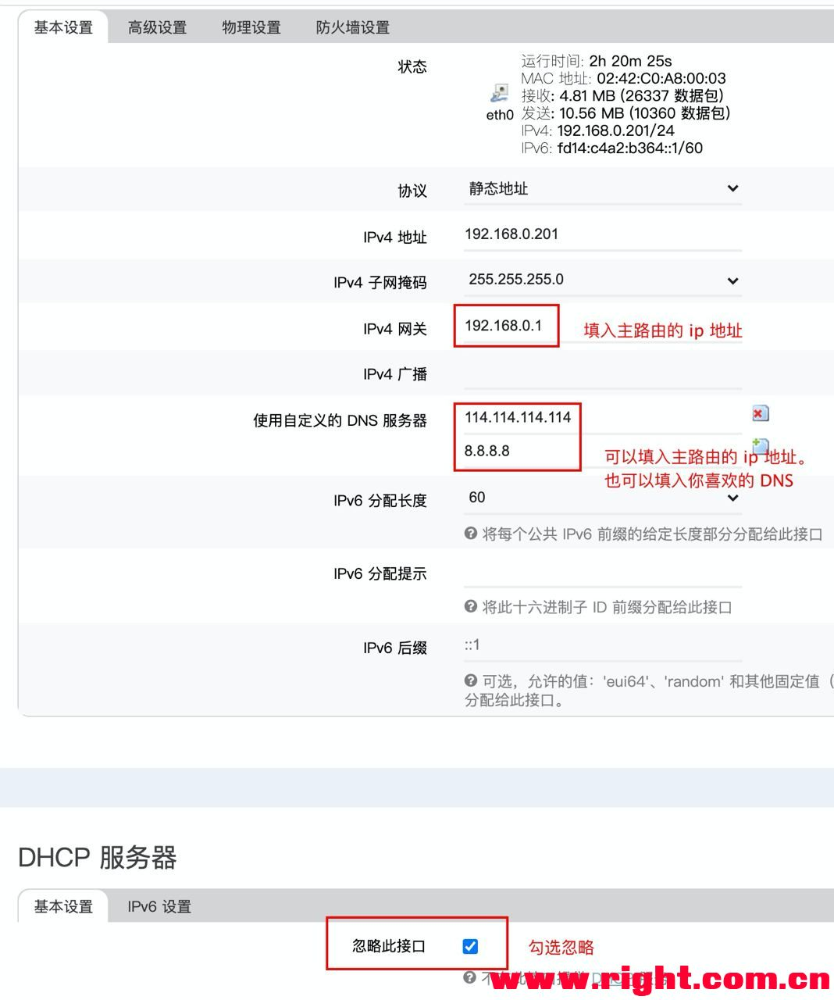
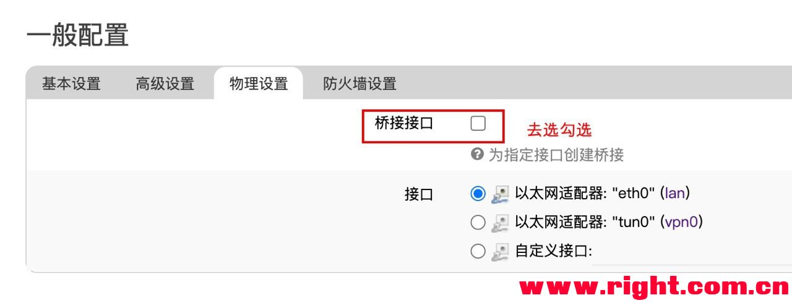
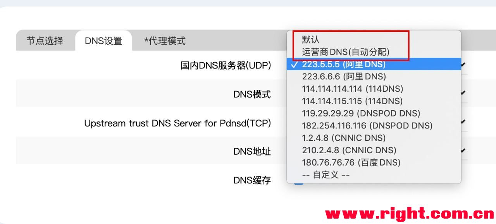
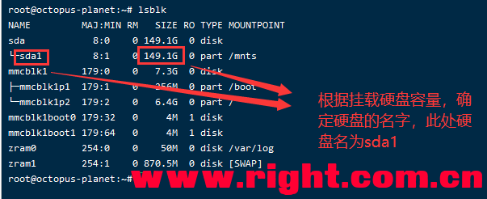
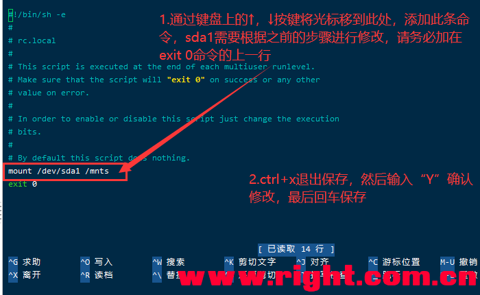

# 斐讯n1刷机

- <https://yuerblog.cc/2019/10/23/%E6%96%90%E8%AE%AFn1-%E5%AE%8C%E7%BE%8E%E5%88%B7%E6%9C%BAarmbian%E6%95%99%E7%A8%8B/?utm_source=cyhour.com>
- <https://cyhour.com/1333/>
- <http://www.safebase.cn/article-261100-1.html>

## 为什么斐讯n1

N1的优势在于：

ARM64主流架构，真64位linux系统，docker随便玩。（Armbian输出：Linux aml 5.0.2-aml-s905 #5.77 SMP PREEMPT Mon Apr 1 17:41:33 MSK 2019 aarch64 GNU/Linux）
真千兆有线网口，2.4/5G双频wifi，可以作热点。
自带8G的emmc存储，linux系统直接刷到盒子里，不用额外插SD卡，I/O性能好。
CPU 4核，2G内存。
唯一缺点：

USB2.0，显然是不配套千兆网口带宽的，磁盘将成为了下载电影的瓶颈。
需要精力折腾，因为是小众社区来支持N1硬件适配到Armbian系统，安装过程缺乏标准化的方案。

# 降级关键分区

连接HDMI、网线、电源，你会进入斐讯自带的安卓系统。

安卓系统的标准启动过程如下：

- bootloader：斐讯针对该盒子硬件实现的类似BIOS的东西，它负责硬件的初始化，最终引导操作系统。
- boot分区：放着安卓操作系统的内核文件，由bootloader唤起，也就实现了进入操作系统的效果。
- recovery分区：类似于WinPE的东西，如果boot分区挂了，则可以通过Recovery方式进入一个临时的操作系统，然后恢复boot分区（类似于ghost做系统）。

问题就在于，bootloader是斐讯针对盒子定制的，它设置了一些限制，比如：

- 只能使用他家的安卓系统
- 不支持U盘引导操作系统

所以呢，恩山论坛有一位叫做webpad的大神，修改了斐讯的bootloader。

我们要做的，就是把bootloader覆盖到盒子里面去。

webpad提供了工具，大家按照教程与工具：<https://www.right.com.cn/forum/thread-340279-1-1.html，通过adb>网络连接的方式刷入即可。

一台N1这辈子只需要做一次降级操作，后续不需要再研究这个问题了。

连接USB线刷的方式，除非你想玩电视系统，否则刷Armbian是不需要强制使用的。

# 制作Armbian U盘

刷armbian的整体逻辑如下：

- 为了把armbian刷入emmc存储，我们首先得把armbian刷到U盘上，然后通过U盘引导进入armbian系统。
- U盘进入系统后，我们执行一个命令就可以把armbian系统的boot分区以及rootfs等等都copy到emmc上。
- 一旦完成emmc刷写，此后bootloader就会直接读emmc中的boot分区，直接引导进入armbian。

首先是选什么版本的Armbian，以及替换哪一个dtb文件，我直接告诉大家结论：

> Armbian 5.77版本，使用xiangsm的dtb文件，这是恩山论坛的帖子：<https://www.right.com.cn/forum/thread-510423-1-1.html>

这是目前恩山论坛最新也是最广泛肯定的版本，大家就不要自己再折腾研究了。

至于armbian和dtb分别是什么来头，我简单说明一下：

- armbian：直接来源于armbian的官方，armbian其实就是debian发行版为arm架构适配后的版本。也就是说，恩山论坛是没有人去改动armbian系统代码的，是非常可靠的。
- dtb：各种品牌的盒子千千万，每个盒子使用的网卡啊、cpu芯片啊的型号千千万，armbian内核为了能够和这些外设正常工作，就要求提供一种叫做dtb的描述文件，我理解就是针对各个硬件的驱动程序。
  - 为了让斐讯N1的各个硬件可以被armbian正常调度，所以需要给斐讯N1适配一套dtb文件。
  - dtb文件需要随着内核编译，所以不同armbian内核版本必须使用配套的dtb文件。
  - 目前斐讯N1的dtb文件已经被armbian收录到官方源码库里，但是使用的时候linux负载会显示的很高，所以热心网友为armbian5.77编译了一个fix过的dtb文件。

armbian5.77大家直接走我的网盘下载即可，因为从armbian官方下载非常慢：

> 链接: <https://pan.baidu.com/s/1-7AmPhRkP1LKtqb6X7s9IA> 提取码: sjp9 复制这段内容后打开百度网盘手机App，操作更方便哦

现在将系统烧录到U盘。

armbian5.77修改过的dtb文件从上面的帖子里下载，然后打开我的电脑U盘：

> 将meson-gxl-s905d-phicomm-n1-xiangsm.dtb文件放到dtb/meson-gxl-s905d-phicomm-n1-xiangsm.dtb下面，修改一下uEnv.ini文件指向它：
>
> dtb_name=/dtb/meson-gxl-s905d-phicomm-n1-xiangsm.dtb

# 进入U盘armbian

千万不要在安卓系统开机的情况下插入U盘，否则U盘中的文件权限会被安卓系统篡改！这不是一句废话！

千万不要在安卓系统开机的情况下插入U盘，否则U盘中的文件权限会被安卓系统篡改！这不是一句废话！

千万不要在安卓系统开机的情况下插入U盘，否则U盘中的文件权限会被安卓系统篡改！这不是一句废话！

> 补充：如果没有USB双公头线，那么将无法通过webpad降级工具的功能3）触发U盘启动。
>
> 替代方法是下载adb工具，然后执行如下2个命令，即可确保支持U盘启动：
>
> adb connect 斐讯IP
>
> adb shell reboot update

先让N1断电，然后插上U盘到靠近HDMI的USB口，然后通电即可进入armbian系统，启动过程中有一些看似报错的东西不需要理睬，属于正常。

默认root 1234登录即可。

ls -l /确认一下目录权限没有被安卓篡改，都是root用户即可：

```

root@aml:~# ls -l /
total 84
drwxr-xr-x   2 root root  4096 Apr  1  2019 bin
drwxr-xr-x   6 root root 16384 Jan  1  1970 boot
drwxr-xr-x  17 root root  4100 Oct 22 21:46 dev
drwxr-xr-x  87 root root  4096 Oct 23 02:01 etc
drwxr-xr-x   2 root root  4096 Feb  3  2019 home
drwxr-xr-x  17 root root  4096 Apr  1  2019 lib
drwx------   2 root root 16384 Oct 22 20:17 lost+found
drwxr-xr-x   2 root root  4096 Oct 22 20:18 media
drwxr-xr-x   2 root root  4096 Oct 22 20:18 mnt
drwxr-xr-x   2 root root  4096 Apr  1  2019 opt
dr-xr-xr-x 137 root root     0 Jan  1  1970 proc
drwx------   5 root root  4096 Oct 23 10:12 root
drwxr-xr-x  20 root root   700 Oct 23 11:04 run
drwxr-xr-x   2 root root  4096 Apr  1  2019 sbin
drwxrwxr-x   2 root root  4096 Apr  1  2019 selinux
drwxr-xr-x   2 root root  4096 Apr  1  2019 srv
dr-xr-xr-x  12 root root     0 Jan  1  1970 sys
drwxrwxrwt   7 root root   160 Oct 23 12:00 tmp
drwxr-xr-x  10 root root  4096 Apr  1  2019 usr
drwxr-xr-x  12 root root  4096 Apr  1  2019 var
```

# 刷armbian到emmc

这一步非常坑！

网上都说执行/root/install.sh刷写U盘中的armbian到emmc，但实际上这个脚本存在严重问题：

> 拔掉U盘后，首次emmc启动可以成功，再重启一次就无法进入系统了，应该是boot分区的处理存在bug。
>
> 如果你此前已经install.sh被坑了，你必须再次插入U盘来引导系统，然后继续往下读。

真正有效的刷写方式是执行如下命令：

*nand*–*sata*-install

它可以完成所有刷写emmc所需的事情，完成后halt关机拔掉U盘，所有刷机工作就结束了。

**如果你想重刷armbian系统，那么还是U盘启动armbian，重新执行nand-sata-install即可完整覆盖掉emmc中的数据，网上的教程一般是教你ddbr或者线刷先恢复到安卓系统再重来，这都是胡扯。**

# 坑爹问题-1

我遇到的第一个问题就是开机后，偶尔无法联通外网。

后来我发现，只需要开机后多等一会，外网就会联通了，所以这个问题就不纠结了。

另外，armbian启动的时候没有等待网卡分配到IP，会导致一些监听网络的程序无法正常工作，需要大家修改一下网卡的模式为auto，即可强制开机等待网络分配（当然太久分配不到也会超时进入系统）：

修改/etc/network/interfaces，注释hotplug热插拔模式，换成auto即可：

```
root@aml:~# cat /etc/network/interfaces
source /etc/network/interfaces.d/*

# Wired adapter #1
auto eth0
#allow-hotplug eth0
```

# 坑爹问题-2

我在路由器上给N1分配静态IP的时候发现，armbian的有线网卡每次重启后MAC地址都会变，解决方法也不复杂。

打开/etc/network/interfaces文件，在eth0网卡上写死一个mac地址即可：

> root@aml:~# cat /etc/network/interfaces
> source /etc/network/interfaces.d/*
>
> \# Wired adapter #1
> allow-hotplug eth0
> no-auto-down eth0
> iface eth0 inet dhcp
> hwaddress 4e:03:88:54:39:93

# 坑爹问题-3

发现ssh终端无法显示中文，也无法输入中文。

输入armbian-config命令，选择personal，locales，确认locale配置了en_US.utf-8，但仍旧无法使用中文。

执行locale命令显示如下，的确诡异：

```
root@aml:~# locale -a
C
C.UTF-8
en_US.utf8
POSIX
root@aml:~# locale
LANG=en_US.UTF-8
LANGUAGE=
LC_CTYPE="en_US.utf-8"
LC_NUMERIC="en_US.utf-8"
LC_TIME="en_US.utf-8"
LC_COLLATE="en_US.utf-8"
LC_MONETARY="en_US.utf-8"
LC_MESSAGES="en_US.utf-8"
LC_PAPER="en_US.utf-8"
LC_NAME="en_US.utf-8"
LC_ADDRESS="en_US.utf-8"
LC_TELEPHONE="en_US.utf-8"
LC_MEASUREMENT="en_US.utf-8"
LC_IDENTIFICATION="en_US.utf-8"
LC_ALL=en_US.utf-8
```

经过查实，armbian官方也有人反馈，只需要改一下/etc/environment中的LC_ALL：

> root@aml:~# cat /etc/environment
> ARCH=arm64
> LC_ALL=”en_US.utf-8″

# 配置时区

执行armbian-config，选择personal，然后配置Timezone为chongqing即可。

# 换apt源

执行armbian-config，选择personal，选择Mirror中清华大学的那个即可。

# 连接wifi

当你完成了上述所有步骤，如果你对网速没有太高要求，那么就可以让N1联无线网。

这样的话，N1就可以放在任何有电源的地方，当一个小型linux服务器了。

执行armbian-config，选择network -> wlan0，选择wifi信号输入账号密码即可。

# 修改vim粘贴模式

默认debian的vim右键没法粘贴内容，需要改一下模式：

```
vim /usr/share/vim/vim80/defaults.vim

查找 set mouse
if has('mouse')
  set mouse=a
endif

将值从"a"改成"r"
if has('mouse')
  set mouse=r
endif
```

> 至此，斐讯N1刷armbian就完成了，一个可靠稳定的盒子，祝大家玩的愉快。

# 命令行连接wifi

nmtui-connect

# 安装/配置docker

```
curl -fsSL https://get.docker.com -o get-docker.sh
sh get-docker.sh --mirror Aliyun #调用阿里云镜像
```

# 配置 docker 使用阿里云镜像加速

N1 Armbian 网络没有科学工具加持，pull OpenWrt 镜像速度可能会很慢，改阿里云 docker 镜像可以加速。

```
sudo mkdir -p /etc/docker
sudo tee /etc/docker/daemon.json <<-'EOF'
{
  "registry-mirrors": ["https://ooxxooxx.mirror.aliyuncs.com"]
}
EOF
sudo systemctl daemon-reload
sudo systemctl restart docker
```

阿里云镜像加速器地址获取：[https://cr.console.aliyun.com/cn-beijing/instances/mirrors](https://cyhour.com/go/aHR0cHM6Ly9jci5jb25zb2xlLmFsaXl1bi5jb20vY24tYmVpamluZy9pbnN0YW5jZXMvbWlycm9ycz91dG1fc291cmNlPWN5aG91ci5jb20)，用你的实际加速地址，替换上面的 <https://ooxxooxx.mirror.aliyuncs.com>

# 安装 docker 图形化管理 Portainer

```
docker volume create portainer_data
docker run -d -p 9000:9000 --name portainer -v /var/run/docker.sock:/var/run/docker.sock -v portainer_data:/data portainer/portainer-ce
```

安装完成后可访问 N1 ip:9000 查看图形化界面。

让 Portainer 开机自动运行：

```
docker update --restart=always portainer
```

# 修改hostname

```
sudo hostnamectl set-hostname
```

# **设置mdns**

机器的网络连接配置好了之后，以后都通过ssh等方法来远程连接是最方便的了。

ip肯定没有名字好记的，ssh cheng@aml.local这条命令要比ssh cheng@192.168.123.1好记的多。

我们可以设置一下mDNS(muticase DNS)来实现通过域名来远程访问机器：

```
sudo apt update
sudo apt install -y libnss-mdns libnss-mymachines
sudo apt install -y avahi-daemon
sudo systemctl enable avahi-daemon
```

接下来我们就可以通过ssh cheng@aml.local的命令来远程连上机器了。

# 安装openwrt旁路由

\1. 安装 docker（这一步建议处于低调上网环境，否则可能会下载慢甚至失败）

1. curl -fsSL <https://get.docker.com> | bash

*复制代码*

\2. 拉取镜像
这里使用的 F 大的镜像，感谢！[原帖地址](https://www.right.com.cn/forum/thread-958173-1-1.html)

1. docker pull unifreq/openwrt-aarch64

*复制代码*

默认拉取最新的镜像

\3. 打开网卡的混杂模式

1. ip link set eth0 promisc on

*复制代码*

\4. 创建 macvlan 网络

1. docker network create -d macvlan --subnet=192.168.x.0/24 --gateway=192.168.x.1 -o parent=eth0 macnet

*复制代码*

注意：这里需要根据实际网络来填写网关和子网掩码，如果主路由的 ip 地址为 192.168.0.1，则将上面的 192.168.x 改为 192.168.0

\5. 运行 OpenWrt

1. docker run --name op --restart always -d --network macnet --privileged unifreq/openwrt-aarch64 /sbin/init

*复制代码*

\6. 修改 OpenWrt 的网络设置

1. docker exec -it op bash

*复制代码*

1. vim /etc/config/network

*复制代码*



修改图中两处红框，
第一处修改为需要访问 OpenWrt 的 ip 地址（前三未数字需要和主路由相同，最后一位数字随意修改，不要和其他设备冲突就行）
第二出修改为主路由 ip 地址

退出，保存：
（按 ESC 键，输入

1. :wq

*复制代码*

，回车）

\7. 重启 OpenWrt 的网络

1. /etc/init.d/network restart

*复制代码*

\8. 此时可以在浏览器访问第 6 步中第一个红框处填写的地址访问 OpenWrt
默认账户：root，默认密码：password

\9. 设置 OpenWrt
9.1 关闭 DHCP
网络 -> 接口 -> LAN/修改



基础设置



9.2 关闭桥接
物理设置



保存即可


到这里 OpenWrt 安装并且已经设置完毕，可以日用了，下面还有一些附加设置可以选择。

\1. 设置 armbian 访问 OpenWrt
在 armbian 下修改 /etc/network/interfaces 文件，替换为以下内容

1. auto eth0
2. iface eth0 inet static
3. address 192.168.0.x
4. netmask 255.255.255.0
5. gateway 192.168.0.1

*复制代码*

x 代表的是你需要设置的 n1 armbian 系统的 Ip 地址
然后重新载入 networking

1. systemctl reload networking

*复制代码*

如果重载失败，请使用

1. systemctl status networking

*复制代码*

查看问题

\2. 低调上网
为什么低调上网需要单独说？因为我在使用过程中发现 PassWall 和 违禁软件 plus+ 设置好了节点之后，节点可以访问，状态也是正常，但是 op 却无法连接，甚至连接百度失败

原因：默认的 DNS 设置有问题
解决方案：



**2020-09-12 11.05.09.jpg** *(69.26 KB, 下载次数: 0)*

[下载附件](https://www.right.com.cn/forum/forum.php?mod=attachment&aid=NDEyNDc4fGE3NDJmMTJjfDE2MTU3MTMyMjZ8NTk3NjI1fDQwNTA5ODY%3D&nothumb=yes) [保存到相册](javascript:;)

2020-9-12 11:05 上传

PassWall 一定不要使用 【默认】和【运营商 DNS（自动分配）】，使用其他 DNS 即可

# 刷回android盒子

<https://www.right.com.cn/forum/thread-425056-1-1.html>

# 挂载硬盘

2、挂载硬盘
           （1）执行以下命令，查看硬盘分配的名字

1. lsblk

*复制代码*



           （2）执行以下命令，创建mnts文件夹，并挂载硬盘（命令中的sda1根据上一步的名称修改）

1. mkdir /mnts;mount /dev/sda1 /mnts;mount -a

*复制代码*

           （3）执行以下命令，编辑rc.local文件，将挂载命令加入开机自启

1. nano /etc/rc.local

*复制代码*

​                操作过程如下图所示

  

           （4）检查挂载命令是否加入开机自启

1. cat /etc/rc.local

# 挂在硬盘2

解决 unknown filesystem type 'exfat'

ubuntu挂载移动硬盘出现错误：mount:unknown filesystem type 'exfat'

处理方法如下：
Ubuntu 13.10 或以上

安装exfat-fuse:

sudo apt-get install exfat-fuse

Ubuntu 13.04 或以下

sudo apt-add-repository ppa:relan/exfat
sudo apt-get update
sudo apt-get install fuse-exfat
————————————————
版权声明：本文为CSDN博主「flexitime」的原创文章，遵循CC 4.0 BY-SA版权协议，转载请附上原文出处链接及本声明。
原文链接：<https://blog.csdn.net/flexitime/article/details/45486185>

3)挂载新增的磁盘sda1

1. mount /dev/sda1 /mnts/ssd1

*复制代码*

4)开机自动挂载：

这条命令可以显示硬盘信息，并记下UUID，为下一步做准备，这里以sda1为例

1. blkid /dev/sda1

*复制代码*

5）用xftp打开/etc/fstab，编辑文件，在 fstab 最后添加这行u盘信息

1. UUID=722059EC2059B835  /mnts    ntfs  defaults     0 0

UUID=后面的内容替换为刚刚查到的uuid，u盘格式如果是fat32的话把ntfs改为vfat

6）最后保存并应用， 则成功自定挂载，开机也会自动挂载

1. mount -a

# 安装nodejs

```
# Using Debian, as root
curl -fsSL https://deb.nodesource.com/setup_15.x | bash -
apt-get install -y nodejs
```

## [n1及ubuntu关闭wifi功能](https://qastack.cn/ubuntu/597116/how-to-disable-wireless-from-command-line)

nmcli nm wifi on
nmcli nm wifi off

nmcli radio wifi off

nmcli radio wifi on

帮助

nmcli radio help
nmcli radio wifi help

完全启用/禁用网络

nmcli networking on/off

## wifi相关操作

### 查看网卡

ifconfig -a

### 启动网卡

ifconfig wlan0 up

### 添加 WiFi 连接配置

wpa_passphrase {SSID} {PASSWORD} > /etc/wpa_supplicant/{SSID}.conf

### 连接无线网络

wpa_supplicant -i wlan0 -c /etc/wpa_supplicant/{SSID}.conf -B

### 配置DHCP自动分配Ip

dhclient wlan0

### 查看是否连接成功

ifconfig

### 验证能否正常上网

ping baidu.com -c 4

执行4次

### 查看所有连接过的wifi的密码

cd /etc/etc/NetworkManager/system-connections

ls 查看文件, 网络名称(ssid) 和 密码保存在文件中

sudu cat 网络名称(ssid) 查看

### nmcli命令

nmcli is a command‐line tool for controlling NetworkManager.

- To see list of saved connections, use (`<SavedWiFiConn>`)

  ```
  nmcli c
  ```

- To see list of available WiFi hotspots (`<WiFiSSID>`)

  ```
  nmcli d wifi list
  ```

  or:

  ```
  sudo iwlist <WifiInterface> scanning
  ```

- To see list of interfaces (`<WifiInterface>`)

  ```
  ifconfig -a
  ```

Just change `<WifiInterface>`, `<WiFiSSID>`, `<WiFiPassword>` in the following commands to reflect your setup. If WiFi info already saved, easier way using `<SavedWiFiConn>` name of connection as it was saved in NetworkManager.

### nmtui

安装

```
sudo apt install network-manager
```

### 忘记网络

If you want to connect to a network called `PrettyFlyForAWiFi-5G`

```
nmcli -a d wifi connect PrettyFlyForAWiFi-5G
```

`-a` (or `--ask`) means it will ask you for the password. The connection will be saved and should connect automatically if you restart your computer.

You could append `password <your password>` to the end (the literal word `password` followed by the actual password)

```
nmcli d wifi connect PrettyFlyForAWiFi-5G password 12345678
```

but maybe run `unset HISTFILE` beforehand, so that your WiFi password isn't saved to your `~/.bash_history` file.

------

To see all the WiFi networks around you (`--rescan yes` is optional, the list of networks might be up to 30 seconds old without it)

```
nmcli d wifi list --rescan yes
```

which will output something like

```
IN-USE  SSID                         MODE   CHAN  RATE        SIGNAL  BARS  SECURITY
        PrettyFlyForAWiFi-5G         Infra  44    405 Mbit/s  59      ▂▄▆_  WPA2
        PrettyFlyForAWiFi            Infra  6     195 Mbit/s  41      ▂▄__  WPA1 WPA2
```

To forget a connection (that was saved after you ran `nmcli -a d wifi connect <name>`)

```
nmcli c delete PrettyFlyForAWiFi-5G
```

To see a list of all saved connections

```
nmcli c
```

------

You can use `nmcli connection` instead of `nmcli c <whatever>` and `nmcli device` instead of `nmcli d`

[`nmcli`](https://en.wikipedia.org/wiki/NetworkManager#Graphical_front-ends_and_command_line_interfaces) is the command line interface for [NetworkManager](https://wiki.archlinux.org/index.php/NetworkManager) (which is part of [GNOME](https://en.wikipedia.org/wiki/GNOME), Ubuntu's default desktop environment) and is already installed on Ubuntu.

Don't forget to set up your country code for using the perfect regulations:

```
sudo iw reg set <2 letter country code>

sudo nano /etc/default/crda 
```

# openwrt镜像地址

链接：<https://pan.baidu.com/s/1BIjHHfi90Oa7Le91Q8gkOg>
提取码：02im

链接：<https://pan.baidu.com/s/14RUYvddKL1p_lYP-kmGxZw>
提取码：yvwc

链接：<https://pan.baidu.com/s/1Ja3oqJTPvmKvd_-Zdhj13g>
提取码：2w5n

## 启动问题

### [Failed to start network manager wait online](https://askubuntu.com/questions/1186368/failed-to-start-network-manager-wait-online#)

猜测是启动是保证机器已经联网

sudo systemctl disable NetworkManager-wait-online.service

### Failed to start Raise network interfaces

修改为热插拔模式

Solved by changing file /etc/network/interfaces.d/setup from:

```
auto lo
iface lo inet loopback
auto eth0
iface eth0 inet dhcp
```

to:

```
auto lo
iface lo inet loopback
allow-hotplug eth0
iface eth0 inet dhcp
```

