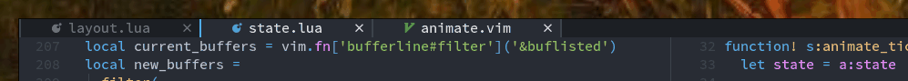
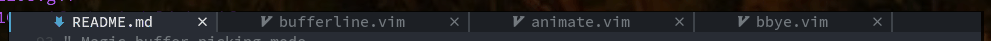
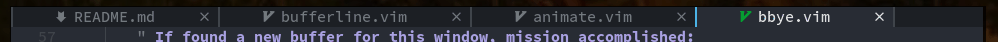
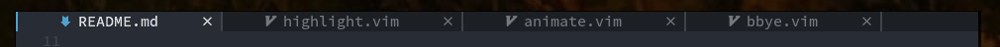
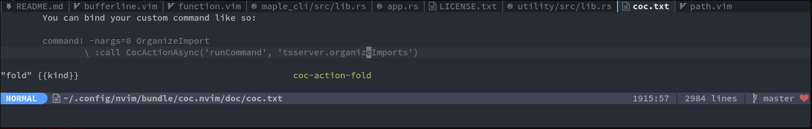
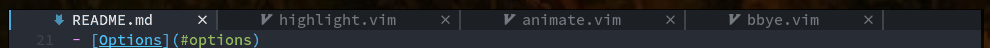
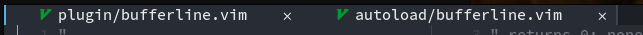
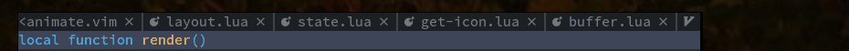
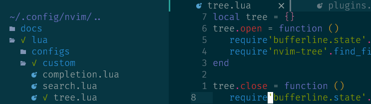

# [barbar.nvim](https://github.com/romgrk/barbar.nvim)

[](https://github.com/romgrk/barbar.nvim/blob/master/static/header.gif)

**Tabs, as understood by any other editor.**

`barbar.nvim` is a tabline plugin with re-orderable, auto-sizing, clickable tabs, icons, nice highlighting, sort-by commands and a magic jump-to-buffer mode. Plus the tab names are made unique when two filenames match.

In jump-to-buffer mode, tabs display a target letter instead of their icon. Jump to any buffer by simply typing their target letter. Even better, the target letter stays constant for the lifetime of the buffer, so if you're working with a set of files you can even type the letter ahead from memory.

**⚠️ NOTE: Recent neovim build (0.5) required (november 2020 & up)**

##### Table of content

- [Features](https://github.com/romgrk/barbar.nvim#features)
- [Install](https://github.com/romgrk/barbar.nvim#install)
- [Usage](https://github.com/romgrk/barbar.nvim#usage)
- [Options](https://github.com/romgrk/barbar.nvim#options)
- [Highlighting](https://github.com/romgrk/barbar.nvim#highlighting)
- [Integration with filetree plugins](https://github.com/romgrk/barbar.nvim#integration-with-filetree-plugins)
- [Known Issues](https://github.com/romgrk/barbar.nvim#known-issues)
- [About Barbar](https://github.com/romgrk/barbar.nvim#about)

## Features

##### Re-order tabs

[](https://github.com/romgrk/barbar.nvim/blob/master/static/reorder.gif)

##### Auto-sizing tabs, fill the space when available

[](https://github.com/romgrk/barbar.nvim/blob/master/static/resize.gif)

##### Jump-to-buffer

[](https://github.com/romgrk/barbar.nvim/blob/master/static/jump.gif)

Letters stay constant for the lifetime of the buffer. By default, letters are assigned based on buffer name, eg **README** will get letter **r**. You can change this so that letters are assigned based on usability: home row (`asdfjkl;gh`) first, then other rows.

##### Sort tabs automatically

[](https://github.com/romgrk/barbar.nvim/blob/master/static/sort.gif)

```
:BufferOrderByDirectory` and `:BufferOrderByLanguage
```

##### Clickable & closable tabs

[](https://github.com/romgrk/barbar.nvim/blob/master/static/click.gif)

Left-click to go, middle-click or close button to close.

##### Unique names when filenames match

[](https://github.com/romgrk/barbar.nvim/blob/master/static/unique-name.png)

##### bbye.vim for closing buffers

A modified version of [bbye.vim](https://github.com/moll/vim-bbye) is included in this plugin to close buffers without messing with your window layout and more. Available as `BufferClose` and `bufferline#bbye#delete(buf)`.

##### Scrollable tabs, to always show the current buffer

[](https://github.com/romgrk/barbar.nvim/blob/master/static/scroll.gif)

## Install

Is one dependency bad for one plugin? Yes it is. But is Barbar a very good tabline plugin? Also yes. Do you now understand why the Install section is strategically placed after the cool demos? Yes again.

```
Plug 'kyazdani42/nvim-web-devicons'
Plug 'romgrk/barbar.nvim'
```

You can skip the dependency on `'kyazdani42/nvim-web-devicons'` if you [disable icons](https://github.com/romgrk/barbar.nvim#options). If you want the icons, don't forget to install [nerd fonts](https://www.nerdfonts.com/).

##### Requirements

- Neovim `0.5`

## Usage

### Mappings & commands

No default mappings are provided, here is an example. It is recommended to use the `BufferClose` command to close buffers instead of `bdelete` because it will not mess your window layout.

```
" Move to previous/next
nnoremap <silent>    <A-,> :BufferPrevious<CR>
nnoremap <silent>    <A-.> :BufferNext<CR>
" Re-order to previous/next
nnoremap <silent>    <A-<> :BufferMovePrevious<CR>
nnoremap <silent>    <A->> :BufferMoveNext<CR>
" Goto buffer in position...
nnoremap <silent>    <A-1> :BufferGoto 1<CR>
nnoremap <silent>    <A-2> :BufferGoto 2<CR>
nnoremap <silent>    <A-3> :BufferGoto 3<CR>
nnoremap <silent>    <A-4> :BufferGoto 4<CR>
nnoremap <silent>    <A-5> :BufferGoto 5<CR>
nnoremap <silent>    <A-6> :BufferGoto 6<CR>
nnoremap <silent>    <A-7> :BufferGoto 7<CR>
nnoremap <silent>    <A-8> :BufferGoto 8<CR>
nnoremap <silent>    <A-9> :BufferLast<CR>
" Close buffer
nnoremap <silent>    <A-c> :BufferClose<CR>
" Wipeout buffer
"                          :BufferWipeout<CR>
" Close commands
"                          :BufferCloseAllButCurrent<CR>
"                          :BufferCloseBuffersLeft<CR>
"                          :BufferCloseBuffersRight<CR>
" Magic buffer-picking mode
nnoremap <silent> <C-s>    :BufferPick<CR>
" Sort automatically by...
nnoremap <silent> <Space>bd :BufferOrderByDirectory<CR>
nnoremap <silent> <Space>bl :BufferOrderByLanguage<CR>

" Other:
" :BarbarEnable - enables barbar (enabled by default)
" :BarbarDisable - very bad command, should never be used
```

## Options

```
" NOTE: If barbar's option dict isn't created yet, create it
let bufferline = get(g:, 'bufferline', {})

" Enable/disable animations
let bufferline.animation = v:true

" Enable/disable auto-hiding the tab bar when there is a single buffer
let bufferline.auto_hide = v:false

" Enable/disable current/total tabpages indicator (top right corner)
let bufferline.tabpages = v:true

" Enable/disable close button
let bufferline.closable = v:true

" Enables/disable clickable tabs
"  - left-click: go to buffer
"  - middle-click: delete buffer
let bufferline.clickable = v:true

" Enable/disable icons
" if set to 'numbers', will show buffer index in the tabline
" if set to 'both', will show buffer index and icons in the tabline
let bufferline.icons = v:true

" Sets the icon's highlight group.
" If false, will use nvim-web-devicons colors
let bufferline.icon_custom_colors = v:false

" Configure icons on the bufferline.
let bufferline.icon_separator_active = '▎'
let bufferline.icon_separator_inactive = '▎'
let bufferline.icon_close_tab = ''
let bufferline.icon_close_tab_modified = '●'

" Sets the maximum padding width with which to surround each tab
let bufferline.maximum_padding = 4

" If set, the letters for each buffer in buffer-pick mode will be
" assigned based on their name. Otherwise or in case all letters are
" already assigned, the behavior is to assign letters in order of
" usability (see order below)
let bufferline.semantic_letters = v:true

" New buffer letters are assigned in this order. This order is
" optimal for the qwerty keyboard layout but might need adjustement
" for other layouts.
let bufferline.letters =
  \ 'asdfjkl;ghnmxcvbziowerutyqpASDFJKLGHNMXCVBZIOWERUTYQP'

" Sets the name of unnamed buffers. By default format is "[Buffer X]"
" where X is the buffer number. But only a static string is accepted here.
let bufferline.no_name_title = v:null
```

### Highlighting

For the highlight groups, here are the default ones. Your colorscheme can override them by defining them. See the "Meaning of terms" comment inside the example below.

```
let fg_target = 'red'

let fg_current  = s:fg(['Normal'], '#efefef')
let fg_visible  = s:fg(['TabLineSel'], '#efefef')
let fg_inactive = s:fg(['TabLineFill'], '#888888')

let fg_modified  = s:fg(['WarningMsg'], '#E5AB0E')
let fg_special  = s:fg(['Special'], '#599eff')
let fg_subtle  = s:fg(['NonText', 'Comment'], '#555555')

let bg_current  = s:bg(['Normal'], '#000000')
let bg_visible  = s:bg(['TabLineSel', 'Normal'], '#000000')
let bg_inactive = s:bg(['TabLineFill', 'StatusLine'], '#000000')

" Meaning of terms:
"
" format: "Buffer" + status + part
"
" status:
"     *Current: current buffer
"     *Visible: visible but not current buffer
"    *Inactive: invisible but not current buffer
"
" part:
"        *Icon: filetype icon
"       *Index: buffer index
"         *Mod: when modified
"        *Sign: the separator between buffers
"      *Target: letter in buffer-picking mode
"
" BufferTabpages: tabpage indicator
" BufferTabpageFill: filler after the buffer section

call s:hi_all([
\ ['BufferCurrent',        fg_current,  bg_current],
\ ['BufferCurrentIndex',   fg_special,  bg_current],
\ ['BufferCurrentMod',     fg_modified, bg_current],
\ ['BufferCurrentSign',    fg_special,  bg_current],
\ ['BufferCurrentTarget',  fg_target,   bg_current,   'bold'],
\ ['BufferVisible',        fg_visible,  bg_visible],
\ ['BufferVisibleIndex',   fg_visible,  bg_visible],
\ ['BufferVisibleMod',     fg_modified, bg_visible],
\ ['BufferVisibleSign',    fg_visible,  bg_visible],
\ ['BufferVisibleTarget',  fg_target,   bg_visible,   'bold'],
\ ['BufferInactive',       fg_inactive, bg_inactive],
\ ['BufferInactiveIndex',  fg_subtle,   bg_inactive],
\ ['BufferInactiveMod',    fg_modified, bg_inactive],
\ ['BufferInactiveSign',   fg_subtle,   bg_inactive],
\ ['BufferInactiveTarget', fg_target,   bg_inactive,  'bold'],
\ ['BufferTabpages',       fg_special,  bg_inactive, 'bold'],
\ ['BufferTabpageFill',    fg_inactive, bg_inactive],
\ ])

call s:hi_link([
\ ['BufferCurrentIcon',  'BufferCurrent'],
\ ['BufferVisibleIcon',  'BufferVisible'],
\ ['BufferInactiveIcon', 'BufferInactive'],
\ ])

" NOTE: this is an example taken from the source, implementation of
" s:fg(), s:bg(), s:hi_all() and s:hi_link() is left as an exercise
" for the reader.
```

[See code for the example above](https://github.com/romgrk/barbar.nvim/blob/master/autoload/bufferline/highlight.vim)

You can also use the [doom-one.vim](https://github.com/romgrk/doom-one.vim) colorscheme that defines those groups and is also very pleasant as you could see in the demos above.

### Integration with filetree plugins

To ensure tabs begin with the shown buffer you can set an offset for the tabline.

[](https://github.com/romgrk/barbar.nvim/blob/master/static/filetree-with-offset.png)

Add tree.lua to your configuration and use the given functions to open and close the file tree. Nvim-tree is used in the given example.

```
local tree ={}
tree.open = function ()
   require'bufferline.state'.set_offset(31)
   require'nvim-tree'.find_file(true)
end

tree.close = function ()
   require'bufferline.state'.set_offset(0)
   require'nvim-tree'.close()
end

return tree 
```

## Known Issues

#### Netrw

`BufferNext/BufferPrevious` don't work in netrw buffer due to an issue in netrw. See [this comment](https://github.com/romgrk/barbar.nvim/issues/82#issuecomment-748498951) for a workaround.

## About

Barbar is called barbar because it's a bar, but it's also more than a bar: a "barbar".

It is pronounced like "Jar Jar" in "Jar Jar Binks", but with Bs.

No, barbar has nothing to do with barbarians.

## License

barbar.nvim: Distributed under the terms of the JSON license.
bbye.vim: Distributed under the terms of the GNU Affero license.