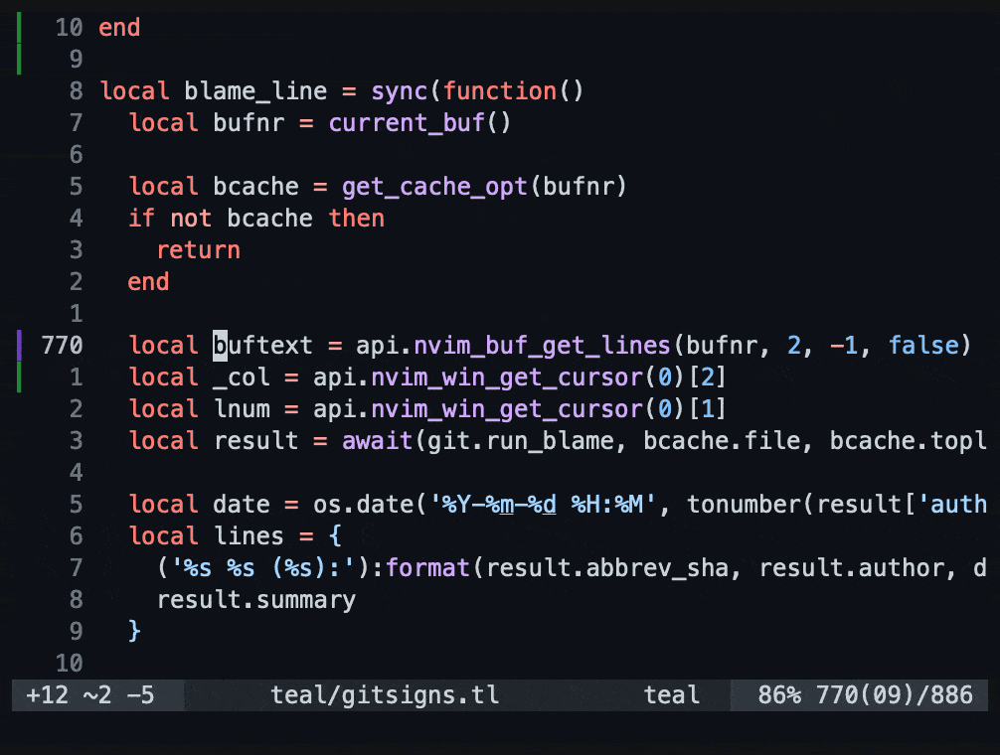
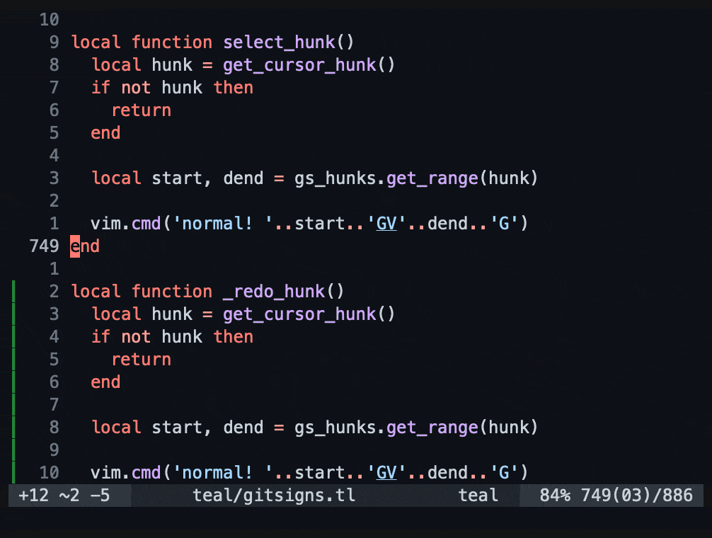

# gitsigns.nvim

git

Super fast git decorations implemented purely in lua/teal.

## Preview

| Hunk Actions                                                 | Line Blame                                                   |
| ------------------------------------------------------------ | ------------------------------------------------------------ |
| [](https://raw.githubusercontent.com/lewis6991/media/main/gitsigns_actions.gif) | [](https://raw.githubusercontent.com/lewis6991/media/main/gitsigns_blame.gif) |

## Features

- Signs for added, removed, and changed lines
- Asynchronous using [luv](https://github.com/luvit/luv/blob/master/docs.md)
- Navigation between hunks
- Stage hunks (with undo)
- Preview diffs of hunks
- Customisable (signs, highlights, mappings, etc)
- Status bar integration
- Git blame a specific line using virtual text.
- Hunk text object
- Support for [yadm](https://yadm.io/)

## Requirements

- Neovim >= 0.5.0
- Newish version of git. Older versions may not work with some features.

## Installation

[packer.nvim](https://github.com/wbthomason/packer.nvim):

```
use {
  'lewis6991/gitsigns.nvim',
  requires = {
    'nvim-lua/plenary.nvim'
  }
}
```

[vim-plug](https://github.com/junegunn/vim-plug):

```
Plug 'nvim-lua/plenary.nvim'
Plug 'lewis6991/gitsigns.nvim'
```

## Usage

For basic setup with all batteries included:

```
require('gitsigns').setup()
```

If using [packer.nvim](https://github.com/wbthomason/packer.nvim) gitsigns can be setup directly in the plugin spec:

```
use {
  'lewis6991/gitsigns.nvim',
  requires = {
    'nvim-lua/plenary.nvim'
  },
  config = function()
    require('gitsigns').setup()
  end
}
```

Configuration can be passed to the setup function. Here is an example with most of the default settings:

```
require('gitsigns').setup {
  signs = {
    add          = {hl = 'GitSignsAdd'   , text = '│', numhl='GitSignsAddNr'   , linehl='GitSignsAddLn'},
    change       = {hl = 'GitSignsChange', text = '│', numhl='GitSignsChangeNr', linehl='GitSignsChangeLn'},
    delete       = {hl = 'GitSignsDelete', text = '_', numhl='GitSignsDeleteNr', linehl='GitSignsDeleteLn'},
    topdelete    = {hl = 'GitSignsDelete', text = '‾', numhl='GitSignsDeleteNr', linehl='GitSignsDeleteLn'},
    changedelete = {hl = 'GitSignsChange', text = '~', numhl='GitSignsChangeNr', linehl='GitSignsChangeLn'},
  },
  numhl = false,
  linehl = false,
  keymaps = {
    -- Default keymap options
    noremap = true,
    buffer = true,

    ['n ]c'] = { expr = true, "&diff ? ']c' : '<cmd>lua require\"gitsigns\".next_hunk()<CR>'"},
    ['n [c'] = { expr = true, "&diff ? '[c' : '<cmd>lua require\"gitsigns\".prev_hunk()<CR>'"},

    ['n <leader>hs'] = '<cmd>lua require"gitsigns".stage_hunk()<CR>',
    ['n <leader>hu'] = '<cmd>lua require"gitsigns".undo_stage_hunk()<CR>',
    ['n <leader>hr'] = '<cmd>lua require"gitsigns".reset_hunk()<CR>',
    ['n <leader>hR'] = '<cmd>lua require"gitsigns".reset_buffer()<CR>',
    ['n <leader>hp'] = '<cmd>lua require"gitsigns".preview_hunk()<CR>',
    ['n <leader>hb'] = '<cmd>lua require"gitsigns".blame_line(true)<CR>',

    -- Text objects
    ['o ih'] = ':<C-U>lua require"gitsigns".select_hunk()<CR>',
    ['x ih'] = ':<C-U>lua require"gitsigns".select_hunk()<CR>'
  },
  watch_index = {
    interval = 1000
  },
  current_line_blame = false,
  sign_priority = 6,
  update_debounce = 100,
  status_formatter = nil, -- Use default
  use_decoration_api = true,
  use_internal_diff = true,  -- If luajit is present
}
```

For information on configuring neovim via lua please see [nvim-lua-guide](https://github.com/nanotee/nvim-lua-guide).

## Status Line

Use `b:gitsigns_status` or `b:gitsigns_status_dict`. `b:gitsigns_status` is formatted using `config.status_formatter`. `b:gitsigns_status_dict` is a dictionary with the keys `added`, `removed`, `changed` and `head`.

Example:

```
set statusline+=%{get(b:,'gitsigns_status','')}
```

For the current branch use the variable `b:gitsigns_head`.

## TODO

-  Add ability to show staged hunks with different signs (maybe in a different sign column?)
-  Add ability to show commit in floating window of current line
-  Allow extra options to be passed to `git diff`
-  Folding of text around hunks
-  Diff against working tree instead of index, or diff against any SHA.
-  Open diff mode of buffer against what gitsigns is comparing to (currently the index)
-  Show messages when navigating hunks similar to '/' search

## Similar plugins

- [coc-git](https://github.com/neoclide/coc-git)
- [vim-gitgutter](https://github.com/airblade/vim-gitgutter)
- [vim-signify](https://github.com/mhinz/vim-signify)