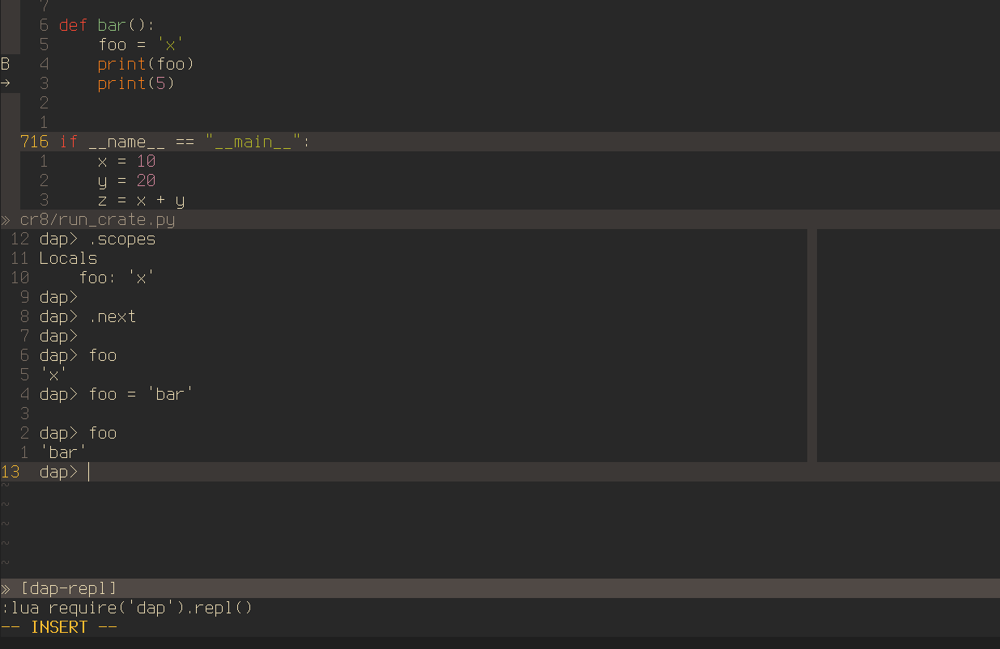

# [DAP (Debug Adapter Protocol)](https://github.com/mfussenegger/nvim-dap)

debug调试

`nvim-dap` is a Debug Adapter Protocol client implementation for [Neovim](https://neovim.io/) (>= 0.5). `nvim-dap` allows you to:

- Launch an application to debug
- Attach to running applications and debug them
- Set breakpoints and step through code
- Inspect the state of the application

**Warning**: This is in an early stage. It targets Neovim HEAD and therefore things may break.

## Installation

- Requires [Neovim HEAD/nightly](https://github.com/neovim/neovim/releases/tag/nightly)
- nvim-dap is a plugin. Install it like any other Neovim plugin.
  - If using [vim-plug](https://github.com/junegunn/vim-plug): `Plug 'mfussenegger/nvim-dap'`
  - If using [packer.nvim](https://github.com/wbthomason/packer.nvim): `use 'mfussenegger/nvim-dap'`
- Generate the documentation for nvim-dap using `:helptags ALL` or `:helptags <PATH-TO-PLUGIN/doc/>`

You'll need to install and configure a debug adapter per language. See

- [:help dap.txt](https://github.com/mfussenegger/nvim-dap/blob/master/doc/dap.txt)
- the [Debug-Adapter Installation](https://github.com/mfussenegger/nvim-dap/wiki/Debug-Adapter-installation) wiki
- `:help dap-adapter`
- `:help dap-configuration`

## Usage

A typical debug flow consists of:

- Setting breakpoints via `:lua require'dap'.toggle_breakpoint()`.
- Launching debug sessions and resuming execution via `:lua require'dap'.continue()`.
- Stepping through code via `:lua require'dap'.step_over()` and `:lua require'dap'.step_into()`.
- Inspecting the state via the built-in REPL: `:lua require'dap'.repl.open()`.

See [:help dap.txt](https://github.com/mfussenegger/nvim-dap/blob/master/doc/dap.txt), `:help dap-mapping` and `:help dap-api`.

## Supported languages

In theory all of the languages for which a debug adapter exists should be supported.

- [Available debug adapters](https://microsoft.github.io/debug-adapter-protocol/implementors/adapters/)
- [nvim-dap Debug-Adapter Installation & Configuration](https://github.com/mfussenegger/nvim-dap/wiki/Debug-Adapter-installation)

The Wiki is community maintained. If you got an adapter working that isn't listed yet, please extend the Wiki. If you struggle getting an adapter working, please create an issue.

## Goals

- Have a basic debugger in Neovim.
- Extensibility and double as a DAP client library. This allows other plugins to extend the debugging experience. Either by improving the UI or by making it easier to debug parts of an application.
  - An example UI/UX extension is [nvim-dap-virtual-text](https://github.com/theHamsta/nvim-dap-virtual-text)
  - Examples for language specific extensions include [nvim-jdtls](https://github.com/mfussenegger/nvim-jdtls) and [nvim-dap-python](https://github.com/mfussenegger/nvim-dap-python)

## Extensions

All known extensions are listed in the [Wiki](https://github.com/mfussenegger/nvim-dap/wiki/Extensions). The wiki is community maintained. Please add new extensions if you built one or if you discovered one that's not listed.

## Non-Goals

- Debug adapter installations are out of scope. It's not the business of an editor plugin to re-invent a package manager. Use your system package manager. Use Nix. Use Ansible.
- Vim support. It's not going to happen. Use [vimspector](https://github.com/puremourning/vimspector) instead.

## Alternatives

- [vimspector](https://github.com/puremourning/vimspector)

## Features

-  launch debug adapter
-  attach to debug adapter
-  toggle breakpoints
-  breakpoints with conditions
-  logpoints
-  set exception breakpoints
-  step over, step into, step out
-  step back, reverse continue
-  Goto
-  restart
-  stop
-  pause
-  evaluate expressions
-  REPL (incl. commands to show threads, frames and scopes)