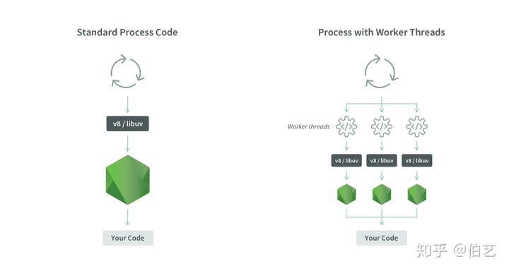
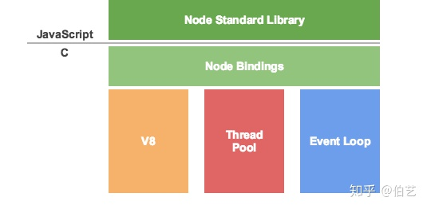
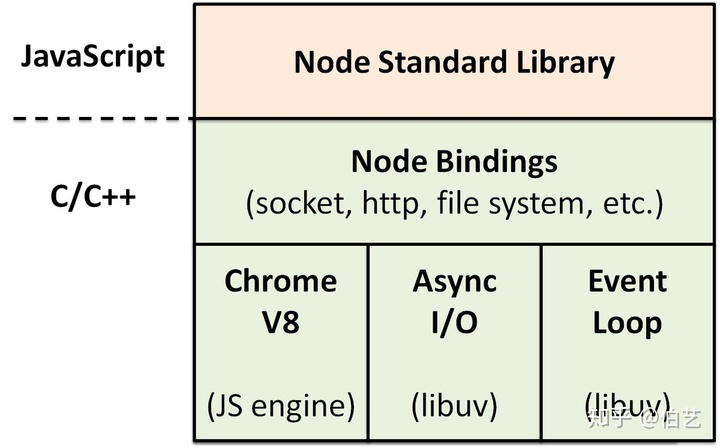
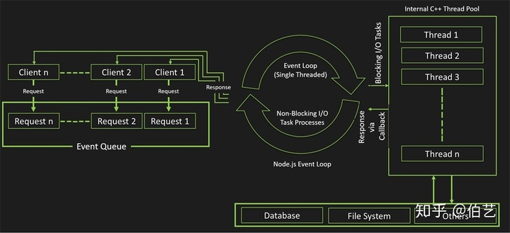

> worker\_threads 的出现让 Node.js 拥有**多工作线程，但**这个概念不同于Java等其它后端语言中的多线程。  
> 对于进程和线程的区别可以参考：[http://www.ruanyifeng.com/blog/2013/04/processes\_and\_threads.html](https://link.zhihu.com/?target=http%3A//www.ruanyifeng.com/blog/2013/04/processes_and_threads.html)  
> java 中的多线程可以参考：[https://www.runoob.com/java/java-multithreading.html](https://link.zhihu.com/?target=https%3A//www.runoob.com/java/java-multithreading.html)

Node.js 通过提供 cluster、child\_process API 创建子进程的方式来赋予Node.js “多线程”能力。但是这种创建进程的方式会牺牲共享内存，并且数据通信必须通过json进行传输。（有一定的局限性和性能问题）

基于此 Node.js V10.5.0 提供了 worker\_threads，它比 child\_process 或 cluster更轻量级。 与child\_process 或 cluster 不同，worker\_threads 可以**共享内存**，通过传输 ArrayBuffer 实例或共享 SharedArrayBuffer 实例来实现。

**这里有一个误区：很多人可能认为在node.js核心模块中添加一个新的模块，来创建线程以及实现线程间同步问题，从而解决CPU密集型操作的问题？**

但事实并非如此，Node.js 并没有其它支持多线的程语言（如：java），诸如"synchronized"之类的关键字来实现线程同步的概念。**Node.js的 worker\_threads 区别于它们的多线程**。如果添加线程，语言本身的性质将发生变化，所以不能将线程作为一组新的可用类或函数添加。

我们可以将其理解为：**JavaScript和Node.js永远不会有线程**，只有基于Node.js 架构的**多工作线程**。

**这张图很好的诠释了多工作线程机制。**（1.理解node.js的event loop机制 2.和其它多线程语言对比性理解）



node.js 工作线程机制

[Understanding Worker Threads in Node.jsnodesource.com](https://link.zhihu.com/?target=https%3A//nodesource.com/blog/worker-threads-nodejs/)
---

## **前置知识**

Node.js 保持了JavaScript在浏览器中单线程的特点。它的优势是没有线程间数据同步的性能消耗也不会出现死锁的情况。所以它是线程安全并且性能高效的。

单线程有它的弱点，无法充分利用多核CPU 资源，CPU 密集型计算可能会导致 I/O 阻塞，以及出现错误可能会导致应用崩溃。

为了解决单线程弱点：

浏览器端： HTML5 制定了 Web Worker 标准（Web Worker 的作用，就是为 JavaScript 创造**多线程环境**，允许主线程创建 Worker 线程，将一些任务分配给后者运行）。

[Web Worker 使用教程 - 阮一峰的网络日志www.ruanyifeng.com](https://link.zhihu.com/?target=http%3A//www.ruanyifeng.com/blog/2018/07/web-worker.html)

Node端：采用了和 Web Worker相同的思路来解决单线程中大量计算问题 ，官方提供了 child\_process 模块和 cluster 模块， cluster 底层是基于child\_process实现。

child\_process、cluster都是用于创建子进程，然后子进程间通过事件消息来传递结果，这个可以很好地保持应用模型的简单和低依赖。从而解决无法利用多核 CPU 和程序健壮性问题。

Node V10.5.0： 提供了实验性质的 worker\_threads模块，才让Node拥有了多工作线程。

Node V12.0.0：worker\_threads 已经成为正式标准，可以在生产环境放心使用。

也有很多开发者认为 worker\_threads 违背了nodejs设计的初衷，事实上那是它并没有真正理解 worker\_threads 的底层原理。其次是每一种语言的出现都有它的历史背景和需要解决的问题，在技术发展的过程中各种语言都是在取长补短，worker\_threads 的设计就是技术发展的需要。

---

**本文目录结构**

- **Nodejs事件循环模型（重要）**
- **一个CPU密集型实验**
- **了解cluster的使用**
- **了解child\_process的使用**
- **worker\_threads 对CPU密集型计算性能的极大提升（重要）**

---

## 一、Nodejs事件循环模型

> 我们先来了解一下node.js 的事件循环机制

[https://cnodejs.org/topic/5ab3166be7b166bb7b9eccf7](https://link.zhihu.com/?target=https%3A//cnodejs.org/topic/5ab3166be7b166bb7b9eccf7)

**Node.js**

Node.js是构建在 Chrome’s V8 引擎之上的JavaScript 运行时环境。事件驱动\(event-driven\)和非阻塞 I/O 模型\(non-blocking I/O model\)的语言特性使 Node.js 天生高效\(efficient\)且轻量\(lightweight\)。它使用 npm 作为包管理器。

**Event Loop**

事件循环（Event Loop）分发 I/O 任务，最终工作线程（Work Thread）将任务丢到线程池（Thread Pool）里去执行，而事件循环只要等待执行结果就可以了。



**将上一张图再细化**

[宋光宇：兄déi，libuv了解一下zhuanlan.zhihu.com](https://zhuanlan.zhihu.com/p/50497450)



- Node Standard Library：Node.js 标准库
- Node Bindings：将 V8 等暴露的 C/C++ 接口转成JavaScript Api
- Chrome v8：JavaScript 引擎，采用 C/C++ 编写
- libuv：由事件循环（Event Loop）和线程池（Async I/O）组成，负责所有 I/O 任务的分发与执行

  

**一个完整的 node.js事件循环流程**



node.js事件循环

  

1.  Client 请求到达 node api，该请求被添加到Event Queue（事件队列）。这是因为Node.js 无法同时处理多个请求。
2.  Event Loop（事件循环） 始终检查 Event Queue 中是否有待处理事件，如果有就从 Event Queue 中从前到后依次取出，然后提供服务。
3.  Event Loop 是单线程非阻塞I/O，它会把请求发送给 C++ Thread Pool\(线程池\)去处理，底层是基于C++ Libuv 异步I/O模型结构可以支持高并发。
4.  现在 C++ Thread Pool有大量的请求，如数据库请求，文件请求等。
5.  任何线程完成任务时，Callback（回调函数）就会被触发，并将响应发送给 Event Loop。
6.  最终 Event Loop 会将请求返回给 Client。

---

## **二、一个实验**

我们以计算10,000,000以内的素数为实验。

这个实验会涉及到父子进程通信。比官方 http server 并发请求更有说服力。

> block\_primes.js

```js
const min = 2
const max = 1e7

function generatePrimes(start, range) {
  let primes = []
  let isPrime = true
  let end = start + range
  for (let i = start; i < end; i++) {
    for (let j = min; j < Math.sqrt(end); j++) {
      if (i !== j && i%j === 0) {
        isPrime = false
        break
      }
    }
    if (isPrime) {
      primes.push(i)
    }
    isPrime = true
  }
  return primes
}
const primes = generatePrimes(min, max)
console.log(primes.length)
```

单线程计算

```js
// 运行
$ time node block_primes.js  

// 输出
// 664579

8.11s user
0.03s system
99% cpu
8.147 total
```

结论：单核利用率 99\%，总耗时 8.147s

## 三、cluster \[了解\]

[cluster | Node.js API 文档nodejs.cn](https://link.zhihu.com/?target=http%3A//nodejs.cn/api/cluster.html%23cluster_cluster)[解读 Node.js 的 cluster 模块www.alloyteam.com](https://link.zhihu.com/?target=http%3A//www.alloyteam.com/2015/08/nodejs-cluster-tutorial/)

如今的机器基本都是多核 cpu。为了能充分利用 cpu 计算能力，node.js V0.8（2012-06-22） 新增了一个内置模块 cluster。它可以通过一个父进程管理一堆子进程的方式来实现集群的功能。

cluster 底层就是 child\_process，master 进程做总控，启动 1 个 agent 和 n 个 worker，agent 来做任务调度，获取任务，并分配给某个空闲的 worker 来做。

需要注意的是：每个 worker 进程通过使用 child\_process.fork\(\) 函数，基于 IPC（Inter-Process Communication，进程间通信），实现与 master 进程间通信。

fork 出的子进程拥有和父进程一致的数据空间、堆、栈等资源（fork 当时），但是是独立的，也就是说二者不能共享这些存储空间。 那我们直接用 fork 自己实现不就行了。

这样的方式仅仅实现了多进程。多进程运行还涉及父子进程通信，子进程管理，以及负载均衡等问题，这些特性 cluster 帮你实现了。

  

> cluster\_primes.js  
> 该方法明显是一个 cpu 密集型计算。 我本地电脑配置为 MacBook Pro \(15-inch, 2018\) ，运行该测试代码，生成的报告显示，需要9.731s 时间：

```js
// 计算 start, 至 start + range 之间的素数
function generatePrimes(start, range) {
    let primes = []
    let isPrime = true
    let end = start + range
    for (let i = start; i < end; i++) {
        for (let j = min; j < Math.sqrt(end); j++) {
            if (i !== j && i%j === 0) {
                isPrime = false
                break
            }
        }

        if (isPrime) {
            primes.push(i)
        }

        isPrime = true
    }
    return primes
}


/**
 * - 加载clustr模块
 * - 设定启动进程数为cpu个数
 */
var cluster = require('cluster')
var numCPUs = require('os').cpus().length

// 素数的计算
const min = 2
const max = 1e7 // = 10000000
let primes = []


if (cluster.isMaster) {
    const range = Math.ceil((max - min) / numCPUs)
    let start = min

    for (var i = 0; i < numCPUs; i++) {
        const worker = cluster.fork() // 启动子进程
        //  在主进程中，这会发送消息给特定的工作进程
        worker.send({ start: start, range: range })

        start += range
        
        worker.on('message', (msg) => {
            primes = primes.concat(msg.data)
            worker.kill()
        })
        
    }
    // 当任何一个工作进程关闭的时候，cluster 模块都将会触发 'exit' 事件
    cluster.on('exit', function(worker, code, signal) {
        console.log('worker ' + worker.process.pid + ' died')
    })
} else {
    // 监听子进程发送的信息
    process.on('message', (msg) => {
        console.log(msg)
        const { start, range} = msg
        const data = generatePrimes(start, range)
        // 在工作进程中，这会发送消息给主进程
        process.send({ data: data })
    })
}
```

  

```js
// 执行
$ time node cluster_primes.js

// 输出 可以看出一共启动了 12个子进程
{ start: 2500004, range: 833334 }
{ start: 833336, range: 833334 }
{ start: 3333338, range: 833334 }
{ start: 2, range: 833334 }
{ start: 1666670, range: 833334 }
{ start: 4166672, range: 833334 }
{ start: 5000006, range: 833334 }
{ start: 5833340, range: 833334 }
{ start: 6666674, range: 833334 }
{ start: 7500008, range: 833334 }
{ start: 8333342, range: 833334 }
{ start: 9166676, range: 833334 }
worker 31008 died
worker 31009 died
worker 31010 died
worker 31011 died
worker 31012 died
worker 31013 died
worker 31014 died
worker 31015 died
worker 31018 died
worker 31019 died
worker 31016 died
worker 31017 died

// 性能
6.68s user
0.24s system
519% cpu
1.332 total
```

结论：启动了12个子进程，cpu利用率为519\%，总耗时1.332s

## **四、child\_process** \[了解\]

[child\_process | Node.js API 文档nodejs.cn](https://link.zhihu.com/?target=http%3A//nodejs.cn/api/child_process.html%23child_process_child_process)

在Node.js中，提供了一个 child\_process 模块，通过它可以开启多个子进程，在多个子进程之间可以共享内存空间，可以通过子进程的互相通信来实现信息的交换。

> child\_process\_main.js

```js
const { fork } = require('child_process')
const worker = fork(__dirname + '/child_process_worker.js')
var numCPUs = require('os').cpus().length

// 接收工作进程计算结果
let max = 1e7
let min = 2
let start = 2
let primes = []

const range = Math.ceil((max - min) / numCPUs)

for (var i = 0; i < numCPUs; i++) {
    worker.send({ start: start, range: range })
    start += range
    worker.on('message', (msg) => {
        primes = primes.concat(msg.data)
        worker.kill()
    })
}
```

> child\__process\__worker.js

```js
// 素数的计算
function generatePrimes(start, range) {
    let primes = []
    let isPrime = true
    let end = start + range
    for (let i = start; i < end; i++) {
        for (let j = 2; j < Math.sqrt(end); j++) {
            if (i !== j && i%j === 0) {
                isPrime = false
                break
            }
        }

        if (isPrime) {
            primes.push(i)
        }

        isPrime = true
    }
    return primes
}


// 监听子进程发送的信息
process.on('message', (msg) => {
    const { start, range} = msg
    console.log(msg)
    const data = generatePrimes(start, range)
    // 在工作进程中，这会发送消息给主进程
    process.send({ data: data })
})

// 收到kill信息，进程退出
process.on('SIGHUP', function() {
    process.exit()
})
```

  

```js
// 执行 
$ time node child_process_main.js

// 输出
{ start: 2, range: 833334 }
{ start: 833336, range: 833334 }
{ start: 1666670, range: 833334 }
{ start: 2500004, range: 833334 }
{ start: 3333338, range: 833334 }
{ start: 4166672, range: 833334 }
{ start: 5000006, range: 833334 }
{ start: 5833340, range: 833334 }
{ start: 6666674, range: 833334 }
{ start: 7500008, range: 833334 }
{ start: 8333342, range: 833334 }
{ start: 9166676, range: 833334 }

// 性能
5.94s user
0.06s system
100% cpu
5.998 total
```

结论：启动了12个子进程，cpu利用率为100\%，总耗时5.998s

## 五、worker\_threads

**1、加载 worker\_threads 模块**

node.js v10.5.0 引入的实验性质API，开启时需要使用 \--experimental-worker 参数。

node.js v12.0.0 里面默认开启，也预示着您可以将该特性用于生产环境中。

```js
// v 10.15.3
$ node -e "require('worker_threads'); console.log('success');"
// 输出
internal/modules/cjs/loader.js:584
    throw err;
    ^

Error: Cannot find module 'worker_threads'
    at Function.Module._resolveFilename (internal/modules/cjs/loader.js:582:15)
    at Function.Module._load (internal/modules/cjs/loader.js:508:25)
    at Module.require (internal/modules/cjs/loader.js:637:17)
    at require (internal/modules/cjs/helpers.js:22:18)
    at [eval]:1:1
    at Script.runInThisContext (vm.js:119:20)
    at Object.runInThisContext (vm.js:326:38)
    at Object.<anonymous> ([eval]-wrapper:6:22)
    at Module._compile (internal/modules/cjs/loader.js:701:30)
    at evalScript (internal/bootstrap/node.js:589:27)
----------------------------------------------------------

// v 10.15.3
$ node --experimental-worker -e 
    "require('worker_threads'); console.log('success');"
// 输出
success

// v 12.6.0
 $ node -e "require('worker_threads'); console.log('success');" 
// 输出
success
```

  

**2、官方介绍**

[Node.js v12.6.0 Documentationnodejs.org](https://link.zhihu.com/?target=https%3A//nodejs.org/api/worker_threads.html%3Fsource%3Dpost_page---------------------------%23worker_threads_worker_threads)

> Workers \(threads\) are useful for performing CPU-intensive JavaScript operations. They will not help much with I/O-intensive work. Node.js’s built-in asynchronous I/O operations are more efficient than Workers can be.

翻译：Workers \(threads\) （工作线程）对于执行CPU密集型的JavaScript操作非常有用。它们对I/O密集型工作没有多大帮助。js的内置异步I/O操作比 Workers 效率更高。

worker\_threads 比使用 child\_process 或 cluster可以获得的并行性更轻量级。 此外，worker\_threads 可以有效地共享内存。

  

**3、Hello world**

> 例子：threads\_example1.js

```js
const { Worker, isMainThread, parentPort } = require('worker_threads');
if (isMainThread) {
  // This code is executed in the main thread and not in the worker.
  
  // Create the worker.
  const worker = new Worker(__filename);
  // Listen for messages from the worker and print them.
  worker.on('message', (msg) => { console.log(msg); });
} else {
  // This code is executed in the worker and not in the main thread.
  
  // Send a message to the main thread.
  parentPort.postMessage('Hello world!');
}
```

- Worker: 该类用于创建 worker对象。有一个必填参数\_\_filename（文件路径），该文件会被worker执行。同时我们可以在主线程中通过worker.on监听message事件
- isMainThread: 该对象用于区分是主线程（true）还是工作线程（false）
- parentPort: 该对象的 postMessage 方法用于 worker 线程向主线程发送消息

> 测试

```js
$ node threads_example1.js
Hello world!
```

  

**4、对实验进行改造**

我们使用 `worker_threads` 对该程序进行改造。

> worker\_threads\_example.js

```js
const { Worker, isMainThread, parentPort, workerData } = require('worker_threads')

function generatePrimes(start, range) {
  let primes = []
  let isPrime = true
  let end = start + range
  for (let i = start; i < end; i++) {
    for (let j = 2; j < Math.sqrt(end); j++) {
      if (i !== j && i%j === 0) {
        isPrime = false
        break
      }
    }
    if (isPrime) {
      primes.push(i)
    }
    isPrime = true
  }
  return primes
}


if (isMainThread) {
  const max = 1e7
  const min = 2
  let primes = []

  const threadCount = +process.argv[2] || 2
  const threads = new Set()
  console.log(`Running with ${threadCount} threads...`)
  const range = Math.ceil((max - min) / threadCount)
  let start = min

  for (let i = 0; i < threadCount - 1; i++) {
    const myStart = start
    threads.add(new Worker(__filename, { workerData: { start: myStart, range }}))
    start += range
  }

  threads.add(new Worker(__filename, { workerData: { start, range: range + ((max - min + 1) % threadCount)}}))
  
  for (let worker of threads) {
    worker.on('error', (err) => { throw err })
    worker.on('exit', () => {
      threads.delete(worker)
      console.log(`Thread exiting, ${threads.size} running...`)
      if (threads.size === 0) {
        // console.log(primes.join('\n'))
      }
    })

    worker.on('message', (msg) => {
      primes = primes.concat(msg)
    })
  }
} else {
  const data = generatePrimes(workerData.start, workerData.range)
  parentPort.postMessage(data)
}
```

该代码中在构造 worker的时候 传入了一个名为workerData的对象，这是我们希望线程在开始运行时可以访问的数据。

workerData 可以是任何一个JavaScript 值。

> 测试

```js
// 开启 1 个工作线程
$ time node worker_threads_example.js 1
Running with 1 threads...
Thread exiting, 0 running...
8.25s user| 0.04s system| 100% cpu| 8.286 total

// 开启 2 个工作线程
$ time node worker_threads_example.js 2
Running with 2 threads...
Thread exiting, 1 running...
Thread exiting, 0 running...
7.22s user| 0.04s system| 175% cpu| 4.127 total

// 开启 4 个工作线程
$ time node worker_threads_example.js 4
Running with 4 threads...
Thread exiting, 3 running...
Thread exiting, 2 running...
Thread exiting, 1 running...
Thread exiting, 0 running...
6.75s user| 0.05s system| 313% cpu| 2.171 total

// 开启 8 个工作线程
$ time node worker_threads_example.js 8
Running with 8 threads...
Thread exiting, 7 running...
Thread exiting, 6 running...
Thread exiting, 5 running...
Thread exiting, 4 running...
Thread exiting, 3 running...
Thread exiting, 2 running...
Thread exiting, 1 running...
Thread exiting, 0 running...
6.53s user| 0.08s system| 473% cpu| 1.397 total

$ time node worker_threads_example.js 12
Running with 12 threads...
Thread exiting, 11 running...
Thread exiting, 10 running...
Thread exiting, 9 running...
Thread exiting, 8 running...
Thread exiting, 7 running...
Thread exiting, 6 running...
Thread exiting, 5 running...
Thread exiting, 4 running...
Thread exiting, 3 running...
Thread exiting, 2 running...
Thread exiting, 1 running...
Thread exiting, 0 running...
6.51s user| 0.10s system| 515% cpu| 1.282 total

$ time node worker_threads_example.js 60
7.67s user| 0.40s system| 471% cpu| 1.712 total 
```

结论：

工作线程数从1 提升到 12 ，我们发现耗时从8.286s 提升到 1.282s，cpu 利用率从 100\% 提升到了 515\%。

当我门再次把工作线程数调大到60的时候，user 耗时达到7.67s，cpu利用率降低到471\%，总耗时上升到 1.712s，所以并不是工作线程数越多越好。

worker\_threads 极大的提升了cpu利用率，提高了程序的运行性能。但使用过程中需要合理控制。

---
