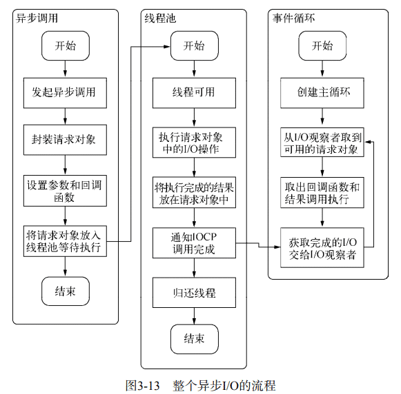
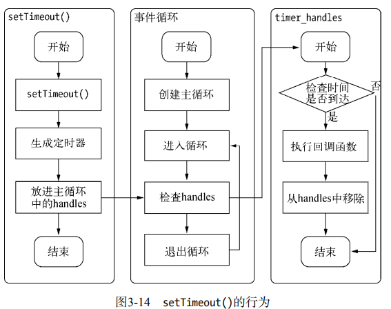

# 《深入浅出Node.js》-异步I/O

[2018-05-25](https://lz5z.com/深入浅出Node-js-异步I-O/)

## 第三章 异步 I/O

异步的概念首先在 Web2.0 中火起来，是因为浏览器中 JavaScript 在单线程上执行，而且它还与 UI 渲染共用一个线程。这意味着 JavaScript 在执行的时候 UI 渲染和响应是处于停滞状态的。前端通过异步的方式来消除 UI 阻塞的现象。假如业务场景中有一组互不相关的任务需要完成，可以采用下面两种方式。

1. 单线程串行一次执行。
2. 多线程并行执行。

如果创建多线程的开销小于并行执行，那么多线程的方式是首选的。多线程的代价在于创建线程和执行期间线程上下文切换的开销较大。另外，在复杂业务中，多线程编程经常面临锁、状态同步等问题。但是多线程能有效利用 CPU。

单线程顺序执行比较符合编程人员按照顺序思考的思维方式，也是最主流的编程方式。缺点在于执行性能，任何一个略慢的任务都会导致后续执行代码被阻塞。

Node 在两者之间给出了它的方案：利用单线程，远离多线程死锁，状态同步问题；利用异步 I/O，让单线程远离阻塞，更好地利用 CPU。

异步 I/O 就是 I/O 的调用不再阻塞后续计算，将原有等待 I/O 完成这段时间分配给其它需要的业务去执行。


### 异步 I/O 和 非阻塞 I/O

从计算机内核 I/O 而言，同步/异步和阻塞/非阻塞实际上是不同的。操作系统内核对 I/O 只有两种方式，阻塞和非阻塞。在调用阻塞 I/O 时，应用程序需要等待 I/O 完成才返回结果。阻塞 I/O 造成 CPU 等待 I/O，CPU 的处理能力得不到充分利用。为了提高性能，内核提供了非阻塞 I/O。非阻塞 I/O 在调用之后立马返回，但是数据并不在返回结果中，返回结果中只有当前调用的状态。为了获取完整的数据，应用程序需要重复调用 I/O 操作来确认是否完成。这种方式叫做轮询。

非阻塞 I/O 技术虽然不会让 CPU 等待造成浪费，但是却需要轮询去确认是否完成数据获取，其实也是对 CPU 资源的浪费。

主要轮询技术：

(1) read。反复调用来检查 I/O 的状态。
(2) select。通过文件描述符上的事件状态进行判断，select 轮询采用 1024 长度数组存储状态。
(3) poll。使用链表，减少不必要的检查。
(4) epoll。该方案是 Linux 下效率最高的 I/O 事件通知机制。在进入轮询的时候如果没有检查到 I/O 事件，将会进行休眠，知道事件发生将它唤醒。

## Node 的异步 I/O

### 事件循环

事件循环是 Node 自身的执行模型，正是它使得回调函数十分普遍。

在进程启动时，Node 便会创建一个类似于 while(true) 的循环，每执行一次循环体成为 Tick。每个 Tick 的过程就是查看是否有事件待处理，如果有，就取出事件及其相关的回调函数。如果存在关联的回调函数，就执行它们，然后进入下个循环，直到没有事件处理，就退出进程。

### 观察者

在每个 Tick 的过程中，如何判断是否有事件需要处理呢？Node 在每个事件循环中都有一个或多个观察者，而判断是否有事件需要处理的过程就是向这些观察者询问是否有要处理的事件。

在 Node 中，事件主要来源于网络请求，文件 I/O 等。事件循环是一个典型的生产者/消费者模型。异步 I/O，网络请求等则是事件的生产者，源源不断为 Node 提供不同类型的事件，这些事件被传递到对应的观察者哪里，事件循环则从观察者那里取出事件并处理。

### 请求对象

对于 Node 中的异步 I/O 而言，回调函数究竟是谁在调用呢？比如下述代码，当文件打开成功后，后面的回调的执行过程是怎样的呢？

```
const fs = require('fs')
fs.open('xxx.js', 'a+', callback)
```

从 JavaScript 调用 Node 核心模块，核心模块调用 C++ 内建模块，内建模块通过 libuv 进行系统调用。libuv 作为封装层，有平台各自的实现，本质上是调用 uv_fs_open() 方法。在调用 uv_fs_open() 的过程中，我们创建了一个 FSReqWrap 请求对象。从 JavaScript 层传入的参数和当前方法都封装在这个请求对象中，回调函数也是这个请求对象的一个属性。而操作系统拿到这个对象后，将 FSReqWrap 对象推入线程池中等待执行。

至此，JavaScript 调用立即返回，异步调用第一阶段完成，JavaScript 线程可以继续执行后续任务。当前的 I/O 操作在线程池中等待执行，不管它是否阻塞，都不会影响 JavaScript 后续的执行。

### 执行回调

线程池中的请求对象在得到 CPU 资源后调用操作系统底层的函数完成 I/O 操作，线程池调用 PostQueuedCompletionStatus() 方法提交状态，然后将结果存储在请求对象的 `req-> result` 属性上，并且释放线程回归线程池。I/O 观察者在每次 Tick 的时候通过调用 GetQueuedCompletionStatus() 方法去检查线程池中是否有执行完的请求，如果存在，会将请求对象加入到 I/O 观察者队列中，然后将其当做事件处理。
I/O 观察者取出请求对象的 result 属性作为参数，取出绑定在上面的回调函数，然后执行，以此达到调用 JavaScript 回调函数的目的。至此，整个异步 I/O 完成。



事件循环、观察者、请求对象、I/O 线程池这四者共同构成了 Node 异步 I/O 模型的基本要素。Windows 主要通过 IOCP 来向系统内核发送 I/O 调用和从系统内核获取 I/O 状态，配以事件循环，完成异步 I/O 的过程，Linux 下通过 epoll 实现这个过程。不同的是，线程池在 Windows 上由内核 IOCP 实现，Linux 下由 libuv 实现。

最后回答上面提到的问题，回调函数究竟由谁来执行？答案是：I/O 观察者。

## 非 I/O 的异步 API

Node 中还存在一些与 I/O 无关的 API：setTimeout()、setInterval()、setImmediate() 和 process.nextTick()。

### 定时器

(1) setTimeout 和 setInterval 的实现原理与异步 I/O 比较类似，只是不需要线程池参与。调用 setTimeout/setInterval 创建的定时器会被插入定时器观察者内部的红黑树中，每次 Tick 执行时，会从该红黑树中迭代选出定时器对象，检查是否超过时间，如果超过，它的回调函数立即执行。

执行回调函数的是定时器观察者。

定时器的问题在于，它并非精确的，尽管事件循环非常快，但是如果每一次循环占用时间较多，那么下次循环时，它可能已经超时很久了。比如 setTimeout 设定一个任务在 10 毫秒后执行，但是在 9 毫秒时，有一个任务占用了 5 毫秒的 CPU 时间片，再次轮到定时器执行时，时间已经超过 4 毫秒了。



(2) process.nextTick() 的出现正是为了解决定时器精度不高，并且需要红黑树（性能浪费）的问题。它的作用是定义一个动作，在下次事件轮询的时间点上执行这个动作。

比如：

```
function foo () {
  console.log('aaa')  
}
process.nextTick(foo)
console.log('bbb')
```

终端上的输出结果是：

```
bbb
aaa
```

使用 setTimeout 也能达到同样的效果：

```
function foo () {
  console.log('aaa')  
}
setTimeout(foo, 0)
console.log('bbb')
```

每次调用 process.nextTick() 方法，只会将回调函数放入队列中，在下一轮 Tick 时取出执行。
定时器中采用红黑树的操作时间复杂度为 O(lg(n))，nextTick() 的时时复杂度为 O(1)。相比之下，
process.nextTick() 更高效。

(3) setImmediate() 与 process.nextTick() 方法十分类似，都是将回调函数延迟执行。

```
process.nextTick(function () {
  console.log('延迟执行')
})
console.log('正常执行')
//----------//
setImmediate(function () {
  console.log('延迟执行')
})
console.log('正常执行')
```

两者的输出结果是一样的：

```
正常执行
延迟执行
```

process.nextTick 的优先级要高于 setImmediate。原因是事件循环对观察者的检查是有先后顺序的。process.nextTick 属于 idle 观察者，setImmediate 属于 check 观察者。在每一个轮询检查中，idle 观察者优先于 I/O 观察者，I/O 观察者优先于 check 观察者。

还有一个主要的区别是，process.nextTick() 的回调函数保存在数组中，setImmediate() 的回调函数保存在链表中。在行为上，process.nextTick() 在每次轮询中会将数组内全部回调函数执行完，setImmediate() 在每次循环中只执行链表的第一个回调函数。

## 事件驱动与高性能服务器

事件驱动的实质就是通过主循环和事件触发的方式来运行程序，Node 采用的事件驱动的方式，无需为每个请求简历额外的线程，可以省去线程创建切换和销毁带来的开销，使得服务器能有条不紊地处理消息，这是 Node 高性能的一个主要原因。

事件驱动带来的高效也被 Nginx 采用，不同之处在于 Nginx 由纯 C 编写，性能极其强大，非常适合做 Web 服务器。

## 总结

异步 I/O 的核心是事件循环，Node 使用了和浏览器中一样的执行模型，让 JavaScript 在服务端发挥巨大的能量。