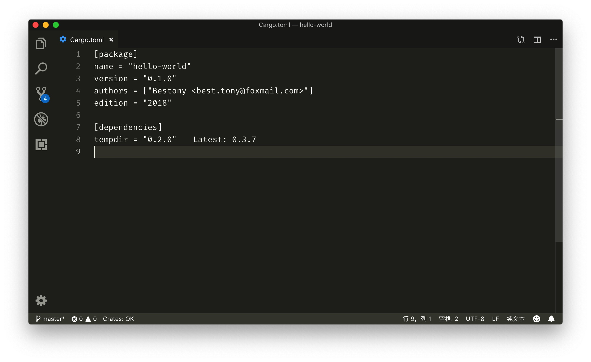
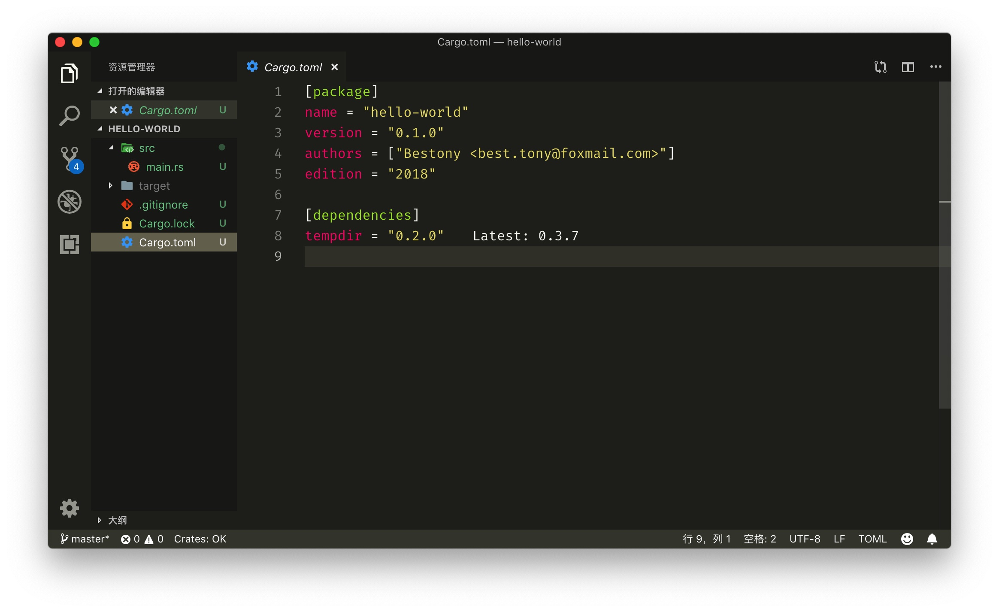

## 安装 Rust

Rust 在 macOS 上的安装非常的简单，只需要在终端执行如下代码

```
curl https://sh.rustup.rs -sSf | sh
```

会自动进入到安装的状态，脚本会检测你的操作系统，然后提示你是否安装，作为初学者，直接用默认的安装吧。

提示

稍等片刻，就安装完成了。

安装完成的提示

你可以重启终端来应用 Rust 的环境变量，或者直接执行如下命令来使环境变量生效。

```
source $HOME/.cargo/env
```

执行命令 `rustc --version` 可以看到版本号信息：


这时，就说明你的安装完成了。

## 创建测试项目

接下来，在终端里执行如下命令，来创建一个测试项目。

```
cargo new hello-world
```

并使用 cd 命令进入该目录，编译，并运行代码

```
cd hello-world
cargo run
```

你可以看到这样的输出，就说明你的 Rust 环境已经配置好了。


## Rust With VSCode

### 安装 Rust 代码支持

我一般习惯用 VSCode 写代码，所以依然这次继续使用 VSCode 来写 Rust。

在 VSCode 中的拓展管理器中搜索 **Rust**，可以看到一个名为 Rust(rls) 的拓展，安装这个拓展。

Rust(rls)

此时使用 VSCode 打开刚刚创建的 Hello World 项目，就可以看到如下的效果。


然后，打开终端，执行如下命令，来安装 Rust 拓展所需的一些 Rust 组件

```
rustup component add rls rust-analysis rust-src
```

### 安装 **[crates.io](https://crates.io/)** 的拓展支持

Crates.io 类似于我们在 Node.js 世界的 NPM，PHP 世界的 Composer。crates.io 的拓展可以帮助我们更好的管理我们的项目拓展。

在 VSCode 的拓展界面搜索 crates ，就可以看到由 Seray Uzgur 提交的 crates 插件，安装这个插件。


安装完成后，打开项目根目录的 `cargo.toml` 文件，然后你可以看到，在你的依赖项目后会提示你最新的版本。



把你的鼠标放在`"0.2.0"`的后面，还会提示你所有的更新的版本，你可以通过一下点击，来升级依赖的版本。


或者执行命令来升级所有的依赖


### 安装 TOML 的高亮

Toml 是 cargo 用来存储项目信息的文件格式，VSCode 本身不提供高亮，不过我们可以通过安装一些拓展来实现。

在 VSCode 的拓展管理器搜索 TOML，并安装由 bungcip 开发的 Better TOML，即可实现 toml 文件的高亮。


安装完成后，重新打开 cargo.toml 文件，你就会发现其内容被语法高亮了。



这样，我们就完成了 Rust 开发环境的基本配置。后续可以根据你自己的需要，去配置其他拓展和依赖。