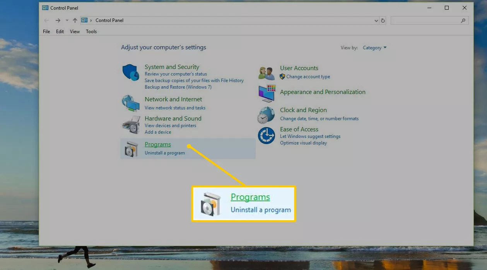
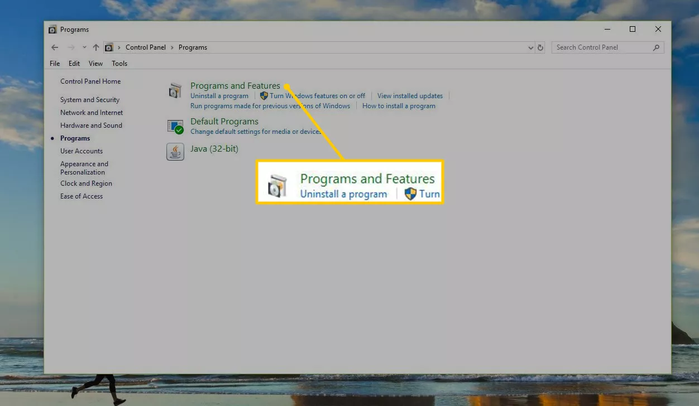
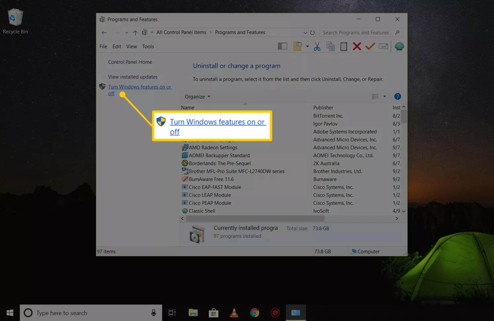
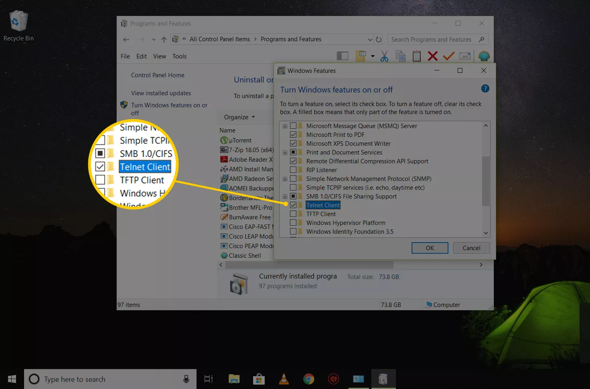
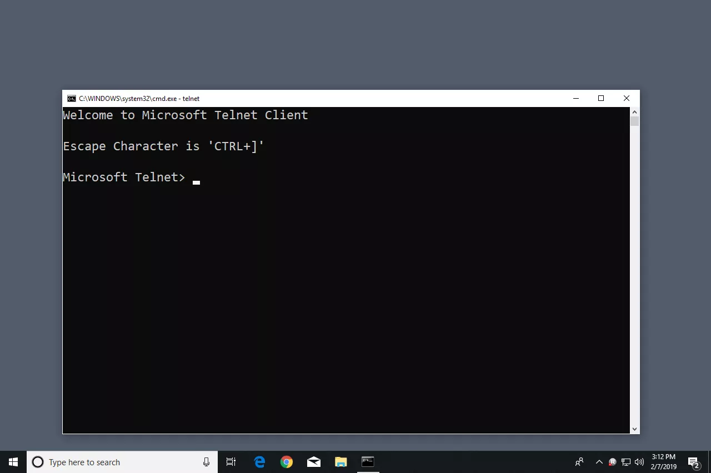
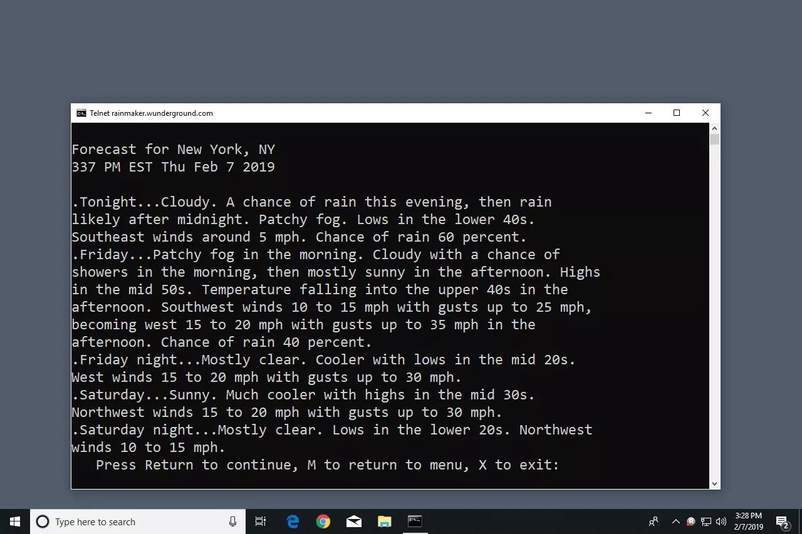
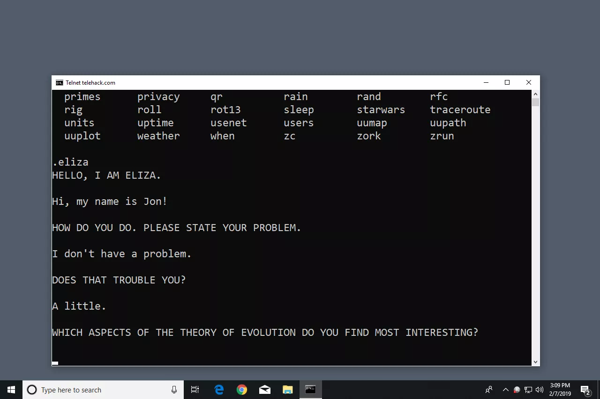
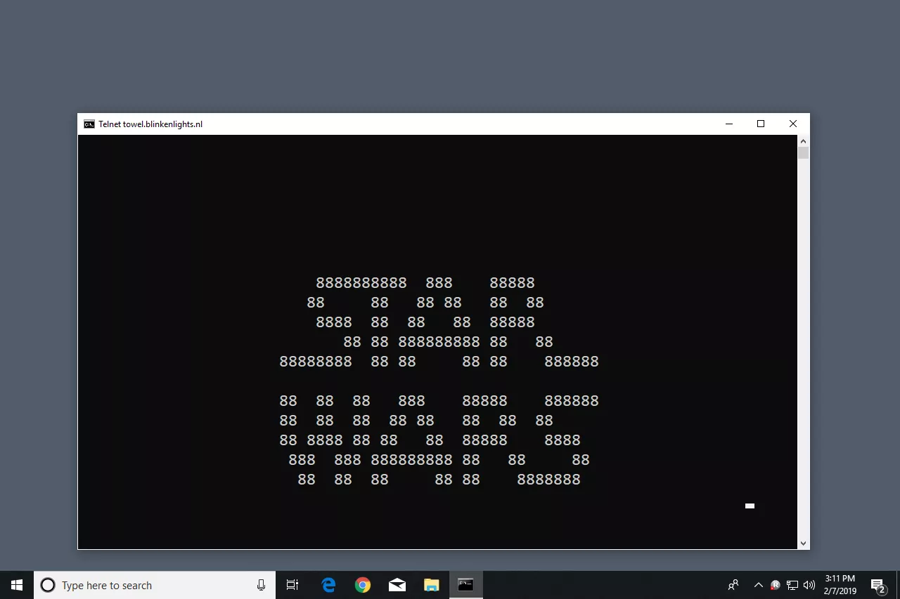

https://www.lifewire.com/what-is-telnet-2626026

win + 功能 + 启用telnet客户端


In This Article

- [How Does Telnet Work?](https://www.lifewire.com/what-is-telnet-2626026#how-does-telnet-work)
- [Windows Telnet Uses](https://www.lifewire.com/what-is-telnet-2626026#how-to-use-windows-telnet)
- [Step-by-Step: Enable Telnet in Windows](https://www.lifewire.com/what-is-telnet-2626026#enable-the-telnet-client-in-windows)
- [Execute Telnet Commands in Windows](https://www.lifewire.com/what-is-telnet-2626026#execute-telnet-commands-in-windows)
- [Extra: Fun Things to Do With Telnet](https://www.lifewire.com/what-is-telnet-2626026#telnet-games--additional-information)

Telnet is a [network protocol](https://www.lifewire.com/definition-of-protocol-network-817949) that provides a [command-line interface](https://www.lifewire.com/what-is-a-command-line-interpreter-2625827) to communicate with a device. Telnet is used most often for remote management but also sometimes for the initial setup for some devices, especially network hardware such as switches and access points. Telnet is also used to manage files on a website.


## How Does Telnet Work?

Telnet originally was used on terminals. These computers require only a keyboard because everything on the screen displays as text. The terminal provides a way to remotely log on to another device, just as if you were sitting in front of it and using it like any other computer.

Nowadays, Telnet can be used from a *virtual* terminal, or a terminal emulator, which is essentially a modern computer that communicates with the same Telnet protocol. One example of this is the telnet command, available from the Command Prompt in Windows. The telnet command uses the Telnet protocol to communicate with a remote device or system.

Telnet commands can also be executed on other operating systems such as Linux and macOS, in the same way that telnet commands are executed in Windows.

Telnet isn't the same as other TCP/IP protocols such as HTTP, which transfers files to and from a server. Instead, the Telnet protocol has you log on to a server as if you were an actual user, then grants you direct control and all the same rights to files and applications as the user that you're logged in as.

Although not the same as Telnet, if you're looking for a way to communicate with another computer remotely, see [this list of free remote access programs](https://www.lifewire.com/free-remote-access-software-tools-2625161).


## How to Use Windows Telnet

Although Telnet isn't a secure way to communicate with another device, there are a reason or two to use it, but you can't just open up a Command Prompt window and expect to start executing telnet commands.

Telnet Client, the command-line tool that executes telnet commands in Windows, works in every version of Windows, but, depending on which version of Windows you're using, you may have to enable it first.


## Enable the Telnet Client in Windows

In Windows 10, Windows 8, Windows 7, and Windows Vista, turn on the Telnet Client in Windows Features in Control Panel before any telnet commands can be executed.

Telnet Client is already installed and ready to use out of the box in both Windows XP and Windows 98.

1. Open Control Panel by searching for **control panel** in the Start menu. Or, open the Run dialog box via **WIN+R** and then enter **control**.

2. Select **Programs**. If you don't see that because you're viewing the [Control Panel applet](https://www.lifewire.com/control-panel-applet-2625831) icons, choose **Programs and Features** instead, and then skip to Step 4.

   

3. Select **Programs and Features**.

   

4. Select **Turn Windows features on or off** from the left pane.

   

5. Select the check box next to **Telnet Client**.

   

6. Select **OK** to enable Telnet.

7. When you see the **Windows completed the requested changes** message, you can close any open dialog boxes.


## Execute Telnet Commands in Windows

Telnet commands are easy to execute. After [opening Command Prompt](https://www.lifewire.com/how-to-open-command-prompt-2618089), enter the word **telnet**. The result is a line that says **Microsoft Telnet>**, which is where Telnet commands are entered.



If you don't plan to follow the first telnet command with additional commands, type **telnet** followed by any telnet command, such as the ones shown in the examples below.

To connect to a Telnet server, enter a command that follows this syntax:

```
telnet hostname port
```

For example, entering **telnet textmmode.com 23** connects to *textmmode.com* on port *23* using Telnet.

The last portion of the command is used for the Telnet port number but is only necessary to specify if it's not the default port of 23. For example, **telnet textmmode.com 23** is the same as running the command **telnet textmmode.com**, but not the same as **telnet textmmode.com 95**, which connects to the same server but on port *95*.

Microsoft keeps [this list of telnet commands](https://docs.microsoft.com/en-us/previous-versions/windows/it-pro/windows-xp/bb491013(v=technet.10)) if you'd like to learn more about how to do things like open and close a Telnet connection, display the Telnet Client settings, and more.


## Telnet Games & Additional Information

There are a number of [Command Prompt tricks](https://www.lifewire.com/command-prompt-tricks-and-hacks-2618104) you can perform using Telnet. Some of them are in text form, but you may have fun with them.

Check the weather at [Weather Underground](https://www.wunderground.com/) with this Telnet command:

```
telnet rainmaker.wunderground.com
```



Use Telnet to talk to an artificially intelligent psychotherapist named *Eliza*. After connecting to Telehack with the command below, enter **eliza** when asked to choose one of the listed commands.

```
telnet telehack.com
```



Watch an ASCII version of the full Star Wars Episode IV movie by entering this in Command Prompt:

```
telnet towel.blinkenlights.nl
```



Beyond the fun things that can be done in Telnet are a number of Bulletin Board Systems. A BBS provides a way to message other users, view news, share files, and more. [Telnet BBS Guide](https://www.telnetbbsguide.com/bbs/connection/telnet/list/detail/) lists hundreds of servers that you can connect to using Telnet.