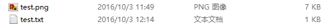
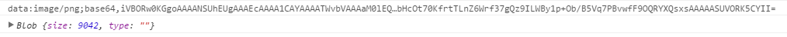
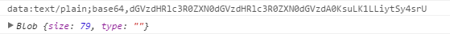
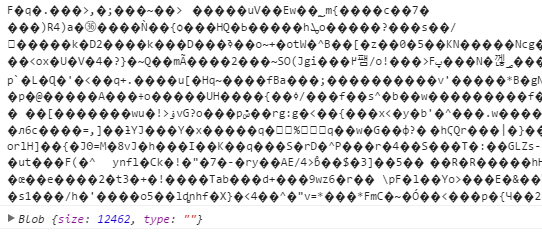
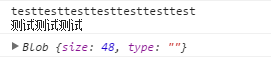
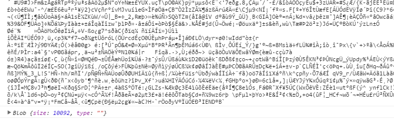
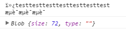
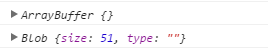

# [前端H5中JS用FileReader对象读取blob对象二进制数据，文件传输](https://www.cnblogs.com/dongxixi/p/11005607.html)

HTML5中的Blob对象只是二进制数据的容器，本身并不能操作二进制，故本篇将对其操作对象FileReader进行介绍。

# FileReader

FileReader主要用于将文件内容读入内存，通过一系列异步接口，可以在主线程中访问本地文件。

> 使用FileReader对象，web应用程序可以异步的读取存储在用户计算机上的文件(或者原始数据缓冲)内容，可以使用File对象或者Blob对象来指定所要处理的文件或数据。

## 创建实例

```
var reader = new FileReader();
```

## 方法

| 方法定义                       | 描述                                              |
| ------------------------------ | ------------------------------------------------- |
| abort():void                   | 终止文件读取操作                                  |
| readAsArrayBuffer(file):void   | 异步按字节读取文件内容，结果用ArrayBuffer对象表示 |
| readAsBinaryString(file):void  | 异步按字节读取文件内容，结果为文件的二进制串      |
| readAsDataURL(file):void       | 异步读取文件内容，结果用data:url的字符串形式表示  |
| readAsText(file,encoding):void | 异步按字符读取文件内容，结果用字符串形式表示      |

## 事件

| 事件名称    | 描述                                    |
| ----------- | --------------------------------------- |
| onabort     | 当读取操作被中止时调用                  |
| onerror     | 当读取操作发生错误时调用                |
| onload      | 当读取操作成功完成时调用                |
| onloadend   | 当读取操作完成时调用,不管是成功还是失败 |
| onloadstart | 当读取操作将要开始之前调用              |
| onprogress  | 在读取数据过程中周期性调用              |

## 使用方法

FileReader通过异步的方式读取文件内容，结果均是通过事件回调获取，下面是一个读取本地txt文件内容的例子：

```
var input  = document.getElementById("file"); //input file
input.onchange = function(){
    var file = this.files[0];
    if(!!file){
        //读取本地文件，以gbk编码方式输出
        var reader = new FileReader();
        reader.readAsText(file,"gbk");
        reader.onload = function(){
            //读取完毕后输出结果
            console.log(this.result);
        }
    }
}
```

此外我们还可以通过注册onprogress、onerror等事件，记录文件读取进度或异常行为等等。

## 读取方式

FileReader提供了四种不同的读取文件的方式，如：readAsArrayBuffer会将文件内容读取为ArrayBuffer对象，readAsBinaryString则将文件读取为二进制串，下面对这四种方式进行简单区分。
首先准备一张图片（6764 字节）和一个txt文本（51字节）作为测试文件：


接着编写测试代码：

```
 var reader = new FileReader();
// 通过四种方式读取文件
//reader.readAsXXX(file);   
reader.onload = function(){
    //查看文件输出内容
    console.log(this.result);
    //查看文件内容字节大小
    console.log(new Blob([this.result]))
}
```

### readAsDataURL

查看图片输出结果：


查看txt输出结果：


很明显，readAsDataURL会将文件内容进行base64编码后输出，这个很好区分。

### readAsText

此方法可以通过不同的编码方式读取字符，我们使用`utf-8`读取
查看图片输出结果：


查看txt输出结果：


readAsText读取文件的单位是字符，故对于文本文件，只要按规定的编码方式读取即可；
而对于媒体文件（图片、音频、视频），其内部组成并不是按字符排列，故采用readAsText读取，会产生乱码，同时也不是最理想的读取文件的方式

### readAsBinaryString

查看图片输出结果：


查看txt输出结果：


与readAsText不同的是，readAsBinaryString函数会按字节读取文件内容。
然而诸如0101的二进制数据只能被机器识别，若想对外可见，还是需要进行一次编码，而readAsBinaryString的结果就是读取二进制并编码后的内容。
尽管readAsBinaryString方法可以按字节读取文件，但由于读取后的内容被编码为字符，大小会受到影响，故不适合直接传输，也不推荐使用。
如：测试的图片文件原大小为6764 字节，而通过readAsBinaryString读取后，内容被扩充到10092个字节

### readAsArrayBuffer

查看图片输出结果：


查看txt输出结果：


与readAsBinaryString类似，readAsArrayBuffer方法会按字节读取文件内容，并转换为ArrayBuffer对象。
我们可以关注下文件读取后大小，与原文件大小一致。
这也就是readAsArrayBuffer与readAsBinaryString方法的区别，readAsArrayBuffer读取文件后，会在内存中创建一个ArrayBuffer对象（二进制缓冲区），将二进制数据存放在其中。通过此方式，我们可以直接在网络中传输二进制内容。
好了说这么多，那ArrayBuffer到底是个毛？
关于ArrayBuffer对象牵涉的知识点比较多，完全可以单开一篇细说，在此只要简单理解为存放了一段二进制数据的内存空间即可。
而本身ArrayBuffer中的内容对外是不可见的，若要查看其中的内容，就要引入另一个概念：类型化数组
我们可以尝试查看下刚刚通过readAsArrayBuffer方法读取的图片文件内容：


可以看到，整个图片文件的6764个字节，被分别存储在长度为6764的数组中，而数组中每一个元素的值，为当前字节的十进制数值。
关于ArrayBuffer和类型化数组的概念在此不做深入解释，之后会再写一篇单独讨论。

# 应用场景

说了这么多，最后还是要落实到FileReader能解决什么问题，下面通过几个例子说明：

## 在线预览本地文件

我们知道，img的src属性或background的url属性，可以通过被赋值为图片网络地址或base64的方式显示图片。
在文件上传中，我们一般会先将本地文件上传到服务器，上传成功后，由后台返回图片的网络地址再在前端显示。
通过FileReader的readAsDataURL方法，我们可以不经过后台，直接将本地图片显示在页面上。这样做可以减少前后端频繁的交互过程，减少服务器端无用的图片资源，代码如下：

```
var input  = document.getElementById("file");   // input file
input.onchange = function(){
    var file = this.files[0];
        if(!!file){
            var reader = new FileReader();
            // 图片文件转换为base64
            reader.readAsDataURL(file);
            reader.onload = function(){
                // 显示图片
                document.getElementById("file_img").src = this.result;
        }
    }
}
```

运行效果如下：


对于图片上传，我们也可以先将图片转换为base64进行传输，此时由于传输的图片内容就是一段字符串，故上传接口可以当做普通post接口处理，当图片传输到后台后，可以在转换为文件实体存储。
当然，考虑到base64转换效率及其本身的大小，本方法还是适合于上传内容简单或所占内存较小的文件。

## 二进制数据上传

HTML5体系的建立引入了一大堆新的东西，基于XHR2，我们可以直接上传或下载二进制内容，无需像以往一样通过form标签由后端拉取二进制内容。
简单整理下上传逻辑：
1、通过input[type="file"]标签获取本地文件File对象
2、通过FileReader的readAsArrayBuffer方法将File对象转换为ArrayBuffer
3、创建xhr对象，配置请求信息
4、通过xhr.sendAsBinary直接将文件的ArrayBuffer内容装填至post body后发送
代码实现如下：

```
var input  = document.getElementById("file");   // input file
input.onchange = function(){
    var file = this.files[0];
        if(!!file){
            var reader = new FileReader();
            reader.readAsArrayBuffer(file);
            reader.onload = function(){
                var binary = this.result;
                upload(binary);
        }
    }
}

//文件上传
function upload(binary){
    var xhr = new XMLHttpRequest();
    xhr.open("POST", "http://xxxx/opload");
    xhr.overrideMimeType("application/octet-stream");
    //直接发送二进制数据
    if(xhr.sendAsBinary){
        xhr.sendAsBinary(binary);
    }else{
        xhr.send(binary);
    }
    
    // 监听变化
    xhr.onreadystatechange = function(e){
        if(xhr.readyState===4){
            if(xhr.status===200){
                // 响应成功       
            }
        }
    }
}
```

# 总结

本篇主要介绍了FileReader对象的属性及应用场景，有了FileReader，我们可以将本地文件读取到内存中。文中我们提到了ArrayBuffer和类型化数组的概念，这使得我们可以在内存中进一步操作二进制数据，关于这部分内容，会在之后的博客中进行归纳。

# 参考资料

[1] [MDN_FileReader](https://developer.mozilla.org/zh-CN/docs/Web/API/FileReader)
[2] [Unicode 和 UTF-8 有何区别](http://www.zhihu.com/question/23374078)
