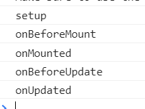
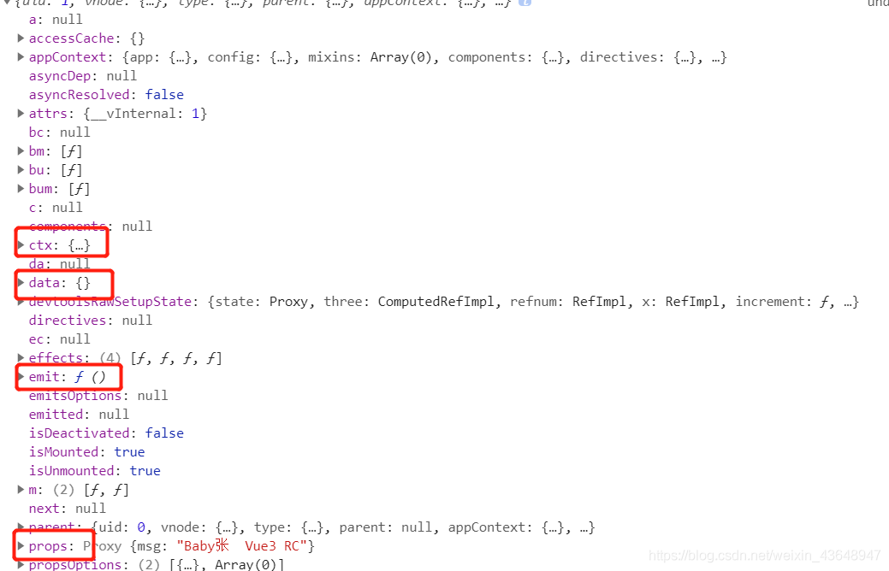

https://segmentfault.com/a/1190000024580501

## 一、3.0 对比 2.x 的重要变更

Vue 3.0 相对与之前的版本，有 6 个方面的重要变更：

### Performance（性能）

性能上，主要是优化了虚拟 DOM，所以也就有了更加优化的编译，同时实现了更加高效的组件初始化。

1. Rewritten virtual dom implementation （重写了虚拟 DOM）
2. Compiler-informed fast paths （优化编译）
3. More efficient component initialization （更高效的组件初始化）
4. 1.3-2x better update performance （1.3~2 倍的更新性能）
5. 2-3x faster SSR （2~3 倍的 SSR 速度）

### Tree-shaking support （支持 Tree-shaking）

在大部分情况下，我们并不需要 vue 中的所有功能，但是在之前的 vue 版本中，我们没有一个合适的办法用来除去不需要的功能，而 Vue3 中，为了满足体积更小的需求，支持 Tree-shaking，也就意味着我们可以按需求引用的内置的指令和方法。

1. Most optional features (e.g. v-model, <transition>) are now tree-shakable （大多数可选功能（如 v-model、<transition>）现在都是支持 Tree-shaking 的。）
2. Bare-bone HelloWorld size: 13.5kb. 11.75kb with only Composition API support.
3. All runtime features included: 22.5kb. More features but still lighter than Vue 2.

### Composition API

Composition API 主要是提高了代码逻辑的可复用性，并且将 Reactivity 模块独立出来，这也使得 vue 3 变得更加灵活地与其他框架组合使用。

1. Usable alongside existing Options API （可与现有选项 API 一起使用）
2. Flexible logic composition and reuse （灵活的逻辑组成和重用）
3. Reactivity module can be used as a standalone library （Reactivity 模块可以作为独立的库使用）

### Fragment, Teleport, Suspense

1. Fragment

在书写vue2时，由于组件必须只有一个根节点，很多时候会添加一些没有意义的节点用于包裹。Fragment组件就是用于解决这个问题的（这和React中的Fragment组件是一样的）。

- No longer limited to a single root node in templates （<template> 中不再局限于单一的根节点）

-Manual render functions can simply return Arrays （render 函数可以返回数组）

- “Just works”

1. Teleport

Teleport其实就是React中的Portal。Portal 提供了一种将子节点渲染到存在于父组件以外的 DOM 节点的优秀的方案。一个 portal 的典型用例是当父组件有 overflow: hidden 或 z-index 样式时，但你需要子组件能够在视觉上“跳出”其容器。例如，对话框、悬浮卡以及提示框。

- Previously known as <Portal>（原名为 <Portal>）
- More details to be shared by @Linusborg

1. Suspense

同样的，这和React中的Supense是一样的。Suspense 让你的组件在渲染之前进行“等待”，并在等待时显示 fallback 的内容。

- Wait on nested async dependencies in a nested tree
- Works with async setup() （与 async 函数 setup() 配合使用）
- Works with Async Components （与 Async 组件配合使用）

### Better TypeScript support （更好的 TypeScript 支持度）

vue3.0 对 TS 的支持度更高了，同时也支持 TSX 的使用；API 在 JS 与 TS 中的使用相同；类组件仍然可用，但是需要我们引入 vue-class-component@next，该模块目前还处于 alpha 测试阶段。

1. Codebase written in TS w/ auto-generated type definitions
2. API is the same in JS and TS
3. In fact, code will also be largely the same
4. TSX support
5. Class component is still supported (vue-class-component@next is currently in alpha)

### Custom Renderer API （自定义的 Renderer API）

自定义 render 会提供一个 API 用来创建自定义的 render，因此不再需要为了自定义一些功能而 fork Vue 的代码。这个特性给 Weex 和 NativeScript Vue 这样的项目提供了很多便利。

1. NativeScript Vue integration underway by @rigor789
2. Users already experimenting w/ WebGL custom renderer that can be used alongside a normal Vue application (Vugel)


# [（建议收藏）Vue3 对比 Vue2.x 差异性、注意点、整体梳理，与React hook比又如何？（面试热点）](https://juejin.cn/post/6892295955844956167)

全文14200多字，平均阅读20分钟，坚持看完你会有收获，还望支持，不对的地方望指正，提出建议。

（采纳的`问题`和`建议`，我会附上`提议者名字、链接`）

# 前言

前不久 `Vue3的RC` 版本终于发布，一直没时间研究，这篇文章我将以下面的结构，为大家整体梳理下`Vue3`，顺便对比下`vue2.x和react hook`结合着带大家看看，可能有些长，耐心看完相信会有收获`（面试热点）`。 

# 一、为什么重写vue2.X?

提示：首先我们先了解下，是什么让尤雨溪决定重写`vue`，这将也是`Vue2.x与Vue3`的差异性对比，vue的一次重大升级。（面试热点）

\color{red}{后续敬请期待，Vue2.x源码解析,努力码字中。。。}后续敬请期待，*V**u**e*2.*x*源码解析,努力码字中。。。

## 1.1背景

如今的前端 `Vue - React - Angular` 三足鼎立，彼此之间相互牵制，可谓明争暗斗多年，自古以来落后就要挨打，如今Vue就是意识到了自己的不足，在寻找突破和提升，那么究竟那些不足呢？相信大家使用时候也多多少少感觉到了，后面将细细说明。 当前`github` 上三大框架的star情况， `vue-175K ， react -159k ， angular- 67.3k`

## 1.2尤雨溪的回答是两个关键因素：

- 主流浏览器对新的`JavaScript`语言特性的普遍支持。
- 当前`Vue`代码库随着时间的推移而暴露出来的设计和体系架构问题。

提示：具体那里不足会在下面`vue2和vue3`对比时候说明

------

# 二、Vue2.x 到 Vue3 详细对比

## 2.1 生命周期的变化

| Vue2.x        | Vue3            |
| ------------- | --------------- |
| beforeCreate  | 使用 setup()    |
| created       | 使用 setup()    |
| beforeMount   | onBeforeMount   |
| mounted       | onMounted       |
| beforeUpdate  | onBeforeUpdate  |
| updated       | onUpdated       |
| beforeDestroy | onBeforeUnmount |
| destroyed     | onUnmounted     |
| errorCaptured | onErrorCaptured |


整体来看其实变化不大，使用setup代替了之前的beforeCreate和created，其他生命周期名字有些变化，功能都是没有变化的

------

## 2.2- 使用proxy代替defineProperty

熟悉vue的朋友都知道，vue2.x双向绑定的核心是`Object.defineProperty()`，那为什么要换掉呢，我们看看他们的语法就知道了。

### 2.2.1- Object.defineProperty()语法

重点：vue为什么对数组对象的深层监听无法实现，因为组件每次渲染都是将data里的数据通过`defineProperty`进行响应式或者双向绑定上，之前没有后加的属性是不会被绑定上，也就不会触发更新渲染

```java
Object.defineProperty( Obj, 'name', {
    enumerable: true, //可枚举
    configurable: true, //可配置
    // writable:true, //跟可配置不能同时存在
    // value:'name',  //可写死直
    get: function () {
        return def
    },
    set: function ( val ) {
        def = val
    }
} )
复制代码
```

### 2.2.2- Proxy的语法

```java
//两个参数，对象，13个配置项
const handler = {
    get: function(obj, prop) {
        return prop in obj ? obj[prop] : 37;
    },
    set:function(){ },
    ...13个配置项
};
const p = new Proxy({}, handler);
p.a = 1;
p.b = undefined;
console.log(p.a, p.b);      // 1, undefined
console.log('c' in p, p.c); // false, 37
复制代码
```

对比了上面两种语法是不是就懂了，`defineProperty`只能响应首次渲染时候的属性，`Proxy`需要的是整体，不需要关心里面有什么属性，而且`Proxy的配置项有13种`，可以做更细致的事情，这是之前的`defineProperty`无法达到的

### 2.2.3- 两者兼容性

1.`vue2.x`之所以只能兼容到IE8就是因为`defineProperty`无法兼容IE8,其他浏览器也会存在轻微兼容问题 2.`proxy`的话除了`IE`，其他浏览器都兼容，这次`vue3`还是使用了它，说明`vue3`直接放弃了`IE`的兼容考虑，个人感觉已经没人用`IE`了

------

## 2.3- Diff算法的提升

### 2.3.1- 以往的渲染策略

`vue2.x`提供类似于`HTML`的模板语法，但是，它是将模板编译成渲染函数来返回`虚拟DOM树`。`Vue`框架通过递归遍历`两个虚拟DOM树`，并比较每个节点上的每个属性，来确定实际DOM的哪些部分需要更新。

### 2.3.2- 潜在的问题

由于现代`JavaScript`引擎执行的高级优化，这种有点暴力的算法通常非常快速，但是`DOM`的更新仍然涉及许多不必要的`CPU`工作，那么如何解决呢？

### 2.3.3- Vue3的突破

引用尤雨溪： 为了实现这一点，编译器和运行时需要协同工作：编译器分析模板并生成带有优化提示的代码，而运行时尽可能获取提示并采用快速路径。这里有三个主要的优化：

- 首先，`在DOM树级别`。我们注意到，在没有动态改变节点结构的模板指令`（例如v-if和v-for）`的情况下，节点结构保持完全静态。如果我们将一个模板分成由这些结构指令分隔的嵌套“块”，则每个块中的节点结构将再次完全静态。当我们更新块中的节点时，我们不再需要递归遍历DOM树 - 该块内的动态绑定可以在一个平面数组中跟踪。这种优化通过将需要执行的树遍历量减少一个数量级来规避虚拟DOM的大部分开销。
- 其次，编译器积极地检测模板中的静态节点、子树甚至数据对象，并在生成的代码中将它们提升到渲染函数之外。这样可以避免在每次渲染时重新创建这些对象，从而大大提高内存使用率并减少垃圾回收的频率。
- 第三，在元素级别。编译器还根据需要执行的更新类型，为每个具有动态绑定的元素生成一个优化标志。例如，具有动态类绑定和许多静态属性的元素将收到一个标志，提示只需要进行类检查。运行时将获取这些提示并采用专用的快速路径。
- 综合起来，这些技术大大改进了我们的渲染更新基准，`Vue 3`有时占用的CPU时间不到`Vue 2的十分之一`。

------

## 2.4- typeScript的支持

### 2.4.1- 存在的问题

`vue2.x`中使用的都是js，它本身并没有类型系统这个概念，现如今`typescript`异常火爆，它的崛起是有原因的，因为对于规模很大的项目，没有类型声明，后期维护和代码的阅读都是头疼的事情，所以广大码农迫切的需要vue能完美支持ts。

（[追加评论区 Wetoria的意见](https://juejin.im/user/2682464104099694/posts)：`vue2`是支持类型的，用的是`Facebook的Flow`做类型检查，但是因为某些情况下推断有问题，所以改为支持ts。一个是为了更好的类型检查，另一个是`拥抱ts`）

### 2.4.2- 如何实现

最终`vue3` 借鉴了`react hook`实现了更自由的编程方式，提出了`Composition API`，`Composition API`不需要通过指定一长串选项来定义组件，而是允许用户像编写函数一样自由地表达、组合和重用有状态的组件逻辑，同时提供出色的`TypeScript`支持。

------

## 2.5- 打包体积变化

### 2.5.1- 以前打包存在的问题

`vue2官方`说的运行时打包师23k，但这只是没安装依赖的时候，随着依赖包和框架特性的增多，有时候不必要的，未使用的代码文件都被打包了进去，所以后期项目大了，打包文件会特别多还很大。

### 2.5.2- vue3是怎么做的

引用尤雨溪：

- 在`Vue 3`中，我们通过将大多数`全局API`和内部帮助程序移动到`Javascript`的`module.exports`属性上实现这一点。这允许现代模式下的`module bundler`能够静态地分析模块依赖关系，并删除与未使用的`module.exports`属性相关的代码。模板编译器还生成了对树抖动友好的代码，只有在模板中实际使用某个特性时，该代码才导入该特性的帮助程序。
- 尽管增加了许多新特性，但`Vue 3`被压缩后的基线大小约为10 KB，不到`Vue 2的一半`。

------

## 2.6-其他Api和功能的改动

注释：这些小改动就不做更细的说明，只列举下。 [详细使用看vue2的迁移部分](https://www.vue3js.cn/docs/zh/guide/migration/introduction.html#概览)

- `Global API`
- 模板指令
- 组件
- 渲染函数
- `vue-cli 从 v4.5.0 `开始提供 Vue 3 预设
- `Vue Router 4.0` 提供了 Vue 3 支持，并有许多突破性的变化
- `Vuex 4.0` 提供了 Vue 3 支持，其 API 与 2.x 基本相同
- 多数库还处在`beta阶段`

| 项目                  | npm                                                          | 仓库                                                         |
| --------------------- | ------------------------------------------------------------ | ------------------------------------------------------------ |
| @vue/babel-plugin-jsx | [](https://www.npmjs.com/package/@vue/babel-plugin-jsx) | [Github](https://github.com/vuejs/jsx-next)                  |
| eslint-plugin-vue     | [](https://www.npmjs.com/package/eslint-plugin-vue/v/next) | [Github](https://github.com/vuejs/eslint-plugin-vue)         |
| @vue/test-utils       | [](https://www.npmjs.com/package/@vue/test-utils/v/next) | [Github](https://github.com/vuejs/vue-test-utils-next)       |
| vue-class-component   | [](https://www.npmjs.com/package/vue-class-component/v/next) | [Github](https://github.com/vuejs/vue-class-component/tree/next) |
| vue-loader            | [](https://www.npmjs.com/package/vue-loader/v/next) | [Github](https://github.com/vuejs/vue-loader/tree/next)      |
| rollup-plugin-vue     | [](https://www.npmjs.com/package/rollup-plugin-vue/v/next) | [Github](https://github.com/vuejs/rollup-plugin-vue/tree/next) |


------

# 三、Vue3整体梳理

看了上面`Vue2.x和Vue3`的对比，是不是感觉好牛逼，有点迫不及待的想体验了呢？

## 3.1- 安装Vue3

我这里使用`vite`脚手架安装

```java
//脚手架vite
npm init vite-app hello-vue3  |  yarn create vite-app hello-vue3
复制代码
//脚手架vue-cli
npm install -g @vue/cli | yarn global add @vue/cli
vue create hello-vue3
# select vue 3 preset
复制代码
```

然后直接跑起来`（我这里稍微改了下文案）` 

------

## 3.2- 组件基本结构分析

这里以改变`helloWorld.vue`组件为例，代码重点部分给了`注释`

```java
//dom 里的东西基本上都是没有变的
<template>
  <h1>{{ msg }}</h1>
  <button @click="increment">
    count: {{ state.count }}, double: {{ state.double }},three：{{ three }},refnum：{{refnum}}
  </button>
</template>

<script>
//这里就是Vue3的组合Api了，这里跟react的 import { useState ,useEffect } from 'react' 有些类似，需要用啥引啥
import {ref, reactive, computed ,watchEffect,watch} from "vue";
export default {
  name: "HelloWorld",
  props: {
    msg: String,
  },
  //上面对比的时候说过，setup相当于beforeCreate 和created，简单理解就是初始化
  setup() { 
  	//这里通过reactive使state成为相应状态（后面会详细介绍）
    const state = reactive({
      count: 0,
      //计算属性computed的使用更灵活了
      double: computed(() => state.count * 2),
    });
    //computed也可以单独拿出来使用
    const three = computed(() => state.count * 3)
    //ref跟reactive作用一样都是用来数据相应的，ref的颗粒度更小（后面详细对比）
	const refnum = ref()
   //这里的watchEffect只要里面的变量发生了改变就会执行,并且第一次渲染会立即执行,没有变化前后返回参数，无法监听整个reactive
    watchEffect(() => {
      refnum.value = state.count;
      console.log(state, "watchEffect");
    });
    //watch里第一个参数是监听需要的变量，第二个是执行的回调函数，
    watch(refnum,(a,b)=>{
      console.log(a,b,'watch,a,b')
    })
    //所有的方法里再也不需要用this了，这是很爽的
    function increment() {
      state.count++;
    }
   	//组中模板中需要的变量，都要通过return给暴露出去，就像当初data({return { } }) 是一样的
    return {
      state,
      increment,
      three,
      refnum
    };
  },
};
</script>
复制代码
```


------

## 3.3- 生命周期的使用

上面对比的时候也说了，生命周期命名改变了更有语义化了，使用方法也改变（这里有点像`react `的`useEffect(()=>{ })`），使用前需要我们在组合Api里获取。

```java
<script>
import {
  reactive,
  computed,
  onMounted,
  onBeforeMount,
  onBeforeUpdate,
  onUpdated,
  onUnmounted,
  onBeforeUnmount,
} from "vue";

export default {
  setup() {
    const state = reactive({
      count: 0,
      double: computed(() => state.count * 2),
    });
    function increment() {
      state.count++;
    }
    onUpdated(() => {
      console.log("onUpdated");
    });
    onUnmounted(() => {
      console.log("onUnmounted");
    });
    onBeforeUnmount(() => {
      console.log("onBeforeUnmount");
    });
    onBeforeUpdate(() => {
      console.log("onBeforeUpdate1");
    });
    onMounted(() => {
      console.log("onMounted");
    });
    onBeforeMount(() => {
      console.log("onBeforeMount");
    });
    console.log("setup");
    return {
      state,
      increment,
    };
  },
};
</script>
复制代码
```

上面生命周期故意顺序乱着写，最终执行还是跟以前一样 

## 3.4- 组件Api的使用

### 3.4.0- setup

`setup`替代了以前的 `beforeCreate 和 created` ，类似于初始化的功能

```
父组件：
<template>
  
  <HelloWorld msg="Baby张  Vue3 RC" />
  //这里传参给子组件
</template>
<script>
import HelloWorld from "./components/HelloWorld.vue";
import { provide } from "vue";
export default {
  name: "App",
  components: {
    HelloWorld,
  }
};
</script>
复制代码
子组件：
//props 接收的父组件传的参数，这就有点像react的props了
//ctx 这个参数表示的当前对象实例，也就个是变相的this
setup(props,ctx){
 console.log(props.msg, ctx, "app-setup");
}
复制代码
```

我们来看看打印的结果  如果你还想要更多当前组件相关的属性，还可以从`组合Api` 里引用` getCurrentInstance`

```java
 import {getCurrentInstance } from "vue";
 const  all  = getCurrentInstance()
 console.log(all, "app-setup");
复制代码
```



------

### 3.4.1- ref 、toRef、 toRefs

看到这3个可能大家一脸懵逼，先看看大概用法，然后再告诉大家好记的方法

```java
import { ref , toRef , toRefs } from 'vue'
setup(){
 const obj = {age:12}
 //初始化设置个响应式变量tor,函数中读取值要tor.value
 let tor = ref(0)
 //这里将对象转化成响应性，并设置key值,函数中读取值要toR._object
 let toR = toRef(obj,'toR')
 const state = reactive({
	num:1,
	name:'baby张'
})
 return {
	tor,
	roR,
	//toRefs针对的是使用了reactive的响应式对象，可以理解为将对象拆分成多个响应式ref，外界可以读取到响应式的所有属性
	...toRefs(state)
	}
 }
复制代码
```

`ref` 就当作简单的响应式变量 `toRef` 就是把不是响应式的对象转化成响应式 `toRefs` 就是把响应式的reactive对象，分解成无数的响应式 ref

（[追加评论区 卡梅隆的意见：](https://juejin.cn/user/1116759543777992)‘toRefs 就是把响应式的reactive对象，分解成无数的 ref 双向绑定’，官方解释是：‘toRefs把一个响应式对象转换成普通对象，该普通对象的每个 property 都是一个 ref ，和响应式对象 property 一一对应）

这里是打印三种Api的结果：  注意点：

1.` ref `响应式的数据，在函数里读取的时候需要 `.value`获取 2. `dom`里不需要我们`+value` 框架替我们自动解构了 3. 组件`return`的时候将 `reactive`的对象` toRefs` ，可以使代码更简洁，又不会丢失数据的响应式

------

### 3.4.2- reactive

上面的 demo 中多多少少都用到了，用法也很简单，就说下注意点：

- `reactive` 内部是可以使用计算属性等各种方法，它只是把数据实现响应式而已
- `reactive` 后`return` 的数据最好是用`toRefs` 转化一下，好处谁用谁知道
- 跟 `ref` 混合使用时候可以用`isRef `判断类型

### 3.4.3- watch、watchEffect

使用方法：

```java
 //这里的watchEffect只要里面的变量发生了改变就会执行,并且第一次渲染会立即执行,没有变化前后返回参数，无法监听整个reactive
    watchEffect(() => {
      refnum.value = state.count;
      console.log(state, "watchEffect");s
    });
    //watch里第一个参数是监听需要的变量，第二个是执行的回调函数，
    watch(refnum,(a,b)=>{
      console.log(a,b,'watch,a,b')
    })
复制代码
```

看名字就知道都是用来监听的，但有一些区别：（亲测）

- `watch `需要具体监听参数，`watchEffect `不需要传入监听参数
- `watch `的回调函数跟以前一样有前后对比的参数，`watchEffect `啥都没有
- `watch `只有监听属性变化才执行，`watchEffect` 第一次会立即执行
- `watch `和` watchEffect `都无法监听未被绑定的属性
- `watch `可以直接监听 `ref` 和 `reactive `绑定的对象，`watchEffect `不可以（ref的值要.value，reactive的值要具体到内部属性），只会执行第一次

------

### 3.4.4- 函数组件

- 现在在` Vue 3 `中，所有的函数式组件都是用普通函数创建的
- 他们有两个参数：`props 和 context`， 跟上面3.4.0说的 setup参数一样
- 以前是在 `render `函数中隐式提供 `creatElement`，现在是组合Api里引入h

```java
import { h } from 'vue'
const Fun = (props, context) => {
//这里h的用法跟以前还是一样的
  return h(p, context.attrs, context.slots)
}
export default Fun
复制代码
```

[放上尤雨溪的模板写法](https://zhuanlan.zhihu.com/p/68477600)：

```java
import { ref, computed, watch, onMounted } from 'vue'

const App = {
  template: `
    <div>
      <span>count is {{ count }}</span>
      <span>plusOne is {{ plusOne }}</span>
      <button @click="increment">count++</button>
    </div>
  `,
  setup() {
    // reactive state
    const count = ref(0)
    // computed state
    const plusOne = computed(() => count.value + 1)
    // method
    const increment = () => { count.value++ }
    // watch
    watch(() => count.value * 2, val => {
      console.log(`count * 2 is ${val}`)
    })
    // lifecycle
    onMounted(() => {
      console.log(`mounted`)
    })
    // expose bindings on render context
    return {
      count,
      plusOne,
      increment
    }
  }
}
复制代码
```

------

### 3.4.5- Other

上面我主要在大的方向给大家做了介绍，其实还有好多细节的改动。

[比如：一步组件、指令、solt、过度class......更多更改看官网Vue2迁移](https://www.vue3js.cn/docs/zh/guide/migration/introduction.html#概览)

------

## 3.5- Typescript的支持

`TS`的支持也是`Vue3`的重中之重，在`vue2.x版本ts`里应该好多人用过`vue-property-decorator` 或者`Facebook的Flow`，来写`vue里的TS`，有些装饰器器和属性也比较难以理解，比如： `@Emit @Inject @Provice @Prop @Watch @Model Mixins `都需要一些学习成本，才能下手。但没办法只能硬着头皮用，外物终究使外物。`写习惯了react + ts `突然用`vue` 总感觉少了什么，也没法像`react` 一样随心所欲的在js里声明类型，这也是`Vue3`重构的原因之一。

（[追加评论区 Wetoria的意见](https://juejin.im/user/2682464104099694/posts)：vue2是支持类型的，用的是`Facebook的Flow`做类型检查，但是因为某些情况下推断有问题，所以改为支持`ts`。一个是为了更好的类型检查，另一个是拥抱`ts` [至于TS还不知怎么用的小伙伴，看看TS官网先学学](https://www.tslang.cn/docs/handbook/interfaces.html)

到这里大家对`Vue3 的RC版本`已经有了一定了解，还没行动的小伙伴，赶紧行动起来吧。

------

# 四 、Vue3 setup与 React Hooks 的对比

## 4.1- React hook

`react 在v16.8` 后的版本就已经全面支持`hook`了，笔者也是使用 `hook 和 TS `完整的开发完了4个项目，收获满满。

[对 React hook 还不了解的小伙伴，看我之前文章（React hook 10种 Hook （详细介绍及使用））](https://blog.csdn.net/weixin_43648947/article/details/102838142)

## 4.2- 个人使用感受对比

我只对新版的`Vue3 和 React v16.8 `做比较，`只是我个人看法勿喷`，不对的地方望指正`（我会附上意见来源）`

| 对比方向   | Vue3         | React v16.8  | 总结                                              |
| ---------- | ------------ | ------------ | ------------------------------------------------- |
| 学习成本   | 低           | 高           | setup 和 hook 比以前其实都简洁很多                |
| 代码可读性 | 高           | 高           | 写组件更像在写js代码                              |
| TS         | 支持         | 支持         | 这也是vue3重构原因                                |
| 心智负担   | 低           | 高           | hook 方法的注意点、优化点、渲染问题、都有人为把控 |
| 欢迎程度   | 高 star 175k | 高 star 159k | 都是很受欢迎、了不起的框架                        |
| 打包体积   | 小           | 大           | Vue3 对打包进行了深度优化，体积原来一半，应该很棒 |
| diff算法   | 更快         | 快           | Vue3 不需要递归对比，理论上应该更快               |
| 使用感受   | 爽           | 爽           | 都是一大突破，用起来很爽                          |


虽然现在我自己用`react `比较多，但还是很期待`Vue3 `的正式发布，两个都是很棒的框架，期待他们的不断完善和成长。

## 4.3- 名家对比

引用尤大大的话：

`setup `和 `React Hooks `有一定的相似性，具有同等的基于函数抽取和复用逻辑的能力，但也有很本质的区别。`React Hooks `在每次组件渲染时都会调用，通过隐式地将状态挂载在当前的内部组件节点上，在下一次渲染时根据调用顺序取出。而` Vue 的 setup() `每个组件实例只会在初始化时调用一次 ，状态通过引用储存在` setup() `的闭包内。这意味着基于 Vue 的函数 API 的代码：

- 整体上更符合 `JavaScript` 的直觉；
- 不受调用顺序的限制，可以有条件地被调用；
- 不会在后续更新时不断产生大量的内联函数而影响引擎优化或是导致 `GC `压力；
- 不需要总是使用 `useCallback` 来缓存传给子组件的回调以防止过度更新；
- 不需要担心传了错误的依赖数组给 `useEffect/useMemo/useCallback` 从而导致回调中- 使用了过期的值 —— Vue 的依赖追踪是全自动的。

# 总结

- 很多人都觉得前端很简单，甚至瞧不起前端，讲道理如今的前端水很深，`Ng Vue React `三大框架、`Node`框架多种、`小程序`多种、`App`多种、`Electron`、`TS`...作为前端的我们压力不小的。
- 各有各的优缺点，落后就最终会被淘汰，升级迭代也就是家常便饭了，大家无须抵触新技术，最好的方式就行接纳拥抱新技术，只有这样才不至于在前端的浪潮中被拍死。
- 对于这么多东西，归根结底还是`js`，所以还是得打好基础，对我们感兴趣的某几项，再深入研究。

全文14200多字，第一次写这么长文章，还望支持，不对的地方望指正，提出建议。`（采纳的问题和建议，我会附上提议者名字、链接）`