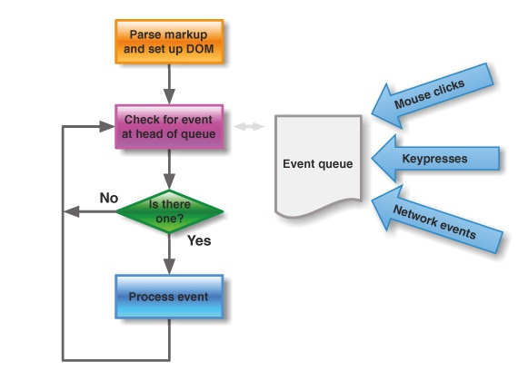

https://blog.csdn.net/weixin_44273311/article/details/114318630


vue中有一个较为特殊的API，nextTick。根据官方文档的解释，它可以在DOM更新完毕之后执行一个回调，用法如下：

> ```html
>  
> // 修改数据
> vm.msg = 'Hello'
> // DOM 还没有更新
> Vue.nextTick(function () {
> // DOM 更新了
> })
> 复制代码
> ```

尽管MVVM框架并不推荐访问DOM，但有时候确实会有这样的需求，尤其是和第三方插件进行配合的时候，免不了要进行DOM操作。而nextTick就提供了一个桥梁，确保我们操作的是更新后的DOM。

本文从这样一个问题开始探索：vue如何检测到DOM更新完毕呢？

检索一下自己的前端知识库，能监听到DOM改动的API好像只有MutationObserver了，后面简称MO.

### 理解MutationObserver

MutationObserver是HTML5新增的属性，用于监听DOM修改事件，能够监听到节点的属性、文本内容、子节点等的改动，是一个功能强大的利器，基本用法如下：

> ```html
>  
> //MO基本用法
> var observer = new MutationObserver(function(){
>  //这里是回调函数
>  console.log('DOM被修改了！');
> });
> var article = document.querySelector('article');
> observer.observer(article);
> 复制代码
> ```

MO的使用不是本篇重点。这里我们要思考的是：vue是不是用MO来监听DOM更新完毕的呢？

那就打开vue的源码看看吧，在实现nextTick的地方，确实能看到这样的代码：

> ```html
>  
> //vue@2.2.5 /src/core/util/env.js
> if (typeof MutationObserver !== 'undefined' && (isNative(MutationObserver) || MutationObserver.toString() === '[object MutationObserverConstructor]')) {
>  var counter = 1
>  var observer = new MutationObserver(nextTickHandler)
>  var textNode = document.createTextNode(String(counter))
>  observer.observe(textNode, {
>    characterData: true
>  })
>  timerFunc = () => {
>   counter = (counter + 1) % 2
>   textNode.data = String(counter)
>  }
> }
> 复制代码
> ```

简单解释一下，如果检测到浏览器支持MO，则创建一个文本节点，监听这个文本节点的改动事件，以此来触发nextTickHandler（也就是DOM更新完毕回调）的执行。后面的代码中，会执行手工修改文本节点属性，这样就能进入到回调函数了。

大体扫了一眼，似乎可以得到实锤了：哦！vue是用MutationObserver监听DOM更新完毕的！

难道不感觉哪里不对劲吗？让我们细细想一下：

1. 我们要监听的是模板中的DOM更新完毕，vue为什么自己创建了一个文本节点来监听，这有点说不通啊！
2. 难道自己创建的文本节点更新完毕，就能代表其他DOM节点更新完毕吗？这又是什么道理！

看来我们上面得出的结论并不对，这时候就需要讲讲js的事件循环机制了。

### 事件循环（Event Loop）

在js的运行环境中，我们这里光说浏览器吧，通常伴随着很多事件的发生，比如用户点击、页面渲染、脚本执行、网络请求，等等。为了协调这些事件的处理，浏览器使用事件循环机制。

简要来说，事件循环会维护一个或多个任务队列（task queues），以上提到的事件作为任务源往队列中加入任务。有一个持续执行的线程来处理这些任务，每执行完一个就从队列中移除它，这就是一次事件循环了，如下图所示：


我们平时用setTimeout来执行异步代码，其实就是在任务队列的末尾加入了一个task，待前面的任务都执行完后再执行它。

关键的地方来了，每次event loop的最后，会有一个UI render步骤，也就是更新DOM。标准为什么这样设计呢？考虑下面的代码：

> ```html
>  
> for(let i=0; i<100; i++){
>   dom.style.left = i + 'px';
> }
> 复制代码
> ```

浏览器会进行100次DOM更新吗？显然不是的，这样太耗性能了。事实上，这100次for循环同属一个task，浏览器只在该task执行完后进行一次DOM更新。

那我们的思路就来了：只要让nextTick里的代码放在UI render步骤后面执行，岂不就能访问到更新后的DOM了？

vue就是这样的思路，并不是用MO进行DOM变动监听，而是用队列控制的方式达到目的。那么vue又是如何做到队列控制的呢？我们可以很自然的想到setTimeout，把nextTick要执行的代码当作下一个task放入队列末尾。

然而事情却没这么简单，vue的数据响应过程包含：数据更改->通知Watcher->更新DOM。而数据的更改不由我们控制，可能在任何时候发生。如果恰巧发生在repaint之前，就会发生多次渲染。这意味着性能浪费，是vue不愿意看到的。

所以，vue的队列控制是经过了深思熟虑的（也经过了多次改动）。在这之前，我们还需了解event loop的另一个重要概念，microtask.

### microtask

从名字看，我们可以把它称为微任务。对应的，task队列中的任务也被叫做macrotask。名字相似，性质可不一样了。

每一次事件循环都包含一个microtask队列，在循环结束后会依次执行队列中的microtask并移除，然后再开始下一次事件循环。

在执行microtask的过程中后加入microtask队列的微任务，也会在下一次事件循环之前被执行。也就是说，macrotask总要等到microtask都执行完后才能执行，microtask有着更高的优先级。

microtask的这一特性，简直是做队列控制的最佳选择啊！vue进行DOM更新内部也是调用nextTick来做异步队列控制。而当我们自己调用nextTick的时候，它就在更新DOM的那个microtask后追加了我们自己的回调函数，从而确保我们的代码在DOM更新后执行，同时也避免了setTimeout可能存在的多次执行问题。

常见的microtask有：Promise、MutationObserver、Object.observe(废弃)，以及nodejs中的process.nextTick.

咦？好像看到了MutationObserver，难道说vue用MO是想利用它的microtask特性，而不是想做DOM监听？对喽，就是这样的。核心是microtask，用不用MO都行的。事实上，vue在2.5版本中已经删去了MO相关的代码，因为它是HTML5新增的特性，在iOS上尚有bug。

那么最优的microtask策略就是Promise了，而令人尴尬的是，Promise是ES6新增的东西，也存在兼容问题呀~ 所以vue就面临一个降级策略。

### vue的降级策略

上面我们讲到了，队列控制的最佳选择是microtask，而microtask的最佳选择是Promise.但如果当前环境不支持Promise，vue就不得不降级为macrotask来做队列控制了。

macrotask有哪些可选的方案呢？前面提到了setTimeout是一种，但它不是理想的方案。因为setTimeout执行的最小时间间隔是约4ms的样子，略微有点延迟。还有其他的方案吗？

不卖关子了，在vue2.5的源码中，macrotask降级的方案依次是：setImmediate、MessageChannel、setTimeout.

setImmediate是最理想的方案了，可惜的是只有IE和nodejs支持。

MessageChannel的onmessage回调也是microtask，但也是个新API，面临兼容性的尴尬...

所以最后的兜底方案就是setTimeout了，尽管它有执行延迟，可能造成多次渲染，算是没有办法的办法了。

### 总结

以上就是vue的nextTick方法的实现原理了，总结一下就是：

1. vue用异步队列的方式来控制DOM更新和nextTick回调先后执行
2. microtask因为其高优先级特性，能确保队列中的微任务在一次事件循环前被执行完毕
3. 因为兼容性问题，vue不得不做了microtask向macrotask的降级方案

# [Vue.nextTick 的原理和用途](https://segmentfault.com/a/1190000012861862)

[**将臣**](https://segmentfault.com/u/jiangchen_587dca8d8937e)发布于 2018-01-16

```
对于 Vue.nextTick 方法，自己有些疑惑。在查询了各种资料后，总结了一下其原理和用途，如有错误，请不吝赐教。
```

# 概览

> 官方文档说明：

- 用法：

在下次 DOM 更新循环结束之后执行延迟回调。在修改数据之后立即使用这个方法，获取更新后的 DOM。

> 疑问：

1. DOM 更新循环是指什么？
2. 下次更新循环是什么时候？
3. 修改数据之后使用，是加快了数据更新进度吗？
4. 在什么情况下要用到？

# 原理

## 异步说明

> Vue 实现响应式并**不是数据发生变化之后 DOM 立即变化**，而是按一定的策略进行 DOM 的更新。

在 Vue 的[文档](https://cn.vuejs.org/v2/guide/reactivity.html#异步更新队列)中，说明 Vue 是**异步**执行 DOM 更新的。关于异步的解析，可以查看阮一峰老师的[这篇文章](http://www.ruanyifeng.com/blog/2014/10/event-loop.html)。截取关键部分如下：

具体来说，异步执行的运行机制如下。

> （1）所有同步任务都在主线程上执行，形成一个执行栈（execution context stack）。
> （2）主线程之外，还存在一个"任务队列"（task queue）。只要异步任务有了运行结果，就在"任务队列"之中放置一个事件。
> （3）一旦"执行栈"中的所有同步任务执行完毕，系统就会读取"任务队列"，看看里面有哪些事件。那些对应的异步任务，于是结束等待状态，进入执行栈，开始执行。
> （4）主线程不断重复上面的第三步。

下图就是主线程和任务队列的示意图。



## 事件循环说明

简单来说，Vue 在修改数据后，视图不会立刻更新，而是等**同一事件循环**中的所有数据变化完成之后，再统一进行视图更新。

[知乎](https://www.zhihu.com/question/50879936)上的例子：

```
//改变数据
vm.message = 'changed'

//想要立即使用更新后的DOM。这样不行，因为设置message后DOM还没有更新
console.log(vm.$el.textContent) // 并不会得到'changed'

//这样可以，nextTick里面的代码会在DOM更新后执行
Vue.nextTick(function(){
    console.log(vm.$el.textContent) //可以得到'changed'
})
```

图解：


> 事件循环：

第一个 tick（图例中第一个步骤，即'本次更新循环'）：

1. 首先修改数据，这是同步任务。同一事件循环的所有的同步任务都在主线程上执行，形成一个执行栈，此时还未涉及 DOM 。
2. Vue 开启一个异步队列，并缓冲在此事件循环中发生的所有数据改变。如果同一个 watcher 被多次触发，只会被推入到队列中一次。

第二个 tick（图例中第二个步骤，即'下次更新循环'）：

同步任务执行完毕，开始执行异步 watcher 队列的任务，更新 DOM 。Vue 在内部尝试对异步队列使用原生的 Promise.then 和 MessageChannel 方法，如果执行环境不支持，会采用 setTimeout(fn, 0) 代替。

第三个 tick（图例中第三个步骤）：

此时就是文档所说的

> 下次 DOM 更新循环结束之后

此时通过 Vue.nextTick 获取到改变后的 DOM 。通过 setTimeout(fn, 0) 也可以同样获取到。

------

简单总结事件循环：

同步代码执行 -> 查找异步队列，推入执行栈，执行Vue.nextTick[事件循环1] ->查找异步队列，推入执行栈，执行Vue.nextTick[事件循环2]...

总之，异步是单独的一个tick，不会和同步在一个 tick 里发生，也是 DOM 不会马上改变的原因。

> 对于事件循环，可以在这里查看更详细的内容： [https://segmentfault.com/a/11...](https://segmentfault.com/a/1190000017204460)

# 用途

> 应用场景：需要在视图更新之后，基于新的视图进行操作。


# 用途

> 应用场景：需要在视图更新之后，基于新的视图进行操作。

## created、mounted

需要注意的是，在 created 和 mounted 阶段，如果需要操作渲染后的试图，也要使用 nextTick 方法。

官方文档说明：

> 注意 mounted 不会承诺所有的子组件也都一起被挂载。如果你希望等到整个视图都渲染完毕，可以用 vm.$nextTick 替换掉 mounted

```
mounted: function () {
  this.$nextTick(function () {
    // Code that will run only after the
    // entire view has been rendered
  })
}
```

## 其他应用场景

其他应用场景如下三例：

例子1：

点击按钮显示原本以 v-show = false 隐藏起来的输入框，并获取焦点。

```
showsou(){
  this.showit = true //修改 v-show
  document.getElementById("keywords").focus()  //在第一个 tick 里，获取不到输入框，自然也获取不到焦点
}
```

修改为：

```
showsou(){
  this.showit = true
  this.$nextTick(function () {
    // DOM 更新了
    document.getElementById("keywords").focus()
  })
}
```

例子2：

点击获取元素宽度。

```
<div id="app">
    <p ref="myWidth" v-if="showMe">{{ message }}</p>
    <button @click="getMyWidth">获取p元素宽度</button>
</div>

getMyWidth() {
    this.showMe = true;
    //this.message = this.$refs.myWidth.offsetWidth;
    //报错 TypeError: this.$refs.myWidth is undefined
    this.$nextTick(()=>{
        //dom元素更新后执行，此时能拿到p元素的属性
        this.message = this.$refs.myWidth.offsetWidth;
  })
}
```

例子3：

使用 swiper 插件通过 ajax 请求图片后的滑动问题。

## 实例理解 nextTick 应用

下面的例子来自 [https://www.cnblogs.com/hity-...](https://www.cnblogs.com/hity-tt/p/6729118.html)， 稍有改动。各位可以复制运行一遍，加深理解。

```
<template>
    <div>
        <ul>
            <li class="example" v-for="item in list1">{{item}}</li>
        </ul>
        <ul>
            <li class="example" v-for="item in list2">{{item}}</li>
        </ul>
        <ol>
            <li class="example" v-for="item in list3">{{item}}</li>
        </ol>
        <ol>
            <li class="example" v-for="item in list4">{{item}}</li>
        </ol>
        <ol>
            <li class="example" v-for="item in list5">{{item}}</li>
        </ol>
    </div>
</template>
<script type="text/javascript">
export default {
    data() {
        return {
            list1: [],
            list2: [],
            list3: [],
            list4: [],
            list5: []
        }
    },
    created() {
        this.composeList12()
        this.composeList34()
        this.composeList5()
        this.$nextTick(function() {
            // DOM 更新了
            console.log('finished test ' + new Date().toString(),document.querySelectorAll('.example').length)
        })
    },
    methods: {
        composeList12() {
            let me = this
            let count = 10000

            for (let i = 0; i < count; i++) {
                this.$set(me.list1, i, 'I am a 测试信息～～啦啦啦' + i)
            }
            console.log('finished list1 ' + new Date().toString(),document.querySelectorAll('.example').length)

            for (let i = 0; i < count; i++) {
                this.$set(me.list2, i, 'I am a 测试信息～～啦啦啦' + i)
            }
            console.log('finished list2 ' + new Date().toString(),document.querySelectorAll('.example').length)

            this.$nextTick(function() {
                // DOM 更新了
                console.log('finished tick1&2 ' + new Date().toString(),document.querySelectorAll('.example').length)
            })
        },
        composeList34() {
            let me = this
            let count = 10000

            for (let i = 0; i < count; i++) {
                this.$set(me.list3, i, 'I am a 测试信息～～啦啦啦' + i)
            }
            console.log('finished list3 ' + new Date().toString(),document.querySelectorAll('.example').length)

            this.$nextTick(function() {
                // DOM 更新了
                console.log('finished tick3 ' + new Date().toString(),document.querySelectorAll('.example').length)
            })

            setTimeout(me.setTimeout1, 0)
        },
        setTimeout1() {
            let me = this
            let count = 10000

            for (let i = 0; i < count; i++) {
                this.$set(me.list4, i, 'I am a 测试信息～～啦啦啦' + i)
            }
            console.log('finished list4 ' + new Date().toString(),document.querySelectorAll('.example').length)

            me.$nextTick(function() {
                // DOM 更新了
                console.log('finished tick4 ' + new Date().toString(),document.querySelectorAll('.example').length)
            })
        },
        composeList5() {
            let me = this
            let count = 10000

            this.$nextTick(function() {
                // DOM 更新了
                console.log('finished tick5-1 ' + new Date().toString(),document.querySelectorAll('.example').length)
            })

            setTimeout(me.setTimeout2, 0)
        },
        setTimeout2() {
            let me = this
            let count = 10000

            for (let i = 0; i < count; i++) {
                this.$set(me.list5, i, 'I am a 测试信息～～啦啦啦' + i)
            }
            console.log('finished list5 ' + new Date().toString(),document.querySelectorAll('.example').length)

            me.$nextTick(function() {
                // DOM 更新了
                console.log('finished tick5 ' + new Date().toString(),document.querySelectorAll('.example').length)
            })
        }
    }
}
</script>
```

结果：


# 参考文章

[vue nextTick深入理解－vue性能优化、DOM更新时机、事件循环机制；](https://www.cnblogs.com/hity-tt/p/6729118.html)
[JavaScript 运行机制详解：再谈Event Loop](http://www.ruanyifeng.com/blog/2014/10/event-loop.html)
[知乎：vue.js$nextTick的一个问题](https://www.zhihu.com/question/50879936)
[JS 事件循环机制 - 任务队列、web API、JS主线程的相互协同](http://www.cnblogs.com/hity-tt/p/6733062.html)

[vue.js](https://segmentfault.com/t/vue.js)[javascript](https://segmentfault.com/t/javascript)[html5](https://segmentfault.com/t/html5)