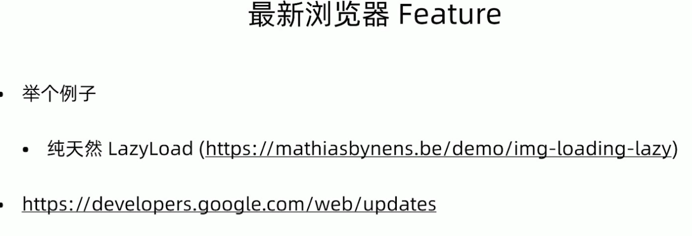

无兼容问题
* 当前版本Chrome
* babel 设置 target 为 Electron 对应的 Chrome 版本
* ES 6/7/8/9/10 (async await/promise, String/Array/Object, BigInt)
* 无跨域问题(Node.js发送请求/Electron net 发送请求)
* 操作本地文件
* 本地DB
* 多线程，多进程并行

Chrome Update
* https://developers.google.com/web/update

