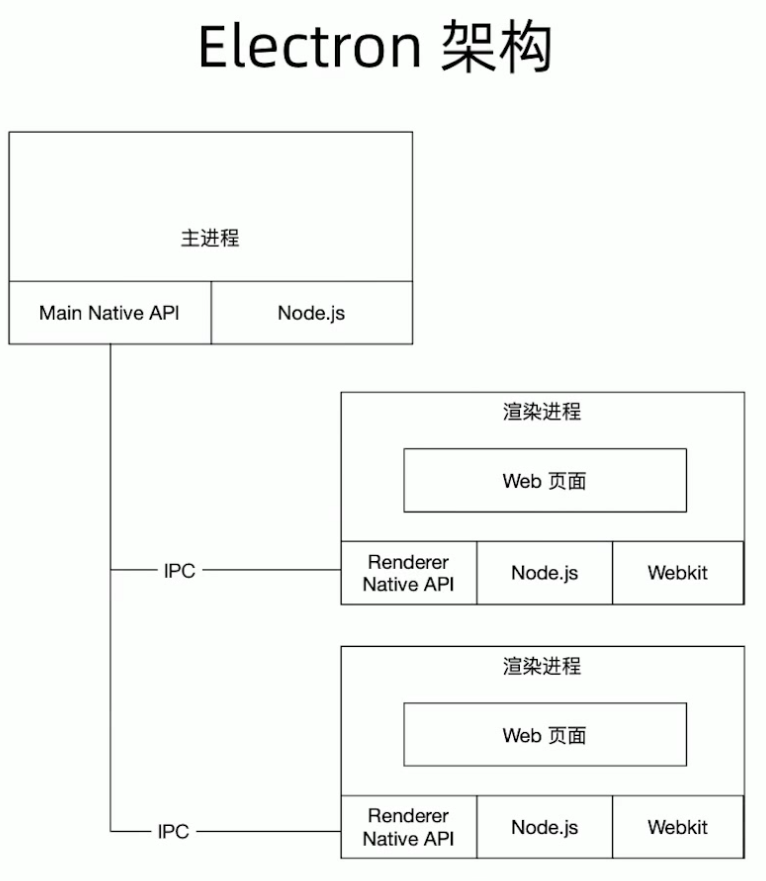
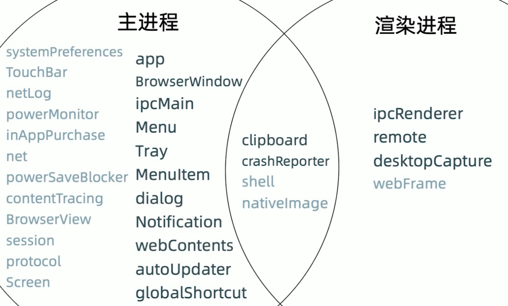

主进程
1. Electron 运行 package.json 的 main 脚本的进程被称为主进程
2. 每个应用只有一个主进程
3. 管理原生GUI，典型的窗口 (BrowserWindow, Tray, Dock, Menu)
4. 创建渲染进程
5. 控制应用的生命周期

渲染进程
1. 展示 web 页面的进程被称为渲染进程
2. 通过 Node.js, Electron 提供的 API 可以跟系统底层打交道
3. 一个 Electron 应用可以有多个渲染进程

Native 模块

* app 应用生命周期，设置 app 属性， 比如 dock
* BrowserWindow 创建窗口
* IpcMain ipc 通信
* Menu 
* Tray 
* MenuItem
* dialog 对话框
* Notification 通知
* webContents 加载网页
* globalShortcut 设置全局的一个快捷键
* autoUpdater 更新模块
* clipboard 访问读写剪贴板
* CrashReport 主进程和渲染进程崩溃情况

* IpcRenderer ipc 通信
* remote 一般不使用
* desktopCapture 捕获桌面流，截图和视频流  

 

