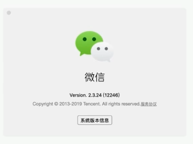
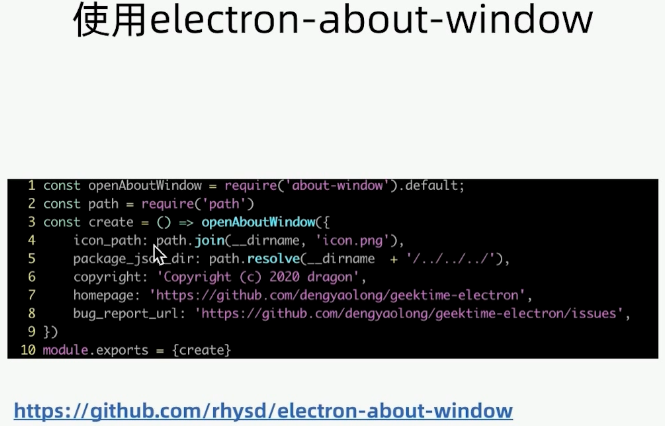
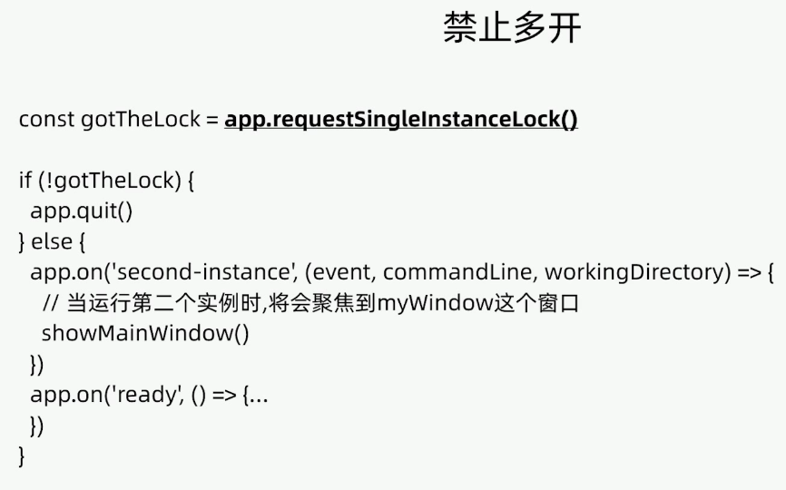
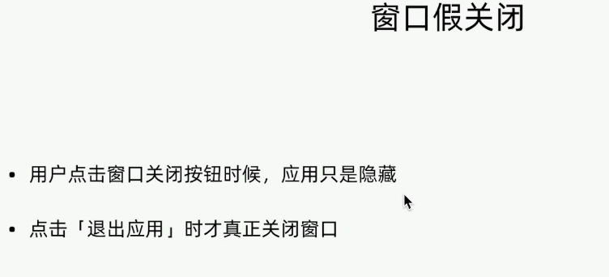
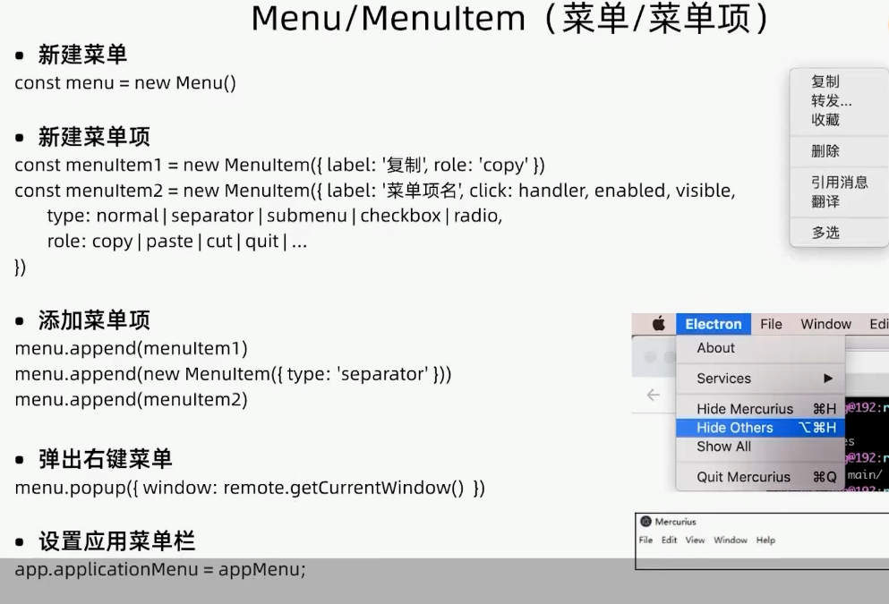
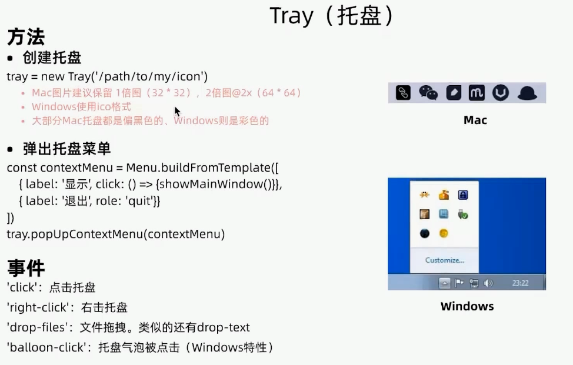

原生体验

## App 特性
* 起名 + logo
* 关于窗口
* 禁止多开
* 窗口假关闭

## 原生GUI
* 托盘 (点击唤起)
* 顶部菜单
* 右键菜单

## 命名

希腊语 拉丁语等

熵 kubernetes

亲人名字

MySQL MariaDB MaxDB

神话故事

Nike (hermes)

关于窗口

图标 + 产品名字 + 版本号 + 版权 + ...

## 菜单项

右键菜单可以使用 remote 创建

## 托盘

 