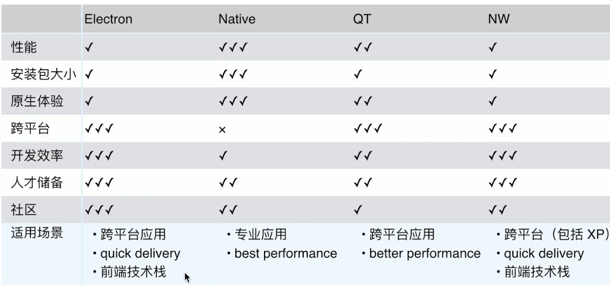

1. 更便捷的入口
2. 离线可用
3. 调用系统能力
4. 安全需求
5. 。。。

| 技术选型 | 优点 | 缺点 |
|---|---|---|
| Native | 高性能，原生体验，体积小 | 门槛高，迭代速度慢 |
| QT | 基于C++，跨平台，高性能，媲美原生体验 | 门槛高，迭代速度一般 |
| Flutter | 跨端 | PC不完善，基建少 |
|NW.js | 跨平台，迭代快，支持xp，源码加密，支持chrome扩展，社区 | 体积大，性能一般 |
|Electron| 跨平台，web技术构建，活跃的社区，众多使用案例 | 体积大，性能一般 |

其他：
1. Carlo
2. WPF
3. chrome embedded framework
4. PWA （桌面入口，离线可用，通知能力）

