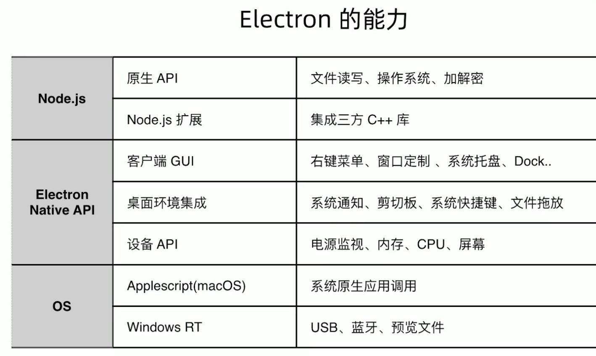

1. 通知
2. docker
3. shell winRT
4. API(文件读写，加解密)
5. binding

Electron API创建原生GUI
* BrowserWindow 应用窗口
* Tray 托盘
* app 设置 dock.badge
* Menu 菜单
* dialog 原生弹窗
* TouchBar

获取Electron API底层能力
* clipboard 剪贴板
* globalShortcut 全局快捷键
* desktopCapture 捕获桌面
* shell 打开文件，url

Node.js底层能力
* Electron 主进程和渲染进程中使用 Node.js 所有的API (fs, crypto)
* npm 安装 Nodejs 库

使用 Node.js 调用原生模块
* node.js add-on
* node-ffi (Foreign Function Interface)

调用 os 能力
* winRT (bluetooth 等)
* Applescript
* Shell (Node child_process)

