项目工程化

工具链, 持续集成, 持续交付, 源码管理, 协同管理, 搭建系统, 组件标准化, 自动化测试

提升开发效率, 协同效率, 项目质量, 产品体验

## 从 html 到安装包步骤

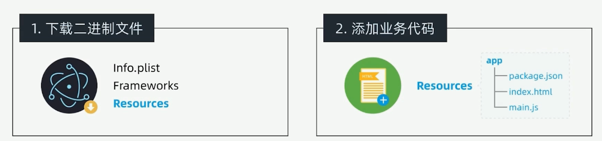

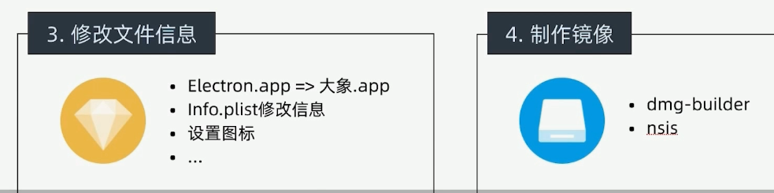

## 打包工具选择

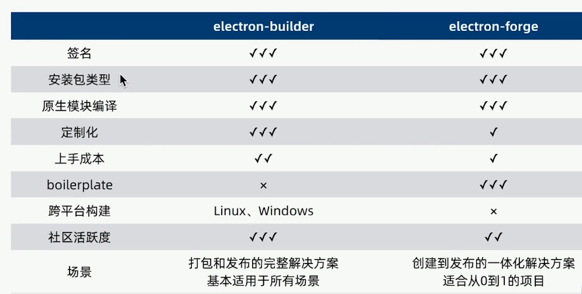

## 打包准备

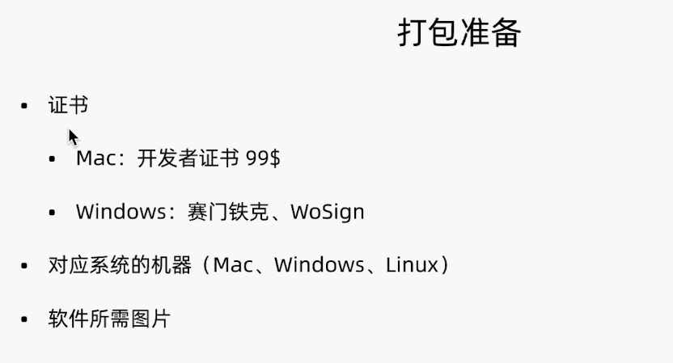

## 图片准备

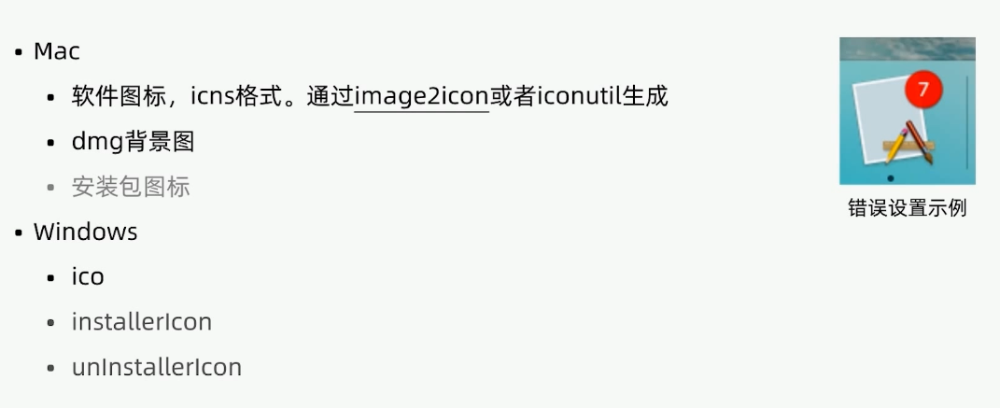

## electron-builder 安装和使用

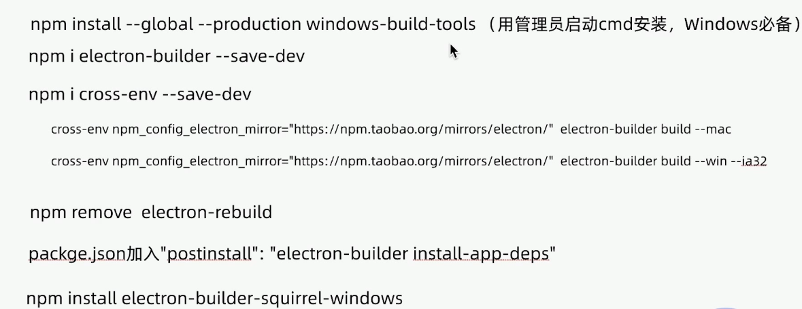

## electron-builder 打包配置

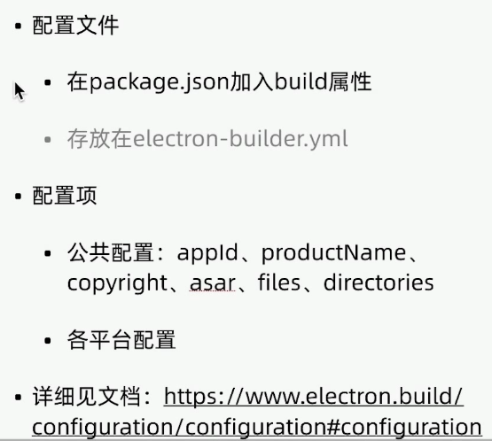

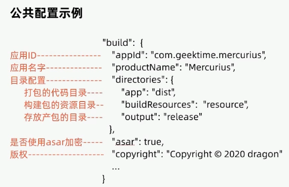
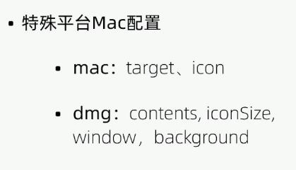

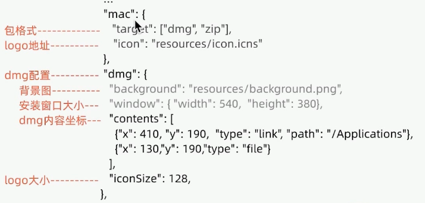

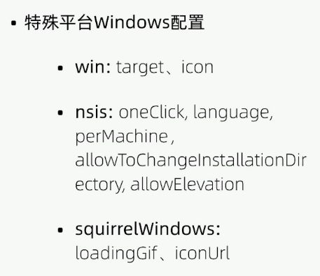

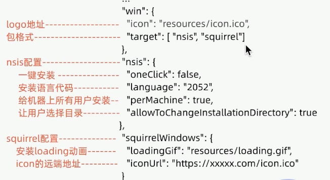

## 经验总结

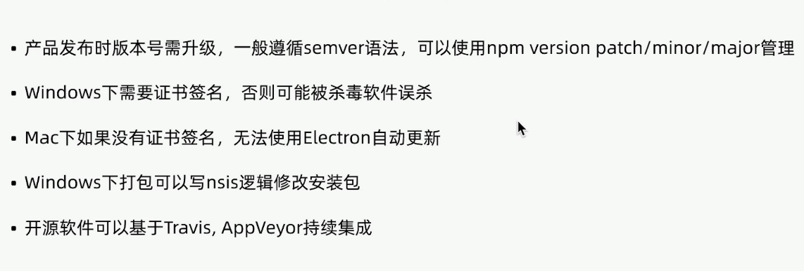

## 参考

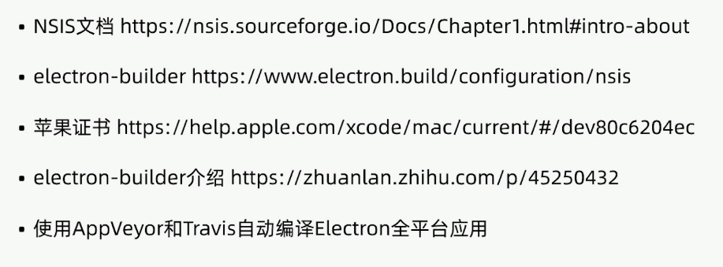
