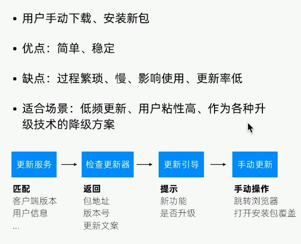
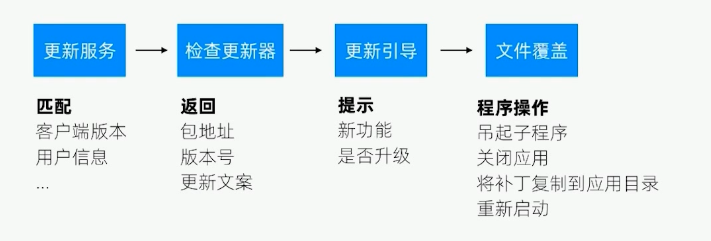
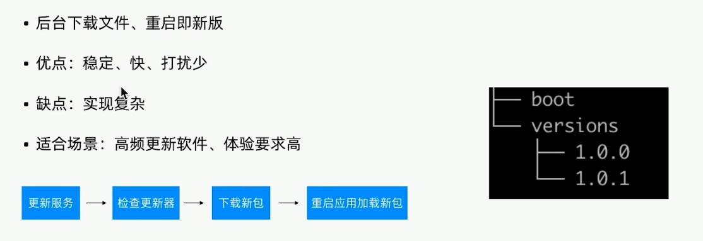

# 更新体验

快, 影响小
流畅度, 用户耗时

(windows) UAC & 权限问题

## 解决方案

更新过程
* 增量更新
* 自动更新

UAC问题
* windows 计划任务
* windows Services
* 不要操作管理员权限文件, 注册表

## 手动更新

用户手动下载, 安装新包

优点: 简单, 稳定

缺点: 过程繁琐, 慢, 影响使用, 更新率低

适合场景: 低频更新, 用户粘性高, 作为各种技术的降级方案

## 文件覆盖

程序自动替换文件更新

优点: 下载过程快
缺点: 慢, 实现比较复杂, 稳定性差, 写文件失败
适合场景: 打补丁

## 自动更新
后台下载文件, 重启即新版

优点: 稳定, 快, 打扰少

缺点: 实现复杂

适合场景: 高频更新软件, 体验要求高

## 应用商店更新

通过个平台应用商店发布

优点: 统一, 稳定

缺点: 受应用商店局限

适合场景: 操作系统应用商上架

c