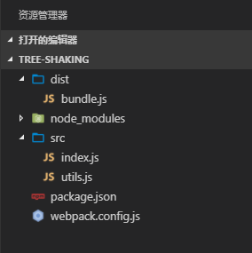
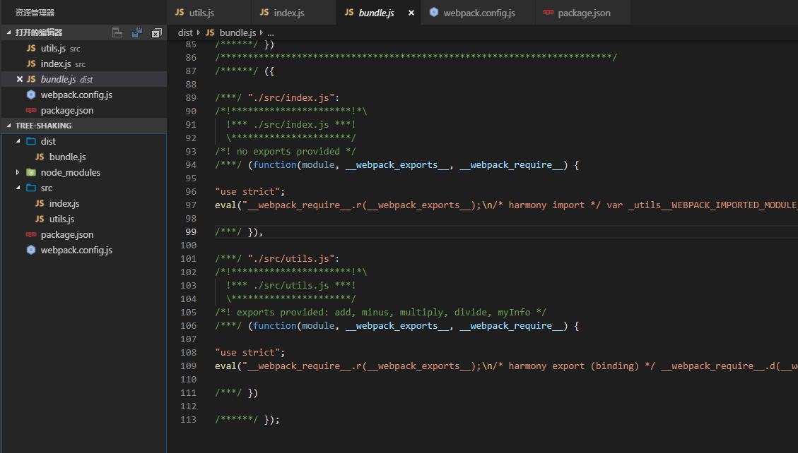

最近朋友面试问了关于`tree shaking`相关问题，之前对`tree shaking`不是很了解，只知道是减少打包体积用的。趁此机会了解了一下它的原委。

当前端项目到达一定的规模后，我们一般会采用按模块方式组织代码，这样可以方便代码的组织及维护。但会存在一个问题，比如我们有一个`utils`工具类，在另一个模块中导入它。这会在打包的时候将`utils`中不必要的代码也打包，从而使得打包体积变大，这时候就需要用到`Tree shaking`技术了。


> ```
> Tree shaking` 是一种通过清除多余代码方式来优化项目打包体积的技术，专业术语叫`Dead code elimination
> ```

首先，新建一个简单的webpack项目，项目结构如下（推荐使用vscode编辑器）：



主要文件如下：

- package.json

```
{
  "name": "tree-shaking",
  "version": "1.0.0",
  "description": "tree-shaking demo",
  "main": "./index.js",
  "scripts": {
    "build": "webpack",
    "webpack": "webpack"
  },
  "author": "twindyorg",
  "license": "MIT",
  "homepage": "https://twindy.org",
  "devDependencies": {
    "@babel/core": "^7.2.2",
    "@babel/plugin-transform-runtime": "^7.2.0",
    "@babel/preset-env": "^7.3.1",
    "babel-loader": "^8.0.5",
    "cross-env": "^5.2.0",
    "jest": "^24.0.0",
    "uglifyjs-webpack-plugin": "^1.3.0",
    "webpack": "^4.29.0",
    "webpack-cli": "^3.2.1"
  }
}
```

- webpack.config.js

```
const path = require('path');

module.exports = {
    entry: './src/index.js',
    mode: 'development',
    output: {
        path: path.resolve(__dirname, 'dist'),
        filename: 'bundle.js'
    },
    plugins: [
        // new UglifyJsPlugin()
    ],
    module: {
        rules: [{
            test: /\.m?js$/,
            exclude: /(node_modules|bower_components)/,
            use: {
                loader: 'babel-loader',
                options: {
                    presets: ['@babel/preset-env'],
                    plugins: [
                        '@babel/plugin-transform-runtime'
                    ]
                }
            }
        }]
    }
};
```

可在项目根目录运行打包命令

```
npm run build
```

接下来，创建`utils.js`文件：

```
export function add(a, b) {
	console.log('add');
	return a + b;
}

export function minus(a, b) {
	console.log('minus');
	return a - b;
}

export function multiply(a, b) {
	console.log('multiply');
	return a * b;
}

export function divide(a, b) {
	console.log('divide');
	return a / b;
}
```

`index.js`文件中导入`utils.js`的`add`方法并调用：

```
import { add } from './utils';

add(10, 2);
```

运行`npm run build`后查看`dist/bundle.js`文件，可以发现`utils.js`中所有的代码都打包了，并没有像我们预期的那样只打包`add()`函数。



当启用`tree shaking`后，多余的代码就不会打入最终的文件。

#### tree shaking 如何工作的呢?

虽然`tree shaking`的概念在1990就提出了，但知道ES6的`ES6-style`模块出现后才真正被利用起来。这是因为`tree shaking`只能在静态`modules`下工作。`ECMAScript 6` 模块加载是静态的,因此整个依赖树可以被静态地推导出解析语法树。所以在`ES6`中使用`tree shaking`是非常容易的。而且，`tree shaking`不仅支持`import/export`级别，而且也支持`statement(声明)`级别。

在`ES6`以前，我们可以使用`CommonJS`引入模块：`require()`，这种引入是动态的，也意味着我们可以基于条件来导入需要的代码：

```
let dynamicModule;
// 动态导入
if(condition) {
    myDynamicModule = require("foo");
} else {
    myDynamicModule = require("bar");
}
```

`CommonJS`的动态特性模块意味着`tree shaking`不适用。因为它是不可能确定哪些模块实际运行之前是需要的或者是不需要的。在`ES6`中，进入了完全静态的导入语法：import。这也意味着下面的导入是不可行的：

```
// 不可行，ES6 的import是完全静态的
if(condition) {
    myDynamicModule = require("foo");
} else {
    myDynamicModule = require("bar");
}
```

我们只能通过导入所有的包后再进行条件获取。如下：

```
import foo from "foo";
import bar from "bar";

if(condition) {
    // foo.xxxx
} else {
    // bar.xxx
}
```

`ES6`的`import`语法完美可以使用`tree shaking`，因为可以在代码不运行的情况下就能分析出不需要的代码。

#### 如何使用`Tree shaking`

从`webpack 2`开始支持实现了`Tree shaking`特性，`webpack 2`正式版本内置支持`ES2015` 模块（也叫做`harmony`模块）和未引用模块检测能力。新的`webpack 4` 正式版本，扩展了这个检测能力，通过`package.json`的 `sideEffects`属性作为标记，向`compiler` 提供提示，表明项目中的哪些文件是 “pure(纯的 ES2015 模块)”，由此可以安全地删除文件中未使用的部分。

本项目中使用的是`webpack4`,只需要将`mode`设置为`production`即可开启`tree shaking`

```
entry: './src/index.js',
mode: 'production', // 设置为production模式
output: {
	path: path.resolve(__dirname, 'dist'),
	filename: 'bundle.js'
},
```

如果是使用`webpack2`,可能你会发现`tree shaking`不起作用。因为`babel`会将代码编译成`CommonJs`模块，而`tree shaking`不支持`CommonJs`。所以需要配置不转义：

```
options: { presets: [ [ 'es2015', { modules: false } ] ] }
```

[参考tree-shaking-es6-modules-in-webpack-2](https://medium.freecodecamp.org/tree-shaking-es6-modules-in-webpack-2-1add6672f31b)

#### 关于side effects（副作用）

`side effects`是指那些当`import`的时候会执行一些动作，但是不一定会有任何`export`。比如`ployfill`,`ployfills`不对外暴露方法给主程序使用。

`tree shaking` 不能自动的识别哪些代码属于`side effects`，因此手动指定这些代码显得非常重要，如果不指定可能会出现一些意想不到的问题。

在`webapck中`，是通过`package.json`的`sideEffects`属性来实现的。

```
{
  "name": "tree-shaking",
  "sideEffects": false
}
```

如果所有代码都不包含副作用，我们就可以简单地将该属性标记为`false`，来告知 `webpack`，它可以安全地删除未用到的`export`导出。

如果你的代码确实有一些副作用，那么可以改为提供一个数组：

```
{
  "name": "tree-shaking",
  "sideEffects": [
    "./src/common/polyfill.js"
  ]
}
```

#### 总结

- `tree shaking` 不支持动态导入（如CommonJS的require()语法），只支持纯静态的导入（ES6的import/export）
- `webpack`中可以在项目`package.json`文件中，添加一个 “sideEffects” 属性,手动指定由副作用的脚本

`tree shaking` 其实很好理解：一颗树，用力摇一摇，枯萎的叶子会掉落下来。剩下的叶子都是存活的

参考：

- [webpack-tree-shaking](https://webpack.js.org/guides/tree-shaking/#src/components/Sidebar/Sidebar.jsx)
- [tree-shaking-es6-modules](https://medium.freecodecamp.org/tree-shaking-es6-modules-in-webpack-2-1add6672f31b)
- [webpack-common-shake](https://github.com/indutny/webpack-common-shake)
- [Tree shaking wiki](https://en.wikipedia.org/wiki/Tree_shaking)