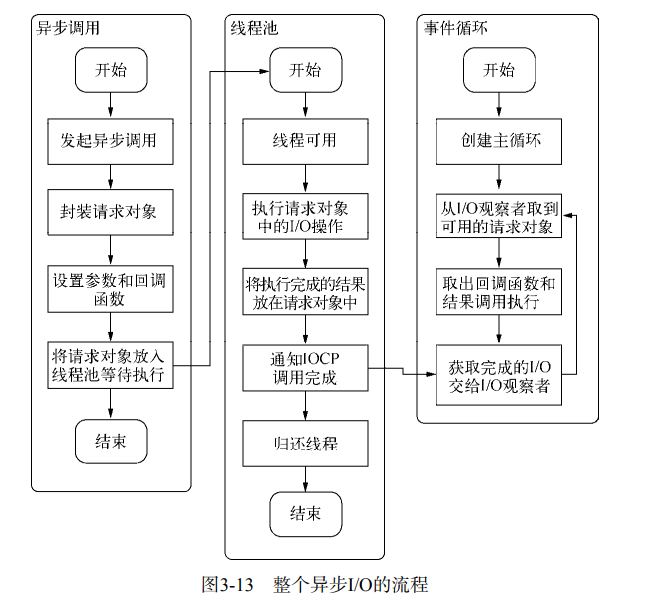

## [异步I/O](../../../深入浅出Node.js.pdf)

事件循环线程, 线程池

工作线程池被用于处理一些高成本任务。包括一些操作系统并没有提供非阻塞版本的 I/O 操作，以及一些 CPU 密集型任务，如：

1. I/O 密集型任务
   - DNS：用于 DNS 解析的模块，`dns.lookup()`, `dns.lookupService()`
   - 文件系统：所有文件系统 API，除了 `fs.FSWatcher()` 和显式调用 API 如 `fs.readFileSync()` 之外
2. CPU 密集型任务
   - Crypto：用于加密的模块
   - Zlib：用于压缩的模块，除了那些显式同步调用的 API 之外

当调用这些 API 时，会进入对应 API 与 C++ 桥接通讯的 Node C++ binding 中，从而向工作线程池提交一个任务。为了达到较高性能，处理这些任务的模块通常都由 C/C++ 编写。

* 事件循环, 观察者, 请求对象, I/O线程池这四者构成了Node异步I/O模型的基本要素

### event-loop 什么时候创建, 执行

node开始运行时, 初始化event loop

js文件执行文件执行完成, 开始启动事件循环

### 异步调用从哪里开始? (call stack)

在V8引擎中，源代码先被解析器转变为抽象语法树(AST)，然后使用JIT编译器的全代码生成器从AST直接生成本地可执行代码, 如果有异步的调用, 开始创建请求对象

## even loop

如上图所示，libuv 中的事件循环主要有 7 个阶段，它们按照执行顺序依次为：

- timers 阶段：这个阶段执行 `setTimeout` 和 `setInterval` 预定的回调函数；
- pending callbacks 阶段：这个阶段会执行除了 close 事件回调、被 timers 设定的回调、`setImmediate` 设定的回调之外的回调函数；
- idle、prepare 阶段：供 node 内部使用；
- poll 阶段：获取新的 I/O 事件，在某些条件下 node 将阻塞在这里；
- check 阶段：执行 `setImmediate` 设定的回调函数；
- close callbacks 阶段：执行 `socket.on('close', ...)` 之类的回调函数

## 宏任务和微任务

除了 libuv 中的七个阶段外，Node 中还有一个特殊的阶段，它一般被称为 microtask，它由 V8 实现，被 Node 调用。包括了 `process.nextTick`、`Promise.resolve` 等微任务，它们会在 libuv 的七个阶段之前执行，而且 `process.nextTick` 的优先级高于 `Promise.resolve`。值得注意的是，在浏览器环境下，我们常说事件循环中包括宏任务（macrotask 或 task）和微任务（microtask），这两个概念是在 HTML 规范中制定，由浏览器厂商各自实现的。而在 Node 环境中，是没有宏任务这个概念的，至于前面所说的微任务，则是由 V8 实现，被 Node 调用的；虽然名字相同，但浏览器中的微任务和 Node 中的微任务实际上不是一个东西，当然，不排除它们间有相互借鉴的成分。

### node和浏览器处理宏任务和微任务

在浏览器中，JavaScript 执行为单线程（不考虑 web worker），所有代码均在主线程调用栈完成执行。当主线程任务清空后才会去轮循任务队列中的任务。

异步任务分为 task（宏任务，也可以被称为 macrotask）和 microtask（微任务）两类。关于事件循环的权威定义可以在 HTML 规范文档中查到：[html.spec.whatwg.org/multipage/w…](https://html.spec.whatwg.org/multipage/webappapis.html#event-loops。)

当满足执行条件时，task 和 microtask 会被放入各自的队列中，等待进入主线程执行，这两个队列被称为 task queue（或 macrotask queue）和 microtask queue。

- task：包括 script 中的代码、`setTimeout`、`setInterval`、`I/O`、UI render
- microtask：包括 `promise`、`Object.observe`、`MutationObserver`

不过，正如规范强调的，这里的 task queue 并非是队列，而是集合（sets），因为事件循环的执行规则是执行第一个可执行的任务，而不是将第一个任务出队并执行。

详细的执行规则可以在 [html.spec.whatwg.org/multipage/w…](https://html.spec.whatwg.org/multipage/webappapis.html#event-loop-processing-model) 查询，一共有 15 个步骤。

可以将执行步骤不严谨的归纳为：

1. 执行完主线程中的任务
2. 清空 microtask queue 中的任务并执行完毕
3. 取出 macrotask queue 中的一个任务执行
4. 清空 microtask queue 中的任务并执行完毕
5. 重复 3、4

进一步归纳，就是：一个宏任务，所有微任务；一个宏任务，所有微任务...

### 浏览器宏任务和微任务

宏仁务主要是由`script`（全局任务），`setTimeout` ，`setInterval` ，`setImmediate` ，I/O ，UI rendering

微任务主要是`process.nextTick`, `Promise.then`, `Object.observer`, `MutationObserver`.

|                    | 宏任务（macrotask）                                          | 微任务（microtask）                                          |
| :----------------- | :----------------------------------------------------------- | ------------------------------------------------------------ |
| 谁发起的           | 宿主（Node、浏览器）                                         | JS引擎                                                       |
| 具体事件           | 1. script (可以理解为外层同步代码)2. setTimeout/setInterval3. UI rendering/UI事件4. postMessage，MessageChannel5. setImmediate，I/O（Node.js） | 1. Promise2. MutaionObserver3. Object.observe（已废弃；Proxy 对象替代）4. process.nextTick（Node.js） |
| 谁先运行           | 后运行                                                       | 先运行                                                       |
| 会触发新一轮Tick吗 | 会                                                           | 不会                                                         |

## [call stack](./event-loop-事件循环.md)

记录代码执行位置的数据结构

## The Message Queue

简单理解为宏任务queue

## ES6 Job Queue

微任务queue

## 参考
<https://zhuanlan.zhihu.com/p/27628685>

https://blog.s1h.org/inside-node-executing-a-script/

https://cloud.tencent.com/developer/article/1701427

https://juejin.cn/post/6844903657264136200