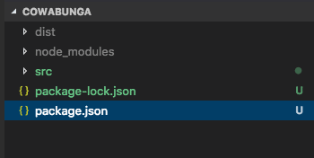

# [NPM Linking and Unlinking](https://dev.to/erinbush/npm-linking-and-unlinking-2h1g)

At work, we have our own npm packages that we manage and maintain. As part of the dev process its crucial to test out the package in the context of a larger project to ensure it functions as expected and meets all our criteria. A handy trick that I've been using is linking local npm packages using `npm link`.

However, as a result of having multiple tasks on the go on any given day, I kept getting myself into weird situations with permission issues where I would have the package not available anymore, which TBH was v annoying. The result of constant branch switching and not cleaning up my local environment before doing so.

Here are the exact steps for both linking and unlinking so you can avoid the #struggle I went through.

Lets say we have an `npm` package that we are working on locally, lets call it `cowabunga`. Our project structure looks something like this:

[](https://res.cloudinary.com/practicaldev/image/fetch/s--aGZH2det--/c_limit%2Cf_auto%2Cfl_progressive%2Cq_auto%2Cw_880/https://thepracticaldev.s3.amazonaws.com/i/828lkf0znj2qu6e2w8uv.png)

And it’s `package.json` file looks something like this:

```json
{
  "name": "cowabunga",
  "version": "0.0.1",
  "description": "This component alerts you when things are awesome",
  "main": "dist/index.js",
  "keywords": [
    "component",
    "cowabunga",
    "dude"
  ],
  "dependencies": {
    "some-package": "^10.0.1"
  },
  "author": "",
  "license": "ISC",
  "access": "public"
}
```

You’ll notice that this package has its own `node_modules` folder - this is where I kept getting tripped up. I would switch branches in the repo where my package lives and the `node_modules` folder would disappear as a result of building other components that don't live in both branches. When I would go to unlink, npm was throwing permissions errors that went something like this:

```
npm ERR! enoent ENOENT: no such file or directory, access ‘my_project/node_modules/cowabunga/node_modules/some-package’
```

In order to avoid this, you have to follow the linking/unlinking order otherwise npm will try to unlink folders that no longer exist. Seems pretty basic but it was surprisingly tedious to figure out.

### Linking:

First, in the *cowabunga* folder (where package.json is):

```
npm link
```

Then in the project you want to include *cowabunga* in:

```
npm link cowabunga
```

### Unlinking:

*Before* switching branches and/or removing any node modules from the package itself (in my project, this includes running `learn clean` which removed the `node_modules` folders)

First, in the project:

```
npm unlink --no-save cowabunga
```

Second, in the package:

```
npm unlink
```

Note: order is important!

Where I kept running into issues is switching branches and then the symlink couldn’t find the package anymore so you were stuck in this weird state where you couldn’t link anything or unlink anything because the folders don’t exist. When this happens, check out your original branch and start from the beginning with linking the package and the project.

🤙

*Bonus:*
You can also run

```
npm install -g i .
```

in your package folder to install it globally and avoid some of the linking mess 🎉