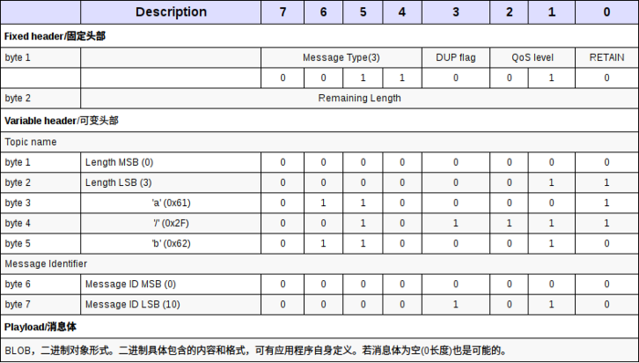
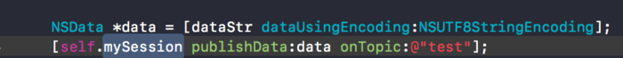

一：前言

最近在了解MQTT协议相关的内容，内容有点多，特此把MQTT协议，以及其从服务端到客户端的流程整理出来，记录如下。

二：MQTT协议介绍

MQTT（Message Queuing Telemetry Transport，消息队列遥测传输）是IBM开发的一个即时通讯协议，它是一种轻量级的、基于代理的“发布/订阅”模式的消息传输协议。其具有协议简洁、小巧、可扩展性强、省流量、省电等优点，而且已经有PHP，JAVA，Python，C，C#，Go等多个语言版本，基本可以使用在任何平台上，几乎可以把所有联网物品和外部连接起来，所以特别适合用来当做物联网的通信协议，实用的场景有遥感数据、汽车、智能家居、智慧城市、医疗医护等等。

MQTT特点

MQTT协议是为大量计算能力有限，且工作在低带宽、不可靠的网络的远程传感器和控制设备通讯而设计的协议，它具有以下主要的几项特性：

1、使用发布/订阅消息模式，提供一对多的消息发布，解除应用程序耦合；

2、对负载内容屏蔽的消息传输；

3、使用 TCP/IP 提供网络连接；

4、有三种消息发布服务质量：

“至多一次”，消息发布完全依赖底层 TCP/IP 网络。会发生消息丢失或重复。这一级别可用于如下情况，环境传感器数据，丢失一次读记录无所谓，因为不久后还会有第二次发送。

“至少一次”，确保消息到达，但消息重复可能会发生。

“只有一次”，确保消息到达一次。这一级别可用于如下情况，在计费系统中，消息重复或丢失会导致不正确的结果

5、小型传输，开销很小（固定长度的头部是 2 字节），协议交换最小化，以降低网络流量；

6、使用 Last Will （遗嘱）和 Testament 特性通知有关各方客户端异常中断的机制；

MQTT协议内容

1 ：消息模型

MQTT是一种基于代理的发布/订阅的消息协议。与请求/回答这种同步模式不同，发布/订阅模式解耦了发布消息的客户（发布者）与订阅消息的客户（订阅者）之间的关系，这意味着发布者和订阅者之间并不需要直接建立联系。一个发布者可以对应多个订阅者，当发布者发生变化的时候，他可以将消息一一通知给所有的订阅者。这种模式提供了更大的网络扩展性和更动态的网络拓扑

此外运用MQTT协议，设备可以很方便地连接到物联网云服务，管理设备并处理数据，最后应用到各种业务场景，如下图所示

2 服务质量

MQTT提供三种质量的服务：

至多一次（qos = 0），可能会出现丢包的现象。使用在对实时性要求不高的情况。这一级别可应用于如下情景，如环境传感器数据，丢失一次读记录无所谓，因为很快下一次读记录就会产生。

至少一次（qos = 1），保证包会到达目的地，但是可能出现重包。

正好一次（qos = 2），保证包会到达目的地，且不会出现重包的现象。这一级别可用于如计费系统等场景，在计费系统中，消息丢失或重复可能会导致生成错误的费用。

服务质量

3 主题与通配符

主题名称（Topic name）用来标识已发布消息的信息的渠道。订阅者用它来确定接收到所关心的信息。它是一个分层的结构，用斜线“/”作为分隔符（这个有点类似于restful风格）。主题还可以通过通配符进行过滤。其中，+可以过滤一个层级，而#只能出现在主题最后表示过滤任意级别的层级。值得注意的是MQTT允许使用通配符订阅主题，但是并不允许使用通配符广播。

举个例子：

building-b/floor-5：代表B楼5层的设备。

+/floor-5：代表任何一个楼的5层的设备。

building-b/#：代表B楼所有的设备。

4 遗嘱

当一个客户端断开连接的时候，它希望客户端可以发送它指定的消息。该消息和普通消息的结构相同。通过设置该位并填入和信息相关的内容即可（后面会有介绍）。

5 消息类型

消息类型 类型 编码说明

reserved 0 保留

connect 1 客户端到服务端的连接请求

connACK 2 服务端对连接请求的响应

publish 3 发布消息

puback 4 新发布消息确认，是QoS 1给PUBLISH消息的回复

pubRec 5 QoS 2消息流的第一部分，表示消息发布已记录

pubRel 6 QoS 2消息流的第二部分，表示消息发布已释放

pubComp 7 QoS 2消息流的第三部分，表示消息发布完

subscribe 8 客户端订阅某个主题

subBack 9 对于SUBSCRIBE消息的确认

unsubscribe 10 客户端终止订阅的消息

unsubBack 11 对于UNSUBSCRIBE消息的确认

pingReq 12 心跳

pingResp 13 确认心跳

disconnect 14 客户端终止连接前通知MQTT代理

reserved 15 保留

MQTT协议头部信息详细介绍

客户端发布消息经由服务器分发到所有对应的订阅者那里。一个订阅者可以订阅若干个主题(Topic name)，但一个PUBLISH消息只能拥有一个主题。其消息架构如下：

1 固定头部

固定头部，使用两个字节，共16位：

Byte 1　消息类型和标志字段，消息类型(4-7)，使用4位二进制表示，可代表16种消息类型。

Byte 2　剩余长度字段（至少1个字节，最多4个字节），采用big-endian模式存储。

消息类型前面已有介绍 此处附上一张图：

DUP flag（打开标志）

保证消息可靠传输，默认为0，只占用一个字节，表示第一次发送。不能用于检测消息重复发送等。只适用于客户端或服务器端尝试重发PUBLISH(发送消息), PUBREL(QoS 2消息流的第二部分，表示消息发布已释放), SUBSCRIBE(客户端订阅某个主题)?或 UNSUBSCRIBE(客户端终止订阅的消息)消息，注意需要满足以下条件：当 QoS > 0时消息需要回复确认，此时，在可变头部需要包含消息ID。当值为1时，表示当前消息先前已经被传送过。

QoS(Quality of Service,服务质量)

使用两个二进制表示PUBLISH类型消息：

RETAIN(保持)

仅针对PUBLISH消息。不同值，不同含义：

0：仅仅为当前订阅者推送此消息。

1：表示发送的消息需要一直持久保存（不受服务器重启影响），不但要发送给当前的订阅者，并且以后新来的订阅了此Topic name的订阅者会马上得到推送。

另外对于新加入的订阅者，只会取出最新的一个RETAIN flag = 1的消息推送。

Remaining Length（剩余长度）

在当前消息中剩余的byte(字节)数，包含可变头部和负荷(称之为内容/body，更为合适)。单个字节最大值：01111111，16进制：0x7F，10进制为127。单个字节为什么不能是11111111（0xFF）呢？因为MQTT协议规定，第八位（最高位）若为1，则表示还有后续字节存在。

同时MQTT协议最多允许4个字节表示剩余长度。那么最大长度为：0xFF,0xFF,0xFF,0x7F。

二进制表示为：11111111,11111111,11111111,01111111

十进制：268435455 byte=261120KB=256MB=0.25GB

四个字节之间值的范围：

2 可变头部

固定头部仅定义了消息类型和一些标志位，一些消息的元数据，需要放入可变头部中。可变头部内容字节长度 + Payload/负荷字节长度 = 剩余长度，这个是需要牢记的。可变头部，包含了协议名称，版本号，连接标志，用户授权，心跳时间等内容，这些在后面会讲到。

3 Payload/消息体/负荷

消息体主要是为配合固定/可变头部命令（比如CONNECT可变头部User name标记若为1则需要在消息体中附加用户名称字符串）而存在。

CONNECT/SUBSCRIBE/SUBACK/PUBLISH等消息有消息体。PUBLISH的消息体以二进制形式对待。

请记住MQTT协议只允许在PUBLISH类型消息体中使用自定义特性，在固定/可变头部想加入自定义私有特性，就免了吧。这也是为了协议免于流于形式，变得很分裂也为了兼顾现有客户端等。比如支持压缩等，那就可以在Payload中定义数据支持，在应用中进行读取处理

4 消息标识符/消息ID

一个16位无符号位的short类型值（值不能为 0，0做保留作为无效的消息ID），仅仅要求在一个特定方向（服务器发往客户端为一个方向，客户端发送到服务器端为另一个方向）的通信消息中必须唯一。比如客户端发往服务器，有可能存在服务器发往客户端会同时存在重复，但不碍事。

可变头部中，需要两个字节的顺序是MSB(Most Significant Bit) LSB(Last/Least Significant Bit)，翻译成中文就是，最高有效位，最低有效位。最高有效位在最低有效位左边/上面，表示这是一个大端字节/网络字节序，符合人的阅读习惯，高位在最左边。

MQTT协议连接和心跳介绍

CONNECT

TCP连接建立完毕后，Client向Server发出一个Request。

如果一段时间内接收不到Server的Response，则关闭socket，重新建立一个session连接。

如果一个ClientID已经与服务器连接，则持有同样ClientID的旧有连接必须由服务器关闭后，新建立才能建立。下面是一个较为完整的CONNECT消息结构：

下面介绍Connect Flags相关的参数

1 连接标志(Connect Flags)

一个字节表示，除了第1位是保留未使用，其它7位都具有不同含义。业务上很重要，对消息总体流程影响很大，需要牢记。

2 Clean Session

0，表示如果订阅的客户机断线了，要保存为其要推送的消息（QoS为1和QoS为2），若其重新连接时，需将这些消息推送（若客户端长时间不连接，需要设置一个过期值）。 1，断线服务器即清理相关信息，重新连接上来之后，会再次订阅。

3 Will Flag

定义了客户端（没有主动发送DISCONNECT消息）出现网络异常导致连接中断的情况下，服务器需要做的一些措施。

简而言之，就是客户端预先定义好，在自己异常断开的情况下，所留下的最后遗愿（Last Will），也称之为遗嘱（Testament）。 这个遗嘱就是一个由客户端预先定义好的主题和对应消息，附加在CONNECT的可变头部中，在客户端连接出现异常的情况下，由服务器主动发布此消息。

只有在Will Flag位为1时，Will Qos和Will Retain才会被读取，此时消息体payload中要出现Will Topic和Will Message具体内容，否则，Will QoS和Will Retain值会被忽略掉。

4 Will Qos

两位表示，和PUBLISH消息固定头部的QoS level含义一样。这里先略过，到PUBLISH消息再回过头来看看，会更明白些。若标识了Will Flag值为1，那么Will QoS就会生效，否则会被忽略掉。

5 Will Retain

如果设置Will Flag，Will Retain标志就是有效的，否则它将被忽略。当客户端意外断开服务器发布其Will Message之后，服务器是否应该继续保存。这个属性和PUBLISH固定头部的RETAIN标志含义一样，这里先略过。

6 User name 和 password Flag

用于授权，两者要么为0要么为1，否则都是无效。都为0，表示客户端可自由连接/订阅，都为1，表示连接/订阅需要授权。

CONNACK

收到CONNECT消息之后，服务器应该返回一个CONNACK消息作为响应：

若客户端绕过CONNECT消息直接发送其它类型消息，服务器应关闭此非法连接 若客户端发送CONNECT之后未收到CONNACT，需要关闭当前连接，然后重新连接

相同Client ID客户端已连接到服务器，先前客户端必须断开连接后，服务器才能完成新的客户端CONNECT连接 客户端发送无效非法CONNECT消息，服务器需要关闭。

一个完整的CONNACK消息大致如下：

PUBLISH 发布消息

Client/Servier均可以进行PUBLISH。（这里的server指的是MQTT的中间件服务，例如：下面会讲到的Apollo，Mosquitto 等服务器）

publish message 应该包含一个TopicName(Subject/Channel)，即订阅关键词。

具体的交互下面这张图就描述的很清晰了：

PUBACK 发布消息后的确认

QoS=1时，Server向Client发布该确认（Client收到确认后删除），订阅者向Server发布确认。PUBREC / PUBREL / PUBCOMP

QoS=2时

\1. Server->Client发布PUBREC（已收到）；

\2. Client->Server发布PUBREL（已释放）；

\3. Server->Client发布PUBCOMP（已完成），Client删除msg；订阅者也会向Server发布类似过程确认。

PUBREC字面意思为Assured publish received，作为订阅者/服务器对QoS level = 2的发布PUBLISH消息的发送方的响应，确认已经收到，为QoS level = 2消息流的第二个消息。 和PUBACK相比，除了消息类型不同外，其它都是一样。

PUBREL Qos level = 2的协议流的第三个消息，有PUBLISH消息的发布者发送，参与方接收。完整示范如下

PUBCOMP 作为QoS level = 2消息流第四个，也是最后一个消息，由收到PUBREL的一方向另一方做出的响应消息。完整的消息一览，和PUBREL一致，除了消息类型。

PINGREQ / PINGRES 心跳

Client有责任发送KeepAliveTime时长告诉给Server（表明当前client处于活动状态）。在一个时长内，发送PINGREQ，Server发送PINGRES确认。

Server在1.5个时长内未收到PINGREQ，就断开连接。

Client在1个时长内未收到PINGRES，断开连接。

一般来说，时长设置为几个分钟。最大18小时，0表示一直未断开。

心跳时间(Keep Alive timer)

以秒为单位，定义服务器端从客户端接收消息的最大时间间隔。一般应用服务会在业务层次检测客户端网络是否连接，不是TCP/IP协议层面的心跳机制(比如开启SOCKET的SO_KEEPALIVE选项)。 一般来讲，在一个心跳间隔内，客户端发送一个PINGREQ消息到服务器，服务器返回PINGRESP消息，完成一次心跳交互，继而等待下一轮。若客户端没有收到心跳反馈，会关闭掉TCP/IP端口连接，离线。 16位两个字节，可看做一个无符号的short类型值。最大值，2^16-1 = 65535秒 = 18小时。最小值可以为0，表示客户端不断开。一般设为几分钟，比如微信心跳周期为300秒

连接异常中断通知机制

CONNECT消息一旦设置在可变头部设置了Will flag标记，那就启用了Last-Will-And-Testament特性，此特性很赞。

一旦客户端出现异常中断，便会触发服务器发布Will Message消息到Will Topic主题上去，通知Will Topic订阅者，对方因异常退出。

抓包分析头部数据

前面说了这么多都是概念性的东西，下面我来点实际性的操作，用wireshark抓包看看具体的MQTT协议数据到底长成什么样，加深对前面概念的理解

我这里用的是wireshark+paho(gui)这两个工具,borker使用的是mosquitto。顺便提下paho是eclipse下的一个子项目，它只是一个库，官网貌似并不提供gui版本(图形界面)，我这里是从github上下载的源码进行编译得到的界面版本，这个界面对于MQTT的消息调试还是蛮好用的，有兴趣的也可以试下，项目的github地址：https://github.com/eclipse/paho.mqtt.java

最新版的wireshark已经支持mqtt协议了，所以在过滤其里面直接填入 mqtt 就可以过滤到mqtt协议的请求了

可以看到上面图中已经抓到我在paho中发起建立连接的请求了，并且在info那一栏可以清楚的看到 connect command，我们再看下下面的具体数据包，它显示的是原始是16进制的，10 1e 00 04 4d 51 54 54 04 02 00 3c 00 12 70 61 68 6f 31 31 31 35 37 37 32 31 39 34 33 36 30 33 这么一大串，下面这张图就解释的比较清楚了

我们来分析下这个数据包，前面两个字节是10和1e

第一个字节：0x10对应的2进制是 10000，用8位bit来显示就是 0001 0000 ，上图详细的显示了这8位的四个部分都是干什么用的，这里就不再详细介绍了

第二个字节：0x1e 表示剩余长度，也就是说本次请求数据包中第二个字节后面所有的字节总数，0x1e换算成十进制就是1*16+14=30字节,?“00 04 4d 51 54 54 04 02 00 3c 00 12 70 61 68 6f 31 31 31 35 37 37 32 31 39 34 33 36 30 33”

可变头部,再次放图如下：

三 ：MQTT 服务端（实现MQTT协议的中间件）

MQTT协议服务端：https://github.com/mqtt/mqtt.github.io/wiki/servers

MQTT协议类库(Client)：https://github.com/mqtt/mqtt.github.io/wiki/libraries

MQTT协议官网：http://mqtt.org/

MQTT协议有很多开源的broker可以用，这里我整理了两个，分别是Apollo和mosquito；详细的服务端选择可以去上面的服务端链接中选。以下所讲的环境配置和服务器搭建都是在MAC环境上，其他平台的可以参见选用broker的详细文档。

一：Apollo-Broker搭建

Apache Apollo是一个代理服务器，其是在ActiveMQ基础上发展而来的，可以支持多种协议，如：STOMP、AMQP、MQTT、SSL等。其搭建流程如下：

1 配置JAVA_HOME，Apollo是java语言编写的，因此搭建Apollo-Broker需要java环境，MAC下如何配置JAVA_HOME可自行查阅网上资料。

2下载Apollo

此处由于之针对自己macbook而言选择OS X版本下载

将下载好的文件解压到适当的目录（最好单独新建一个方便后续整理）。解压后会有apache-apollo-xxx文件夹，该文件夹默认为环境变量${APOLLO_HOME}；

3 创建broker，有两种方式

cd放置broker路径（建议就放在2创建的文件夹中方便以后查看或整理）

方法一：通过环境变量 （相对路径）创建${APOLLO_HOME}/bin/apollo create MyBroker //上面是通过环境变量直接创建，如果失败说明之前操作有些问题导致环境变量配置失败。

方法二：将apollo拖入终端用绝对地址 创建 xxx/bin/apollo create MyBroker#在当前目录下生成一个mqtt_test目录,其下面包含:*****运行结果******* Creating apollo instance at: MyBroker Generating ssl keystore... You can now start the broker by executing:"/Users/lqx/Desktop/未命名文件夹/MyBroker/bin/apollo-broker"run Or you can run the brokerinthe background using:"/Users/lqx/Desktop/未命名文件夹/MyBroker/bin/apollo-broker-service"start

成功后文件目录大致应该是这个样子：

bin 运行脚本

etc 环境配置

data 存储持久化数据

log 运行日志

tmp 临时文件

4 运行broker

cd MyBroker(3创建的文件夹)

apollo-broker run

由于apollo提供了可视化web界面（这也就是我选择他的原因），我们在浏览器中输入

http://127.0.0.1:61680/（http访问） 或者https://127.0.0.1:61681/（https访问，可用于研究mqtt+ssl）输入用户名密码即可登录（默认用户名：admin 密码：password）

关于服务器与客户端的联调 ，我会在客户端篇讲到。

值得注意的是 默认配置的tcp的port是61613，我之前写demo 的时候客户端一直连不上broker，原因就是服务器所在主机的端口号61613没打开，所以大家在搭建完服务器后一定要检查相应的端口是否打开了，相应端口截图如下

再说一下Mac的端口情况，目前OSX 10.10之前版本可以用以下指令开放端口

sudo ipfw add 61613 allow tcp from any to any dst-port 61613；

osx10.10之后的版本目前还没找到开放端口的方法，有知道的可以告诉我一下，查阅资料得到的处理方式都是用Nginx服务器做端口转发，不过比较麻烦，所以我用了一个简单的方法替换了，方法如下：

Mac端默认的tcp端口开放了1883，这个大家可以在网络实用工具中看，所以我们得去吧Apollobroker的配置文件中的tcpport 由61613改成1883，

在你上面创建好的broker文件夹中找到apollo.xml，这个就是配置文件

将tcp 配置port改成1883

然后重启服务就可以了。其他系统可直接开放61613端口号，方便快捷。

apollo 除了提供了可视化Web界面外，还提供了测试网页，

打开页面如下

在连接后 可以去Apollo监控页面（http://127.0.0.1:61680/（http访问） 或者https://127.0.0.1:61681/（https访问，可用于研究mqtt+ssl））查看，会发现有你连接的主题和消费者。

至此，Apollo 相关的服务器需要讲得已经讲完了。

二：mosquito 服务器搭建

Mosquitto是一款实现了 MQTT v3.1 协议的开源消息代理软件，提供轻量级的，支持发布/订阅的的消息推送模式，使设备对设备之间的短消息通信简单易用

Mosquitto是C语言实现的，不需要配置什么环境，我们直接用homebrew安装，简单快捷。

1 打开终端 输入brew install mosquitto直接安装

Linux(ubuntu)环境下的安装也比较简单（注意#号，需要root权限）：

\# apt install?mosquitto

当然如果真的是这么安装的，那么不好意思，安装的版本可能会比较低，不过也不要紧，照样可以用。但是如果你想安装最新版的，那么就按照下面的命令来吧：

1、先删除刚刚安装mosquitto（没有安装的可以直接跳到第2步）

\# apt-get --purge remove mosquitto

2、引入mosquitto仓库并更新

\# apt-add-repository ppa:mosquitto-dev/mosquitto-ppa

\# apt-get update

3、安装Mosquitto

\# apt-get install mosquitto

4、检查是否安装成功

\# service mosquitto status

安装成功界面如下

mosquitto服务启动命令

停止服务 brew services stop mosquitto

启动服务 brew services start mosquitto

重启服务 brew services restart mosquitto

接下来讲一下mosquito的配置文件，配置文件是目录/usr/local/etc/mosquitto/下的mosquitto.conf文件。配置文件相关说明如下，

\# =================================================================

\# General configuration

\# =================================================================

\#客户端心跳的间隔时间

\#retry_interval 20

\#系统状态的刷新时间

\#sys_interval 10

\#系统资源的回收时间，0表示尽快处理

\#store_clean_interval 10

\#服务进程的PID

\#pid_file /var/run/mosquitto.pid

\#服务进程的系统用户

\#user mosquitto

\# 客户端心跳消息的最大并发数

\#max_inflight_messages 10

\#客户端心跳消息缓存队列

\#max_queued_messages 100

\#用于设置客户端长连接的过期时间，默认永不过期

\#persistent_client_expiration

\# =================================================================

\#Default listener

\# =================================================================

\#服务绑定的IP地址

\#bind_address

\#服务绑定的端口号

\#port 1883

\#允许的最大连接数，-1表示没有限制

\#max_connections -1

\#cafile：CA证书文件

\#capath：CA证书目录

\#certfile：PEM证书文件

\#keyfile：PEM密钥文件

\#cafile

\#capath

\#certfile

\#keyfile

\#必须提供证书以保证数据安全性

\#require_certificate false

\#若require_certificate值为true，use_identity_as_username也必须为true

\#use_identity_as_username false

\#启用PSK（Pre-shared-key）支持

\#psk_hint

\#SSL/TSL加密算法，可以使用“openssl ciphers”命令获取

\#as the output of that command.

\#ciphers

\# =================================================================

\#Persistence

\# =================================================================

\#消息自动保存的间隔时间

\#autosave_interval 1800

\#消息自动保存功能的开关

\#autosave_on_changes false

\#持久化功能的开关

persistencetrue

\#持久化DB文件

\#persistence_file?mosquitto.db

\#持久化DB文件目录

\#persistence_location /var/lib/mosquitto/

\# =================================================================

\#Logging

\# =================================================================

\#4种日志模式：stdout、stderr、syslog、topic

\#none 则表示不记日志，此配置可以提升些许性能

log_dest none

\#选择日志的级别（可设置多项）

\#log_type error

\#log_type warning

\#log_type notice

\#log_type information

\#是否记录客户端连接信息

\#connection_messages true

\#是否记录日志时间

\#log_timestamp true

\# =================================================================

\#Security

\# =================================================================

\#客户端ID的前缀限制，可用于保证安全性

\#clientid_prefixes

\#允许匿名用户

\#allow_anonymous true

\#用户/密码文件，默认格式：username:password

\#password_file

\#PSK格式密码文件，默认格式：identity:key

\#psk_file

\#pattern write sensor/%u/data

\#ACL权限配置，常用语法如下：

\#用户限制：user

\#话题限制：topic [read|write]

\#正则限制：pattern write sensor/%u/data

\#acl_file

\# =================================================================

\#Bridges

\# =================================================================

\#允许服务之间使用“桥接”模式（可用于分布式部署）

\#connection

\#address [:]

\#topic [[[out | in | both] qos-level] local-prefix remote-prefix]

\#设置桥接的客户端ID

\#clientid

\#桥接断开时，是否清除远程服务器中的消息

\#cleansession false

\#是否发布桥接的状态信息

\#notifications true

\#设置桥接模式下，消息将会发布到的话题地址

\#$SYS/broker/connection//state

\#notification_topic

\#设置桥接的keepalive数值

\#keepalive_interval 60

\#桥接模式，目前有三种：automatic、lazy、once

\#start_type automatic

\#桥接模式automatic的超时时间

\#restart_timeout 30

\#桥接模式lazy的超时时间

\#idle_timeout 60

\#桥接客户端的用户名

\#username

\#桥接客户端的密码

\#password

\#bridge_cafile：桥接客户端的CA证书文件

\#bridge_capath：桥接客户端的CA证书目录

\#bridge_certfile：桥接客户端的PEM证书文件

\#bridge_keyfile：桥接客户端的PEM密钥文件

\#bridge_cafile

\#bridge_capath

\#bridge_certfile

\#bridge_keyfile

mosquito 配置用户名和密码可以参考https://www.jianshu.com/p/4b545332b495这篇简书，我这里做一个简单demo就不配置用户名和密码了。

我们需要改的配置很少

就设置一下host 和port就可以了。配置好后重启服务就可以生效了。

要注意的地方和Apollo一样 ，注意端口号是否打开或被占用。

由于mosquito没有提供可视化界面，在自己不搭建可视化界面的情况下，我们可以用两个客户端订阅同一主题来测试mosquito服务器。mosquito至此就基本ok了。

四MQTT客户端

客户端一般两个常用的mqtt三方库MQTTKit和MQTTClient，MQTTClient在Ios10出来后更新了一版，经常维护；MQTTKit，这个貌似很久没更新了，所以我们选用MQTTClient，搭建环境为iOS。

1 安装MQTTClient

直接用cocopod集成 pod 'MQTTClient'

2相关类

3 具体用法

这里做连接的时候 需要先打开你的服务，用mosquito或者Apollo都可以

用Apollo 是需要加用户名和密码的，默认为admin 和password ，用mosquito则不需要用户名和密码。host为你服务器的ip，port为你设置的port 我这边是1883，服务器所在主机和手机在同一局域网内就可以连上，觉得局域网麻烦的大佬可以直接甩到阿里云之类的服务器上去。连上后，订阅同一主题的客户端就能相互通信了，比如在Apollo 服务器下手机客户端可以和其提供的webdemo通信了。

客户端接受消息

客户端发送消息

其他多主题或者lastwill遗嘱设置或者retain设置参考MQTTClient的注释。

最后 用完后记得释放资源

至此，一个简单的MQTT协议从服务端到客户端的实现到此就完成了。