# [HTTPS 的工作原理](https://zhuanlan.zhihu.com/p/149307301)

[芋道源码](https://www.zhihu.com/people/yunaiv)

我的微信公众号：芋道源码。一起知其然，知其所以然。

关注他

14 人赞同了该文章

- 我们为什么需要HTTPS？

- - HTTPS是什么？SSL/TLS是什么？
  - SSL/TLS发展史
  - SSL/TLS的工作原理

- 参考

------

- [《Java 2019 超神之路》](https://link.zhihu.com/?target=http%3A//www.iocoder.cn/zhishixingqiu/%3Fzhihu)
- [《Dubbo 实现原理与源码解析 —— 精品合集》](https://link.zhihu.com/?target=http%3A//www.iocoder.cn/Dubbo/good-collection/%3Fzhihu)
- [《Spring 实现原理与源码解析 —— 精品合集》](https://link.zhihu.com/?target=http%3A//www.iocoder.cn/Spring/good-collection/%3Fzhihu)
- [《MyBatis 实现原理与源码解析 —— 精品合集》](https://link.zhihu.com/?target=http%3A//www.iocoder.cn/MyBatis/good-collection/%3Fzhihu)
- [《Spring MVC 实现原理与源码解析 —— 精品合集》](https://link.zhihu.com/?target=http%3A//www.iocoder.cn/Spring-MVC/good-collection/%3Fzhihu)
- [《Spring Boot 实现原理与源码解析 —— 精品合集》](https://link.zhihu.com/?target=http%3A//www.iocoder.cn/Spring-Boot/good-collection/%3Fzhihu)
- [《数据库实体设计合集》](https://link.zhihu.com/?target=http%3A//www.iocoder.cn/Entity/good-collection/%3Fzhihu)
- [《Java 面试题 —— 精品合集》](https://link.zhihu.com/?target=http%3A//www.iocoder.cn/Interview/good-collection/%3Fzhihu)
- [《Java 学习指南 —— 精品合集》](https://link.zhihu.com/?target=http%3A//www.iocoder.cn/Interview/good-collection/%3Fzhihu)

------

当你打开浏览器，访问某个网站，如果网址旁有个小锁，代表访问的网址是安全的，反之不安全。当我们没有看到那个小锁的小图标的时候，需要提高警惕，不要随意输入个人重要的资料。所有的银行和支付相关的网站都是100%使用HTTPS的。

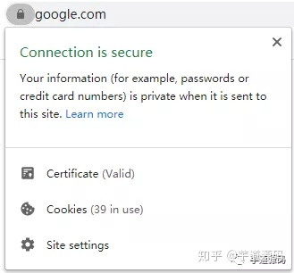

## **我们为什么需要HTTPS？**

主要有三个原因：

1. 保护隐私(Privacy)：所有信息都是加密传播，第三方无法窃听数据。如果使用HTTP明文传输数据的话，很可能被第三方劫持数据，那么所输入的密码或者其他个人资料都被暴露在他人面前，后果可想而知。
2. 数据完整性(Integraty)：一旦第三方篡改了数据，接收方会知道数据经过了篡改，这样便保证了数据在传输过程中不被篡改 —— 数据的完整性。
3. 身份认证(Identification)：第三方不可能冒充身份参与通信，因为服务器配备了由证书颁发机构（Certificate Authority，简称CA）颁发的安全证书，可以证实服务器的身份信息，防止第三方冒充身份。（也有少数情况下，通信需要客户端提供证书，例如银行系统，需要用户在登录的时候，插入银行提供给用户的USB，就是需要客户端提供证书，用来验证客户的身份信息。）

## **HTTPS是什么？SSL/TLS是什么？**

- HTTP协议(HyperText Transfer Protocol，超文本传输协议)是大家最熟悉的一种协议，它是一个用于传输超媒体文档的协议，它位于OSI网络协议模型的应用层。但是它是明文传输协议，是非常不安全的，容易被人篡改和窃取数据。
- SSL(Secure Socket Layer) —— 网景(Netscape)公司设计的主要用于web的安全传输协议。它位于TCP传输层协议和应用层协议之间。（它没有被划分在OSI网络协议模型中，且认为它是应用层的子层。）
- 众所周知，网景公司20世纪90年代在和微软的竞争中最终败下阵来，之后网景公司将SSL协议的管理权转交给IETF(Internet Engineering Task Force, [http://www.ietf.org](https://link.zhihu.com/?target=http%3A//www.ietf.org))。于是IETF将SSL作了标准化，重新命名为TLS.xn--ietfssl%2Ctls-o68q04a8c50mt9nhxfc5e1qcb41ewo6bpjcqwqez6w/)(Transport Layer Security)。在1999年，TLS 1.0诞生了（其实也就是SSL 3.1）。
- HTTPS(HyperText Transfer Protocol Secure)是建立在SSL/TLS协议之上，信息通信通过SSL/TLS进行加密，最后一个S就是`Secure`的缩写，代表安全的意思，`HTTPS = HTTP + SSL/TLS`。

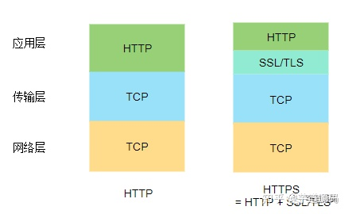

## **SSL/TLS发展史**

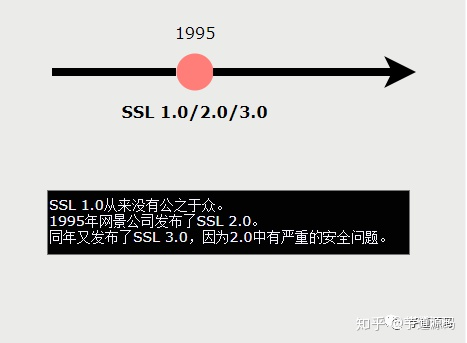

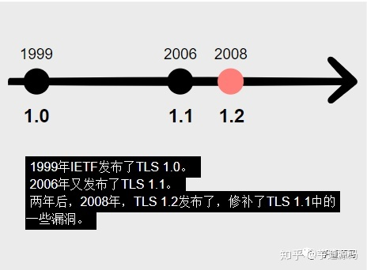

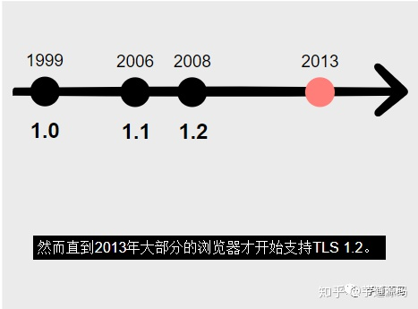

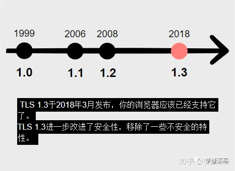

- 实际上现代的浏览器已经基本不使用SSL，使用的都是TLS，SSL 3.0于2015年已经寿终正寝 —— 各大浏览器也不支持了。但是由于SSL这个术语存在的时间太长，很多地方还是广泛的使用它，但是要清楚其实它说的是TLS。

- 有调查显示现在绝大部分浏览器（> 99.5%)都使用TLS 1.2或者TLS 1.3。只有不足1%的浏览器仍然使用TLS 1.0或者TLS 1.1。

- TLS 1.2仍然是主流协议（本文写于2020年初），相信将来逐渐TLS 1.3将会作为主流协议。

- 很多浏览器将会开始不支持TLS 1.0和1.1:

- - Google将在Chrome 72中不推荐使用TLS 1.0和1.1，而Chrome 81之后将会完全不支持。
  - Mozilla的Firefox，微软的Edge和IE以及苹果的Safari都会分别于2020年逐渐移除对TLS 1.0和1.1的支持。

- 那么一些还在使用TLS 1.0和1.1的网站就得被迫升级到TLS 1.2或者TLS 1.3。

- 要关闭浏览器对TLS 1.0和1.1的支持，可以在Internet选项中修改：

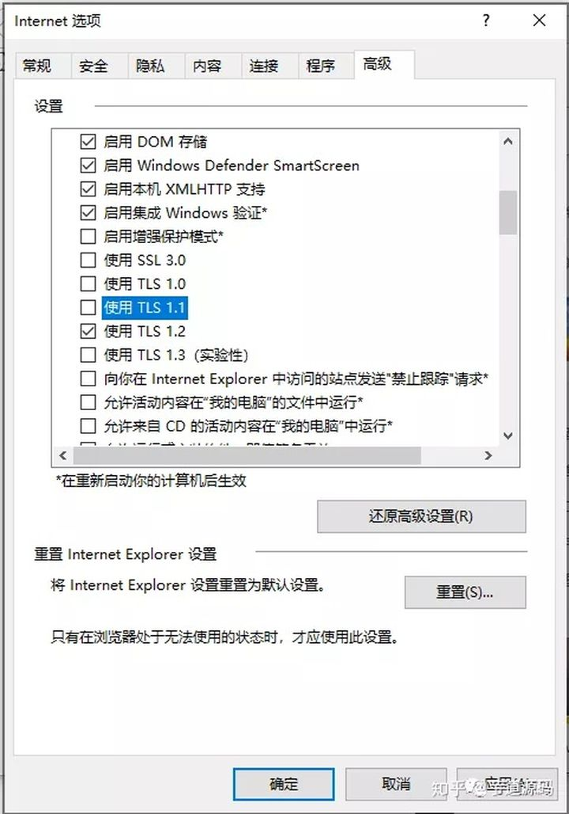

## **SSL/TLS的工作原理**

需要理解SSL/TLS的工作原理，我们需要掌握加密算法。加密算法有两种：对称加密和非对称加密：

- 对称加密：通信双方使用相同的密钥进行加密。特点是加密速度快，但是缺点是需要保护好密钥，如果密钥泄露的话，那么加密就会被别人破解。常见的对称加密有AES，DES算法。
- 非对称加密：它需要生成两个密钥：公钥(Public Key)和私钥(Private Key)。公钥顾名思义是公开的，任何人都可以获得，而私钥是私人保管的。相信大多程序员已经对这种算法很熟悉了：我们提交代码到github的时候，就可以使用SSH key：在本地生成私钥和公钥，私钥放在本地`.ssh`目录中，公钥放在github网站上，这样每次提交代码，不用麻烦的输入用户名和密码了，github会根据网站上存储的公钥来识别我们的身份。公钥负责加密，私钥负责解密；或者，私钥负责加密，公钥负责解密。这种加密算法安全性更高，但是计算量相比对称加密大很多，加密和解密都很慢。常见的非对称算法有RSA。

SSL/TLS是利用了对称加密和非对称加密的特点。先来看下整个SSL/TLS的握手过程，之后我们再分步骤详细解读，每一步都干了些什么。

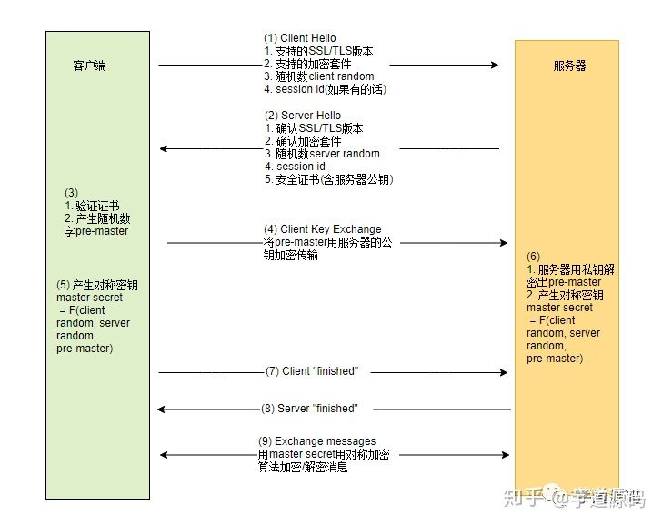

1. 当TCP建立连接之后，TLS握手的第一步由客户端发起，发送`ClientHello`的消息到服务器。`ClientHello`消息包含：

- 客户端支持的SSL/TLS版本
- 客户端支持的加密套件(Cipher Suites)
- 会话Id`session id`（如果有的值的话，服务器端会复用对应的握手信息，避免短时间内重复握手）
- 随机数`client-random`

> “延伸阅读： 加密套件名如：“TLS_ECDHE_RSA_WITH_AES_256_GCM_SHA256”，这么长的名字看着有点晕吧，不用怕，其实它的命名非常规范，格式很固定。基本的形式是“密钥交换算法-服务身份验证算法-对称加密算法-握手校验算法”。 握手过程中，证书签名使用的RSA算法，如果证书验证正确，再使用ECDHE算法进行密钥交换，握手后的通信使用的是AES256的对称算法分组模式是GCM。验证证书签名合法性使用SHA256作哈希算法检验。相关的算法的用处将在后文中详解。

1. 然后服务器端在收到这个`ClientHello`，从中选择服务器支持的版本和套件，发送`ServerHello`消息：

- 服务器所能支持的最高SSL/TLS版本
- 服务器选择的加密套件
- 随机数`server-random`
- 会话Id`session id`(用于下次复用当前握手的信息，避免短时间内重复握手。)

随后服务器发送服务器的安全证书(含公钥)。

如果需要客户端也提供证书的话，还会发出客户端证书请求(Client Certificate Request)，只有少数金融机构才需要客户端也提供客户端证书。

此后客户端发送`Server Hello Done`消息表示Hello阶段完成。

1. 客户端收到`ServerHello`后，会对收到的证书进行验证。

我们来看一下为什么可以通过CA(Certificate Authority，证书颁发机构)签发的证书来确认网站的身份？

当我们安装操作系统或者浏览器的时候，会安装一组可信任的CA（根证书CA包括GlobalSign、GeoTrust、Verisign等）列表。根CA如GlobalSign就在我们的可信任的CA列表里，你的浏览器或者操作系统含有GlobalSign的公钥。

先来看一下Google的证书，当你访问Google的时候，Google会发给你它的证书。证书中包含颁发机构的签名以及服务器的公钥。

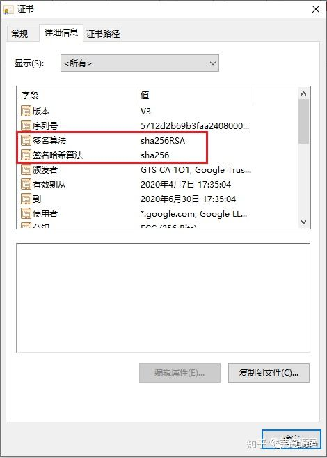

浏览器首先用哈希函数对明文信息的摘要做哈希得到一个哈希值（用到的就是证书中的签名哈希算法SHA256），然后用根CA的公钥对根证书的签名作解密得到另一个哈希值（用到的算法就是RSA非对称算法），如果两个哈希值相等则说明证书没有被篡改过。当然还需校验证书中服务器名称是否合法以及验证证书是否过期.

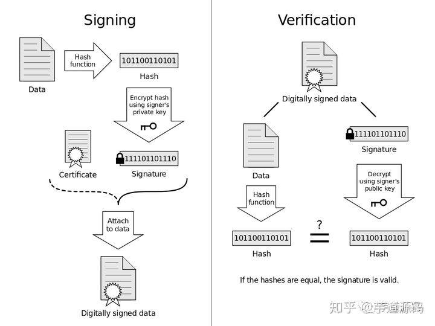

这样就免受中间人攻击了，因为假如有中间人修改了证书的内容（如将证书中的公钥替换成自己的公钥），那么将获得不同的哈希值，从而两个哈希值不匹配导致验证失败。如果要绕过这个机制，中间人必须要也替换签名，使签名也相匹配。而做到这一点就需要破解到了根证书的密钥（而这是不可能的，中间人必然会失败）。浏览器会出现以下画面，告诉你正在遭受中间人攻击，因为证书被篡改了：

那聪明的你肯定也想到了，如果你开发了一个系统还在测试阶段，还没有正式申请一张证书，那么你可以为服务器自签名一张证书，然后将证书导入客户端的CA信任列表中。

**信任链机制**

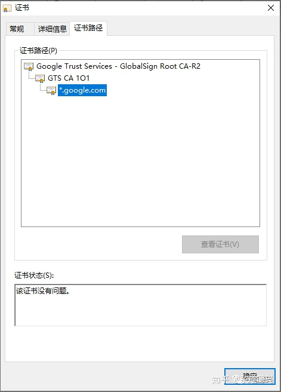

可以看到证书路径是GlobalSign Root CA-R2 -> GTS CA 1O1->*.[http://google.com](https://link.zhihu.com/?target=http%3A//google.com)。因为我们的浏览器信任GlobalSign Root CA，根据信任链机制，你相信了根CA颁发的证书，也要相信它签名的子CA颁发的证书，也要相信子CA签名的子子CA的证书…而我们通过一级级的校验，如果从根证书到最下层的证书都没有被篡改过，我们就相信最下层的这个服务器证书是合法的。所以在这个机制中，你就需要无条件的相信根证书的颁发机构。

如果通过验证，客户端生成一个随机数`pre-master`，用于密钥交换过程。

1. 密钥交换过程：客户端用第三步中服务器的证书中拿到服务器的公钥，用这个公钥加密（算法是加密套件中的密钥交换算法，譬如`ECDHE算法`）生成密文发送给服务器。
2. 客户端用`server-random` + `client-random` + `pre-master`一起计算出对称密钥`master secret`。
3. 服务器收到第四步的信息之后，用服务器的私钥对密文进行解密得到密钥`pre-master`。

因为只有服务器有私钥，可以针对客户端发出的加密过的信息进行解密得到`pre-master`，这样就保证了只有服务器和客户端知道`pre-master`。服务器端也可以用`server-random` + `client-random` + `pre-master`一起计算出对称密钥`master secret`。

现在客户端和服务器均有密钥`master secret`了，后面就可以用它来进行加密和解密了。

> “为什么不能只用一个`pre-master`作为之后加密的对称密钥？ 虽然只有服务器有私钥，能够解密`pre-master`呀，但仅用它作为`master secret`是不够安全的，这是因为要以防客户端的`pre-master`并不是随机数的情况。加上另外两个随机数`client-random`以及`server-random`（而这两个随机数和时间有相关性），这样就能保证最后生成的`master secret`一定是随机数。

1. 客户端用`master secret`加密了一条`握手完成`的消息发送给服务器。
2. 服务器端也回发了一条用`master secret`加密的`握手完成`的消息。
3. 当两方都收到对方发送的握手消息之后，也成功解密后，就可以用`master secret`愉快的开始数据加密和解密了。

综上，整个握手过程主要是通过一系列步骤通过非对称加密的算法交换得到了`master secret`，这个步骤通常需要几百毫秒，但是就是这一顿猛操作之后使得只有服务器和客户端知道`master secret`。之后的通信又利用了高效的对称算法对所有信息进行加密和解密，虽然加密和解密也需要耗时耗流量，不过信息是完全不可能被别人篡改和破解的，这一点损耗还是值得的。

来源： [http://stephanietang.github.io/2020/04/19/how-https-works/](https://link.zhihu.com/?target=http%3A//stephanietang.github.io/2020/04/19/how-https-works/)

- [《Java 2019 超神之路》](https://link.zhihu.com/?target=http%3A//www.iocoder.cn/zhishixingqiu/%3Fzhihu)
- [《Dubbo 实现原理与源码解析 —— 精品合集》](https://link.zhihu.com/?target=http%3A//www.iocoder.cn/Dubbo/good-collection/%3Fzhihu)
- [《Spring 实现原理与源码解析 —— 精品合集》](https://link.zhihu.com/?target=http%3A//www.iocoder.cn/Spring/good-collection/%3Fzhihu)
- [《MyBatis 实现原理与源码解析 —— 精品合集》](https://link.zhihu.com/?target=http%3A//www.iocoder.cn/MyBatis/good-collection/%3Fzhihu)
- [《Spring MVC 实现原理与源码解析 —— 精品合集》](https://link.zhihu.com/?target=http%3A//www.iocoder.cn/Spring-MVC/good-collection/%3Fzhihu)
- [《Spring Boot 实现原理与源码解析 —— 精品合集》](https://link.zhihu.com/?target=http%3A//www.iocoder.cn/Spring-Boot/good-collection/%3Fzhihu)
- [《数据库实体设计合集》](https://link.zhihu.com/?target=http%3A//www.iocoder.cn/Entity/good-collection/%3Fzhihu)
- [《Java 面试题 —— 精品合集》](https://link.zhihu.com/?target=http%3A//www.iocoder.cn/Interview/good-collection/%3Fzhihu)
- [《Java 学习指南 —— 精品合集》](https://link.zhihu.com/?target=http%3A//www.iocoder.cn/Interview/good-collection/%3Fzhihu)

发布于 2020-06-18