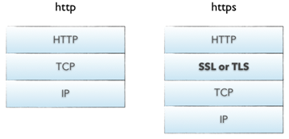
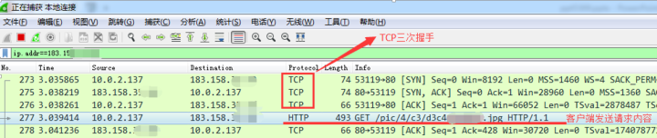
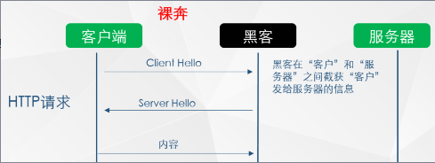

## https是什么

HTTPS（全称：HyperText Transfer Protocol over Secure Socket Layer） SSL加持下的超文本传输协议  
HTTP 协议（HyperText Transfer Protocol，超文本传输协议）：是客户端浏览器或其他程序与Web服务器之间的应用层通信协议 。
HTTPS 协议（HyperText Transfer Protocol over Secure Socket Layer）：可以理解为HTTP+SSL/TLS， 即 HTTP 下加入 SSL 层，HTTPS 的安全基础是 SSL，因此加密的详细内容就需要 SSL，用于安全的 HTTP 数据传输。

## 为什么HTTPS

TCP三次握手之后, 客户端和服务器相互确认了各自的收发能力, 客户端向服务器发送http请求,HTTP请求过程中，客户端与服务器之间没有任何身份确认的过程，数据全部明文传输，“裸奔”在互联网上，所以很容易遭到黑客的攻击

所以 HTTP 传输面临的风险有：
（1） 窃听风险：黑客可以获知通信内容。
（2） 篡改风险：黑客可以修改通信内容。
（3） 冒充风险：黑客可以冒充他人身份参与通信。

## https实现基础

### 对称加密

// TODO 流式, 分组
有流式、分组两种，加密和解密都是使用的同一个密钥。

例如：DES、AES-GCM、ChaCha20-Poly1305等

### 非对称加密

// TODO 各种加密算法
加密使用的密钥和解密使用的密钥是不相同的，分别称为：公钥、私钥，公钥和算法都是公开的，私钥是保密的。非对称加密算法性能较低，但是安全性超强，由于其加密特性，非对称加密算法能加密的数据长度也是有限的。

例如：RSA、DSA、ECDSA、 DH、ECDHE

### 哈希算法

将任意长度的信息转换为较短的固定长度的值，通常其长度要比信息小得多，且算法不可逆。

例如：MD5、SHA-1、SHA-2、SHA-256 等

### 数字签名

签名就是在信息的后面再加上一段内容（信息经过hash后的值），可以证明信息没有被修改过。hash值一般都会加密后（也就是签名）再和信息一起发送，以保证这个hash值不被修改。

hash(明文) == decode(signature) 证明证书没有被修改过

### 密钥交换和数据加密

公钥和加密算法都是公开的

后向使用非对称加密交换密钥, 这个密钥作为后续对称加密的密钥

密钥交换的过程:

1. 第一次握手, 客户端和服务器指定TLS协议版本, 发送了两个随机数, 确定了加密算法, 此阶段可以进行会话恢复
2. 第二次握手, 服务端发送证书(可选,取决于使用的加密算法), ServerKeyExchange(可选), CertificateRequest(可选), ServerHelloDone, 客户端会校验服务都安证书, 如果不合法断开TLS握手
3. 第三次握手, 客户端发送其证书(可选), ClientKeyExchange(发送 Pre-Master-Secret), CertificateVerify(可选, 验证客户端是否有用此证书), 生成Master-Secret
4. 第四次挥手, 客户端发送ChangeCipherSpec, 服务端发送ChangeCipherSpec

- 第一次握手

  - 客户端发送 ClientHello 消息，其中包含**支持的最高 TLS 协议版本**、**随机数**（稍后用于生成“会话密钥”）、**加密算法列表**（如 RSA 公钥加密）和**压缩算法列表**

    > 如果客户端正在尝试恢复握手，则它可以发送会话 ID。
    >
    > 如果客户端可以使用[应用协议协商](https://en.wikipedia.org/wiki/Application-Layer_Protocol_Negotiation)，则它可能包括受支持的应用程序协议列表，例如 [HTTP 2.0](https://en.wikipedia.org/wiki/HTTP/2)。

  - 服务端回应 ServerHello 消息，其中包含**要使用的 TLS 协议版本**、**随机数**（稍后用于生成“会话密钥”）、**要使用的加密算法**和**要使用的压缩算法**

    > 为了确认恢复握手，则服务端可以发送会话 ID。
    >
    > 要使用的协议版本应该是客户端和服务端都支持的最高版本。例如，客户端支持 TLS 1.1，服务端支持 TLS 1.2，则应该选择 TLS 1.1 版本。

- 第二次握手

  - 服务端发送其证书（可选，取决于使用的加密算法）

    > 目前主流的 RSA 算法就是基于证书的。使用证书也是更推荐的做法，因为相比于无证书的机制，使用证书更安全

  - 服务端发送 ServerKeyExchange 消息（可选，取决于使用的加密算法。DHE 和 DH_anon 算法会发送该消息）

  - 服务端发送 CertificateRequest 消息，请求获取客户端证书，以便进行相互认证（可选，如果是单向身份认证，通常是服务端认证，则不需要这一步）

  - 服务端发送 ServerHelloDone 消息，表示**服务端握手协商完成**（注意，是协商完成，而不是整个 TLS 握手完成）。

  - 客户端校验服务端证书（如果证书不合法，客户端会**向用户发出警告信息**并**断开 TLS 握手**）

- 第三次握手

  - 客户端发送其证书，供服务端使用和校验（可选，如果是单向身份认证，通常是服务端认证，则不需要这一步）

  - 客户端发送 ClientKeyExchange 消息（可选，同样取决于使用的加密算法。DHE 和 DH_anon 算法会用到），其中可能包含 Pre-Master-Secret、公钥。

    > Pre-Master-Secret (PMS，预主密钥) 是一个随机数，在发送之前，会使用服务端证书中的公钥对其进行加密。

  - 客户端发送一个 CertificateVerify 消息（可选，如果是单向身份认证，通常是服务端认证，则不需要这一步），其中包含使用客户端**私钥**对之前握手信息的签名。服务端可以使用客户端公钥来验证此签名，以确定客户端是否拥有此证书

  - 到此为止，客户端和服务端都具有了三个随机数（两个随机数 + PMS），然后它们分别使用之前协商的**对称加密算法**和**三个随机数**来生成 Master-Secret，用于加密之后传输的数据

    > Master-Secret（MS，主密钥，也称为“会话密钥”）

- 第四次挥手

  - 客户端发送 ChangeCipherSpec 记录，用于告诉服务端“之后的所有数据都将进行身份验证（如果服务端证书中存在加密参数，则会进行加密）”。具体如下：
    - 客户端发送经过身份验证和加密的 Finished 消息，其包含之前所有握手信息的 Hash 和 [MAC](https://en.wikipedia.org/wiki/Message_authentication_code)
    - 服务端尝试解密 Finished 消息，获取并验证 Hash 和 MAC。如果解密或验证失败，则认为握手失败，断开 TLS 链接。
  - 服务端回应 ChangeCipherSpec 记录，同样用于告诉客户端“之后的所有数据都将进行身份验证（如果服务端证书中存在加密参数，则会进行加密）”。具体如下：
    - 服务端发送经过身份验证和加密的 Finished 消息，其包含之前所有握手信息的 Hash 和 [MAC](https://en.wikipedia.org/wiki/Message_authentication_code)
    - 客户端执行与服务端上一步相同的解密和验证过程

上面对 TLS 四次握手进行了全面的介绍，但比较晦涩难懂，下面我们将其简化并总结一下：

> 由于不用证书的 TLS 握手不够安全，也很少使用，因此这里只讨论需要证书的。

- 第一次握手

  - 客户端发送 TLS 握手请求，其中包含**支持的最高 TLS 协议版本**、**随机数**、**加密算法列表**、**压缩算法列表**
  - 服务端回应请求，回应的内容包含**要使用的 TLS 协议版本**、**随机数**、**要使用的加密算法**、**要使用的压缩算法**

- 第二次握手

  - 服务端发送其证书，请求获取客户端证书，然后发送 ServerHelloDone 消息
  - 客户端验证服务端证书，如果不合法，则断开 TLS 握手连接

- 第三次握手

  客户端发送以下信息：

  - 客户端证书
  - 一个随机数（PMS）。该随机数使用服务端的公钥加密
  - 使用客户端**私钥**对先前握手信息的签名

  此时，客户端和服务端都有了三个随机数，然后双方各自使用协商的对称加密算法和三个随机数，来生成对话密钥（MS），用于加密之后传输的数据。

- 第四次挥手

  客户端发送如下信息：

  - 编码改变通知（用于告诉服务端加密传输接下来的数据）
  - 握手结束通知（该通知包含之前所有握手信息的 Hash 和 [MAC](https://en.wikipedia.org/wiki/Message_authentication_code)，供服务端校验）

  服务端发送如下信息：

  - 编码改变通知（用于告诉客户端加密传输接下来的数据）
  - 握手结束通知（该通知包含之前所有握手信息的 Hash 和 [MAC](https://en.wikipedia.org/wiki/Message_authentication_code)，供客户端校验）

#### ssl证书

（1）证书的发布机构CA

（2）证书的有效期

（3）公钥

（4）证书所有者

（5）签名

### 证书篡改验证

浏览器首先用哈希函数对明文信息的摘要做哈希得到一个哈希值（用到的就是证书中的签名哈希算法SHA256），然后用根CA的公钥对根证书的签名作解密得到另一个哈希值（用到的算法就是RSA非对称算法），如果两个哈希值相等则说明证书没有被篡改过。当然还需校验证书中服务器名称是否合法以及验证证书是否过期.

这样就免受中间人攻击了，因为假如有中间人修改了证书的内容（如将证书中的公钥替换成自己的公钥），那么将获得不同的哈希值，从而两个哈希值不匹配导致验证失败。如果要绕过这个机制，中间人必须要也替换签名，使签名也相匹配。而做到这一点就需要破解到了根证书的密钥（而这是不可能的，中间人必然会失败）。浏览器会出现以下画面，告诉你正在遭受中间人攻击，因为证书被篡改了：

那聪明的你肯定也想到了，如果你开发了一个系统还在测试阶段，还没有正式申请一张证书，那么你可以为服务器自签名一张证书，然后将证书导入客户端的CA信任列表中。