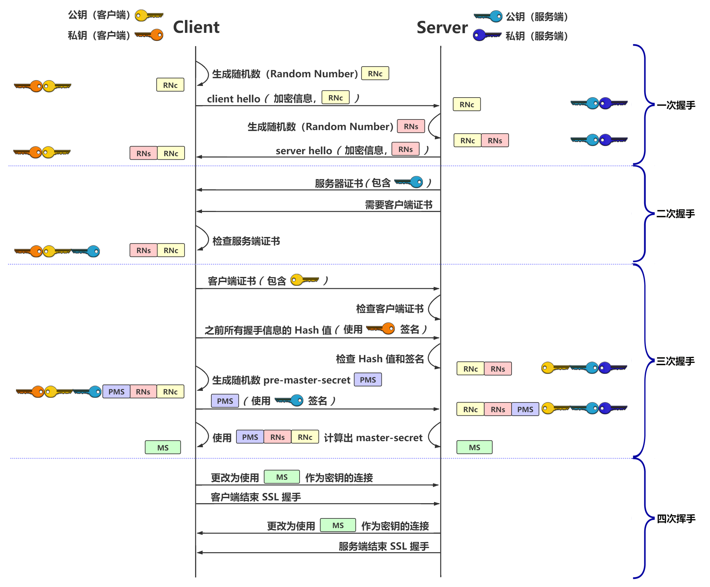
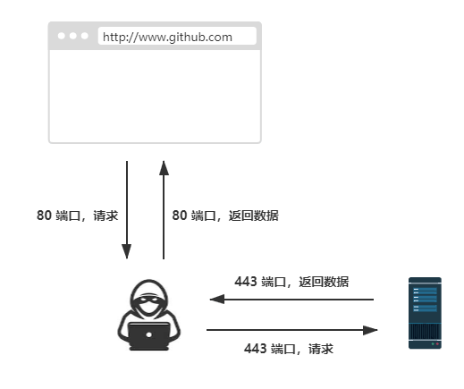

# [深入探究 SSL/TLS 协议](https://liuyib.github.io/2020/04/18/deep-study-ssl-tls/#HTTP-%E4%B8%BA%E4%BB%80%E4%B9%88%E4%B8%8D%E5%AE%89%E5%85%A8)

SSL/TLS 协议是 HTTPS 中特别重要的一部分，因此有必要深入了解其原理和运作过程。

## HTTP 为什么不安全

HTTP 是明文传输协议，通信过程和数据传输都没有进行加密，也没有验证通信双方的身份。因此通信过程很容易遭到劫持、窃听、篡改等。


使用 HTTP 协议传输信息时，就好比邮寄信件，邮件会经过很多快递员，但是每个快递员都可以拆开邮件并读取内容（因为 HTTP 是明文传输的），所以邮件的内容可以被轻易窃取。除此之外，快递员还可以伪造、篡改邮件，使得用户最终收到的邮件是假的。

## HTTPS 如何保证安全

HTTPS = HTTP + SSL/TLS，如今 SSL 已废弃，这里我们只讨论 HTTP + TLS。

为了解决 HTTP 协议的问题，HTTPS 引入了**数据加密**和**身份验证机制**。在开始传输数据之前，通过安全可靠的 TLS 协议进行加密，从而保证后续加密传输数据的安全性。

## TLS 协议

**传输层安全性协议**（Transport Layer Security，**TLS**）及其前身**安全套接层**（Secure Sockets Layer，**SSL**）是一种安全协议，目的是为了保证**网络通信安全**和**数据完整性**。

受 TLS 协议保护的通信过程，具有以下一种或几种属性：

- 连接是安全的

  > 因为传输的数据进行了加密（使用对称加密算法）。并且对称加密的密钥是为每一个连接唯一生成的（基于 TLS 握手阶段协商的[加密算法](https://en.wikipedia.org/wiki/Transport_Layer_Security#Key_exchange_or_key_agreement)和[共享密钥](https://en.wikipedia.org/wiki/Shared_secret)）。
  >
  > 其中，**共享密钥**的协商是安全可靠的。如果有攻击者修改了通信，那么该修改一定会被检测出来并被阻止。并且即使攻击者处于整个连接的中间（窃听 TLS 握手），也无法利用窃听到的密钥。

- 连接是可靠的

  > 发送的每条消息都会通过[消息验证码](https://en.wikipedia.org/wiki/Message_authentication_code)（Message authentication code, MAC），来进行消息完整性检查。

- 可以使用公钥对通信双方进行身份验证

  > 该项一般只需要验证一方的身份（通常是服务端）。对于一些非常保密的应用，还是需要验证双方的身份。例如，金融机构往往只允许认证后的用户连入自己的网络。

TLS 协议包括两层：[TLS 记录](https://en.wikipedia.org/wiki/Transport_Layer_Security#TLS_record)和 [TLS 握手协议](https://en.wikipedia.org/wiki/Transport_Layer_Security#TLS_handshake)。本文主要讲述 TLS 握手协议。

由于诸多原因（主要是安全方面），SSL 协议的所有版本（SSL 1.0、SSL 2.0、SSL 3.0）都已弃用。并且 TLS 1.0、TLS 1.1 也将在 2020 年弃用，因此目前主流的通信加密协议版本是 TLS 1.2 和 TLS 1.3。

## TLS 握手

一张图解 TLS 握手（下面会详细介绍）：

> 带证书的双向身份验证的 TLS 握手。



> 图片原始来源：[Wikipedia - File:SSL handshake with two way authentication with certificates.svg](https://zh.wikipedia.org/wiki/File:SSL_handshake_with_two_way_authentication_with_certificates.svg)，由我翻译并绘制为中文。

详细过程如下：

- 第一次握手

  - 客户端发送 ClientHello 消息，其中包含**支持的最高 TLS 协议版本**、**随机数**（稍后用于生成“会话密钥”）、**加密算法列表**（如 RSA 公钥加密）和**压缩算法列表**

    > 如果客户端正在尝试恢复握手，则它可以发送会话 ID。
    >
    > 如果客户端可以使用[应用协议协商](https://en.wikipedia.org/wiki/Application-Layer_Protocol_Negotiation)，则它可能包括受支持的应用程序协议列表，例如 [HTTP 2.0](https://en.wikipedia.org/wiki/HTTP/2)。

  - 服务端回应 ServerHello 消息，其中包含**要使用的 TLS 协议版本**、**随机数**（稍后用于生成“会话密钥”）、**要使用的加密算法**和**要使用的压缩算法**

    > 为了确认恢复握手，则服务端可以发送会话 ID。
    >
    > 要使用的协议版本应该是客户端和服务端都支持的最高版本。例如，客户端支持 TLS 1.1，服务端支持 TLS 1.2，则应该选择 TLS 1.1 版本。

- 第二次握手

  - 服务端发送其证书（可选，取决于使用的加密算法）

    > 目前主流的 RSA 算法就是基于证书的。使用证书也是更推荐的做法，因为相比于无证书的机制，使用证书更安全

  - 服务端发送 ServerKeyExchange 消息（可选，取决于使用的加密算法。DHE 和 DH_anon 算法会发送该消息）

  - 服务端发送 CertificateRequest 消息，请求获取客户端证书，以便进行相互认证（可选，如果是单向身份认证，通常是服务端认证，则不需要这一步）

  - 服务端发送 ServerHelloDone 消息，表示**服务端握手协商完成**（注意，是协商完成，而不是整个 TLS 握手完成）。

  - 客户端校验服务端证书（如果证书不合法，客户端会**向用户发出警告信息**并**断开 TLS 握手**）

- 第三次握手

  - 客户端发送其证书，供服务端使用和校验（可选，如果是单向身份认证，通常是服务端认证，则不需要这一步）

  - 客户端发送 ClientKeyExchange 消息（可选，同样取决于使用的加密算法。DHE 和 DH_anon 算法会用到），其中可能包含 Pre-Master-Secret、公钥。

    > Pre-Master-Secret (PMS，预主密钥) 是一个随机数，在发送之前，会使用服务端证书中的公钥对其进行加密。

  - 客户端发送一个 CertificateVerify 消息（可选，如果是单向身份认证，通常是服务端认证，则不需要这一步），其中包含使用客户端**私钥**对之前握手信息的签名。服务端可以使用客户端公钥来验证此签名，以确定客户端是否拥有此证书

  - 到此为止，客户端和服务端都具有了三个随机数（两个随机数 + PMS），然后它们分别使用之前协商的**对称加密算法**和**三个随机数**来生成 Master-Secret，用于加密之后传输的数据

    > Master-Secret（MS，主密钥，也称为“会话密钥”）

- 第四次挥手

  - 客户端发送 ChangeCipherSpec 记录，用于告诉服务端“之后的所有数据都将进行身份验证（如果服务端证书中存在加密参数，则会进行加密）”。具体如下：
    - 客户端发送经过身份验证和加密的 Finished 消息，其包含之前所有握手信息的 Hash 和 [MAC](https://en.wikipedia.org/wiki/Message_authentication_code)
    - 服务端尝试解密 Finished 消息，获取并验证 Hash 和 MAC。如果解密或验证失败，则认为握手失败，断开 TLS 链接。
  - 服务端回应 ChangeCipherSpec 记录，同样用于告诉客户端“之后的所有数据都将进行身份验证（如果服务端证书中存在加密参数，则会进行加密）”。具体如下：
    - 服务端发送经过身份验证和加密的 Finished 消息，其包含之前所有握手信息的 Hash 和 [MAC](https://en.wikipedia.org/wiki/Message_authentication_code)
    - 客户端执行与服务端上一步相同的解密和验证过程

上面对 TLS 四次握手进行了全面的介绍，但比较晦涩难懂，下面我们将其简化并总结一下：

> 由于不用证书的 TLS 握手不够安全，也很少使用，因此这里只讨论需要证书的。

- 第一次握手

  - 客户端发送 TLS 握手请求，其中包含**支持的最高 TLS 协议版本**、**随机数**、**加密算法列表**、**压缩算法列表**
  - 服务端回应请求，回应的内容包含**要使用的 TLS 协议版本**、**随机数**、**要使用的加密算法**、**要使用的压缩算法**

- 第二次握手

  - 服务端发送其证书，请求获取客户端证书，然后发送 ServerHelloDone 消息
  - 客户端验证服务端证书，如果不合法，则断开 TLS 握手连接

- 第三次握手

  客户端发送以下信息：

  - 客户端证书
  - 一个随机数（PMS）。该随机数使用服务端的公钥加密
  - 使用客户端**私钥**对先前握手信息的签名

  此时，客户端和服务端都有了三个随机数，然后双方各自使用协商的对称加密算法和三个随机数，来生成对话密钥（MS），用于加密之后传输的数据。

- 第四次挥手

  客户端发送如下信息：

  - 编码改变通知（用于告诉服务端加密传输接下来的数据）
  - 握手结束通知（该通知包含之前所有握手信息的 Hash 和 [MAC](https://en.wikipedia.org/wiki/Message_authentication_code)，供服务端校验）

  服务端发送如下信息：

  - 编码改变通知（用于告诉客户端加密传输接下来的数据）
  - 握手结束通知（该通知包含之前所有握手信息的 Hash 和 [MAC](https://en.wikipedia.org/wiki/Message_authentication_code)，供客户端校验）

## 证书校验

TLS 协议中重要的一环是如何校验证书的真实性。虽然有些 TLS 握手不需要证书（例如，使用 [Diffie-Hellman](https://en.wikipedia.org/wiki/Diffie–Hellman)（DH） 算法的 TLS 握手），但是这些情况都被证实不安全，而且很少使用。

要证明证书的真实性，通常依赖于**一组**受信任的第三方**证书颁发机构**（Certificate authorities, **CA**）。验证 TLS 证书有效性的方法如下：

1. 检查证书是否是浏览器中**受信任的根证书机构**颁发

   证书都是上级 CA 签发的，上级的 CA 可能还有上级，直到找到根证书。

2. 检查证书中的**证书吊销列表**（CRL），看证书是否已经被吊销

   证书被吊销后，会被记录在证书吊销列表中，CA 会定期发布 CRL。应用程序可以根据 CRL 来检查证书是否被吊销。

3. 通过**在线证书状态协议**（OCSP）检查证书是否有效

   CA 会提供实时的查询接口，用来查询证书的有效性。在线实时查询会使得 TLS 握手时间延长，因为浏览器需要等待查询结束才能继续 TLS 握手。至于使用**在线查询**还是证书中的**吊销列表**，由浏览器决定。

4. 检查证书是否过期

5. 检查域名和证书中的域名是否一致

6. 查询网站是否被列入了欺诈网站黑名单

   这一步 IE7 会进行，IE7 会到**欺诈网站数据库**，查询网站是否被列入了欺诈黑名单。

经过了以上步骤，浏览器中才会显示安全锁的标志。任意一个步骤出问题，浏览器都无法建立安全链接，并最终提示“您的链接不是私密链接”。

## 对称加密

对称加密，又叫私钥加密，指**加密和解密使用相同密钥的加密算法**。其特点是，加密密钥和解密秘钥可以相互推算出来。并且在大多数对称加密算法中，加密密钥和解密秘钥是相同的。因此，密钥的保密性对通信的安全性至关重要。

优点：计算量小、加密速度快，效率高。
缺点：双方使用同样的密钥，安全性得不到保证。

从以上特点可以看出，如果 TLS 握手阶段使用对称加密，那么只要攻击者窃听到密钥，就可以获取所有通信数据，这使得加密毫无意义。因此，需要用到非对称加密来保证 TLS 握手的安全。

## 非对称加密

上文介绍了 TLS 四次握手，我们知道在数据传输之前，需要**通过协商来交换密钥、加密算法等**。密钥协商阶段常用的非对称加密算法是 [RSA](https://en.wikipedia.org/wiki/RSA_(algorithm))（用于生成**公钥**和**私钥**）。其中，公钥会被包含在证书中，私钥则由客户端或服务端自己来保管。

RSA 算法安全性很高，实现也简单，但缺点是需要比较大的质数（目前业界常用的是 2048 位）来保证安全强度，并且运算极其消耗 CPU 资源。

一次完全的 TLS 握手中，在密钥交换阶段，非对称加密的计算量占整个握手过程的 90% 以上，而对称加密的计算量只相当于非对称加密的 0.1% 左右。所以，如果后续的数据传输也使用非对称加密，则会极其消耗 CPU 性能，服务器根本无法承受。

此外，非对称加密有一个限制：**加密的内容长度不能超过公钥的长度**。例如，常用的公钥长度为 2048 位，意味着加密内容不能超过 256 个字节。

因此，非对称加密目前只适用于**密钥协商**或 **CA 签名**，不适用于传输数据的加解密，这也就是为什么不全程使用非对称加密的原因。

## 握手恢复

TLS 握手阶段使用了非对称加密（例如 RSA 算法），其计算消耗非常大，因此 TLS 握手机制中提供了会话恢复的功能，从而提高了握手中断后再次握手的性能。

有两种方法可以恢复会话：一种是 Session ID，另一种是 Session tickets。

### Session ID

Session ID 的思想很简单：每次会话都有一个 Session ID。如果 TLS 握手中断，下次重连的时候，只要客户端给出 Session ID，并且服务端有对应的记录，那么双方就可以使用之前的“会话密钥”，而不必重新计算生成。

具体过程如下：在一次会话中，服务器发送 Session ID 作为 ServerHello 消息的一部分。客户端将此 Session ID 与服务端的 IP、TCP 端口相关联，以便下次重连时简化握手。服务端则会将此 Session ID 与之前协商的密钥相关联，特别是“会话密钥（Master-Secret）”。

### Session tickets

Session ID 机制有一些弊端，例如：1、只能保留在一台服务器上。负载匀衡中，多台服务器之间往往没有同步 Session 信息，如果客户端的两次请求没有被同一台服务器处理，就无法通过 Session ID 恢复握手。2、服务端不好控制 Session ID 对应信息的失效时间。时间太短起不到作用，太长又占用服务器大量资源。

Session tickets 的出现就是为了 Session ID 机制的一些弊端。

使用 Session tickets 时，服务器将**会话状态**存储在其中，然后将 Session tickets 加密后存储到客户端。客户端在恢复会话时，将 Session tickets 发送给服务端，服务器验证通过后，就可以使用其中的会话状态来恢复 TLS 握手。

## TLS 安全性

从 TLS 的原理可知，其设计是严谨、可靠的，但是问题出现在不严谨的使用中。

### 中间人攻击

中间人攻击（Man-in-the-middle, MITM）是指 A 和 B 通信时，有第三者 C 处于信道中间，可以完全劫持、窃听、篡改这些信息。

上文中也一直强调，不使用证书的 TLS 握手是不安全的。例如，使用密钥交换算法 [DH](https://en.wikipedia.org/wiki/Diffie–Hellman)，该算法就没有证书的概念，这样攻击者就可以轻易窃听、篡改数据，从而冒充他人。

### TLS 剥离攻击

TLS 剥离攻击是指将 HTTPS 连接降级到 HTTP 连接，从而截获用户传输的内容。也属于中间人攻击的一种。

用户在访问网站时，一般只会在地址栏输入域名，例如 `github.com`。这样操作的结果是，浏览器用默认的 HTTP 协议发送请求，服务器会返回 302 状态码，然后客户端进行重定向，这时候才使用 HTTPS 协议去访问网站。

攻击者正是利用 HTTP 重定向到 HTTPS 的过程，进行 TLS 剥离攻击。如下图所示：



在请求第一次走 HTTP 协议时，攻击者劫持 80 端口，然后模拟 HTTPS 请求到服务器上获取数据，最后仍通过 80 端口返回给用户，整个过程用户完全察觉不到。

有两种情况下可能存在 TLS 剥离攻击：

- 用户没有通过 `https://` 的方式输入网址，浏览器会走 HTTP 协议

- 在 HTTPS 页面中，包含 HTTP 链接

  > 这就是为什么建议 HTTPS 页面中，所有的链接都要使用 HTTPS 协议。哪怕其中有一个链接使用了 HTTP 协议，那么整个 HTTPS 页面都可能是不安全的。

### 伪造证书攻击

上文介绍 TLS 握手时，提到了如果攻击者使用了伪造的证书，那么一定会被检验出来。但是，如果客户端信任攻击者的伪造证书会怎样？结果不言而喻，攻击者可以随意窃取用户的数据。

假设用户访问 `https://github.com`，但是用户的 DNS 服务器被攻击了，使得 IP 并没有指向 Github 的服务器，而是指向了攻击者的服务器。此时，如果攻击者的服务器上有合法的证书，那么客户端就会信任攻击者，从而和攻击者进行通信。

这种攻击的前提条件是：1、**用户的 DNS 服务器被攻击**。2、**攻击者的服务器上有合法的证书**。其中，第二点对于用户来说无法控制，需要证书机构不滥发证书。

在实际中，这种攻击确实发生过，例如：2016 年 Mozilla 发现沃通 CA 存在严重的信任问题，例如偷签 `github.com` 的证书，故意倒填证书日期绕过浏览器对 SHA-1 证书的限制等，将停止信任 WoSign 和 StartCom 签发的新证书。

## 安全措施

### HSTS 策略

为了应对 TLS 剥离攻击，引入了 HSTS 技术。HSTS（HTTP Strict Transport Security）的作用是强制客户端使用 HTTPS 进行通信。

该策略的原理很简单：在服务端的响应头中添加 `Strict-Transport-Security` 字段，该字段中设置了 `max-age`，下次客户端使用 HTTP 访问时，只要 `max-age` 未过期，就直接内部返回 307 状态码（不经过服务器），然后重定向到 HTTPS。

使用示例：

```
Strict-Transport-Security: max-age=31536000; includeSubDomains
```

> `includeSubDomains` 表示对子域名也生效。

这意味着两点：

- 在接下来的 31536000 秒（即一年）中，客户端发起 HTTP 请求时，会自动强制跳转到 HTTPS
- 在接下来的一年中，如果服务器发送的 TLS 证书无效，用户不能忽略浏览器的警告继续访问网站

使用 HSTS 的一些弊端：

- 用户第一次访问某网站，还没有种下 `Strict-Transport-Security` 响应头，HSTS 策略无法生效

  > 解决这个弊端有两种方法：
  >
  > 1. 浏览器预置 HSTS 域名列表
  > 2. 将 HSTS 信息加入到域名系统记录中（这需要确保 DNS 安全）

- 直接使用 IP 访问，HSTS 策略无法生效

- 可以改通过修改系统时间绕过 `max-age`

  > 攻击者可以通过伪造 NTP（Network Time Protocol，网络时间协议） 信息，设置错误时间来绕过 HSTS。解决方法是认证 NTP 信息，或者禁止 NTP 大幅度增减时间。

- 如果证书错误，浏览器一般会提醒存在安全风险，但仍然提供继续访问的链接。使用 HSTS 策略后，浏览器就不再提供继续访问的链接了，所以一旦证书配置错误，就会引起很大的故障

- 如果服务器的 HTTPS 没有配置好就开启了 `Strict-Transport-Security` 响应头，那么在服务器的 HTTPS 配置好之前，用户无法连接到服务器，除非等到 `max-age` 过期或使用 IP 访问

使用 HSTS 的额外收益：节省一次 302/301 重定向请求。

------

参考资料：

- [SSL/TLS 协议运行机制的概述](https://www.ruanyifeng.com/blog/2014/02/ssl_tls.html)
- [深入揭秘 HTTPS 安全问题&连接建立全过程](https://zhuanlan.zhihu.com/p/22142170)
- [从网络协议的角度聊一聊最近 Github 被大规模攻击事件](https://mp.weixin.qq.com/s/AI0mjOZxBx3bRn71CjbY3w?client=tim&ADUIN=1656081615&ADSESSION=1585797524&ADTAG=CLIENT.QQ.5603_.0&ADPUBNO=26933)
- [SSL/TLS 原理详解](https://www.linuxidc.com/Linux/2016-05/131147.htm)
- [HTTP over SSL/TLS](https://hit-alibaba.github.io/interview/basic/network/HTTPS.html)
- [HSTS 学习笔记](https://jjayyyyyyy.github.io/2017/04/27/HSTS.html)
- [你所不知道的 HSTS](https://www.barretlee.com/blog/2015/10/22/hsts-intro/#comments)