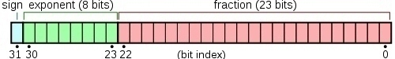
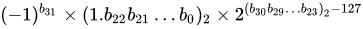
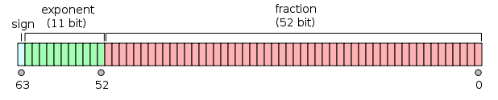
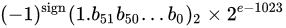
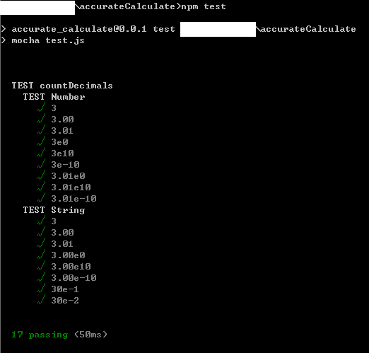

# 如何避开JavaScript浮点数计算精度问题（如0.1+0.2!==0.3）

[](https://www.zhihu.com/people/regardless)

[Regardless](https://www.zhihu.com/people/regardless)

小码农（你不点进来看看吗

关注他

35 人赞同了该文章

不知道大家在使用JS的过程中有没有发现某些浮点数运算的时候，得到的结果存在**精度问题**：比如0.1 + 0.2 = 0.30000000000000004以及7 * 0.8 = 5.6000000000000005等等。


究竟是什么原因造成了这个问题？实际上是因为计算机内部的信息都是由**二进制方式**表示的，即0和1组成的各种编码，但由于**某些浮点数没办法用二进制准确的表示出来**，也就带来了一系列精度问题。当然这也**不是JS独有的问题**。


接下来让我们**以0.1+0.2为例**，深入理解一下**浮点数的运算方法**，以及使用JS时应该如何**规避**这个问题。这个问题很基础，但也很有了解的必要，大家就当是复习一下**《计算机组成原理》**吧。


**通过后面的几个小章节，将会大致为大家介绍以下几个方面内容：**

- 浮点数的二进制表示方式
- IEEE 754 标准是什么
- 避开浮点数计算精度问题的方案
- 测试框架(Mocha)的基本用法


## **一、计算机的运算方式**


## ㈠ 如何将小数转成二进制

**① 整数部分：**除2取余数，若商不为0则继续对它除2，当商为0时则将所有余数逆序排列；

**② 小数部分：**乘2取整数部分，若小数不为0则继续乘2，直至小数部分为0将取出的整数位正序排列。（若小数部分无法为零，根据有效位数要求取得相应数值，位数后一位0舍1入进行取舍）

**利用上述方法，我们尝试一下将0.1转成二进制：**

0.1 * 2 = 0.2 - - - - - - - - - - 取0

0.2 * 2 = 0.4 - - - - - - - - - - 取0

0.4 * 2 = 0.8 - - - - - - - - - - 取0

0.8 * 2 = 1.6 - - - - - - - - - - 取1

0.6 * 2 = 1.2 - - - - - - - - - - 取1

0.2 * 2 = 0.4 - - - - - - - - - - 取0

......

算到这就会发现小数部分再怎么继续乘都**不会等于0**，所以**二进制是没办法精确表示0.1的**。

那么0.1的二进制表示是：0.000110011......0011...... (0011无限循环)

而0.2的二进制表示则是：0.00110011......0011...... (0011无限循环)

而具体应该保存多少位数，则需**要根据使用的是什么标准来确定**，也就是下一节所要讲到的内容。


## ㈡ IEEE 754 标准

IEEE 754 标准是IEEE二进位浮点数算术标准(IEEE Standard for Floating-Point Arithmetic)的标准编号。IEEE 754 标准规定了计算机程序设计环境中的二进制和十进制的浮点数自述的交换、算术格式以及方法。

**根据IEEE 754标准，任意一个二进制浮点数都可以表示成以下形式：**


**S为数符，它表示浮点数的正负（0正1负）；M为有效位（尾数）；E为阶码，用移码表示，阶码的真值都被加上一个常数（偏移量）。**

**尾数部分M**通常都是规格化表示的，即非"0"的尾数其第一位总是"1"，而这一位也称**隐藏位**，因为存储时候这一位是会被**省略**的。比如保存1.0011时，只保存0011，等读取的时候才把第一位的1加上去，这样做相当于**多保存了1位有效数字**。


## 常用的浮点格式有：

**① 单精度：**

单精度浮点格式

*这是32位的浮点数，最高的1位是符号位S，后面的8位是指数E，剩下的23位为尾数（有效数字）M；*

其**真值**为：



**② 双精度：**

双精度浮点格式

*这是64位的浮点数，最高的1位是符号位S，后面的11位是指数E，剩下的52位为尾数（有效数字）M；*

其**真值**为：



JavaScript只有一种数字类型number，而number使用的就是**IEEE 754双精度浮点格式**。依据上述规则，接下来我们就来看看JS是如何存储0.1和0.2的：

0.1是正数，所以**符号位**是0；

而其二进制位是0.000110011......0011...... (0011无限循环)，进行**规格化**后为1.10011001......1001(1)*2^-4，根据0舍1入的规则，**最后的值**为

2^-4 * 1.1001100110011001100110011001100110011001100110011010

而**指数E** = -4 + 1023 = 1019

由此可得，JS中**0.1**的二进制存储格式为**(符号位用逗号分隔，指数位用分号分隔)**：

0,01111111011;1001100110011001100110011001100110011001100110011010

**0.2则为：**

0,01111111100;1001100110011001100110011001100110011001100110011010


***Q1：**指数位E（阶码）为何用移码表示？*

***A1：**为了便于判断其大小。*


## ㈢ 浮点数运算

0.1 => 0,01111111011;1001100110011001100110011001100110011001100110011010

0.2 => 0,01111111100;1001100110011001100110011001100110011001100110011010

**浮点数的加减运算按以下几步进行：**

**① 对阶**，使两数的小数点位置对齐（也就是使两数的阶码相等）。

所以要先求阶差，阶小的尾数要根据阶差来右移**（尾数位移时可能会发生数丢失的情况，影响精度）**

因为0.1和0.2的阶码和尾数均为正数，所以它们的原码、反码及补码都是一样的。（使用补码进行运算，计算过程中使用双符号）

**△阶差(补码)** = 00,01111111011 - 00,01111111100 = 00,01111111011 + 11,10000000100 = 11,11111111111

由上可知**△阶差为-1**，也就是0.1的阶码比0.2的小，所以要把0.1的**尾数右移1位，阶码加1**（使0.1的阶码和0.2的一致）

最后0.1 => 0,01111111100;1100110011001100110011001100110011001100110011001101**(0)**

*注：要注意0舍1入的原则。之所以右移一位，尾数补的是1，是因为隐藏位的数值为1（默认是不存储的，只有读取的时候才加上）*


**② 尾数求和**

0.1100110011001100110011001100110011001100110011001101

\+ 1.1001100110011001100110011001100110011001100110011010

——————————————————————————————

10.0110011001100110011001100110011001100110011001100111

**③ 规格化**

针对步骤②的结果，需要**右规**（即尾数右移1位，阶码加1）

sum = 0.1 + 0.2 = 0,01111111101;1.0011001100110011001100110011001100110011001100110011**(1)**

*注：右规操作，可能会导致低位丢失，引起误差，造成精度问题。所以就需要步骤④的舍入操作*


**④ 舍入（0舍1入）**

sum = 0,01111111101;1.0011001100110011001100110011001100110011001100110100


**⑤ 溢出判断**

根据阶码判断浮点运算是否溢出。而我们的阶码01111111101即不上溢，也不下溢。


至此，0.1+0.2的运算就已经结束了。接下来，我们一起来看看上面计算得到的结果，它的十进制数是多少。

**<1> 先将它非规格化，得到二进制形式：**

sum = 0.010011001100110011001100110011001100110011001100110100

**<2> 再将其转成十进制**

sum = 2^2 + 2^5 + 2^6 + ... + 2^52 = 0.30000000000000004440892098500626

现在你应该明白JS中 **0.30000000000000004** 这个结果怎么来的吧。


***Q2：**计算机运算为何要使用补码？*

***A2：**可以简化计算机的运算步骤，且只用设加法器，如做减法时若能找到与负数等价的正数来代替该负数，就可以把减法操作用加法代替。而采用补码，就能达到这个效果。*


## **二、浮点数精度问题的解决方法**


## ㈠ 简单解决方案

我的思路就是将小数转成整数来运算，之后再转回小数。代码也比较简单，就直接贴出来了。

```js
'use strict'

var accAdd = function(num1, num2) {
    num1 = Number(num1);
    num2 = Number(num2);
    var dec1, dec2, times;
    try { dec1 = countDecimals(num1)+1; } catch (e) { dec1 = 0; }
    try { dec2 = countDecimals(num2)+1; } catch (e) { dec2 = 0; }
    times = Math.pow(10, Math.max(dec1, dec2));
    // var result = (num1 * times + num2 * times) / times;
    var result = (accMul(num1, times) + accMul(num2, times)) / times;
    return getCorrectResult("add", num1, num2, result);
    // return result;
};

var accSub = function(num1, num2) {
    num1 = Number(num1);
    num2 = Number(num2);
    var dec1, dec2, times;
    try { dec1 = countDecimals(num1)+1; } catch (e) { dec1 = 0; }
    try { dec2 = countDecimals(num2)+1; } catch (e) { dec2 = 0; }
    times = Math.pow(10, Math.max(dec1, dec2));
    // var result = Number(((num1 * times - num2 * times) / times);
    var result = Number((accMul(num1, times) - accMul(num2, times)) / times);
    return getCorrectResult("sub", num1, num2, result);
    // return result;
};

var accDiv = function(num1, num2) {
    num1 = Number(num1);
    num2 = Number(num2);
    var t1 = 0, t2 = 0, dec1, dec2;
    try { t1 = countDecimals(num1); } catch (e) { }
    try { t2 = countDecimals(num2); } catch (e) { }
    dec1 = convertToInt(num1);
    dec2 = convertToInt(num2);
    var result = accMul((dec1 / dec2), Math.pow(10, t2 - t1));
    return getCorrectResult("div", num1, num2, result);
    // return result;
};

var accMul = function(num1, num2) {
    num1 = Number(num1);
    num2 = Number(num2);
    var times = 0, s1 = num1.toString(), s2 = num2.toString();
    try { times += countDecimals(s1); } catch (e) { }
    try { times += countDecimals(s2); } catch (e) { }
    var result = convertToInt(s1) * convertToInt(s2) / Math.pow(10, times);
    return getCorrectResult("mul", num1, num2, result);
    // return result;
};

var countDecimals = function(num) {
    var len = 0;
    try {
        num = Number(num);
        var str = num.toString().toUpperCase();
        if (str.split('E').length === 2) { // scientific notation
            var isDecimal = false;
            if (str.split('.').length === 2) {
                str = str.split('.')[1];
                if (parseInt(str.split('E')[0]) !== 0) {
                    isDecimal = true;
                }
            }
            let x = str.split('E');
            if (isDecimal) {
                len = x[0].length;
            }
            len -= parseInt(x[1]);
        } else if (str.split('.').length === 2) { // decimal
            if (parseInt(str.split('.')[1]) !== 0) {
                len = str.split('.')[1].length;
            }
        }
    } catch(e) {
        throw e;
    } finally {
        if (isNaN(len) || len < 0) {
            len = 0;
        }
        return len;
    }
};

var convertToInt = function(num) {
    num = Number(num);
    var newNum = num;
    var times = countDecimals(num);
    var temp_num = num.toString().toUpperCase();
    if (temp_num.split('E').length === 2) {
        newNum = Math.round(num * Math.pow(10, times));
    } else {
        newNum = Number(temp_num.replace(".", ""));
    }
    return newNum;
};

var getCorrectResult = function(type, num1, num2, result) {
    var temp_result = 0;
    switch (type) {
        case "add":
            temp_result = num1 + num2;
            break;
        case "sub":
            temp_result = num1 - num2;
            break;
        case "div":
            temp_result = num1 / num2;
            break;
        case "mul":
            temp_result = num1 * num2;
            break;
    }
    if (Math.abs(result - temp_result) > 1) {
        return temp_result;
    }
    return result;
};
```

**基本用法：**

```text
加法： accAdd(0.1, 0.2)  // 得到结果：0.3
减法： accSub(1, 0.9)    // 得到结果：0.1
除法： accDiv(2.2, 100)  // 得到结果：0.022
乘法： accMul(7, 0.8)    // 得到结果：5.6

countDecimals()方法：计算小数位的长度
convertToInt()方法：将小数转成整数
getCorrectResult()方法：确认我们的计算结果无误，以防万一
```


## ㈡ 使用特殊进制类型类库

如果你需要非常精确的结果，可以考虑使用特殊的进制数据类型，如下面的这个叫bignumber的类库：

[https://github.com/MikeMcl/bignumber.js](https://link.zhihu.com/?target=https%3A//github.com/MikeMcl/bignumber.js)


## **三、通过单元测试验证解决方案的可行性**


测试可以保证我们的代码质量。而我们的那个精确计算的方案需要大量的测试来验证其正确性，通过编写测试代码进行测试省时省力，而且方便以后修改代码，能很快确认代码是否有误。

测试使用的是现在较流行的JavaScript测试框架Mocha，在浏览器和Node环境都可以使用。


**通过以下几个简单的步骤安装、使用它：**

**①** **安装好Node.js环境**

**②** 到工程目录下，通过npm init命令初始化**生成package.json**

**③** 在工程目录下**安装相关的类库**(测试框架mocha，断言库chai)

```text
npm install mocha chai --save
```

**④** **测试代码的编写**

因为不涉及到界面，所以我们就**以node的方式**来测试代码

**④-1** 先**将要测试的函数export出来**，便于测试代码调用。大致如下：

```js
if (typeof module !== 'undefined' && module.exports) {
    var calc = {};
    calc.countDecimals = countDecimals;
    calc.convertToInt = convertToInt;
    calc.getCorrectResult = getCorrectResult;
    calc.accAdd = accAdd;
    calc.accSub = accSub;
    calc.accDiv = accDiv;
    calc.accMul = accMul;
    module.exports = calc;
}
```

**④-2** 编写**测试代码**（以测试countDecimals方法为例）

```js
var chai = require('chai'); 
var assert = chai.assert;    // Using Assert style
var expect = chai.expect;    // Using Expect style
var should = chai.should();  // Using Should style

var calc = require('./accurateCalculate');
var countDecimals = calc.countDecimals;

function test_countDecimals(info, num, expected) {
    it(info, function(done) {
        expect(countDecimals(num)).to.be.equal(expected);
        done();
    });
}

describe('TEST countDecimals', function() {
    describe('TEST Number', function() {
        test_countDecimals('3', 3, 0);
        test_countDecimals('3.00', 3.00, 0);
        test_countDecimals('3.01', 3.01, 2);
        test_countDecimals('3e0', 3e0, 0);
        test_countDecimals('3e10', 3e10, 0);
        test_countDecimals('3e-10', 3e-10, 10);
        test_countDecimals('3.01e0', 3.01e0, 2);
        test_countDecimals('3.01e10', 3.01e10, 0);
        test_countDecimals('3.01e-10', 3.01e-10, 12);
    });
    
    describe('TEST String', function() {
        test_countDecimals('3', '3', 0);
        test_countDecimals('3.00', '3.00', 0);
        test_countDecimals('3.01', '3.01', 2);
        test_countDecimals('3.00e0', '3.00e0', 0);
        test_countDecimals('3.00e10', '3.00e10', 0);
        test_countDecimals('3.00e-10', '3.00e-10', 10);
        test_countDecimals('30e-1', '30e-1', 0);
        test_countDecimals('30e-2', '30e-2', 1);
    });
});
```

首先需要**require语句**，导入相关类库以及刚才待测js中export出来的对象。

**describe块称为"测试套件"（test suite）**，它是一个函数，可在通过它的第一个参数描述这块测试的是什么内容。

**it块称为"测试用例"（test case）**，表示一个单独的测试，是测试的最小单位。第一个参数是测试用例的名称。

**测试脚本里面应该包括一个或多个describe块，每个describe块应该包括一个或多个it块。**

上面的测试代码使用的是**expect断言风格**：

```js
expect(调用待测函数()).to.be.equal(期待的返回值);
```

所谓"断言"，就是判断被测函数的实际执行结果与预期结果是否一致。

**⑤** 编写package.json中的**test项**

```json
"scripts": {
    "test": "mocha test.js"
  },
```

**⑥ 运行测试代码**

配置好package.json后，只需运行npm test命令即可看到测试结果：



更多Mocha的详尽用法可以参阅这篇博客：

[测试框架 Mocha 实例教程 - 阮一峰的网络日志www.ruanyifeng.com](https://link.zhihu.com/?target=http%3A//www.ruanyifeng.com/blog/2015/12/a-mocha-tutorial-of-examples.html)


## **四、结论**


JS浮点数计算精度问题是因为某些小数没法用二进制精确表示出来。JS使用的是IEEE 754双精度浮点格式。


而规避浮点数计算精度问题，可通过以下几种方法：

- 调用round() 方法四舍五入或者toFixed() 方法保留指定的位数（对精度要求不高，可用这种方法）
- 将小数转为整数再做计算，即前文提到的那个简单的解决方案
- 使用特殊的进制数据类型，如前文提到的bignumber（对精度要求很高，可借助这些相关的类库）


***如果文章中存在问题，希望大家指出；有疑问也欢迎大家和我交流。***