# [你真的了解执行上下文吗？](https://juejin.cn/post/6945240902625394718#heading-21)

## 执行上下文

> **执行上下文** 可以理解为当前代码的执行环境，同一个函数在不同的环境中执行，会因为访问数据的不同产生不一样的结果。

执行上下文分为三种：

- 全局执行上下文：只有一个，程序首次运行时创建，它会在浏览器中创建一个全局对象（`window`对象），使`this`指向这个全局对象
- 函数执行上下文：函数被调用时创建，每次调用都会为该函数创建一个新的执行上下文
- Eval 函数执行上下文：运行`eval`函数中的代码时创建的执行上下文，少用且不建议使用

## 执行上下文栈

执行上下文栈（Execution context stack，ECS），也叫函数调用栈(`call stack`)，是一种拥有 `LIFO`（后进先出）数据结构的栈，用于存储代码执行时创建的执行上下文

由于JS是单线程的，每次只能做一件事情，通过这种机制，我们能够追踪到哪个函数正在执行，其他函数在调用栈中排队等待执行。

JS引擎第一次执行脚本时，会创建一个全局执行上下文压到栈顶，然后随着每次函数的调用都会创建一个新的执行上下文放入到栈顶中，随着函数执行完毕后被执行上下文栈顶弹出，直到回到全局的执行上下文中。

**代码实例🌰**

```js
var color = 'blue';

function changeColor() {
  var anotherColor = 'red';
  
  function swapColors() {
    var tempColor = anotherColor;
    anotherColor = color;
    color = tempColor;
  }
  
  swapColors();
}

changeColor();

console.log(color); // red
复制代码
```

执行过程可以在 `devTool` 的 `call stack` 中看到，其中 `anonyomus` 为全局上下文栈；其余为函数上下文栈

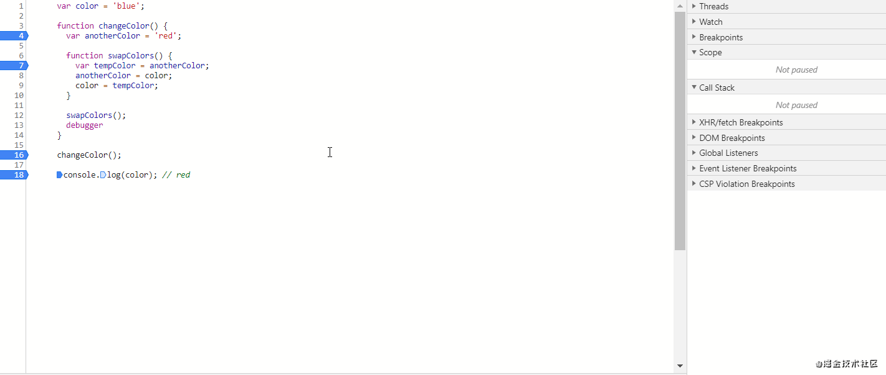

图解： 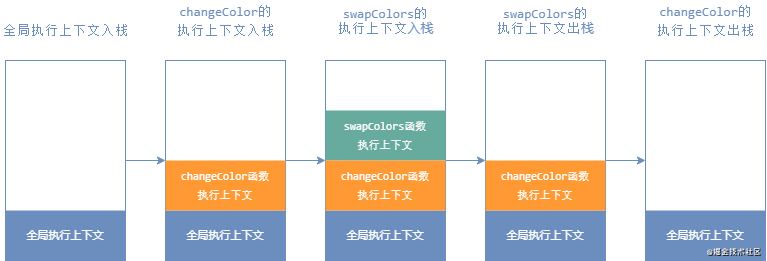

执行过程：

1. 首先创建了`全局执行上下文`，压入执行栈，其中的可执行代码开始执行。
2. 然后调用 `changeColor` 函数，JS引擎停止执行全局执行上下文，激活函数 `changeColor` 创建它自己的执行上下文，且把该函数上下文放入执行上下文栈顶，其中的可执行代码开始执行。
3. `changeColor` 调用了 `swapColors` 函数，此时暂停了 `changeColor` 的执行上下文，创建了 `swapColors` 函数的新执行上下文，且把该函数执行上下文放入执行上下文栈顶。
4. 当 `swapColors` 函数执行完后，其执行上下文从栈顶出栈，回到了 `changeColor` 执行上下文中继续执行。
5. `changeColor` 没有可执行代码，也没有再遇到其他执行上下文了，将其执行上下文从栈顶出栈，回到了 `全局执行上下文` 中继续执行。
6. 一旦所有代码执行完毕，JS引擎将从当前栈中移除 `全局执行上下文`。

```!
注意：函数中，遇到return能直接终止可执行代码的执行，因此会直接将当前上下文弹出栈。
复制代码
```

使用 `ECStack` 来模拟调用栈：

```js
ECStack=[]
复制代码
```

JS第一次执行代码时就会遇到全局代码，执行上下文栈会压入一个全局上下文，我们用 `globalContext` 表示它，只有当整个应用程序结束的时候，`ECStack` 才会被清空，所以 `ECStack` 最底部永远有个 `globalContext`：

```js
ECStack.push(globalContext)
复制代码
```

使用伪代码模拟上述代码行为：

```js
ECStack.push(<changeColor> functionContext);
ECStack.push(<swapColors> functionContext);

// swapColors出栈
ECStack.pop();
// changeColor出栈
ECStack.pop();
复制代码
```

为了巩固一下执行上下文的理解，我们再来绘制一个例子的演变过程，这是一个简单的闭包例子。

```js
function f1() {
  var n = 999;
  function f2() {
    console.log(n);
  }
  return f2;
}
f1()() // 999
复制代码
```

使用伪代码模拟上述代码行为：

```js
ECStack.push(<f1> functionContext);
// f1出栈
ECStack.pop();

ECStack.push(<f2> functionContext);
// f2出栈
ECStack.pop();
复制代码
```

因为f1中的函数f2在f1的可执行代码中，并没有被调用执行，因此执行f1时，f2不会创建新的上下文，而直到f2执行时，才创建了一个新的。具体演变过程如下。

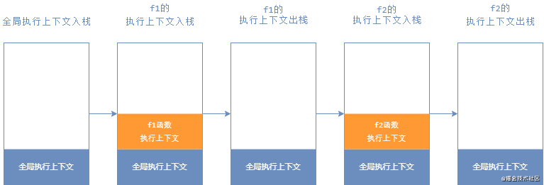

## es3版本

es3版本执行上下文内有三个重要属性：

- 变量对象 VO（variable object）
- 作用域链（scope chain）
- this

可以将每个执行上下文抽象为一个对象。

执行上下文的组成代码示例：

```js
executionContextObj = {
  scopeChain: { /* 变量对象（variableObject）+ 所有父执行上下文的变量对象*/ },
  [variableObject | activationObject]: {
    /*函数 arguments/参数，内部变量和函数声明 */
    arguments,
    ...
  },
  this: {}
}
复制代码
```

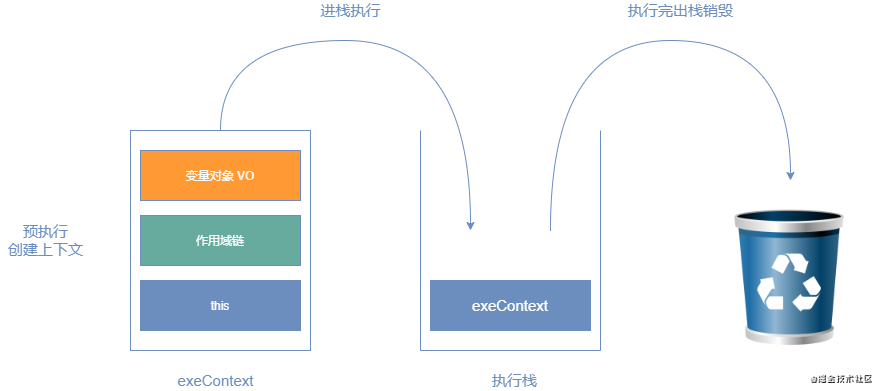

### 变量对象

**变量对象** 是与执行上下文相联的数据作用域，用来存储上下文中定义的变量和函数声明。

不同执行上下文中的变量对象也不一样：

- **全局上下文** 中的变量对象就是全局对象，在浏览器中就是 window 对象。在顶层 JavaScript 代码中，可以用关键字 this 引用全局对象。所有的全局变量和函数都是作为 window 的属性和方法存在。

```js
    console.log(this) //window
    var a=1 //挂到window上的属性
    console.log(window.a) //1
    console.log(this.a) //1
复制代码
```

- **函数执行上下文** 中我们用**活动对象 AO (activation object)** 来表示变量对象，因为变量对象是规范上的或者说是引擎实现上的，在 JavaScript 环境中是不能被直接访问的，只有当函数被调用时，变量对象被激活为活动对象时，我们才能访问到其中的属性和方法。

```!
  活动对象就是变量对象，只不过处于不同的状态和阶段而已。
复制代码
```

### 作用域链

对于 `JavaScript` 来说作用域及作用域链的变量查询是通过存储在浏览器内存中的执行上下文实现的。当查找变量时，首先从当前上下文中的变量对象查找，如果没有就会往上查找父级作用域中的变量对象，最终找到全局上下文的变量对象，如果没有就报错。这样由多个执行上下文的变量对象构成的链表就叫做**作用域链**。

关于作用域和作用域链可以参考我的另一篇文章： [掌握JavaScript面试：什么是闭包？](https://juejin.cn/post/6874829017006997511#heading-1)

那么有同学就有疑问了，作用域和执行上下文有什么 **区别** 呢 🎉：

函数执行上下文是在调用函数时, 函数体代码执行之前创建，函数调用结束时就会自动释放。因为不同的调用可能有不同的参数：

```js
var a = 10;
function fn(x) {
  var a = 20;
  console.log(arguments)
  console.log(x)
}
fn(20)
fn(10) // 不同的调用可能有不同的参数
复制代码
```

而JavaScript采用的是词法作用域，fn 函数创建的作用域在函数定义时就已经确定了；


**关联 🎉**：

作用域只是一个“地盘”，其中没有变量，要通过作用域对应的执行上下文环境来获取变量的值，所以作用域是静态观念的，而执行上下文环境是动态的。也就是说，作用域只是用于划分你在这个作用域里面定义的变量的有效范围，出了这个作用域就无效。

同一个作用域下，对同一个函数的不同的调用会产生不同的执行上下文环境，继而产生不同的变量的值，所以，作用域中变量的值是在执行过程中确定的，而作用域是在函数创建时就确定的。

### 生命周期

执行上下文的生命周期有三个阶段，分别是：

- 创建阶段
  - 生成变量对象
    - 创建arguments
    - 扫描函数声明
    - 扫描变量声明
  - 建立作用域链
  - 确定this的指向
- 执行阶段
  - 变量赋值
  - 函数的引用
  - 执行其他代码
- 销毁阶段

#### 创建阶段

**生成变量对象 🎉**

1. 创建arguments：如果是函数上下文，首先会创建 `arguments` 对象，给变量对象添加形参名称和值。
2. 扫描函数声明：对于找到的函数声明，将函数名和函数引用（指针）存入 `VO` 中，如果 `VO` 中已经有同名函数，那么就进行覆盖（重写引用指针）。
3. 扫描变量声明：对于找到的每个变量声明，将变量名存入 `VO` 中，并且将变量的值初始化为`undefined` 。如果变量的名字已经在变量对象里存在，不会进行任何操作并继续扫描。

让我们举一个栗子来说明 🌰：

```js
function person(age) {
  console.log(typeof name); // function
  console.log(typeof getName); // undefined
  var name = 'abby';
  var hobby = 'game';
  var getName = function getName() {
    return 'Lucky';
  };
  function name() {
    return 'Abby';
  }
  function getAge() {
    return age;
  }
  console.log(typeof name); // string
  console.log(typeof getName); // function
  name = function () {};
  console.log(typeof name); // function
}
person(20);
复制代码
```

在调用person(20)的时候，但是代码还没执行的时候，创建的状态是这样:

```js
personContext = {
    scopeChain: { ... },
    activationObject: {
        arguments: {
            0: 20,
            length: 1
        },
        age: 20,
        name: pointer, // reference to function name(),
        getAge: pointer, // reference to function getAge(),
        hobby: undefined,
        getName : undefined,
    },
    this: { ... }
}
复制代码
```

函数在执行之前，会先创建一个函数执行上下文，首先是指出函数的引用，然后按顺序对变量进行定义，初始化为 `undefined`存入到 `VO` 之中，在扫描到变量 `name` 时发现在 `VO` 之中存在同名的属性（函数声明变量），因此忽略。

```!
全局执行上下文的创建没有创建 arguments 这一步
复制代码
```

**建立作用域链 🎉**

在执行期上下文的创建阶段，作用域链是在变量对象之后创建的。作用域链本身包含变量对象。

1. 当书写一段函数代码时，就会创建一个词法作用域，这个作用域是函数内部的属性，我们用`[[scope]]`表示，它里面保存父变量对象，所以`[[scope]]`就是一条层级链。

```js
person.[[scope]] = [
     globalContext.variableObject
]
复制代码
```

1. 当函数调用，就意味着函数被激活了，此时创建函数上下文并压入执行栈，然后复制函数 [[scope]] 属性创建作用域链：

```js
personContext = {
     scopeChain:person.[[scope]]
}
复制代码
```

1. 创建活动对象（前面的生成变量对象步骤），然后将活动对象(AO)推到作用域链的前端。

```js
personContext = {
    activationObject: {
        arguments: {
            0: 20,
            length: 1
        },
        age: 20,
        name: pointer, // reference to function name(),
        getAge: pointer, // reference to function getAge(),
        hobby: undefined,
        getName : undefined,
    },
    scopeChain:[activationObject,[[scope]]]
}
复制代码
```

**确定this的指向 🎉**

如果当前函数被作为对象方法调用或使用 `bind`、`call`、`apply` 等 `API` 进行委托调用，则将当前代码块的调用者信息（this value）存入当前执行上下文，否则默认为全局对象调用。

关于其中this的执行问题可以参考我的另一篇文章： [解锁this、apply、call、bind新姿势🍊](https://juejin.cn/post/6869943642325254158)

#### 执行阶段

> **执行阶段** 中，执行流进入函数并且在上下文中运行/解释代码，JS 引擎开始对定义的变量赋值、开始顺着作用域链访问变量、如果内部有函数调用就创建一个新的执行上下文压入执行栈并把控制权交出

**此时代码从上到下执行的时候激活阶段的过程是:**

1. 第一次执行 `console.log`; 此时 `name` 在 `VO` 中是函数。`getName` 未指定值在 `VO` 中的值是 `undefined`。
2. 执行到赋值代码，`getName` 被赋值成函数表达式，`name` 被赋值为 `abby`
3. 第二次执行 `console.log`; 此时的 `name` 由于函数被字符串赋值覆盖因此是 `string` 类型`getName` 是 `function` 类型。
4. 第三次执行 `console.log`; 此时的 `name` 由于又被覆盖因此是 `function` 类型

因此理解执行上下文之后很好解释了变量提升（Hoisting）：实际上变量和函数声明在代码里的位置是不会改变的，而是在编译阶段被JavaScript引擎放入内存中

这就解释了为什么我们能在 `name` 声明之前访问它，为什么之后的 `name` 的类型值发生了变化，为什么 `getName` 第一次打印的时候是 `undefined` 等等问题了。

✨ ES6 引入了 `let` 和 `const` 关键字，从而使 JavaScript 也能像其他语言一样拥有了块级作用域，很好解决了变量提升带来的一系列问题。

**最后执行 console 时候的函数执行上下文：**

```js
personContext = {
    scopeChain: { ... },
    activationObject: {
        arguments: {
            0: 20,
            length: 1
        },
        age: 20,
        name: pointer, // reference to function name(),
        getAge: pointer, // reference to function getAge(),
        hobby: 'game',
        getName:pointer, pointer to function getName(),
    },
    this: { ... }
}
复制代码
```

#### 销毁阶段

一般来讲当函数执行完成后，当前执行上下文（局部环境）会被弹出执行上下文栈并且等待虚拟机回收，控制权被重新交给执行栈上一层的执行上下文。

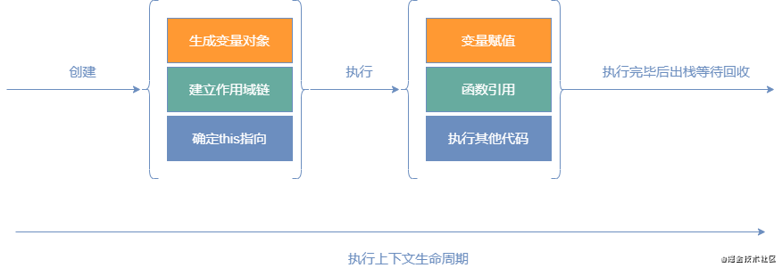

### 完整示例

**示例一**🌰：

```js
var scope = "global scope";
function checkscope(){
    var scope = "local scope";
    function f(){
        return scope;
    }
    return f();
}
checkscope();
复制代码
```

1、执行全局代码，生成全局上下文，并且压入执行栈

```js
ECStack=[
     globalContext
]
复制代码
```

2、全局上下文初始化

```js
globalContext={
     variableObject:[global,scope,checkscope],
     this:globalContext.variableObject,
     scopeChain:[globalContext.variableObject]
}
复制代码
```

3、创建 checkscope 函数时生成内部属性 [[scope]],并将全局上下文作用域链存入其中

```js
checkscope.[[scope]] = [
     globalContext.variableObject
]
复制代码
```

4、调用 checkscope 函数，创建函数上下文，压栈

```js
ECStack=[
     globalContext,
     checkscopeContext
]
复制代码
```

5、此时 checkscope 函数还未执行，进入执行上下文

- 复制函数 [[scope]] 属性创建作用域链
- 用 arguments 属性创建活动对象
- 初始化变量对象，加入变量声明、函数声明、形参
- 活动对象压入作用域链顶端

```js
    checkscopeContext = {
        activationObject: {
            arguments: {
                length: 0
            },
            scope: undefined,
            f: pointer, // reference to function f(),
        },
        scopeChain: [activationObject, globalContext.variableObject],
        this: undefined
    }
复制代码
```

6、checkscope 函数执行，对变量 scope 设值

```js
    checkscopeContext = {
        activationObject: {
            arguments: {
                length: 0
            },
            scope: 'local scope',
            f: pointer, // reference to function f(),
        },
        scopeChain: [activationObject, globalContext.variableObject],
        this: undefined
    }
复制代码
```

f 函数被创建生成 [[scope]] 属性，并保存父作用域的作用域链

```js
f.[[scope]]=[
     checkscopeContext.activationObject,
     globalContext.variableObject
]
复制代码
```

7、f 函数调用，生成 f 函数上下文，压栈

```js
ECStack=[
     globalContext,
     checkscopeContext,
     fContext
] 
复制代码
```

8、此时 f 函数还未执行，初始化执行上下文

- 复制函数 [[scope]] 属性创建作用域链
- 用 arguments 属性创建活动对象
- 初始化变量对象，加入变量声明、函数声明、形参
- 活动对象压入作用域链顶端

```js
fContext = {
     activationObject: {
            arguments: {
                length: 0
            },
        },
        scopeChain: [fContext.activationObject, checkscopeContext.activationObject, globalContext.variableObject],
        this: undefined
    }
复制代码
```

9、f 函数执行，沿着作用域链查找 scope 值，返回 scope 值

10、f 函数执行完毕，f函数上下文从执行上下文栈中弹出

```js
ECStack=[
     globalContext,
     checkscopeContext
]
复制代码
```

11、checkscope 函数执行完毕，checkscope 执行上下文从执行上下文栈中弹出

```js
ECStack=[
     globalContext
]
复制代码
```

**示例二**🌰：

```js
var scope = "global scope";
function checkscope(){
    var scope = "local scope";
    function f(){
        return scope;
    }
    return f;
}
checkscope()();
复制代码
```

1. 执行全局代码，生成全局上下文，并且压入执行栈

2. 全局上下文初始化

3. 创建 `checkscope` 函数时生成内部属性 `[[scope]]`,并将全局上下文作用域链存入其中

4. 调用 `checkscope` 函数，创建函数上下文，压栈

5. 此时

    

   ```
   checkscope
   ```

    

   函数还未执行，进入执行上下文

   - 复制函数 `[[scope]]` 属性创建作用域链
   - 用 `arguments` 属性创建活动对象
   - 初始化变量对象，加入变量声明、函数声明、形参
   - 活动对象压入作用域链顶端

6. `checkscope` 函数执行，对变量 `scope` 设值，`f` 函数被创建生成 `[[scope]]` 属性，并保存父作用域的作用域链

7. 返回函数f，此时 checkscope 函数执行完成，弹栈

8. `f` 函数调用，生成 `f` 函数上下文，压栈

9. 此时

    

   ```
   f
   ```

    

   函数还未执行，初始化执行上下文

   - 复制函数 `[[scope]]` 属性创建作用域链
   - 用 `arguments` 属性创建活动对象
   - 初始化变量对象，加入变量声明、函数声明、形参
   - 活动对象压入作用域链顶端

10. `f` 函数执行，沿着作用域链查找 `scope` 值，返回 `scope` 值

11. `f` 函数执行完毕，`f` 函数上下文从执行上下文栈中弹出

🚀 可以看到和前面唯一的区别就是 `checkScope` 函数执行完先出栈了，之后再执行 `f` 函数，步骤与示例一一致

```js
fContext = {
    scopeChain: [activationObject, checkscopeContext.activationObject, globalContext.variableObject],
}
复制代码
```

✨这里在 `checkscopeContext` 函数执行完销毁后，`f` 函数依然可以读取到 `checkscopeContext.AO` 的值，也就是说 `checkscopeContext.AO` 依然活在内存中，`f` 函数依然可以通过 `f` 函数的作用域链找到它。而为什么 `checkscopeContext.AO` 没有被销毁，正是因为 `f` 函数引用了 `checkscopeContext.AO` 中的值，又正是因为JS实现了在子上下文引用父上下文的变量的时候，不会销毁这些变量的效果实现了**闭包** 这个概念！

## es5版本

ES5 规范去除了 ES3 中变量对象和活动对象，以 词法环境组件（ LexicalEnvironment component） 和 变量环境组件（ VariableEnvironment component） 替代。

### 生命周期

es5 执行上下文的生命周期也包括三个阶段：创建阶段 → 执行阶段 → 回收阶段

#### 创建阶段

创建阶段做了三件事：

1. 确定 this 的值，也被称为 This Binding
2. LexicalEnvironment（词法环境） 组件被创建
3. VariableEnvironment（变量环境） 组件被创建

伪代码大概如下：

```js
ExecutionContext = {  
  ThisBinding = <this value>,     // 确定this 
  LexicalEnvironment = { ... },   // 词法环境
  VariableEnvironment = { ... },  // 变量环境
}
复制代码
```

##### This Binding

`ThisBinding` 是和执行上下文绑定的，也就是说每个执行上下文中都有一个 `this`，与 `es3` 的`this` 并没有什么区别，`this` 的值是在执行的时候才能确认，定义的时候不能确认

##### 创建词法环境

词法环境的结构如下：

```js
GlobalExectionContext = {  // 全局执行上下文
  LexicalEnvironment: {       // 词法环境
    EnvironmentRecord: {     // 环境记录
      Type: "Object",           // 全局环境
      // 标识符绑定在这里 
      outer: <null>           // 对外部环境的引用
  }  
}
 
FunctionExectionContext = { // 函数执行上下文
  LexicalEnvironment: {     // 词法环境
    EnvironmentRecord: {    // 环境记录
      Type: "Declarative",      // 函数环境
      // 标识符绑定在这里      // 对外部环境的引用
      outer: <Global or outer function environment reference>  
  }  
}
复制代码
```

可以看到词法环境有两种类型 👇：

- **全局环境**：是一个没有外部环境的词法环境，其外部环境引用为 `null`。拥有一个全局对象（window 对象）及其关联的方法和属性（例如数组方法）以及任何用户自定义的全局变量，`this` 的值指向这个全局对象。
- **函数环境**：用户在函数中定义的变量被存储在环境记录中，包含了 `arguments` 对象。对外部环境的引用可以是全局环境，也可以是包含内部函数的外部函数环境。

词法环境有两个组件 👇：

- **环境记录器** ：存储变量和函数声明的实际位置。
- **外部环境的引用** ：它指向作用域链的下一个对象，可以访问其父级词法环境（作用域），作用与 es3 的作用域链相似

环境记录器也有两种类型 👇：

- 在函数环境中使用 **声明式环境记录器**，用来存储变量、函数和参数。
- 在全局环境中使用 **对象环境记录器**，用来定义出现在全局上下文中的变量和函数的关系。

🎉 因此：

- 创建全局上下文的词法环境使用 **对象环境记录器** ,`outer` 值为 `null`;
- 创建函数上下文的词法环境时使用 **声明式环境记录器** ,`outer` 值为全局对象，或者为父级词法环境（作用域）

##### 创建变量环境

变量环境也是一个词法环境，因此它具有上面定义的词法环境的所有属性。

在 ES6 中，词法环境和 变量环境的区别在于前者用于存储函数声明和变量（ `let`和`const`关键字）绑定，而后者仅用于存储变量（ `var` ）绑定，因此变量环境实现函数级作用域，通过词法环境在函数作用域的基础上实现块级作用域。

🚨 使用 `let` / `const` 声明的全局变量，会被绑定到 `Script` 对象而不是 `Window` 对象，不能以`Window.xx` 的形式使用；使用 `var` 声明的全局变量会被绑定到 `Window` 对象；使用 `var` / `let` / `const` 声明的局部变量都会被绑定到 `Local` 对象。注：`Script` 对象、`Window` 对象、`Local` 对象三者是平行并列关系。

```!
箭头函数没有自己的上下文，没有arguments，也不存在变量提升
复制代码
```

使用例子进行介绍

```js
let a = 20;  
const b = 30;  
var c;

function multiply(e, f) {  
 var g = 20;  
 return e * f * g;  
}

c = multiply(20, 30);
复制代码
```

遇到调用函数 `multiply` 时，函数执行上下文开始被创建：

```js
GlobalExectionContext = {

  ThisBinding: <Global Object>,

  LexicalEnvironment: {  
    EnvironmentRecord: {  
      Type: "Object",  
      // 标识符绑定在这里  
      a: < uninitialized >,  
      b: < uninitialized >,  
      multiply: < func >  
    }  
    outer: <null>  
  },

  VariableEnvironment: {  
    EnvironmentRecord: {  
      Type: "Object",  
      // 标识符绑定在这里  
      c: undefined,  
    }  
    outer: <null>  
  }  
}

FunctionExectionContext = {  
   
  ThisBinding: <Global Object>,

  LexicalEnvironment: {  
    EnvironmentRecord: {  
      Type: "Declarative",  
      // 标识符绑定在这里  
      Arguments: {0: 20, 1: 30, length: 2},  
    },  
    outer: <GlobalLexicalEnvironment>  
  },

  VariableEnvironment: {  
    EnvironmentRecord: {  
      Type: "Declarative",  
      // 标识符绑定在这里  
      g: undefined  
    },  
    outer: <GlobalLexicalEnvironment>  
  }  
}
复制代码
```

变量提升的原因：在创建阶段，函数声明存储在环境中，而变量会被设置为 `undefined`（在 var 的情况下）或保持未初始化 `uninitialized`（在 let 和 const 的情况下）。所以这就是为什么可以在声明之前访问 var 定义的变量（尽管是 undefined ），但如果在声明之前访问 let 和 const 定义的变量就会提示引用错误的原因。这就是所谓的变量提升。

**图解变量提升：**

```js
var myname = "极客时间"
function showName(){
  console.log(myname);
  if(0){
   var myname = "极客邦"
  }
  console.log(myname);
}
showName()
复制代码
```

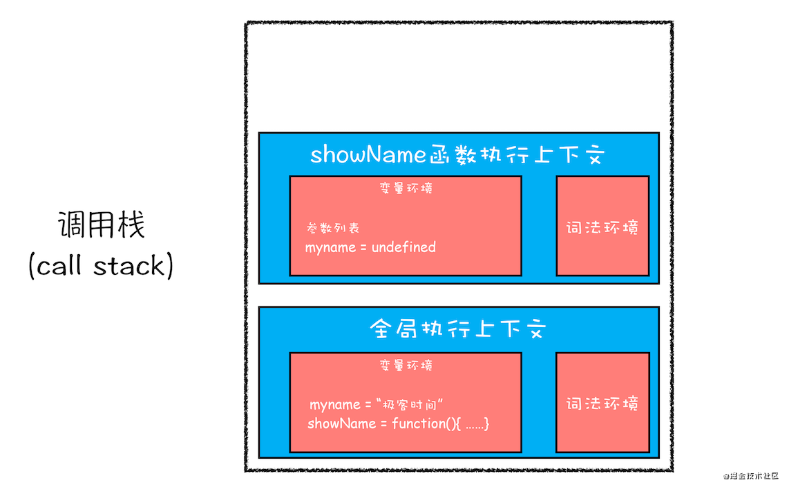

在 showName 内部查找 myname 时会先使用当前函数执行上下文里面的变量 myname ，由于`变量提升`，当前的执行上下文中就包含了变量 myname，而值是 undefined，所以获取到的 myname 的值就是 undefined。

#### 执行阶段

在此阶段，完成对所有这些变量的分配，最后执行代码，如果 `JavaScript` 引擎不能在源码中声明的实际位置找到 `let` 变量的值，它会被赋值为 `undefined`

#### 回收阶段

执行上下文出栈等待虚拟机回收执行上下文

#### 过程总结

1. **创建阶段** 首先创建全局上下文的词法环境：首先创建 `对象环境记录器`，接着创建他的外部环境引用 `outer`，值为 null
2. 创建全局上下文的变量环境：过程同上
3. 确定 this 值为全局对象（以浏览器为例，就是 window ）
4. 函数被调用，创建函数上下文的词法环境：首先创建 `声明式环境记录器`，接着创建他的外部环境引用 `outer`，值为 null，值为全局对象，或者为父级词法环境
5. 创建函数上下文的变量环境：过程同上
6. 确定 this 值
7. 进入函数执行上下文的 **执行阶段**
8. 执行完成后进入 **回收阶段**

### 实例讲解

将词法环境中 `outer` 抽离出来，执行上下文结构如下： 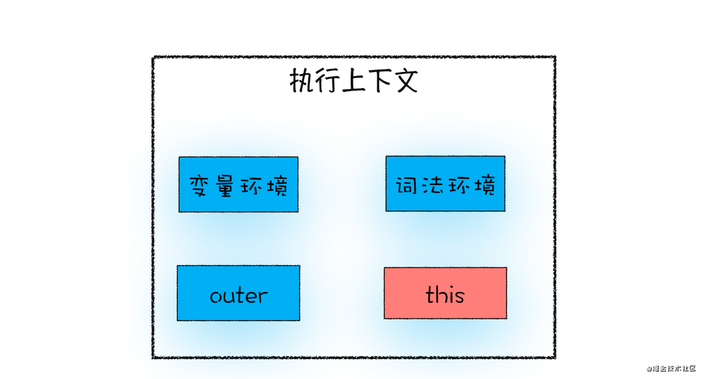

下面我们以如下示例来分析执行上下文的创建及执行过程：

```js
function foo(){
  var a = 1
  let b = 2
  {
    let b = 3
    var c = 4
    let d = 5
    console.log(a)
    console.log(b)
  }
  console.log(b) 
  console.log(c)
  console.log(d)
}   
foo()
复制代码
```

**第一步：** 调用 `foo` 函数前先编译并创建执行上下文，在编译阶段将 `var` 声明的变量存放到变量环境中，`let` 声明的变量存放到词法环境中，需要注意的是此时在函数体内部块作用域中 `let` 声明的变量不会被存放到词法环境中，如下图所示 👇：

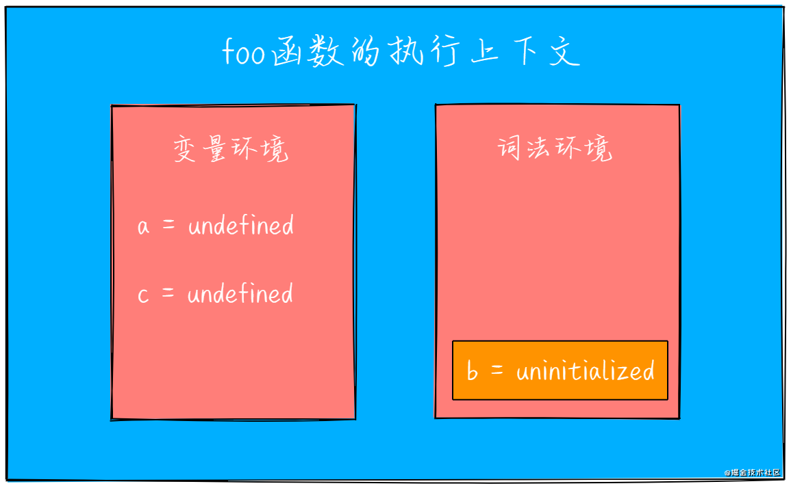

**第二步：** 继续执行代码，当执行到代码块里面时，变量环境中的 a 的值已经被设置为1，词法环境中 b 的值已经被设置成了2，此时函数的执行上下文如图所示：

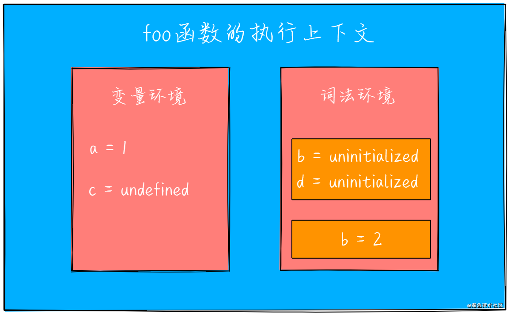

从图中就可以看出，当进入函数的作用域块时，作用域块中通过 `let` 声明的变量，会被存放在词法环境的一个单独的区域中，这个区域中的变量并不影响作用域块外面的变量，因此示例中在函数体内块作用域中声明的变量的 b 与函数作用域中声明的变量 b 都是独立的存在。

在词法环境内部，实际上维护了一个小型栈结构，栈底是函数最外层的变量，进入一个作用域块后，就会把该作用域内部的变量压到栈顶；当该块级作用域执行完成之后，该作用域的信息就会从栈顶弹出，这就是词法环境的结构。

**第三步：** 当代码执行到作用域块中的 `console.log(a)` 时，就需要在词法环境和变量环境中查找变量 a 的值了，具体查找方式是：沿着词法环境的栈顶向下查询，如果在词法环境中的某个块中查找到了，就直接返回给 JavaScript 引擎，如果没有查找到，那么继续在变量环境中查找。

这样一个变量查找过程就完成了，你可以参考下图：

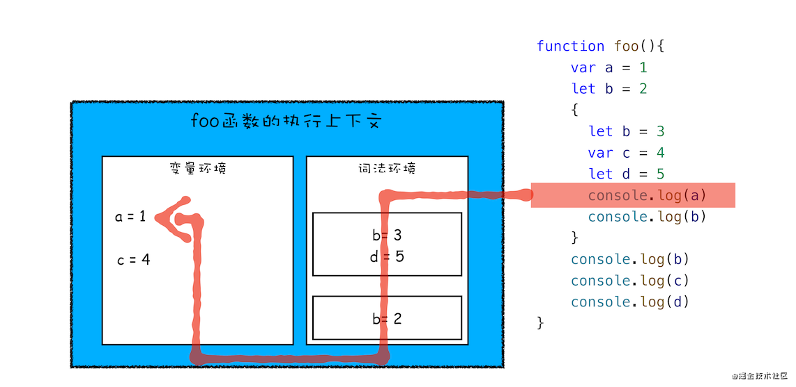

**第四步：** 当函数体内块作用域执行结束之后，其内部变量就会从词法环境的栈顶弹出，此时执行上下文如下图所示：

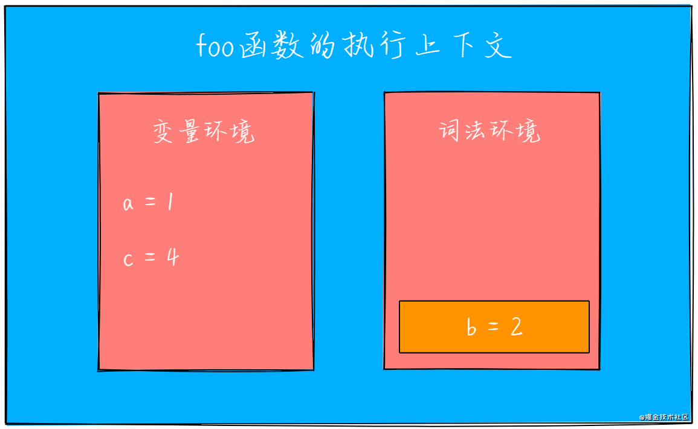

**第五步：** 当foo函数执行完毕后执行栈将foo函数的执行上下文弹出。

所以，块级作用域就是通过词法环境的栈结构来实现的，而变量提升是通过变量环境来实现，通过这两者的结合，JavaScript 引擎也就同时支持了变量提升和块级作用域了。

### outer引用

> **outer** 是一个外部引用，用来指向外部的执行上下文，其是由词法作用域指定的

```js
function bar() {
  console.log(myName)
}
function foo() {
  var myName = " 极客邦 "
  bar()
}
var myName = " 极客时间 "
foo()
复制代码
```

当一段代码使用了一个变量时，JavaScript 引擎首先会在“当前的执行上下文”中查找该变量， 比如上面那段代码在查找 myName 变量时，如果在当前的变量环境中没有查找到，那么 JavaScript 引擎会继续在 outer 所指向的执行上下文中查找。为了直观理解，你可以看下面这张图：

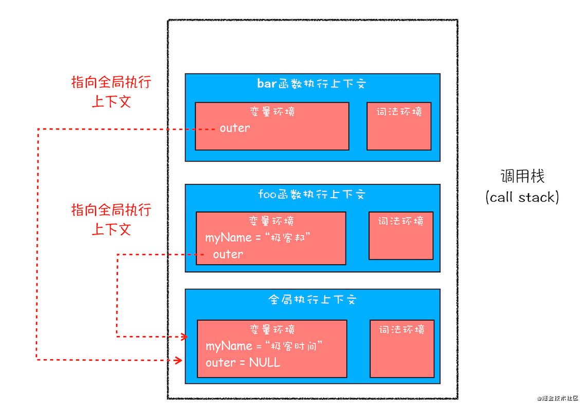

从图中可以看出，bar 函数和 foo 函数的 outer 都是指向全局上下文的，这也就意味着如果在 bar 函数或者 foo 函数中使用了外部变量，那么 JavaScript 引擎会去全局执行上下文中查找。我们把这个查找的链条就称为作用域链。 现在你知道变量是通过作用域链来查找的了，不过还有一个疑问没有解开，foo 函数调用的 bar 函数，那为什么 bar 函数的外部引用是全局执行上下文，而不是 foo 函数的执行上下文？

> 这是因为在 JavaScript 执行过程中，其作用域链是由词法作用域决定的。词法作用域指作用域是由代码中函数声明的位置来决定的,因此是静态的作用域

结合变量环境、词法环境以及作用域链，我们看下下面的代码：

```js
function bar() {
  var myName = " 极客世界 "
  let test1 = 100
  if (1) {
    let myName = "Chrome 浏览器 "
    console.log(test)
  }
}
function foo() {
  var myName = " 极客邦 "
  let test = 2
  {
    let test = 3
    bar()
  }
}
var myName = " 极客时间 "
let myAge = 10
let test = 1
foo()
复制代码
```

对于上面这段代码，当执行到 bar 函数内部的 if 语句块时，其调用栈的情况如下图所示：

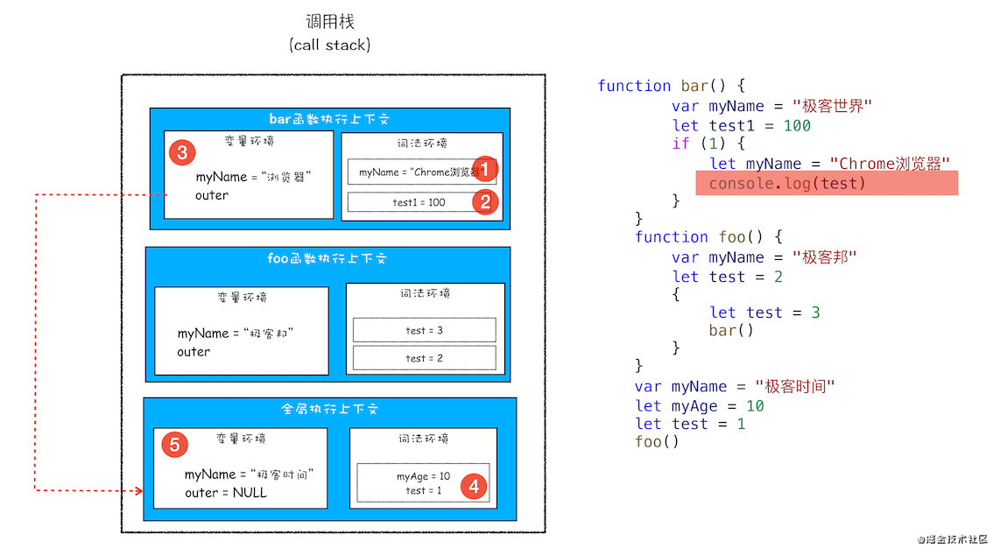

解释下这个过程。首先是在 bar 函数的执行上下文中查找，但因为 bar 函数的执行上下文中没有定义 test 变量，所以根据词法作用域的规则，下一步就在 bar 函数的外部作用域中查找，也就是全局作用域。

## 参考

- [JavaScript 执行上下文解析](https://juejin.cn/post/6935339455184109582#heading-2)
- [[译\] 理解 JavaScript 中的执行上下文和执行栈](https://juejin.cn/post/6844903682283143181#heading-8)
- [执行上下文详细图解](https://www.jianshu.com/p/a6d37c77e8db)
- [聊一聊执行上下文](https://juejin.cn/post/6924568666608992264#heading-6)