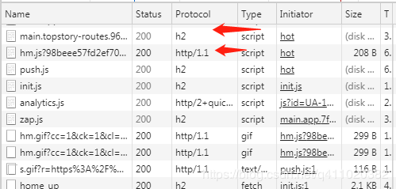
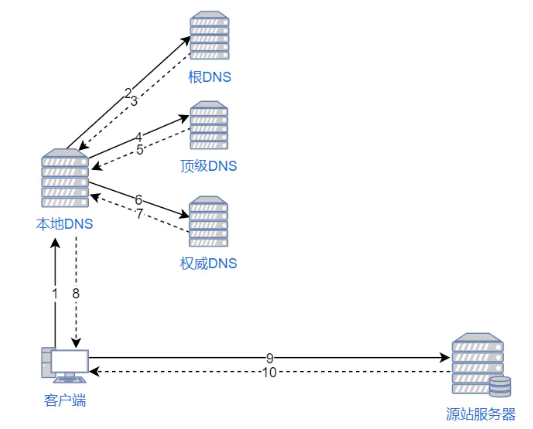
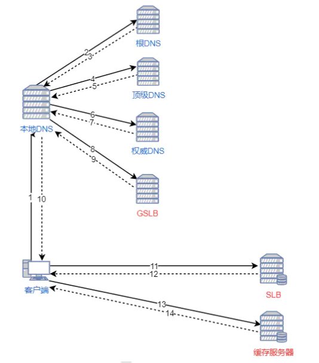
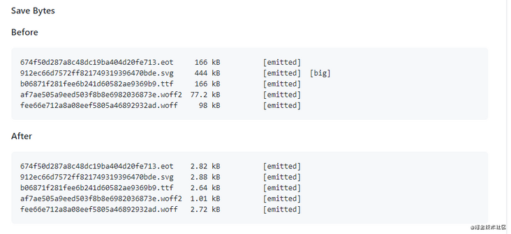
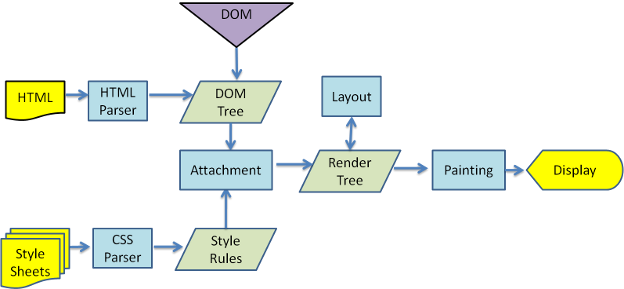
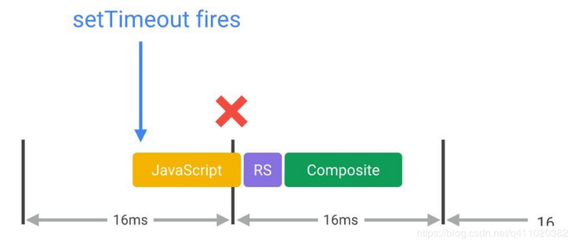
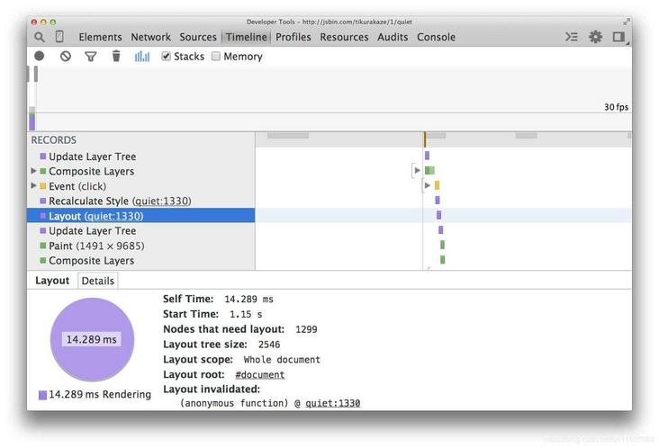
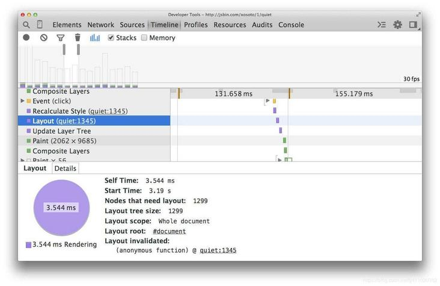
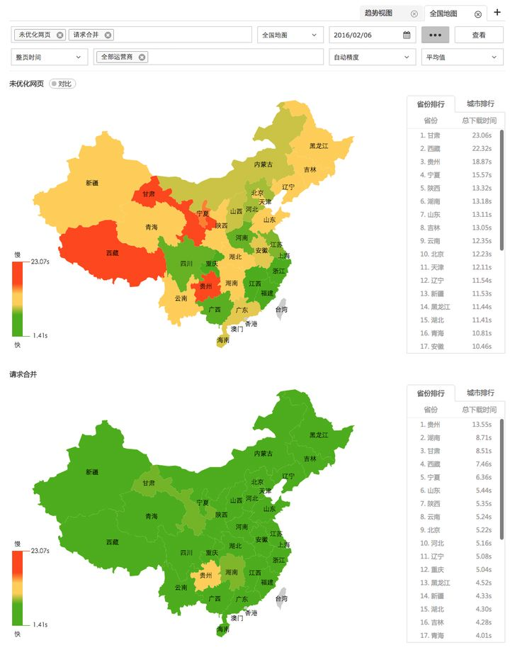
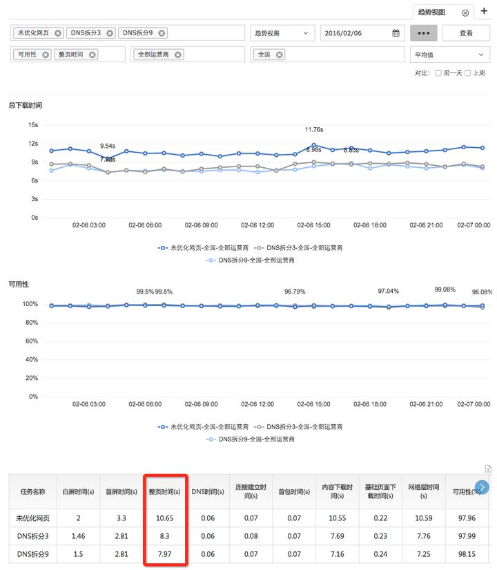

# [前端性能优化 24 条建议（2020）](https://segmentfault.com/a/1190000022205291)

[**谭光志**](https://segmentfault.com/u/woai3c)发布于 2020-03-30

性能优化是把双刃剑，有好的一面也有坏的一面。好的一面就是能提升网站性能，坏的一面就是配置麻烦，或者要遵守的规则太多。并且某些性能优化规则并不适用所有场景，需要谨慎使用，请读者带着批判性的眼光来阅读本文。

本文相关的优化建议的引用资料出处均会在建议后面给出，或者放在文末。

### 1. 减少 HTTP 请求

一个完整的 HTTP 请求需要经历 DNS 查找，TCP 握手，浏览器发出 HTTP 请求，服务器接收请求，服务器处理请求并发回响应，浏览器接收响应等过程。接下来看一个具体的例子帮助理解 HTTP ：


这是一个 HTTP 请求，请求的文件大小为 28.4KB。

名词解释：

- Queueing: 在请求队列中的时间。
- Stalled: 从TCP 连接建立完成，到真正可以传输数据之间的时间差，此时间包括代理协商时间。
- Proxy negotiation: 与代理服务器连接进行协商所花费的时间。
- DNS Lookup: 执行DNS查找所花费的时间，页面上的每个不同的域都需要进行DNS查找。
- Initial Connection / Connecting: 建立连接所花费的时间，包括TCP握手/重试和协商SSL。
- SSL: 完成SSL握手所花费的时间。
- Request sent: 发出网络请求所花费的时间，通常为一毫秒的时间。
- Waiting(TFFB): TFFB 是发出页面请求到接收到应答数据第一个字节的时间。
- Content Download: 接收响应数据所花费的时间。

从这个例子可以看出，真正下载数据的时间占比为 `13.05 / 204.16 = 6.39%`，文件越小，这个比例越小，文件越大，比例就越高。这就是为什么要建议将多个小文件合并为一个大文件，从而减少 HTTP 请求次数的原因。

参考资料：

- [understanding-resource-timing](https://developers.google.com/web/tools/chrome-devtools/network/understanding-resource-timing)

### 2. 使用 HTTP2

HTTP2 相比 HTTP1.1 有如下几个优点：

#### 解析速度快

服务器解析 HTTP1.1 的请求时，必须不断地读入字节，直到遇到分隔符 CRLF 为止。而解析 HTTP2 的请求就不用这么麻烦，因为 HTTP2 是基于帧的协议，每个帧都有表示帧长度的字段。

#### 多路复用

HTTP1.1 如果要同时发起多个请求，就得建立多个 TCP 连接，因为一个 TCP 连接同时只能处理一个 HTTP1.1 的请求。

在 HTTP2 上，多个请求可以共用一个 TCP 连接，这称为多路复用。同一个请求和响应用一个流来表示，并有唯一的流 ID 来标识。
多个请求和响应在 TCP 连接中可以乱序发送，到达目的地后再通过流 ID 重新组建。

#### 首部压缩

HTTP2 提供了首部压缩功能。

例如有如下两个请求：

```
:authority: unpkg.zhimg.com
:method: GET
:path: /za-js-sdk@2.16.0/dist/zap.js
:scheme: https
accept: */*
accept-encoding: gzip, deflate, br
accept-language: zh-CN,zh;q=0.9
cache-control: no-cache
pragma: no-cache
referer: https://www.zhihu.com/
sec-fetch-dest: script
sec-fetch-mode: no-cors
sec-fetch-site: cross-site
user-agent: Mozilla/5.0 (Windows NT 6.1; Win64; x64) AppleWebKit/537.36 (KHTML, like Gecko) Chrome/80.0.3987.122 Safari/537.36
:authority: zz.bdstatic.com
:method: GET
:path: /linksubmit/push.js
:scheme: https
accept: */*
accept-encoding: gzip, deflate, br
accept-language: zh-CN,zh;q=0.9
cache-control: no-cache
pragma: no-cache
referer: https://www.zhihu.com/
sec-fetch-dest: script
sec-fetch-mode: no-cors
sec-fetch-site: cross-site
user-agent: Mozilla/5.0 (Windows NT 6.1; Win64; x64) AppleWebKit/537.36 (KHTML, like Gecko) Chrome/80.0.3987.122 Safari/537.36
```

从上面两个请求可以看出来，有很多数据都是重复的。如果可以把相同的首部存储起来，仅发送它们之间不同的部分，就可以节省不少的流量，加快请求的时间。

HTTP/2 在客户端和服务器端使用“首部表”来跟踪和存储之前发送的键－值对，对于相同的数据，不再通过每次请求和响应发送。

下面再来看一个简化的例子，假设客户端按顺序发送如下请求首部：

```
Header1:foo
Header2:bar
Header3:bat
```

当客户端发送请求时，它会根据首部值创建一张表：

| 索引 | 首部名称 | 值   |
| ---- | -------- | ---- |
| 62   | Header1  | foo  |
| 63   | Header2  | bar  |
| 64   | Header3  | bat  |

如果服务器收到了请求，它会照样创建一张表。
当客户端发送下一个请求的时候，如果首部相同，它可以直接发送这样的首部块：

```
62 63 64
```

服务器会查找先前建立的表格，并把这些数字还原成索引对应的完整首部。

#### 优先级

HTTP2 可以对比较紧急的请求设置一个较高的优先级，服务器在收到这样的请求后，可以优先处理。

#### 流量控制

由于一个 TCP 连接流量带宽（根据客户端到服务器的网络带宽而定）是固定的，当有多个请求并发时，一个请求占的流量多，另一个请求占的流量就会少。流量控制可以对不同的流的流量进行精确控制。

#### 服务器推送

HTTP2 新增的一个强大的新功能，就是服务器可以对一个客户端请求发送多个响应。换句话说，除了对最初请求的响应外，服务器还可以额外向客户端推送资源，而无需客户端明确地请求。

例如当浏览器请求一个网站时，除了返回 HTML 页面外，服务器还可以根据 HTML 页面中的资源的 URL，来提前推送资源。

现在有很多网站已经开始使用 HTTP2 了，例如知乎：



其中 h2 是指 HTTP2 协议，http/1.1 则是指 HTTP1.1 协议。

参考资料：

- [HTTP2 简介](https://developers.google.com/web/fundamentals/performance/http2/?hl=zh-cn)
- [半小时搞懂 HTTP、HTTPS和HTTP2](https://github.com/woai3c/Front-end-articles/blob/master/http-https-http2.md)

### 3. 使用服务端渲染

客户端渲染: 获取 HTML 文件，根据需要下载 JavaScript 文件，运行文件，生成 DOM，再渲染。

服务端渲染：服务端返回 HTML 文件，客户端只需解析 HTML。

- 优点：首屏渲染快，SEO 好。
- 缺点：配置麻烦，增加了服务器的计算压力。

下面我用 Vue SSR 做示例，简单的描述一下 SSR 过程。

#### 客户端渲染过程

1. 访问客户端渲染的网站。
2. 服务器返回一个包含了引入资源语句和 `<div id="app"></div>` 的 HTML 文件。
3. 客户端通过 HTTP 向服务器请求资源，当必要的资源都加载完毕后，执行 `new Vue()` 开始实例化并渲染页面。

#### 服务端渲染过程

1. 访问服务端渲染的网站。
2. 服务器会查看当前路由组件需要哪些资源文件，然后将这些文件的内容填充到 HTML 文件。如果有 ajax 请求，就会执行它进行数据预取并填充到 HTML 文件里，最后返回这个 HTML 页面。
3. 当客户端接收到这个 HTML 页面时，可以马上就开始渲染页面。与此同时，页面也会加载资源，当必要的资源都加载完毕后，开始执行 `new Vue()` 开始实例化并接管页面。

从上述两个过程中可以看出，区别就在于第二步。客户端渲染的网站会直接返回 HTML 文件，而服务端渲染的网站则会渲染完页面再返回这个 HTML 文件。

**这样做的好处是什么？是更快的内容到达时间 (time-to-content)**。

假设你的网站需要加载完 abcd 四个文件才能渲染完毕。并且每个文件大小为 1 M。

这样一算：客户端渲染的网站需要加载 4 个文件和 HTML 文件才能完成首页渲染，总计大小为 4M（忽略 HTML 文件大小）。而服务端渲染的网站只需要加载一个渲染完毕的 HTML 文件就能完成首页渲染，总计大小为已经渲染完毕的 HTML 文件（这种文件不会太大，一般为几百K，我的个人博客网站（SSR）加载的 HTML 文件为 400K）。**这就是服务端渲染更快的原因**。

参考资料：

- [vue-ssr-demo](https://github.com/woai3c/vue-ssr-demo)
- [Vue.js 服务器端渲染指南](https://ssr.vuejs.org/zh/)

### 4. 静态资源使用 CDN

内容分发网络（CDN）是一组分布在多个不同地理位置的 Web 服务器。我们都知道，当服务器离用户越远时，延迟越高。CDN 就是为了解决这一问题，在多个位置部署服务器，让用户离服务器更近，从而缩短请求时间。

#### CDN 原理

当用户访问一个网站时，如果没有 CDN，过程是这样的：

1. 浏览器要将域名解析为 IP 地址，所以需要向本地 DNS 发出请求。
2. 本地 DNS 依次向根服务器、顶级域名服务器、权限服务器发出请求，得到网站服务器的 IP 地址。
3. 本地 DNS 将 IP 地址发回给浏览器，浏览器向网站服务器 IP 地址发出请求并得到资源。



如果用户访问的网站部署了 CDN，过程是这样的：

1. 浏览器要将域名解析为 IP 地址，所以需要向本地 DNS 发出请求。
2. 本地 DNS 依次向根服务器、顶级域名服务器、权限服务器发出请求，得到全局负载均衡系统（GSLB）的 IP 地址。
3. 本地 DNS 再向 GSLB 发出请求，GSLB 的主要功能是根据本地 DNS 的 IP 地址判断用户的位置，筛选出距离用户较近的本地负载均衡系统（SLB），并将该 SLB 的 IP 地址作为结果返回给本地 DNS。
4. 本地 DNS 将 SLB 的 IP 地址发回给浏览器，浏览器向 SLB 发出请求。
5. SLB 根据浏览器请求的资源和地址，选出最优的缓存服务器发回给浏览器。
6. 浏览器再根据 SLB 发回的地址重定向到缓存服务器。
7. 如果缓存服务器有浏览器需要的资源，就将资源发回给浏览器。如果没有，就向源服务器请求资源，再发给浏览器并缓存在本地。



参考资料：

- [CDN是什么？使用CDN有什么优势？](https://www.zhihu.com/question/36514327/answer/193768864)
- [CDN原理简析](https://juejin.im/post/6844903873518239752)

### 5. 将 CSS 放在文件头部，JavaScript 文件放在底部

所有放在 head 标签里的 CSS 和 JS 文件都会堵塞渲染。如果这些 CSS 和 JS 需要加载和解析很久的话，那么页面就空白了。所以 JS 文件要放在底部，等 HTML 解析完了再加载 JS 文件。

那为什么 CSS 文件还要放在头部呢？

因为先加载 HTML 再加载 CSS，会让用户第一时间看到的页面是没有样式的、“丑陋”的，为了避免这种情况发生，就要将 CSS 文件放在头部了。

另外，JS 文件也不是不可以放在头部，只要给 script 标签加上 defer 属性就可以了，异步下载，延迟执行。

### 6. 使用字体图标 iconfont 代替图片图标

字体图标就是将图标制作成一个字体，使用时就跟字体一样，可以设置属性，例如 font-size、color 等等，非常方便。并且字体图标是矢量图，不会失真。还有一个优点是生成的文件特别小。

#### 压缩字体文件

使用 [fontmin-webpack](https://github.com/patrickhulce/fontmin-webpack) 插件对字体文件进行压缩（感谢[前端小伟](https://juejin.im/user/237150239985165)提供）。



参考资料：

- [fontmin-webpack](https://github.com/patrickhulce/fontmin-webpack)
- [Iconfont-阿里巴巴矢量图标库](https://www.iconfont.cn/)

### 7. 善用缓存，不重复加载相同的资源

为了避免用户每次访问网站都得请求文件，我们可以通过添加 Expires 或 max-age 来控制这一行为。Expires 设置了一个时间，只要在这个时间之前，浏览器都不会请求文件，而是直接使用缓存。而 max-age 是一个相对时间，建议使用 max-age 代替 Expires 。

不过这样会产生一个问题，当文件更新了怎么办？怎么通知浏览器重新请求文件？

可以通过更新页面中引用的资源链接地址，让浏览器主动放弃缓存，加载新资源。

具体做法是把资源地址 URL 的修改与文件内容关联起来，也就是说，只有文件内容变化，才会导致相应 URL 的变更，从而实现文件级别的精确缓存控制。什么东西与文件内容相关呢？我们会很自然的联想到利用[数据摘要要算法](https://baike.baidu.com/item/消息摘要算法/3286770?fromtitle=摘要算法&fromid=12011257)对文件求摘要信息，摘要信息与文件内容一一对应，就有了一种可以精确到单个文件粒度的缓存控制依据了。

参考资料：

- [webpack + express 实现文件精确缓存](https://github.com/woai3c/node-blog/blob/master/doc/node-blog7.md)
- [webpack-缓存](https://www.webpackjs.com/guides/caching/)
- [张云龙--大公司里怎样开发和部署前端代码？](https://www.zhihu.com/question/20790576/answer/32602154)

### 8. 压缩文件

压缩文件可以减少文件下载时间，让用户体验性更好。

得益于 webpack 和 node 的发展，现在压缩文件已经非常方便了。

在 webpack 可以使用如下插件进行压缩：

- JavaScript：UglifyPlugin
- CSS ：MiniCssExtractPlugin
- HTML：HtmlWebpackPlugin

其实，我们还可以做得更好。那就是使用 gzip 压缩。可以通过向 HTTP 请求头中的 Accept-Encoding 头添加 gzip 标识来开启这一功能。当然，服务器也得支持这一功能。

gzip 是目前最流行和最有效的压缩方法。举个例子，我用 Vue 开发的项目构建后生成的 app.js 文件大小为 1.4MB，使用 gzip 压缩后只有 573KB，体积减少了将近 60%。

附上 webpack 和 node 配置 gzip 的使用方法。

**下载插件**

```
npm install compression-webpack-plugin --save-dev
npm install compression
```

**webpack 配置**

```
const CompressionPlugin = require('compression-webpack-plugin');

module.exports = {
  plugins: [new CompressionPlugin()],
}
```

**node 配置**

```
const compression = require('compression')
// 在其他中间件前使用
app.use(compression())
```

### 9. 图片优化

#### (1). 图片延迟加载

在页面中，先不给图片设置路径，只有当图片出现在浏览器的可视区域时，才去加载真正的图片，这就是延迟加载。对于图片很多的网站来说，一次性加载全部图片，会对用户体验造成很大的影响，所以需要使用图片延迟加载。

首先可以将图片这样设置，在页面不可见时图片不会加载：

```

```

等页面可见时，使用 JS 加载图片：

```
const img = document.querySelector('img')
img.src = img.dataset.src
```

这样图片就加载出来了，完整的代码可以看一下参考资料。

参考资料：

- [web 前端图片懒加载实现原理](https://juejin.im/entry/6844903482164510734)

#### (2). 响应式图片

响应式图片的优点是浏览器能够根据屏幕大小自动加载合适的图片。

通过 `picture` 实现

```
<picture>
    <source srcset="banner_w1000.jpg" media="(min-width: 801px)">
    <source srcset="banner_w800.jpg" media="(max-width: 800px)">
    
</picture>
```

通过 `@media` 实现

```
@media (min-width: 769px) {
    .bg {
        background-image: url(bg1080.jpg);
    }
}
@media (max-width: 768px) {
    .bg {
        background-image: url(bg768.jpg);
    }
}
```

#### (3). 调整图片大小

例如，你有一个 1920 * 1080 大小的图片，用缩略图的方式展示给用户，并且当用户鼠标悬停在上面时才展示全图。如果用户从未真正将鼠标悬停在缩略图上，则浪费了下载图片的时间。

所以，我们可以用两张图片来实行优化。一开始，只加载缩略图，当用户悬停在图片上时，才加载大图。还有一种办法，即对大图进行延迟加载，在所有元素都加载完成后手动更改大图的 src 进行下载。

#### (4). 降低图片质量

例如 JPG 格式的图片，100% 的质量和 90% 质量的通常看不出来区别，尤其是用来当背景图的时候。我经常用 PS 切背景图时， 将图片切成 JPG 格式，并且将它压缩到 60% 的质量，基本上看不出来区别。

压缩方法有两种，一是通过 webpack 插件 `image-webpack-loader`，二是通过在线网站进行压缩。

以下附上 webpack 插件 `image-webpack-loader` 的用法。

```
npm i -D image-webpack-loader
```

webpack 配置

```
{
  test: /\.(png|jpe?g|gif|svg)(\?.*)?$/,
  use:[
    {
    loader: 'url-loader',
    options: {
      limit: 10000, /* 图片大小小于1000字节限制时会自动转成 base64 码引用*/
      name: utils.assetsPath('img/[name].[hash:7].[ext]')
      }
    },
    /*对图片进行压缩*/
    {
      loader: 'image-webpack-loader',
      options: {
        bypassOnDebug: true,
      }
    }
  ]
}
```

#### (5). 尽可能利用 CSS3 效果代替图片

有很多图片使用 CSS 效果（渐变、阴影等）就能画出来，这种情况选择 CSS3 效果更好。因为代码大小通常是图片大小的几分之一甚至几十分之一。

参考资料：

- [img图片在webpack中使用](https://juejin.im/post/6844903816081457159)

#### (6). 使用 webp 格式的图片

> WebP 的优势体现在它具有更优的图像数据压缩算法，能带来更小的图片体积，而且拥有肉眼识别无差异的图像质量；同时具备了无损和有损的压缩模式、Alpha 透明以及动画的特性，在 JPEG 和 PNG 上的转化效果都相当优秀、稳定和统一。

参考资料：

- [WebP 相对于 PNG、JPG 有什么优势？](https://www.zhihu.com/question/27201061)

### 10. 通过 webpack 按需加载代码，提取第三库代码，减少 ES6 转为 ES5 的冗余代码

> 懒加载或者按需加载，是一种很好的优化网页或应用的方式。这种方式实际上是先把你的代码在一些逻辑断点处分离开，然后在一些代码块中完成某些操作后，立即引用或即将引用另外一些新的代码块。这样加快了应用的初始加载速度，减轻了它的总体体积，因为某些代码块可能永远不会被加载。

#### 根据文件内容生成文件名，结合 import 动态引入组件实现按需加载

通过配置 output 的 filename 属性可以实现这个需求。filename 属性的值选项中有一个 [contenthash]，它将根据文件内容创建出唯一 hash。当文件内容发生变化时，[contenthash] 也会发生变化。

```
output: {
    filename: '[name].[contenthash].js',
    chunkFilename: '[name].[contenthash].js',
    path: path.resolve(__dirname, '../dist'),
},
```

#### 提取第三方库

由于引入的第三方库一般都比较稳定，不会经常改变。所以将它们单独提取出来，作为长期缓存是一个更好的选择。
这里需要使用 webpack4 的 splitChunk 插件 cacheGroups 选项。

```
optimization: {
      runtimeChunk: {
        name: 'manifest' // 将 webpack 的 runtime 代码拆分为一个单独的 chunk。
    },
    splitChunks: {
        cacheGroups: {
            vendor: {
                name: 'chunk-vendors',
                test: /[\\/]node_modules[\\/]/,
                priority: -10,
                chunks: 'initial'
            },
            common: {
                name: 'chunk-common',
                minChunks: 2,
                priority: -20,
                chunks: 'initial',
                reuseExistingChunk: true
            }
        },
    }
},
```

- test: 用于控制哪些模块被这个缓存组匹配到。原封不动传递出去的话，它默认会选择所有的模块。可以传递的值类型：RegExp、String和Function;
- priority：表示抽取权重，数字越大表示优先级越高。因为一个 module 可能会满足多个 cacheGroups 的条件，那么抽取到哪个就由权重最高的说了算；
- reuseExistingChunk：表示是否使用已有的 chunk，如果为 true 则表示如果当前的 chunk 包含的模块已经被抽取出去了，那么将不会重新生成新的。
- minChunks（默认是1）：在分割之前，这个代码块最小应该被引用的次数（译注：保证代码块复用性，默认配置的策略是不需要多次引用也可以被分割）
- chunks (默认是async) ：initial、async和all
- name(打包的chunks的名字)：字符串或者函数(函数可以根据条件自定义名字)

#### 减少 ES6 转为 ES5 的冗余代码

Babel 转化后的代码想要实现和原来代码一样的功能需要借助一些帮助函数，比如：

```
class Person {}
```

会被转换为：

```
"use strict";

function _classCallCheck(instance, Constructor) {
  if (!(instance instanceof Constructor)) {
    throw new TypeError("Cannot call a class as a function");
  }
}

var Person = function Person() {
  _classCallCheck(this, Person);
};
```

这里 `_classCallCheck` 就是一个 `helper` 函数，如果在很多文件里都声明了类，那么就会产生很多个这样的 `helper` 函数。

这里的 `@babel/runtime` 包就声明了所有需要用到的帮助函数，而 `@babel/plugin-transform-runtime` 的作用就是将所有需要 `helper` 函数的文件，从 `@babel/runtime包` 引进来：

```
"use strict";

var _classCallCheck2 = require("@babel/runtime/helpers/classCallCheck");

var _classCallCheck3 = _interopRequireDefault(_classCallCheck2);

function _interopRequireDefault(obj) {
  return obj && obj.__esModule ? obj : { default: obj };
}

var Person = function Person() {
  (0, _classCallCheck3.default)(this, Person);
};
```

这里就没有再编译出 `helper` 函数 `classCallCheck` 了，而是直接引用了 `@babel/runtime` 中的 `helpers/classCallCheck`。

**安装**

```
npm i -D @babel/plugin-transform-runtime @babel/runtime
```

**使用**
在 `.babelrc` 文件中

```
"plugins": [
        "@babel/plugin-transform-runtime"
]
```

参考资料：

- [Babel 7.1介绍 transform-runtime polyfill env](https://www.jianshu.com/p/d078b5f3036a)
- [懒加载](http://webpack.docschina.org/guides/lazy-loading/)
- [Vue 路由懒加载](https://router.vuejs.org/zh/guide/advanced/lazy-loading.html#路由懒加载)
- [webpack 缓存](https://webpack.docschina.org/guides/caching/)
- [一步一步的了解webpack4的splitChunk插件](https://juejin.im/post/6844903614759043079)

### 11. 减少重绘重排

**浏览器渲染过程**

1. 解析HTML生成DOM树。
2. 解析CSS生成CSSOM规则树。
3. 将DOM树与CSSOM规则树合并在一起生成渲染树。
4. 遍历渲染树开始布局，计算每个节点的位置大小信息。
5. 将渲染树每个节点绘制到屏幕。



**重排**

当改变 DOM 元素位置或大小时，会导致浏览器重新生成渲染树，这个过程叫重排。

**重绘**

当重新生成渲染树后，就要将渲染树每个节点绘制到屏幕，这个过程叫重绘。不是所有的动作都会导致重排，例如改变字体颜色，只会导致重绘。记住，重排会导致重绘，重绘不会导致重排 。

重排和重绘这两个操作都是非常昂贵的，因为 JavaScript 引擎线程与 GUI 渲染线程是互斥，它们同时只能一个在工作。

什么操作会导致重排？

- 添加或删除可见的 DOM 元素
- 元素位置改变
- 元素尺寸改变
- 内容改变
- 浏览器窗口尺寸改变

如何减少重排重绘？

- 用 JavaScript 修改样式时，最好不要直接写样式，而是替换 class 来改变样式。
- 如果要对 DOM 元素执行一系列操作，可以将 DOM 元素脱离文档流，修改完成后，再将它带回文档。推荐使用隐藏元素（display:none）或文档碎片（DocumentFragement），都能很好的实现这个方案。

### 12. 使用事件委托

事件委托利用了事件冒泡，只指定一个事件处理程序，就可以管理某一类型的所有事件。所有用到按钮的事件（多数鼠标事件和键盘事件）都适合采用事件委托技术， 使用事件委托可以节省内存。

```
<ul>
  <li>苹果</li>
  <li>香蕉</li>
  <li>凤梨</li>
</ul>

// good
document.querySelector('ul').onclick = (event) => {
  const target = event.target
  if (target.nodeName === 'LI') {
    console.log(target.innerHTML)
  }
}

// bad
document.querySelectorAll('li').forEach((e) => {
  e.onclick = function() {
    console.log(this.innerHTML)
  }
}) 
```

### 13. 注意程序的局部性

一个编写良好的计算机程序常常具有良好的局部性，它们倾向于引用最近引用过的数据项附近的数据项，或者最近引用过的数据项本身，这种倾向性，被称为局部性原理。有良好局部性的程序比局部性差的程序运行得更快。

**局部性通常有两种不同的形式：**

- 时间局部性：在一个具有良好时间局部性的程序中，被引用过一次的内存位置很可能在不远的将来被多次引用。
- 空间局部性 ：在一个具有良好空间局部性的程序中，如果一个内存位置被引用了一次，那么程序很可能在不远的将来引用附近的一个内存位置。

时间局部性示例

```
function sum(arry) {
    let i, sum = 0
    let len = arry.length

    for (i = 0; i < len; i++) {
        sum += arry[i]
    }

    return sum
}
```

在这个例子中，变量sum在每次循环迭代中被引用一次，因此，对于sum来说，具有良好的时间局部性

空间局部性示例

**具有良好空间局部性的程序**

```
// 二维数组 
function sum1(arry, rows, cols) {
    let i, j, sum = 0

    for (i = 0; i < rows; i++) {
        for (j = 0; j < cols; j++) {
            sum += arry[i][j]
        }
    }
    return sum
}
```

**空间局部性差的程序**

```
// 二维数组 
function sum2(arry, rows, cols) {
    let i, j, sum = 0

    for (j = 0; j < cols; j++) {
        for (i = 0; i < rows; i++) {
            sum += arry[i][j]
        }
    }
    return sum
}
```

看一下上面的两个空间局部性示例，像示例中从每行开始按顺序访问数组每个元素的方式，称为具有步长为1的引用模式。
如果在数组中，每隔k个元素进行访问，就称为步长为k的引用模式。
一般而言，随着步长的增加，空间局部性下降。

这两个例子有什么区别？区别在于第一个示例是按行扫描数组，每扫描完一行再去扫下一行；第二个示例是按列来扫描数组，扫完一行中的一个元素，马上就去扫下一行中的同一列元素。

数组在内存中是按照行顺序来存放的，结果就是逐行扫描数组的示例得到了步长为 1 引用模式，具有良好的空间局部性；而另一个示例步长为 rows，空间局部性极差。

#### 性能测试

运行环境：

- cpu: i5-7400
- 浏览器: chrome 70.0.3538.110

对一个长度为9000的二维数组（子数组长度也为9000）进行10次空间局部性测试，时间（毫秒）取平均值，结果如下：

所用示例为上述两个空间局部性示例

| 步长为 1 | 步长为 9000 |
| -------- | ----------- |
| 124      | 2316        |

从以上测试结果来看，步长为 1 的数组执行时间比步长为 9000 的数组快了一个数量级。

总结：

- 重复引用相同变量的程序具有良好的时间局部性
- 对于具有步长为 k 的引用模式的程序，步长越小，空间局部性越好；而在内存中以大步长跳来跳去的程序空间局部性会很差

参考资料：

- [深入理解计算机系统](https://book.douban.com/subject/26912767/)

### 14. if-else 对比 switch

当判断条件数量越来越多时，越倾向于使用 switch 而不是 if-else。

```
if (color == 'blue') {

} else if (color == 'yellow') {

} else if (color == 'white') {

} else if (color == 'black') {

} else if (color == 'green') {

} else if (color == 'orange') {

} else if (color == 'pink') {

}

switch (color) {
    case 'blue':

        break
    case 'yellow':

        break
    case 'white':

        break
    case 'black':

        break
    case 'green':

        break
    case 'orange':

        break
    case 'pink':

        break
}
```

像以上这种情况，使用 switch 是最好的。假设 color 的值为 pink，则 if-else 语句要进行 7 次判断，switch 只需要进行一次判断。 从可读性来说，switch 语句也更好。

从使用时机来说，当条件值大于两个的时候，使用 switch 更好。不过 if-else 也有 switch 无法做到的事情，例如有多个判断条件的情况下，无法使用 switch。

### 15. 查找表

当条件语句特别多时，使用 switch 和 if-else 不是最佳的选择，这时不妨试一下查找表。查找表可以使用数组和对象来构建。

```
switch (index) {
    case '0':
        return result0
    case '1':
        return result1
    case '2':
        return result2
    case '3':
        return result3
    case '4':
        return result4
    case '5':
        return result5
    case '6':
        return result6
    case '7':
        return result7
    case '8':
        return result8
    case '9':
        return result9
    case '10':
        return result10
    case '11':
        return result11
}
```

可以将这个 switch 语句转换为查找表

```
const results = [result0,result1,result2,result3,result4,result5,result6,result7,result8,result9,result10,result11]

return results[index]
```

如果条件语句不是数值而是字符串，可以用对象来建立查找表

```
const map = {
  red: result0,
  green: result1,
}

return map[color]
```

### 16. 避免页面卡顿

**60fps 与设备刷新率**

> 目前大多数设备的屏幕刷新率为 60 次/秒。因此，如果在页面中有一个动画或渐变效果，或者用户正在滚动页面，那么浏览器渲染动画或页面的每一帧的速率也需要跟设备屏幕的刷新率保持一致。
> 其中每个帧的预算时间仅比 16 毫秒多一点 (1 秒/ 60 = 16.66 毫秒)。但实际上，浏览器有整理工作要做，因此您的所有工作需要在 10 毫秒内完成。如果无法符合此预算，帧率将下降，并且内容会在屏幕上抖动。 此现象通常称为卡顿，会对用户体验产生负面影响。


假如你用 JavaScript 修改了 DOM，并触发样式修改，经历重排重绘最后画到屏幕上。如果这其中任意一项的执行时间过长，都会导致渲染这一帧的时间过长，平均帧率就会下降。假设这一帧花了 50 ms，那么此时的帧率为 1s / 50ms = 20fps，页面看起来就像卡顿了一样。

对于一些长时间运行的 JavaScript，我们可以使用定时器进行切分，延迟执行。

```
for (let i = 0, len = arry.length; i < len; i++) {
    process(arry[i])
}
```

假设上面的循环结构由于 process() 复杂度过高或数组元素太多，甚至两者都有，可以尝试一下切分。

```
const todo = arry.concat()
setTimeout(function() {
    process(todo.shift())
    if (todo.length) {
        setTimeout(arguments.callee, 25)
    } else {
        callback(arry)
    }
}, 25)
```

如果有兴趣了解更多，可以查看一下[高性能JavaScript](https://github.com/woai3c/recommended-books/blob/master/前端/高性能JavaScript.pdf)第 6 章和[高效前端：Web高效编程与优化实践](https://book.douban.com/subject/30170670/)第 3 章。

参考资料：

- [渲染性能](https://developers.google.com/web/fundamentals/performance/rendering)

### 17. 使用 requestAnimationFrame 来实现视觉变化

从第 16 点我们可以知道，大多数设备屏幕刷新率为 60 次/秒，也就是说每一帧的平均时间为 16.66 毫秒。在使用 JavaScript 实现动画效果的时候，最好的情况就是每次代码都是在帧的开头开始执行。而保证 JavaScript 在帧开始时运行的唯一方式是使用 `requestAnimationFrame`。

```
/**
 * If run as a requestAnimationFrame callback, this
 * will be run at the start of the frame.
 */
function updateScreen(time) {
  // Make visual updates here.
}

requestAnimationFrame(updateScreen);
```

如果采取 `setTimeout` 或 `setInterval` 来实现动画的话，回调函数将在帧中的某个时点运行，可能刚好在末尾，而这可能经常会使我们丢失帧，导致卡顿。



参考资料：

- [优化 JavaScript 执行](https://developers.google.com/web/fundamentals/performance/rendering/optimize-javascript-execution?hl=zh-cn)

### 18. 使用 Web Workers

Web Worker 使用其他工作线程从而独立于主线程之外，它可以执行任务而不干扰用户界面。一个 worker 可以将消息发送到创建它的 JavaScript 代码, 通过将消息发送到该代码指定的事件处理程序（反之亦然）。

Web Worker 适用于那些处理纯数据，或者与浏览器 UI 无关的长时间运行脚本。

创建一个新的 worker 很简单，指定一个脚本的 URI 来执行 worker 线程（main.js）：

```
var myWorker = new Worker('worker.js');
// 你可以通过postMessage() 方法和onmessage事件向worker发送消息。
first.onchange = function() {
  myWorker.postMessage([first.value,second.value]);
  console.log('Message posted to worker');
}

second.onchange = function() {
  myWorker.postMessage([first.value,second.value]);
  console.log('Message posted to worker');
}
```

在 worker 中接收到消息后，我们可以写一个事件处理函数代码作为响应（worker.js）：

```
onmessage = function(e) {
  console.log('Message received from main script');
  var workerResult = 'Result: ' + (e.data[0] * e.data[1]);
  console.log('Posting message back to main script');
  postMessage(workerResult);
}
```

onmessage处理函数在接收到消息后马上执行，代码中消息本身作为事件的data属性进行使用。这里我们简单的对这2个数字作乘法处理并再次使用postMessage()方法，将结果回传给主线程。

回到主线程，我们再次使用onmessage以响应worker回传的消息：

```
myWorker.onmessage = function(e) {
  result.textContent = e.data;
  console.log('Message received from worker');
}
```

在这里我们获取消息事件的data，并且将它设置为result的textContent，所以用户可以直接看到运算的结果。

不过在worker内，不能直接操作DOM节点，也不能使用window对象的默认方法和属性。然而你可以使用大量window对象之下的东西，包括WebSockets，IndexedDB以及FireFox OS专用的Data Store API等数据存储机制。

参考资料：

- [Web Workers](https://developer.mozilla.org/zh-CN/docs/Web/API/Web_Workers_API/Using_web_workers)

### 19. 使用位操作

JavaScript 中的数字都使用 IEEE-754 标准以 64 位格式存储。但是在位操作中，数字被转换为有符号的 32 位格式。即使需要转换，位操作也比其他数学运算和布尔操作快得多。

##### 取模

由于偶数的最低位为 0，奇数为 1，所以取模运算可以用位操作来代替。

```
if (value % 2) {
    // 奇数
} else {
    // 偶数 
}
// 位操作
if (value & 1) {
    // 奇数
} else {
    // 偶数
}
```

##### 取整

```
~~10.12 // 10
~~10 // 10
~~'1.5' // 1
~~undefined // 0
~~null // 0
```

##### 位掩码

```
const a = 1
const b = 2
const c = 4
const options = a | b | c
```

通过定义这些选项，可以用按位与操作来判断 a/b/c 是否在 options 中。

```
// 选项 b 是否在选项中
if (b & options) {
    ...
}
```

### 20. 不要覆盖原生方法

无论你的 JavaScript 代码如何优化，都比不上原生方法。因为原生方法是用低级语言写的（C/C++），并且被编译成机器码，成为浏览器的一部分。当原生方法可用时，尽量使用它们，特别是数学运算和 DOM 操作。

### 21. 降低 CSS 选择器的复杂性

#### (1). 浏览器读取选择器，遵循的原则是从选择器的右边到左边读取。

看个示例

```
#block .text p {
    color: red;
}
```

1. 查找所有 P 元素。
2. 查找结果 1 中的元素是否有类名为 text 的父元素
3. 查找结果 2 中的元素是否有 id 为 block 的父元素

#### (2). CSS 选择器优先级

```
内联 > ID选择器 > 类选择器 > 标签选择器
```

根据以上两个信息可以得出结论。

1. 选择器越短越好。
2. 尽量使用高优先级的选择器，例如 ID 和类选择器。
3. 避免使用通配符 *。

最后要说一句，据我查找的资料所得，CSS 选择器没有优化的必要，因为最慢和慢快的选择器性能差别非常小。

参考资料：

- [CSS selector performance](https://ecss.io/appendix1.html)
- [Optimizing CSS: ID Selectors and Other Myths](https://www.sitepoint.com/optimizing-css-id-selectors-and-other-myths/)

### 22. 使用 flexbox 而不是较早的布局模型

在早期的 CSS 布局方式中我们能对元素实行绝对定位、相对定位或浮动定位。而现在，我们有了新的布局方式 [flexbox](https://developer.mozilla.org/zh-CN/docs/Web/CSS/CSS_Flexible_Box_Layout/Basic_Concepts_of_Flexbox)，它比起早期的布局方式来说有个优势，那就是性能比较好。

下面的截图显示了在 1300 个框上使用浮动的布局开销：



然后我们用 flexbox 来重现这个例子：



现在，对于相同数量的元素和相同的视觉外观，布局的时间要少得多（本例中为分别 3.5 毫秒和 14 毫秒）。

不过 flexbox 兼容性还是有点问题，不是所有浏览器都支持它，所以要谨慎使用。

各浏览器兼容性：

- Chrome 29+
- Firefox 28+
- Internet Explorer 11
- Opera 17+
- Safari 6.1+ (prefixed with -webkit-)
- Android 4.4+
- iOS 7.1+ (prefixed with -webkit-)

参考资料：

- [使用 flexbox 而不是较早的布局模型](https://developers.google.com/web/fundamentals/performance/rendering/avoid-large-complex-layouts-and-layout-thrashing?hl=zh-cn)

### 23. 使用 transform 和 opacity 属性更改来实现动画

在 CSS 中，transforms 和 opacity 这两个属性更改不会触发重排与重绘，它们是可以由合成器（composite）单独处理的属性。


参考资料：

- [使用 transform 和 opacity 属性更改来实现动画](https://developers.google.com/web/fundamentals/performance/rendering/stick-to-compositor-only-properties-and-manage-layer-count?hl=zh-cn)

### 24. 合理使用规则，避免过度优化

性能优化主要分为两类：

1. 加载时优化
2. 运行时优化

上述 23 条建议中，属于加载时优化的是前面 10 条建议，属于运行时优化的是后面 13 条建议。通常来说，没有必要 23 条性能优化规则都用上，根据网站用户群体来做针对性的调整是最好的，节省精力，节省时间。

在解决问题之前，得先找出问题，否则无从下手。所以在做性能优化之前，最好先调查一下网站的加载性能和运行性能。

##### 检查加载性能

一个网站加载性能如何主要看白屏时间和首屏时间。

- 白屏时间：指从输入网址，到页面开始显示内容的时间。
- 首屏时间：指从输入网址，到页面完全渲染的时间。

将以下脚本放在 `</head>` 前面就能获取白屏时间。

```
<script>
    new Date() - performance.timing.navigationStart
</script>
```

在 `window.onload` 事件里执行 `new Date() - performance.timing.navigationStart` 即可获取首屏时间。

##### 检查运行性能

配合 chrome 的开发者工具，我们可以查看网站在运行时的性能。

打开网站，按 F12 选择 performance，点击左上角的灰色圆点，变成红色就代表开始记录了。这时可以模仿用户使用网站，在使用完毕后，点击 stop，然后你就能看到网站运行期间的性能报告。如果有红色的块，代表有掉帧的情况；如果是绿色，则代表 FPS 很好。performance 的具体使用方法请用搜索引擎搜索一下，毕竟篇幅有限。

通过检查加载和运行性能，相信你对网站性能已经有了大概了解。所以这时候要做的事情，就是使用上述 23 条建议尽情地去优化你的网站，加油！

参考资料：

- [performance.timing.navigationStart](https://developer.mozilla.org/zh-CN/docs/Web/API/PerformanceTiming/navigationStart)

## 其他参考资料

- [性能为何至关重要](https://developers.google.com/web/fundamentals/performance/why-performance-matters?hl=zh-cn)
- [高性能网站建设指南](https://github.com/woai3c/recommended-books/blob/master/前端/高性能网站建设指南.pdf)
- [Web性能权威指南](https://github.com/woai3c/recommended-books/blob/master/前端/Web性能权威指南.pdf)
- [高性能JavaScript](https://github.com/woai3c/recommended-books/blob/master/前端/高性能JavaScript.pdf)
- [高效前端：Web高效编程与优化实践](https://book.douban.com/subject/30170670/)


[](https://www.zhihu.com/people/zhu-jian-feng-95)

[朱建锋](https://www.zhihu.com/people/zhu-jian-feng-95)

互联网码农一个

317 人赞同了该回答

下面讲一下我的测试，基本思想就是测试一种优化手段在使用前后性能是否有所提升，以及提升了多少。我测试的优化手段是以下几个：合并请求、域名拆分、开启Gzip、开启keepalive、Minify。刚好春节前为了做技术分享做过一组测试，我可以分享一下自己的数据。（一般收益有多大根据业务不同也会不同的，硬要说有多大收益，其实并没有一个“标准”，我的数据也只能做个参考）。**构造被测页面**
因为不同的网站页面大小不同，js/css个数不同，图片个数不同，比如淘宝首页和百度首页差别就非常大，所以构造被测页面确实没有一个完美的方法。我采用的方法是参考httparchive([http://httparchive.org/](https://link.zhihu.com/?target=http%3A//httparchive.org))最近的统计值，决定网页中有多少个js/css和图片，以及它们的大小（数字并没有完全精确相等，但是比较接近），所以，构造的基准网页结构如下：
1.总请求数90，总大小1.6MB
2.HTML请求1个，大小4.1KB
2.CSS请求5个，总大小71.2KB，内容为一些开源的CSS库，因为测试只考虑网页的加载性能，不考虑渲染性能，所以CSS规则冲突之类的问题可以忽略。
3.JS请求27个，总大小404KB，内容为一些开源的JS代码，和上一条原因相同，忽略JS的执行效率问题，选择的代码中不包含对dom树的更改，所以理论上不会影响资源加载进度。
4.图片请求57个，总大小1.1MB，其中大图12张，体积3KB以下的小图标45个。**选择测试工具**
这种测试最好有大量的测试样本和精确的指标计算，手工测试会累残，单机测试也不准，最好在全网范围内进行真实用户客户端的测试。市面上有一些提供测试的服务商，选择了其中的性能魔方（[http://www.mmtrix.com/](https://link.zhihu.com/?target=http%3A//www.mmtrix.com)），有免费额度可用，收费版也不贵。**构造被测网站**
这个不多说了，阿里云上买了一台虚拟机，绑定了域名，开了nginx，对不同的优化手段进行不同的配置，比如开关gzip的配置等。虚拟机是1核2G，Ubuntu的系统，按流量收费，峰值带宽100M。说个题外话，按流量收费真是太贵了，做个测试差点没把我做破产。**优化手段1：合并请求**
合并请求的主要目的是减少浏览器对服务器发起的请求数，从而减少在发起请求过程中花费的时间。本测试采用了合并JS、合并CSS以及合并小图片（也就是使用CSS精灵）等方式来减少请求。优化前，页面的请求数和大小如上文所说，优化后，情况如下：
1.总请求数18，总大小1.6MB
2.HTML请求1个，大小4.3KB
2.CSS请求2个，总大小70.5KB，考虑到很多网站会有各个页面都使用的公用CSS，所以测试中并未把所有CSS合并成1个，而是合并成了两个。
3.JS请求2个，总大小398KB，与上一条理由差不多，也合并成了两个JS文件。
4.图片请求13个，总大小1.1MB，使用工具将45个小图标合并成了一张图片。
合并前的网页地址：[http://jianfeng.in/combine/index.html](https://link.zhihu.com/?target=http%3A//jianfeng.in/combine/index.html)，未开Gzip，未开KeepAlive
合并后的网页地址：[http://jianfeng.in/combine/combined.html](https://link.zhihu.com/?target=http%3A//jianfeng.in/combine/combined.html)，未开Gzip，未开KeepAlive
（现在访问这两个地址可能会有点慢，因为我把云主机的配置从100M带宽按流量收费改成了1M带宽按带宽收费了，测试的时候阿里云光流量费用就一天收了我100多大洋，再也不敢这么任性了）
啰嗦了这么多，是时候看结果了

上图中，颜色越靠近绿色速度就越快，越靠近红色就越慢。可以很直观的看出，在全国范围内，未优化网页明显比合并请求的网页慢很多。
可以看出，在2月6日一整天的测试数据中，优化前后所有样本的平均整页时间（总下载时间）从**10.65**秒提升到了**4.15**秒，性能提升**1.56**倍，同时可用性也有所提高，主要是因为请求数变少了，请求出错的概率就降低了。这里可以得出一个结论，在使用HTTP/1.1和HTTP/1.0的时候，能减少HTTP请求就尽量减少HTTP请求，因为每个请求都会消耗很多时间。对于使用HTTP/2.0的情况，我还了解不多，貌似使用Server Push技术可以无视资源数，有高手知道还望指教。**优化手段2：域名拆分**
域名拆分主要是为了增加浏览器下载的并行度，让浏览器能同时发起更多的请求，所以本组实验主要由三个实验对象：
1.上文描述的基准网页，地址为：[http://jianfeng.in/combine/index.html](https://link.zhihu.com/?target=http%3A//jianfeng.in/combine/index.html)
2.将基准网页中的JS、CSS和图片分别使用三个域名加载，分别是 [http://js.jianfeng.in](https://link.zhihu.com/?target=http%3A//js.jianfeng.in)、[http://css.jianfeng.in](https://link.zhihu.com/?target=http%3A//css.jianfeng.in)、[http://img.jianfeng.in](https://link.zhihu.com/?target=http%3A//img.jianfeng.in)，地址为：[http://jianfeng.in/dns/dns3.html](https://link.zhihu.com/?target=http%3A//jianfeng.in/dns/dns3.html)
3.在2的基础上进行更多的拆分，共9个，分别为[http://js1.jianfeng.in](https://link.zhihu.com/?target=http%3A//js1.jianfeng.in)、[http://js2.jianfeng.in](https://link.zhihu.com/?target=http%3A//js2.jianfeng.in)、[http://css1.jianfeng.in](https://link.zhihu.com/?target=http%3A//css1.jianfeng.in)、[http://css2.jianfeng.in](https://link.zhihu.com/?target=http%3A//css2.jianfeng.in)、[http://img1.jianfeng.in](https://link.zhihu.com/?target=http%3A//img1.jianfeng.in)、[http://img2.jianfeng.in](https://link.zhihu.com/?target=http%3A//img2.jianfeng.in)、[http://img3.jianfeng.in](https://link.zhihu.com/?target=http%3A//img3.jianfeng.in)、[http://img4.jianfeng.in](https://link.zhihu.com/?target=http%3A//img4.jianfeng.in)、[http://img5.jianfeng.in](https://link.zhihu.com/?target=http%3A//img5.jianfeng.in)，地址为：[http://jianfeng.in/dns/dns9.html](https://link.zhihu.com/?target=http%3A//jianfeng.in/dns/dns9.html)
同样都未开启Gzip，未开启KeepAlive，结果如下

从结果中可以看出，拆分域名后，整页加载时间有所减低，但是并没有合并请求效果那么明显。其中，拆分为3个域名之后，整页时间降低了**22%**，拆分为9个之后，整页时间降低了**25%**。
其实这里有一点不符合我的预期，按照我看到的资料，域名拆分为3到5个比较合适，过多的域名会带来DNS解析时间的损耗，可能会降低性能，所以9个域名应该不会比3个域名性能好。在我的实验里，9个域名的DNS解析总时间也确实最长，达到了0.77秒。个人猜测，原因可能是在我的实验中，请求数比较多，DNS解析带来的性能损耗比并行下载带来的性能提升要小，所以总体上9个域名的性能还是比3格域名要好的。当然，这里只是猜测，大家如果有不同见解，可以评论里讨论。**优化手段3：开启Gzip**
Gzip是一种压缩技术，可以将资源在服务端进行压缩，然后发送给浏览器后再进行解压，这种方式会降低传输大小，提高网页加载性能。本组实验的实验对象有两个：
1.基准网页，地址为：[http://jianfeng.in/combine/index.html](https://link.zhihu.com/?target=http%3A//jianfeng.in/combine/index.html)
2.对基准网页开启Gzip，地址为：[http://gzip.jianfeng.in/combine/index.html](https://link.zhihu.com/?target=http%3A//gzip.jianfeng.in/combine/index.html)
两个网页均未开启KeepAlive，结果如下：

从结果可以看出，开启Gzip后，整页时间从**10.65**秒降低到**10.06**秒，性能提升**5.5%**，页面大小从**1572.14**KB降低到**1257.69**KB，降幅为**20%**。由于测试页面中大量的内容是图片，而我又只对JS/CSS/HTML类型的资源开启了Gzip，所以优化收益一般，对于以文本为主的页面，Gzip的优化收益应该是很大的。**优化手段4：开启KeepAlive**
开启KeepAlive能够减少浏览器与服务器建立连接的次数，从而节省建立连接时间。本组实验的对象有两个：
1.基准网页，地址为：[http://jianfeng.in/combine/index.html](https://link.zhihu.com/?target=http%3A//jianfeng.in/combine/index.html)
2.对基准网页开启了keepalive，地址为：[http://keep.jianfeng.in/combine/index.html](https://link.zhihu.com/?target=http%3A//keep.jianfeng.in/combine/index.html)
两个网页均未开启gzip，结果如下：

从结果可以看出，开启KeepAlive后，整页时间从**10.65**秒降低到**6.19**秒，性能提升**41.8%**，建立连接次数从**89**次降低到**8**次，建立连接总时间从**7.31**秒降低到**1.86**秒。对于同一个主机上请求数较多的的页面，开启KeepAlive可以较好的提高性能，但是开启KeepAlive也会使服务器负载变大，也更加容易遭受攻击，实际项目中需要权衡利弊。**优化手段5：Minify**
Minify指的是将JS和CSS等文本文件进行最小化处理，一般对于CSS来说就是去除空格去除换行去除注释等，对于JS，除了上述方法外，还可以进行变量名替换，将长变量名替换为短变量名。目前有很多用户做Minify的工具，例如uglifyjs等。由于Minify只是对文本类资源进行的优化操作，所以本组实验的两个实验对象都是对基准网页进行一定的处理后而来，首先将基准网页中的图片删去大部分，只保留一张，其次，将JS和CSS先进行合并处理。得到实验对象如下：
1.未做Minify的网页，地址为：[http://jianfeng.in/minify/index.html](https://link.zhihu.com/?target=http%3A//jianfeng.in/minify/index.html)
2.对JS和CSS做了Minify的网页，地址为：[http://jianfeng.in/minify/minified.html](https://link.zhihu.com/?target=http%3A//jianfeng.in/minify/minified.html)
以上两个网页均未开启gzip和keepalive，结果如下：

从结果可以看出，minify前后，整页时间从**1.69**秒降低到了**1.24**秒，性能提升了**26.6%**，页面大小从**504.05**KB减小到**224.52**KB，降幅为**55.4**%。Minify除了可以提高页面加载速度之外，还有另外一个收益，那就是可以降低网站的带宽费用，因为Minify是实实在在减小网页大小的。**总结**
上述几个测试算是可以粗糙的证明常见的网页性能优化手段都是有收益的。在实验里有些手段收益大，有些手段收益小，在实际生产环境中，还是要根据自己的站点实际情况以及投入产出比进行使用。总之，别人的数据对自己的产品的价值还是有限的，重点是测试自己的站点，衡量自己的收益，用自己的数据指导自己的优化行为，这样才能获得更好的用户体验。