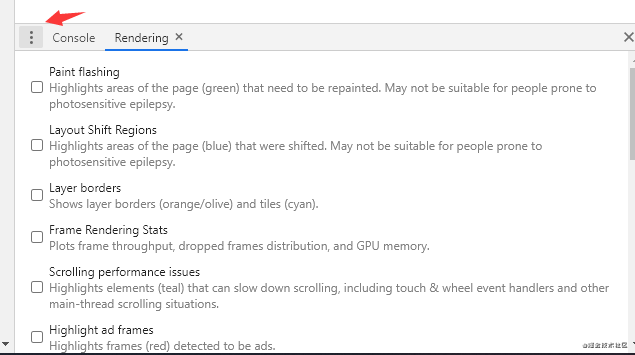
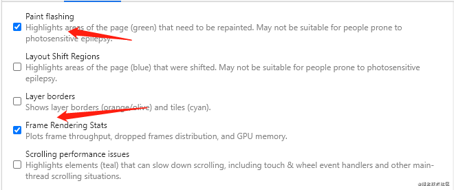
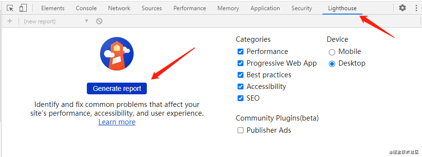

### 手动检查

###### 检查加载性能

一个网站看加载性能如何主要看首屏时间和白屏时间。

1. 白屏时间：指输入网址，到页面开始显示内容的时间；
2. 首屏时间：指输入网址，页面完全加载完成之后的时间；

可以将以下代码放在`</head>`前，就能获取白屏页面白屏时间。

```
<script>
    new Date().getTime() -
performance.timing.navigationStart
</script>
```

在 `window.onload` 事件里执行 `new Date().getTime() - performance.timing.navigationStart` 可以获取首屏完全加载所用时间。

###### 检查运行性能

这里我们就用chrome的开发者工具查看运行时的性能。

打开网站，F12进入浏览器控制台，选择performance,点击左上角的灰色圆点，变为红色即开始记录了。这时可以模仿用户使用网站，在使用完毕后，点击stop,然后就能看到网站运行期间的性能报告。如果有红色块，说明有掉帧的情况；如果为绿色，说明帧率高，网页比较流畅。

在performance选项下，按ESC会弹出来一个小框，点击小框左边的三个点，把rendering勾出来。




第一个是高亮重绘区域，另一个是显示帧渲染信息。勾上之后，再去浏览网页，便可以实时看到网页的渲染变化。

### 利用工具检查

chrome工具 Lighthouse


这个工具会对网站进行性能打分。