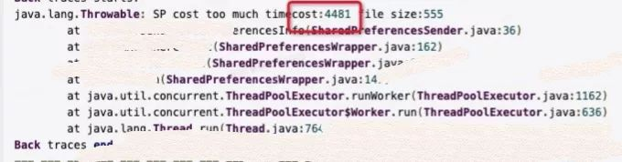

作者：阿里巴巴淘系技术
链接：https://www.zhihu.com/question/40505685/answer/1284521344
来源：知乎
著作权归作者所有。商业转载请联系作者获得授权，非商业转载请注明出处。

白屏、卡顿、页面加载失败、页面跳转慢、图片空窗、崩溃、耗电等问题一直都是用户频繁舆情反馈的痛点。

如何衡量和提升客户端的性能和提升体验，一直都是技术在不断探索和解决的问题。

Google也在每一次的Android Studio的迭代中，不断增加了大量的性能排查工具帮助开发提升代码质量，作为了全世界第一的电商APP，如何定义APP的可用性，以及提升APP的可用性，一直以来都是手淘技术不断追求的目标。

**今天，我们也从手淘APP产品的角度，聊聊关于性能优化和解决用户痛点的问题。**

▐ 用户痛点

### **舆情反馈**

- 舆情信息的整理，主要是Crash、白屏、网络出错、黑屏、图片不显示、ANR等。
- 舆情的统计数据，其中每天有X条与性能体验相关的舆情，一条舆情背后是上万级别的用户面临的痛点。
- 线上性能问题形势严峻，其中卡顿、打不开、白屏、无反应、闪退、页面加载慢等用户痛点问题是舆情的TOP问题，也是全链路性能体验治理的发力点。

## ▐  全链路性能体验目标

客户端的稳定性和性能既是用户体验的痛点，也一直都是各个应用技术团队关心的指标，Google的开发团队也为Android的开发者们量身打造了Android Studio去发现和定位各种性能问题。

如卡顿分析工具TraceView、SysTrace，布局优化工具Hierarchy Viewer，过度绘制工具开发者模式下的OverDraw，内存分析工具Memory Monitor、Heap Viewer，内存跟踪工具Allocation Tracker，内存泄漏分析工具MAT，ANR 分析工具Analyze Stacktrace，耗电分析工具Battery Historian，其他还提供了非常强大的能力如DropBox、StrictMode等等。各式各样的专项工具都在全方位的帮助开发者快速的发现和定位，从而打造一款良好体验的APP。

然而各式各样Google Android专项工具都需要开发主动去使用才能发现问题，一般都是在开发同学遇到某一个或者某一类问题的时候才会想到用特定的工具去排查问题，往往只能在事后才能发现问题。

本系列从全新的视野和角度出发，打造一款业务无入侵性的SDK-Olympic，Olympic是对手机淘宝历史性能问题的排查、分析和解决的沉淀后的产物，将在手淘历史上出现的问题的排查方法积累下来后，面向Android客户端的性能排查平台。

其使命是“数据为中心，平台为依托，打造移动端高可用旗舰APP”，帮助开发同学事先分析和定位问题，问题直指代码调用行、View路径和内存引用链，并通过问题的排查和积累，提供《问题快速解决手册》帮助开发同学快速解决问题，从而减少定位问题的成本，降低线上风险，Olympic的目标是发现可以从技术上优化解决的性能问题。相比与Google Android Studio提供的排查能力，Olympic更加轻量和准确。

全链路性能体验，基于Olympic-SDK，打通TMQ线下性能自动化卡口，EMAS性能数据采集与统计，实现完整的性能相关问题发现、分析、卡口、统计的链路，并命名为Olympic，赋能手淘性能，Olympic的目标是成为手淘性能问题的“线下集成卡口、线上发布标准”。

## **打造高可用APP（GSM）**

图1 打造一款高可用的移动APP(Goal)

## **整体架构**

以数据为中心，平台为依托，打造移动端高可用旗舰APP，全方位的性能和稳定性监控，分为稳定性相关的检测、卡顿相关的检测、安全相关的检测、耗电相关检测、流量相关检测，每个领域都是一个大的专项，细分许多子专项进行详解。项目名称我们取之为Olympic，意味着让手机客户端“更快，更高，更远”。

Olympic治理性能问题并不是衡量Olympic好坏的唯一标准，Olympic真正的价值在于沉淀提升体验的方法论，沉淀提升体验的基础设施，从帮助开发快速的解决痛点，拿到好的结果。

★  数据是整个项目中的灵魂，它如同石油，只有数据才能让整个项目流畅的运作起来。

- Olympic帮助HA-EMAS做数据呈现，报表展示，风险分析，订阅跟报警；
- Olympic帮助MOTU-EYE做AB实验，通过数据帮助业务更好的决策；
- Olympic帮助TMQ做线下验收，持续集成，把问题拦在线下；
- Olympic帮助舆情平台提供问题信息，帮助开发快速解决用户问题。

## **核心技术创新**

## ▐  TMQ 性能卡口自动化

全链路性能体验(Olympic)性能卡口自动化部分，基于 TMQ 平台智能Monkey自动化测试能力，通过华为、VIVO、OPPO、荣耀、小米和Pixel等设备，系统覆盖Android 4.x-10.x，以Olympic性能SDK能力为核心，对内存相关问题、资源泄漏、卡顿和安全等问题进行检测，实现线下自动化卡口方案和手工验收方案。

其中线下自动化卡口方案，打通手淘Android Debug包、DebugSetting、TMQ、TMQ设备中台、Aone平台和摩天轮平台，实现全自动化的性能问题发现、存储、定位、分发和卡口。其中手工验收方案，在测试验收过程中可以通过DebugSetting的“全链路性能验收工具(Olympic)”查看验收过程中发生的异常性能问题列表，并对确认的问题，提bug到aone必改问题空间。

Olympic性能卡口自动化部分至今累计发现内存泄漏(Activity泄露、Service泄露、Broadcast泄露)、资源泄漏(文件描述符未关闭、Sqlite未关闭、图片资源未释放)和ANR等必改问题X00+个。

## ▐  大图片检测

大图片是指控件所持有的Bitmap对象的宽高远超了View自身的宽高，导致内存处于不必要的浪费，不但对内存存在挑战，同时也对IO存在挑战，合理的使用图片不仅能提升内存质量，减少IO，同时也能带来视觉上的良好体验。手淘客户端对图片的有着大量的应用，解析图片导致的OOM也不胜枚举。

Olympic中开发了OverBitmapPlugin，针对大图片问题量身定制，直接发现大图片和其页面中的View路径，帮助开发快速发现和解决问题，大图检测单项累计发现X000+问题。

## ▐  SharedPreferences优化

主线程进行SharedPreferences的commit和apply操作会导致ANR的产生（此插件帮组手淘100%解决了SP导致的ANR），Olympic的SharedPreferences检查插件可以帮助你发现可优化的SharedPreferences代码，同时同步实现了手淘的SharedPreferences，能帮你快速替换系统的SharedPreferences提升代码质量，改善用户体验，减少不必要的ANR。一个小细节给用带来的不仅仅是体验，更是手机淘宝“用户第一”的态度。

图2 线上主线程操作SharedPreferences导致ANR堆栈

通过线上ANR堆栈可以看到，主线程操作SharedPreferences，导致主线程耗时4481ms，此操作很容易导致主线程ANR。

既然UI线程SharedPreferences调用commit或者非UI线程SharedPreferences调用apply都有可能导致ANR，那是否有方式能很好的避免ANR呢？

答案是通过在非UI线程的SharedPreferences调用commit来优雅的解决以上问题。思维很好，但是实际操作比较麻烦：

1. Android的开发者已经被SharedPreferences训练了很多次，包括AndroidStudio也会推进开发者将commit改成apply，从而提升体验（这个Android官方的推荐使用方法其实我本人在手淘的世始建过程中是不认可的）；
2. 在大应用模块化开发的环境下，如何保证所有的开发同学（包含新手同学）能遵守“非UI线程的SharedPreferences调用commit”这个方案来解决ANR是很难的（我个人的看法是‘如果没有合理的规范化的开发规范，人是最容易出错的’）。

基于对以上两点的思考，开始着手思考，通过无入侵的SharedPreferences使用不合理的探测插件，通过规范化的开发手册，快速帮助开发同学矫正SharedPreferences开发方式，以最快的速度获取最大的收益。

## **问题快速解决手册**

## ▐  内存监控

内存问题，说的更直白点，就是你想让一个对象在下次GC的时候彻底被回收，但是这个对象所处的条件不符合GC所认定的应当回收的条件，而导致实际上没有被回收依然占用着内存空间，像这样的对象多了，迟早会把内存撑爆引发大名鼎鼎的OOM问题。

内存撑爆引发大名鼎鼎的OOM问题其实有两类，一类是内存该释放不释放，主要是静态全局对象引用了不该引用的对象，如Activity泄漏，Service泄漏和Receiver泄漏；另一类则是内存使用不合理，如可以用更少内存完成的任务，却用了大量的内存来完成，主要发生的图片端，如在Android设备中res目录下的drawable目录存放高清大图。

### **Activity泄漏**

Activity泄漏是指当Activity对象生命周期结束后Activity被其他对象强引用，得不到及时的释放导致的内存泄漏，Activity一般承接在页面的整体视觉，持有着图片，因此Activity泄漏会对内存造成很大的负担，也是开发者治理内存泄漏的重中之重，当然开源社区也有成熟的检测SDK帮助开发者开始的发现Activity的泄漏问题，如LeakCanary[1]。

Olympic中开发了ActivityLeaksPlugin，针对Activity泄漏量身定制，直接发现泄漏的Activity和其引用链，帮助开发快速发现和解决问题，详细原理参考LeakCanary[1]。

### **Service泄漏**

Service泄漏是指在使用Activity进行bindService后，在Activity生命周期销毁之前没有及时的unbindService导致的Service泄漏。bindService的行为一定要慎重的思考，bindService的生命周期，如果伴随者APP整个生命周期运行的Service，建议使用applicaion去bindService，而避免使用其他的context去bindService。bindService还有一些点要注意，bindService可以通过Context去注册运行时Service，意味着Service和Receiver的Context也可以去BindService，随着Service和Receiver的创建和销毁可能带来了大量的Service的泄漏。

Olympic中开发了ServiceLeaksPlugin，针对Service泄漏量身定制，直接发现泄漏的Service和调用栈，帮助开发快速发现和解决问题。

### **Receiver泄漏**

Receiver泄漏是指在使用Activity进行registerReceiver后，在Activity生命周期销毁之前没有及时的unregisterReceiver导致的Receiver泄漏。registerReceiver的行为也要慎重的思考，registerReceiver的生命周期，如果伴随者APP整个生命周期运行的Receiver，建议使用applicaion去registerReceiver，而避免使用其他的context去registerReceiver。registerReceiver还有一些点要注意，registerReceiver可以通过Context去注册运行时Service，意味着Service和Receiver的Context也可以去registerReceiver，随着Service和Receiver的创建和销毁可能带来了大量的Receiver的泄漏。

Olympic中开发了ReceiverLeaksPlugin，针对Recevier泄漏量身定制，直接发现泄漏的Recevier和调用栈，帮助开发快速发现和解决问题。

## ▐  资源泄漏

资源泄漏也是开发者老生常谈的另一个令人头痛的问题，随着泄漏的增加系统的可用资源不断减少，最终走向不可求药的崩溃，而这类问题和内存问题一样一般很难排查到问题的根因。最常见的文件描述符泄漏、线程泄漏、Socket泄漏和数据库泄漏。

### **文件描述符泄漏**

这里的文件描述符泄漏主要是指打开的文件没有及时的关闭导致的泄漏问题。Olympic中开发了CloseableObjectsLeaksPlugin，针对资源未释放的问题量身定制，直接发现资源open的调用栈，帮助开发快速发现和解决问题。

### **线程泄漏**

线程泄漏是指在程序运行过程中创建的线程对象在程序运行过程中不会被使用，同时也不会释放的线程创建行为，在Android应用中经常发生在死锁的线程，不会退出的HandlerThread，以及非静态全局的线程池创建。

Olympic中开发了ThreadLeaksPlugin，针对线程泄漏问题量身定制，直接发现泄漏的线程名，帮助开发快速发现和解决问题。

### **Socket泄漏**

Socket泄漏是指打开的网络连接没有及时的关闭，或在网络异常的时候没有关闭Socket导致的泄漏。Olympic中开发了CloseableObjectsLeaksPlugin，针对资源未释放的问题量身定制，直接发现资源open的调用栈，帮助开发快速发现和解决问题。

### **数据库泄漏**

数据库泄漏是指打开的数据库连接没有及时的关闭，或在数据库异常的时候没有关闭数据库连接而导致的泄漏。Olympic中开发了SqlLiteObjectsLeaksPlugin，针对数据库未释放的问题量身定制，直接发现数据库open的调用栈及对应的数据库名和SQL语句，帮助开发快速发现和解决问题。

## ▐  卡顿

卡顿是指用户在滑动过程中或在播放视频和动画的时候出现画面滞帧的场景，都是卡顿的现象。FPS是衡量客户端卡顿的一个很重要的指标。严格意义上来讲，一般来讲客户端的FPS在60帧每秒，未达到60帧每秒的时候，都可以理解为出现了卡顿。而导致卡断的原因也很多样化，一般有消息耗时、主线程读/写、主线程网络读写、主线图片解析、主线程SlowCall，主线程碎片读写、主线程BinderCall、OverLayout、OverDraw、不合理SharedPreferences使用等。

### **消息耗时**

Android的UI渲染主要是通过消息队列的方式实现的，当之前的消息出现耗时行为的时候，会导致后续的消息得不到及时的执行，而出现卡顿的问题，更严重的话会出现ANR。Olympic中开发了MainBlockedPlugin，针对主线程卡顿问题量身定制，直接发现消息执行耗时超过1s的消息名和其调用栈，帮助开发快速发现和解决问题。

### **主线程读/写**

主线程读写是指在Android的UI线程中有IO操作，用于存储设备的硬件特性，往往寄存器的读写性能好过Cache，Cache的读写性能好过内存，内存的读写性能好过硬盘，而硬盘的读写性能往往是相对于内存的读写是及其糟糕的，因此Google的Android团队也是建议开发者尽量避免在主线程操作IO。主线程操作IO会出现卡顿的问题，更严重的话会出现ANR。

Olympic中开发了DiskReadOnMainPlugin/DiskWriteOnMainPlugin，针对主线程IO问题量身定制，直接发现在主线程IO的方法调用栈，帮助开发快速发现和解决问题。

### **主线程网络读写**

主线程网络读写是指在Android的UI线程中有网络操作，用网络操作的问题和主线IO的问题一样甚至更严重，网络的建联和数据的接手都是非常耗时的操作，建议开发者避免在主线程操作网络。主线程操作网络会出现卡顿的问题，更严重的话会出现ANR。

Olympic中开发了NetworkPlugin，针对主线程网络读写问题量身定制，直接发现在主线程网络读写的方法调用栈，帮助开发快速发现和解决问题。

### **主线图片解析**

主线程图片解析是指在Android的UI线程中执行Bitmap的创建操作。主线程图片解析也会导致卡顿的问题，更严重的话会出现ANR。

Olympic中开发了BitmapPlugin，针对主线程图片解析进行检测。在详细的原理篇中也会给出在主线程解析图片优雅的解决方案。

### **主线程SlowCall**

主线程SlowCall是指在Android的UI线程中处理比较耗时的方法，主要是图片的Bitmap内存Copy，和网络的是实例查找，都是比较耗时的方法，因此大家有尽可能的避免使用，或使用其代替方案。

Olympic中开发了SlowCallPlugin，针对主线程SlowCall问题量身定制，直接发现在主线程SlowCall的方法调用栈，帮助开发快速发现和解决问题。

### **主线程碎片读写**

主线程碎片读写是指在主线程做大量的碎片读写，如inputStream.read()每次只读取一个字节，操作系统对内存的读写有LRU的内存缓存命中优化，连续的读写有助于提高IO性能的，当然碎片读写的会导致LRU的内存缓存失效，从而触发大量的内存交互，降低了手机的性能，导致页面卡顿。

Olympic中开发了UnbufferedIOPlugin，针对主线程碎片读写问题量身定制，直接发现在主线程碎片读写方法调用栈，帮助开发快速发现和解决问题。

### **主线程BinderCall**

主线程BinderCall是指在主线程做IBinder调用的时远程对象时出现了异常，导致主线耗时的场景。开发者因尽可能的避免主线程BinderCall导致用户体验下降，更应避免存在异常的BinderCall，这会让用户体验更糟糕。

Olympic中开发了BinderCallPlugin，针对主线程BinderCall问题量身定制，直接发现在主线程BinderCall方法调用栈，帮助开发快速发现和解决问题。

### **OverLayout**

OverLayout是指在页面布局的时候存在冗余的View，导致View在绘制的时候存现性能下降，而Android的开发团队在Android Studio中为此类问题量身定制了Hierarchy Viewer插件，可见Android开发团队对View布局的重视。

Olympic中开发了OverLayoutPlugin,针对页面布局OverLayout量身定制，直接发现布局结构中存在过度布局的View并获取其在页面中的位置，帮助开发快速发现和解决问题。

### **OverDraw**

OverDraw是指在页面布局的时候存在冗余的背景设置，导致View在绘制的时候存现性能下降，而Android的开发团队在“开发者模式”下为此类问题量身定制了“调试GPU过度绘制”功能，可见Android开发团队对View OverDraw的重视。

Olympic中开发了OverDrawPlugin,采用线段树算法针对页面OverDraw量身定制，直接发现布局结构中存在过度绘制的View并获取其在页面中的位置，帮助开发快速发现和解决问题。

## ▐  视觉

## **白屏检测**

白屏检测是指页面View未渲染或者是在指定的时间内未得到及时的渲染导致页面的曾现处于完全或者部分无预期内容的问题。

Olympic中开发了WhiteScreenPlugin，针对H5、WEEX、原生Native的特性量身实现，能发现各类白屏问题，通过轻量级UI描述还原白屏现场。目前正在“手淘架构实验室-白屏实验”发光发热。

### **图片404检测**

图片空窗检测是指页面ImageView控件已经呈现，而网络中下载的图片由于已经被删除或者CDN拼接出错导致的图片空窗的问题。

Olympic中开发了Image404Plugin，能发现页面中存在图片空窗的View，并指出其页面所在的位置。

## ▐  安全

近期facebook的隐私泄漏事件再度唤起了公众对隐私的关注，在这个越来越重视个人隐私的时代里，安全早已是一个无法绕开的话题。作为一个开发人员，必须具备安全意识，掌握基础的安全知识，为打造更加安全的应用做出努力。涉及网络明文、文件明文和外跳，其他更深层次的安全问题，如四大组件导出、WebView、存储、传输、日志、混淆、数据加密、应用加固等安全漏洞及防护策略，由于个人的知识面原因会在后续的文章中有所涉及但不会作为性能专项详细讲解。

### **网络明文检测**

网络明文是指在使用非安全的域名请求网络请求，如请求http://example.com/，而不是请求https://example.com/。

Olympic中开发了CleartextNetworkPlugin，能帮助开发无意间明文请求网络而导致数据泄漏。能定位到访问的IP地址，帮助开发快速发现和解决问题。**CleartextNetworkPlugin**为了帮助开发者降低数据泄漏的风险，从而更好的保护开发者。

### **文件明文导出检测**

Android不再允许在app中把file://Uri暴露给其他app，包括但不局限于通过Intent或ClipData 等方法。

原因在于使用file://Uri会有一些风险，比如：

- 文件是私有的，接收file://Uri的app无法访问该文件。
- 在Android6.0之后引入运行时权限，如果接收file://Uri的app没有申请READ_EXTERNAL_STORAGE权限，在读取文件时会引发崩溃。

Olympic中开发了FileUriExposurePlugin，能帮助开发无意间明文请求网络而导致数据泄漏。能定位到访问的IP地址，帮助开发快速发现和解决问题。

### **外跳检测**

外跳检查是指通过当前进程去唤起二方或者三方APP的问题。对外跳进行监控主要是为了更好的保护用户，随着小程序、WEEX和H5等容器化的控件，手机淘宝将手机淘宝的客户端基础能力开放出来给商家使用，难免会放生一些不可控的行为，如商家使用jdmobile://、pk206://link/room/984551等不受控的APP。

Olympic中开发了SafeActivityPlugin，能帮助开发无意间外跳行为，更好的保护业务安全。

## **总结**

“性能问题的终结者”是Olympic对自身价值的定位。Olympic从手机淘宝中孕育为生，在手机淘宝中的过去、现在和未来都将发挥重要的价值。Olympic不仅要去发现问题，并针对Olympic发现的问题提供对应的解决方案，真正的去释放业务开发的时间，为业务赋能。

Olympic具备全面、精准、高效、创新、自动化、开放和赋能开发等特点。用极少的精力去解决性能问题，用更多的时间关注自身业务成长。

## ▐  全面

30+个性能专项插件，涉及内存、资源、卡顿、安全等多领域全方位的性能监控，打造手机淘宝的**“超严格模式”**。

## ▐  精准高效

细粒度的问题定位（栈级别，View级别，文件名级别）帮助开发者快速定位问题根因。全方位的原理介绍、常见问题排查手册，经典问题回顾，不费余力的解决性能问题。

## ▐  创新 

全新视角，从0-1提供专业的性能监控—大图检查、白屏检查深入原理，另辟蹊径，突破系统障碍，强化系统能力—SharePerferences精益求精，“Geek精神”，做细粒度的性能优化—OverDraw、OverLayout

## ▐  自动化 

打通TMQ，Aone，EMAS，MTL卡口等流程，自动化定位问题、分发问题、持续集成，释放开发者时间。

## ▐  开放 

开放包容的思想，吸收能专项治理某一类性能问题的任何想法。集团内部开源，全方位提升集团APP性能。

## ▐  赋能 

横向纵向的性能数据对比，帮助业务更好的决策，判断新技术的价值。

## 参考

【1】LeakCanary链接：[https://square.github.io/leakcanary/](https://link.zhihu.com/?target=https%3A//square.github.io/leakcanary/)

——————————————————————————————————

本篇回答内容来自阿里巴巴淘系技术部皓远 非台 大音

本账号主体为阿里巴巴淘系技术，淘系技术部隶属于阿里巴巴新零售技术事业群，旗下包含淘宝技术、天猫技术、农村淘宝技术、闲鱼、躺平等团队和业务，是一支是具有商业和技术双重基因的螺旋体。

刚刚入驻知乎，将会给大家带来超多干货分享，立体化输出我们对于技术和商业的思考与见解。

详情介绍可以看这里 [阿里巴巴淘系技术介绍](https://zhuanlan.zhihu.com/p/141070026)

欢迎收藏点赞关注我们！共同进步~ ：）