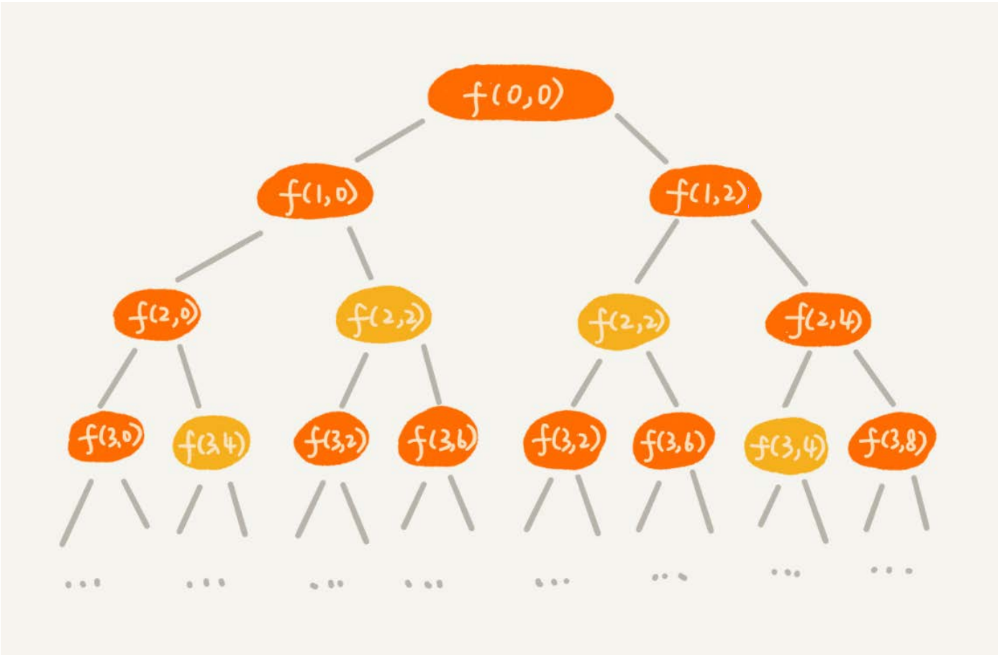
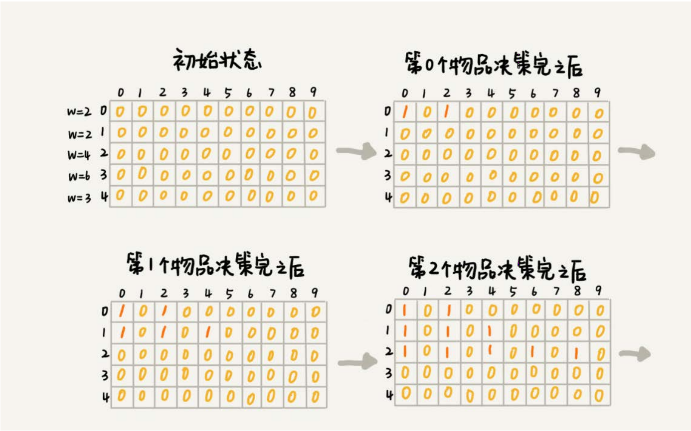
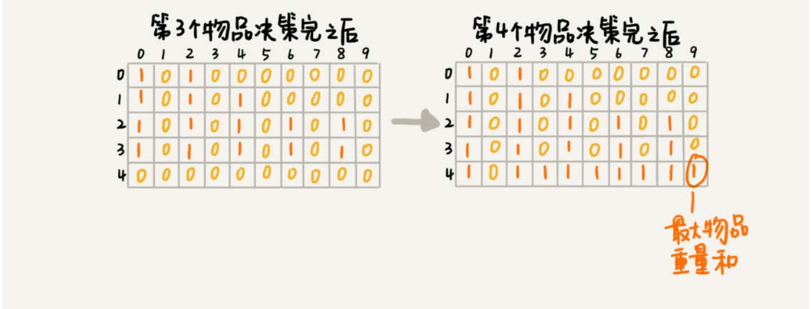
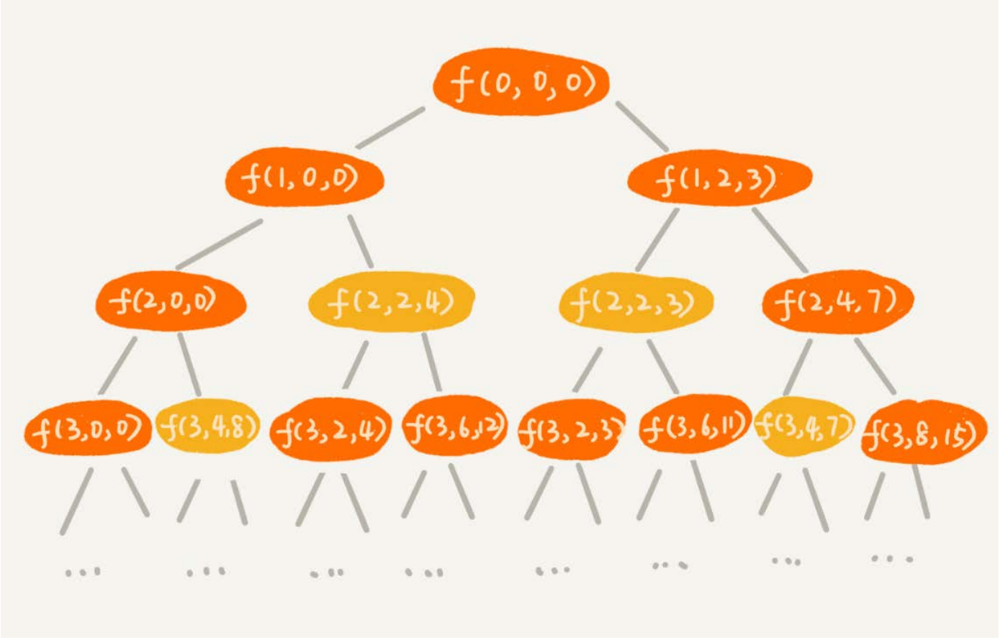

# 初识动态规划

## 动态规划与双十一

淘宝的“双十一”购物节有各种促销活动，比如“满200元减50元”。假设你女朋友的购物车中有n个（n>100）想买的商品，她希望从里面选几个，在凑够满减条件的
前提下，让选出来的商品价格总和最大程度地接近满减条件（200元），这样就可以极大限度地“薅羊毛”。作为程序员的你，能不能编个代码来帮她搞定呢？
要想高效地解决这个问题，就要用到我们今天讲的动态规划（Dynamic Programming）。

### 场景

动态规划比较适合用来求解最优问题，比如求最大值、最小值等等。它可以非常显著地降低时间复杂度，提高代码的执行效率。不过，它也是出了名的难学。它
的主要学习难点跟递归类似，那就是，求解问题的过程不太符合人类常规的思维方式。对于新手来说，要想入门确实不容易。不过，等你掌握了之后，你会发
现，实际上并没有想象中那么难。

## 背包问题

对于一组不同重量、不可分割的物品，我们需要选择一些装入背包，在满足背包最大重量限制的前提下，背包中物品总重量的最大值是多少呢？
关于这个问题，我们上一节讲了回溯的解决方法，也就是穷举搜索所有可能的装法，然后找出满足条件的最大值。不过，回溯算法的复杂度比较高，是指数级别
的。那有没有什么规律，可以有效降低时间复杂度呢？我们一起来看看。

```java
// 回溯算法实现。注意：我把输入的变量都定义成了成员变量。
private int maxW = Integer.MIN_VALUE; // 结果放到maxW中
private int[] weight = {2，2，4，6，3}; // 物品重量
private int n = 5; // 物品个数
private int w = 9; // 背包承受的最大重量
public void f(int i, int cw) { // 调用f(0, 0)
 if (cw == w || i == n) { // cw==w表示装满了，i==n表示物品都考察完了
 if (cw > maxW) maxW = cw;
 return;
 }
 f(i+1, cw); // 选择不装第i个物品
 if (cw + weight[i] <= w) {
   f(i+1,cw + weight[i]); // 选择装第i个物品
 }
}
```

对于这种递归回溯求解过程, 用递归树画出来



递归树中的每个节点表示一种状态，我们用（i, cw）来表示。其中，i表示将要决策第几个物品是否装入背包，cw表示当前背包中物品的总重量。比如，（2，2）
表示我们将要决策第2个物品是否装入背包，在决策前，背包中物品的总重量是2。

从递归树中，你应该能会发现，有些子问题的求解是重复的，比如图中f(2, 2)和f(3,4)都被重复计算了两次。我们可以借助递归那一节讲的“备忘录”的解决方式，记
录已经计算好的f(i, cw)，当再次计算到重复的f(i, cw)的时候，可以直接从备忘录中取出来用，就不用再递归计算了，这样就可以避免冗余计算。

```java
private int maxW = Integer.MIN_VALUE; // 结果放到maxW中
private int[] weight = {2，2，4，6，3}; // 物品重量
private int n = 5; // 物品个数
private int w = 9; // 背包承受的最大重量
private boolean[][] mem = new boolean[5][10]; // 备忘录，默认值false
public void f(int i, int cw) { // 调用f(0, 0)
 if (cw == w || i == n) { // cw==w表示装满了，i==n表示物品都考察完了
 if (cw > maxW) maxW = cw;
 return;
 }
 if (mem[i][cw]) return; // 重复状态
 mem[i][cw] = true; // 记录(i, cw)这个状态
 f(i+1, cw); // 选择不装第i个物品
 if (cw + weight[i] <= w) {
 f(i+1,cw + weight[i]); // 选择装第i个物品
 }
}
```

### 动态规划解法

我们把整个求解过程分为n个阶段，每个阶段会决策一个物品是否放到背包中。每个物品决策（放入或者不放入背包）完之后，背包中的物品的重量会有多种情
况，也就是说，会达到多种不同的状态，对应到递归树中，就是有很多不同的节点。
我们把每一层重复的状态（节点）合并，只记录不同的状态，然后基于上一层的状态集合，来推导下一层的状态集合。我们可以通过合并每一层重复的状态，这
样就保证每一层不同状态的个数都不会超过w个（w表示背包的承载重量），也就是例子中的9。于是，我们就成功避免了每层状态个数的指数级增长。
我们用一个二维数组states[n][w+1]，来记录每层可以达到的不同状态。
第0个（下标从0开始编号）物品的重量是2，要么装入背包，要么不装入背包，决策完之后，会对应背包的两种状态，背包中物品的总重量是0或者2。我们
用states[0][0]=true和states[0][2]=true来表示这两种状态。
第1个物品的重量也是2，基于之前的背包状态，在这个物品决策完之后，不同的状态有3个，背包中物品总重量分别是0(0+0)，2(0+2 or 2+0)，4(2+2)。我们
用states[1][0]=true，states[1][2]=true，states[1][4]=true来表示这三种状态。
以此类推，直到考察完所有的物品后，整个states状态数组就都计算好了。我把整个计算的过程画了出来，你可以看看。图中0表示false，1表示true。我们只需要在
最后一层，找一个值为true的最接近w（这里是9）的值，就是背包中物品总重量的最大值。




文字描述可能还不够清楚。我把上面的过程，翻译成代码，你可以结合着一块看下。

```java
weight:物品重量，n:物品个数，w:背包可承载重量
public int knapsack(int[] weight, int n, int w) {
 boolean[][] states = new boolean[n][w+1]; // 默认值false
 states[0][0] = true; // 第一行的数据要特殊处理，可以利用哨兵优化
 states[0][weight[0]] = true;
 for (int i = 1; i < n; ++i) { // 动态规划状态转移
 for (int j = 0; j <= w; ++j) {// 不把第i个物品放入背包
 if (states[i-1][j] == true) states[i][j] = states[i-1][j];
 }
 for (int j = 0; j <= w-weight[i]; ++j) {//把第i个物品放入背包
 if (states[i-1][j]==true) states[i][j+weight[i]] = true;
 }
 }
 for (int i = w; i >= 0; --i) { // 输出结果
 if (states[n-1][i] == true) return i;
 }
 return 0;
}
```

实际上，这就是一种用动态规划解决问题的思路。我们把问题分解为多个阶段，每个阶段对应一个决策。我们记录每一个阶段可达的状态集合（去掉重复的），
然后通过当前阶段的状态集合，来推导下一个阶段的状态集合，动态地往前推进。这也是动态规划这个名字的由来，你可以自己体会一下，是不是还挺形象的？

前面我们讲到，用回溯算法解决这个问题的时间复杂度O(2^n) ，是指数级的。那动态规划解决方案的时间复杂度是多少呢？我来分析一下。

这个代码的时间复杂度非常好分析，耗时最多的部分就是代码中的两层for循环，所以时间复杂度是O(n*w)。n表示物品个数，w表示背包可以承载的总重量。
从理论上讲，指数级的时间复杂度肯定要比O(n*w)高很多，但是为了让你有更加深刻的感受，我来举一个例子给你比较一下。
我们假设有10000个物品，重量分布在1到15000之间，背包可以承载的总重量是30000。如果我们用回溯算法解决，用具体的数值表示出时间复杂度，就
是2^10000，这是一个相当大的一个数字。如果我们用动态规划解决，用具体的数值表示出时间复杂度，就是10000*30000。虽然看起来也很大，但是和2^10000比
起来，要小太多了。
尽管动态规划的执行效率比较高，但是就刚刚的代码实现来说，我们需要额外申请一个n乘以w+1的二维数组，对空间的消耗比较多。所以，有时候，我们会说，
动态规划是一种空间换时间的解决思路。你可能要问了，有什么办法可以降低空间消耗吗？
实际上，我们只需要一个大小为w+1的一维数组就可以解决这个问题。动态规划状态转移的过程，都可以基于这个一维数组来操作。具体的代码实现我贴在这里，
你可以仔细看下。

```java
public static int knapsack2(int[] items, int n, int w) {
 boolean[] states = new boolean[w+1]; // 默认值false
 states[0] = true; // 第一行的数据要特殊处理，可以利用哨兵优化
 states[items[0]] = true;
 for (int i = 1; i < n; ++i) { // 动态规划
 for (int j = w-items[i]; j >= 0; --j) {//把第i个物品放入背包
 if (states[j]==true) states[j+items[i]] = true;
 }
 }
 for (int i = w; i >= 0; --i) { // 输出结果
 if (states[i] == true) return i;
 }
 return 0;
}

```

这里我特别强调一下代码中的第6行，j需要从大到小来处理。如果我们按照j从小到大处理的话，会出现for循环重复计算的问题。你可以自己想一想，这里我就不
详细说了。

## 背包问题升级版

我们继续升级难度。我改造了一下刚刚的背包问题。你看这个问题又该如何用动态规划解决？
我们刚刚讲的背包问题，只涉及背包重量和物品重量。我们现在引入物品价值这一变量。对于一组不同重量、不同价值、不可分割的物品，我们选择将某些物品
装入背包，在满足背包最大重量限制的前提下，背包中可装入物品的总价值最大是多少呢？
这个问题依旧可以用回溯算法来解决。这个问题并不复杂，所以具体的实现思路，我就不用文字描述了，直接给你看代码。

```java
private int maxV = Integer.MIN_VALUE; // 结果放到maxV中
private int[] items = {2，2，4，6，3}; // 物品的重量
private int[] value = {3，4，8，9，6}; // 物品的价值
private int n = 5; // 物品个数
private int w = 9; // 背包承受的最大重量
public void f(int i, int cw, int cv) { // 调用f(0, 0, 0)
 if (cw == w || i == n) { // cw==w表示装满了，i==n表示物品都考察完了
  if (cv > maxV) maxV = cv;
 return;
 }
 f(i+1, cw, cv); // 选择不装第i个物品
 if (cw + weight[i] <= w) {
 f(i+1,cw+weight[i], cv+value[i]); // 选择装第i个物品
 }
}
```

针对上面的代码，我们还是照例画出递归树。在递归树中，每个节点表示一个状态。现在我们需要3个变量（i, cw, cv）来表示一个状态。其中，i表示即将要决策
第i个物品是否装入背包，cw表示当前背包中物品的总重量，cv表示当前背包中物品的总价值。



我们发现，在递归树中，有几个节点的i和cw是完全相同的，比如f(2,2,4)和f(2,2,3)。在背包中物品总重量一样的情况下，f(2,2,4)这种状态对应的物品总价值更大，
我们可以舍弃f(2,2,3)这种状态，只需要沿着f(2,2,4)这条决策路线继续往下决策就可以。
也就是说，对于(i, cw)相同的不同状态，那我们只需要保留cv值最大的那个，继续递归处理，其他状态不予考虑。

思路说完了，但是代码如何实现呢？如果用回溯算法，这个问题就没法再用“备忘录”解决了。所以，我们就需要换一种思路，看看动态规划是不是更容易解决这
个问题？
我们还是把整个求解过程分为n个阶段，每个阶段会决策一个物品是否放到背包中。每个阶段决策完之后，背包中的物品的总重量以及总价值，会有多种情况，也
就是会达到多种不同的状态。
我们用一个二维数组states[n][w+1]，来记录每层可以达到的不同状态。不过这里数组存储的值不再是boolean类型的了，而是当前状态对应的最大总价值。我们把
每一层中(i, cw)重复的状态（节点）合并，只记录cv值最大的那个状态，然后基于这些状态来推导下一层的状态。
我们把这个动态规划的过程翻译成代码，就是下面这个样子：

```java
public static int knapsack3(int[] weight, int[] value, int n, int w) {
 int[][] states = new int[n][w+1];
 for (int i = 0; i < n; ++i) { // 初始化states
 for (int j = 0; j < w+1; ++j) {
 states[i][j] = -1;
 }
 }
 states[0][0] = 0;
 states[0][weight[0]] = value[0];
 for (int i = 1; i < n; ++i) { //动态规划，状态转移
 for (int j = 0; j <= w; ++j) { // 不选择第i个物品
 if (states[i-1][j] >= 0) states[i][j] = states[i-1][j];
 }
 for (int j = 0; j <= w-weight[i]; ++j) { // 选择第i个物品
 if (states[i-1][j] >= 0) {
 int v = states[i-1][j] + value[i];
 if (v > states[i][j+weight[i]]) {
 states[i][j+weight[i]] = v;
 }
 }
 }
 }
 // 找出最大值
 int maxvalue = -1;
 for (int j = 0; j <= w; ++j) {
 if (states[n-1][j] > maxvalue) maxvalue = states[n-1][j];
 }
 return maxvalue;
}

```

关于这个问题的时间、空间复杂度的分析，跟上一个例子大同小异，所以我就不赘述了。我直接给出答案，时间复杂度是O(n*w)，空间复杂度也是O(n*w)。跟上
一个例子类似，空间复杂度也是可以优化的，你可以自己写一下。
