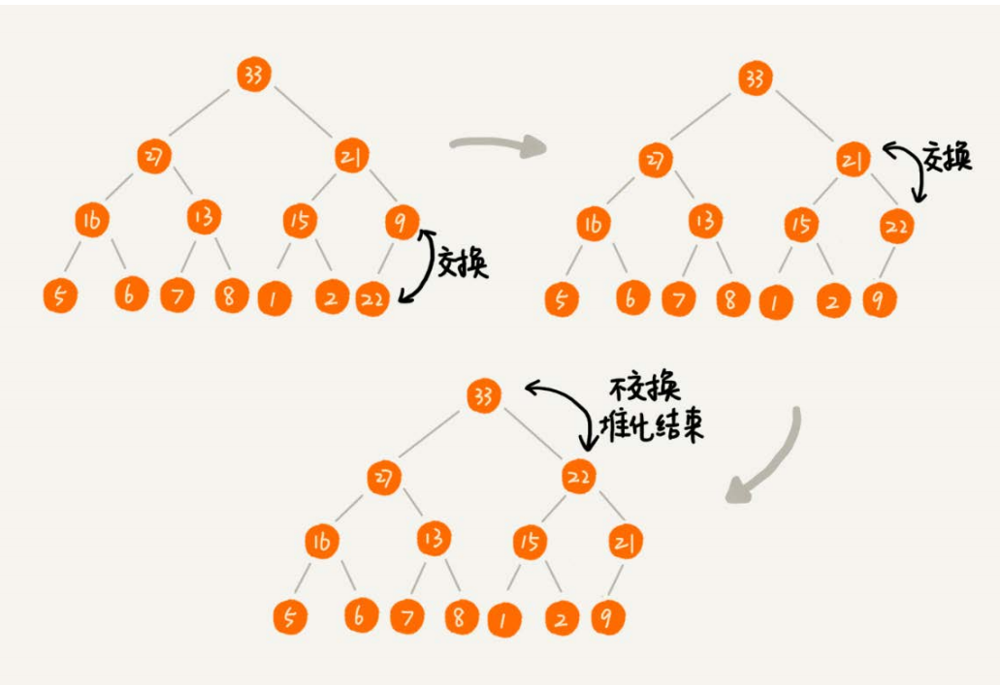
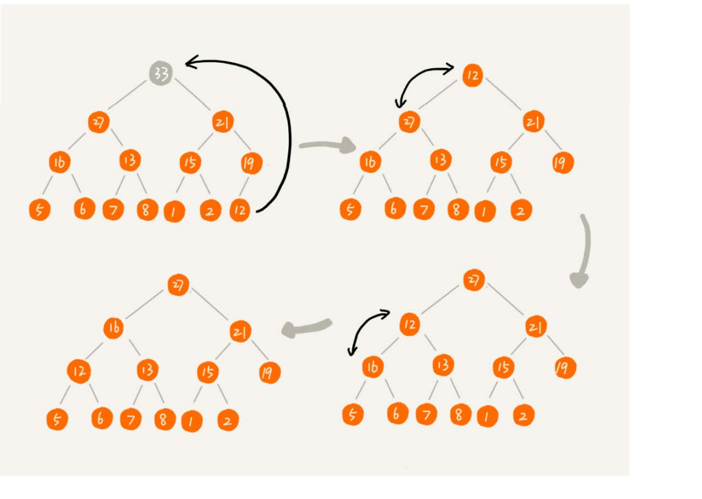
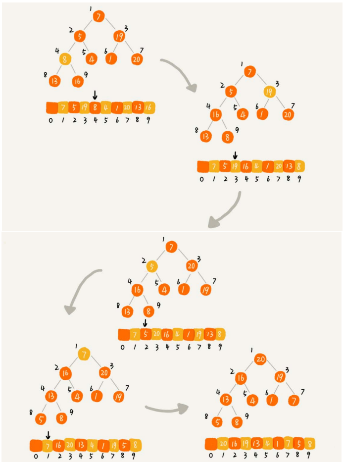
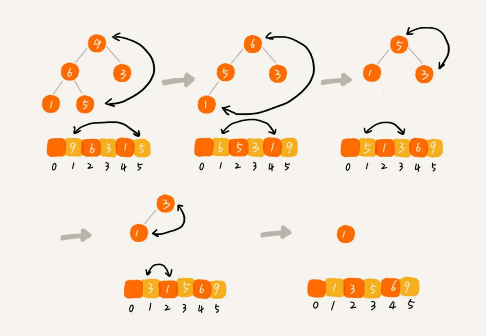

## 如何理解堆

1. 堆是一个完全二叉树
2. 堆中每一个节点的值都必须>=(大顶堆)或者<=(小顶堆)其子树中每个节点的值

## 基本操作

### 插入

往堆中插入一个元素后(放在堆的最后), 我们需要继续满足堆的两个特性(堆化)

### 删除

## 堆排序

### 步骤

1. 建堆
2. 排序

### 建堆

建堆我们从n/2的到1的数据进行堆化, 下标n/2 + 1 到 n 的节点是叶子节点, 不需要堆化

### 排序过程

### 对比快速排序

1. 堆排序数据的访问但是没有快速排序好, 顺序访问对于CPU的缓存更加友好
2. 同样的数据, 堆排序算法的数据交换次数要多余快速排序

有序度和逆序度, 建堆的过程会打乱数据原有的相对先后顺序，导致原数据的有序度降低

### 堆的应用

#### 优先队列

   1. 在优先级队列中，数据的出队顺序不是先进先出，而是按照优先级来，优先级最高的，最先出队。
   2. 赫夫曼编码、图的最短路径、最小生成树算法等等。不仅如此，很多语言中，都提供了优先级队列的实现，比如，Java的PriorityQueue，C++的priority_queue等

优先队列的具体应用

本质上来说是应用一个动态排序问题, 加入新的元素, 删除旧的元素

1. 合并小文件
2. 高性能定时器

#### 利用堆求Top K

#### 利用堆求中位数

## 总结

优先级队列是一种特殊的队列，优先级高的数据先出队，而不再像普通的队列那样，先进先出。实际上，堆就可以看作优先级队列，只是称谓不一样罢了。求Top
K问题又可以分为针对静态数据和针对动态数据，只需要利用一个堆，就可以做到非常高效率的查询Top K的数据。求中位数实际上还有很多变形，比如求99百分
位数据、90百分位数据等，处理的思路都是一样的，即利用两个堆，一个大顶堆，一个小顶堆，随着数据的动态添加，动态调整两个堆中的数据，最后大顶堆的
堆顶元素就是要求的数据。
