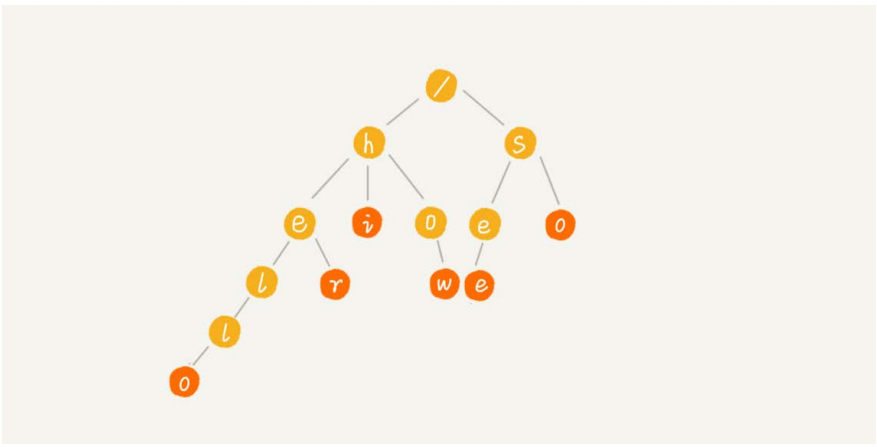
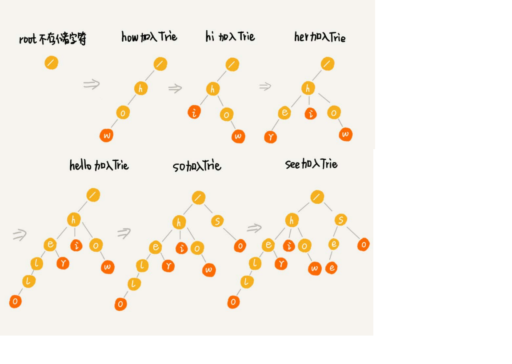
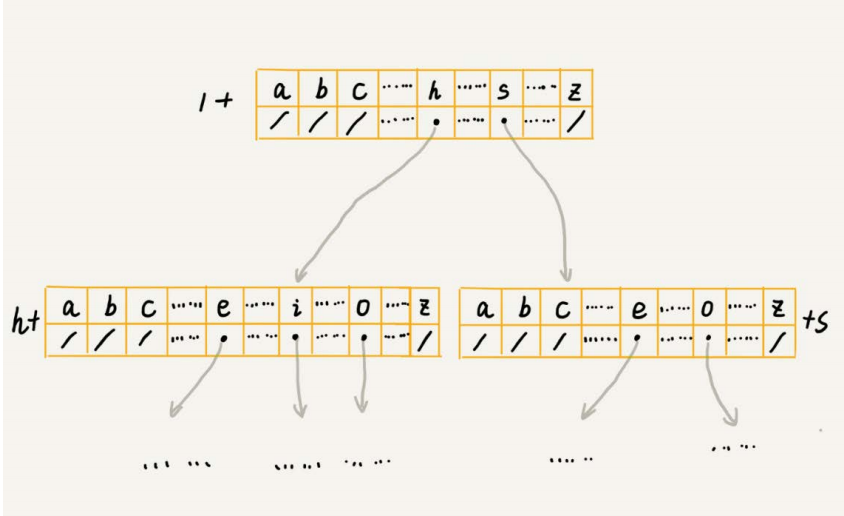

## 什么时Trie树

Trie树，也叫“字典树”。顾名思义，它是一个树形结构。它是一种专门处理字符串匹配的数据结构，用来解决在一组字符串集合中快速查找某个字符串的问题。

### 本质上

Trie树的本质，就是利用字符串之间的公共前
缀，将重复的前缀合并在一起。最后构造出来的就是下面这个图中的样子

### 构造方式

## 存储方式

## 对比散列表, 红黑树

### 总结

适用场景, 字符集不能太大, 要求前缀重合较多, 不然空间消耗会变大
缺点: 没有现成的实现, 数据指针项链, 不利于cpu缓存

Trie树只是不适合精确匹配查找，这种问题更适合用散列表或者红黑树来解决。Trie树比较适合的是查找前缀匹配的字符串

### 对比

实际上，字符串的匹配问题，笼统上讲，其实就是数据的查找问题。对于支持动态数据高效操作的数据结构，我们前面已经讲过好多了，比如散列表、红黑树、跳表等等。实
际上，这些数据结构也可以实现在一组字符串中查找字符串的功能。我们选了两种数据结构，散列表和红黑树，跟Trie树比较一下，看看它们各自的优缺点和应用场景。
在刚刚讲的这个场景，在一组字符串中查找字符串，Trie树实际上表现得并不好。它对要处理的字符串有及其严苛的要求。
第一，字符串中包含的字符集不能太大。我们前面讲到，如果字符集太大，那存储空间可能就会浪费很多。即便可以优化，但也要付出牺牲查询、插入效率的代价。
第二，要求字符串的前缀重合比较多，不然空间消耗会变大很多。
第三，如果要用Trie树解决问题，那我们就要自己从零开始实现一个Trie树，还要保证没有bug，这个在工程上是将简单问题复杂化，除非必须，一般不建议这样做。
第四，我们知道，通过指针串起来的数据块是不连续的，而Trie树中用到了指针，所以，对缓存并不友好，性能上会打个折扣。
综合这几点，针对在一组字符串中查找字符串的问题，我们在工程中，更倾向于用散列表或者红黑树。因为这两种数据结构，我们都不需要自己去实现，直接利用编程语言中
提供的现成类库就行了。
讲到这里，你可能要疑惑了，讲了半天，我对Trie树一通否定，还让你用红黑树或者散列表，那Trie树是不是就没用了呢？是不是今天的内容就白学了呢？
实际上，Trie树只是不适合精确匹配查找，这种问题更适合用散列表或者红黑树来解决。Trie树比较适合的是查找前缀匹配的字符串，也就是类似开篇问题的那种场景。
