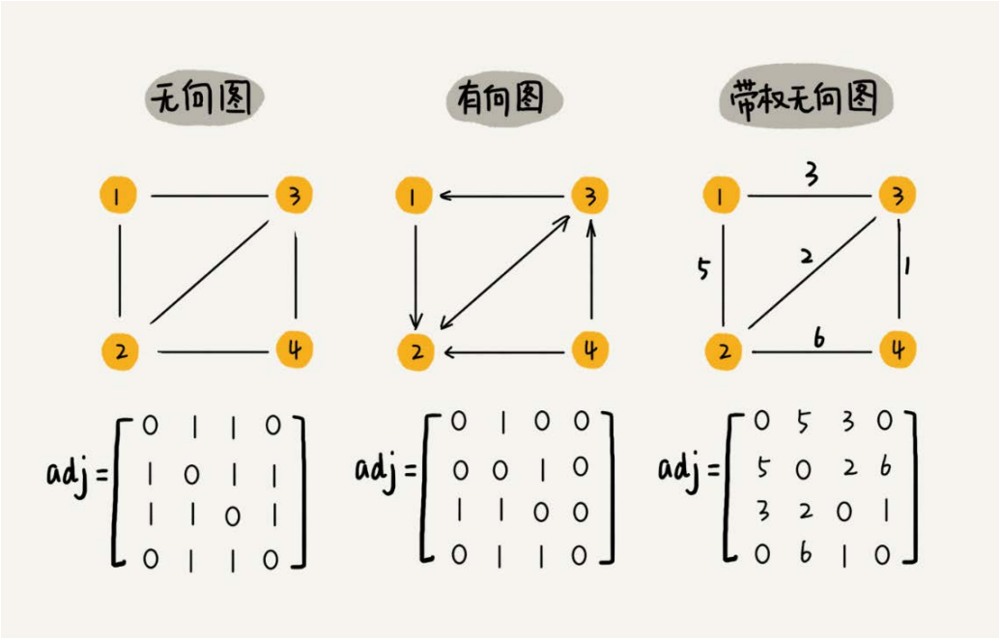
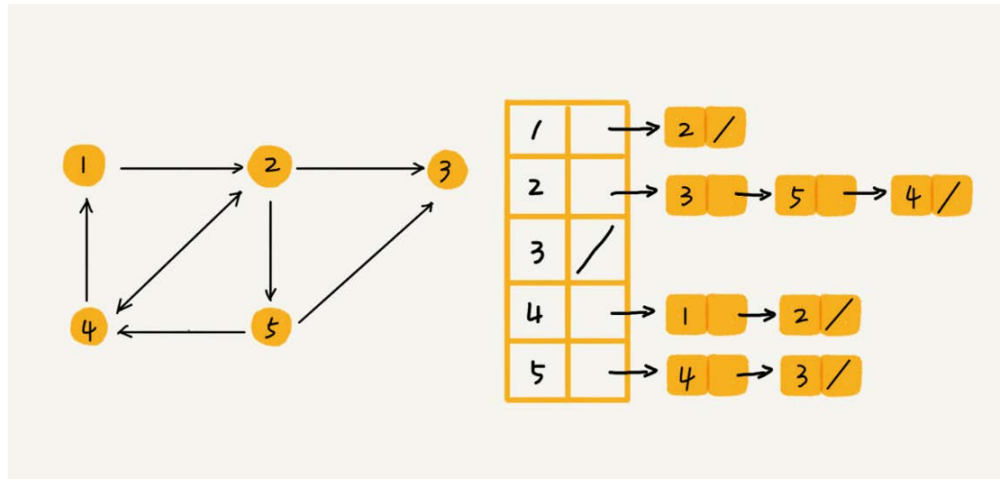
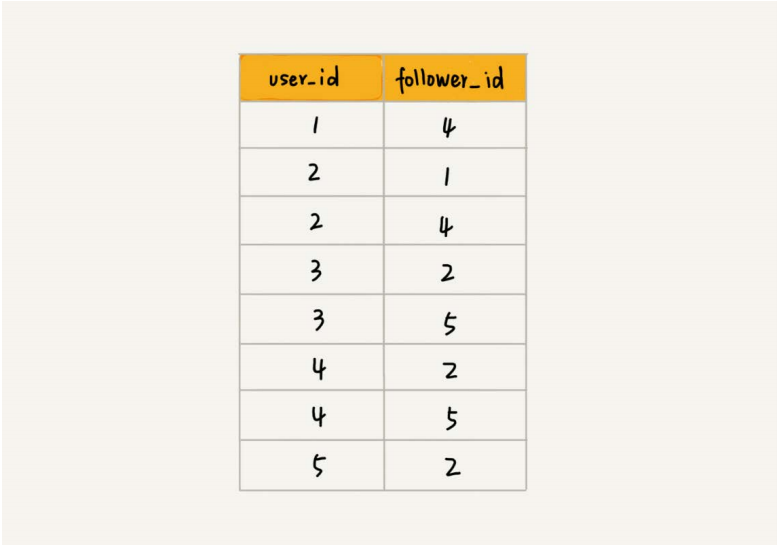
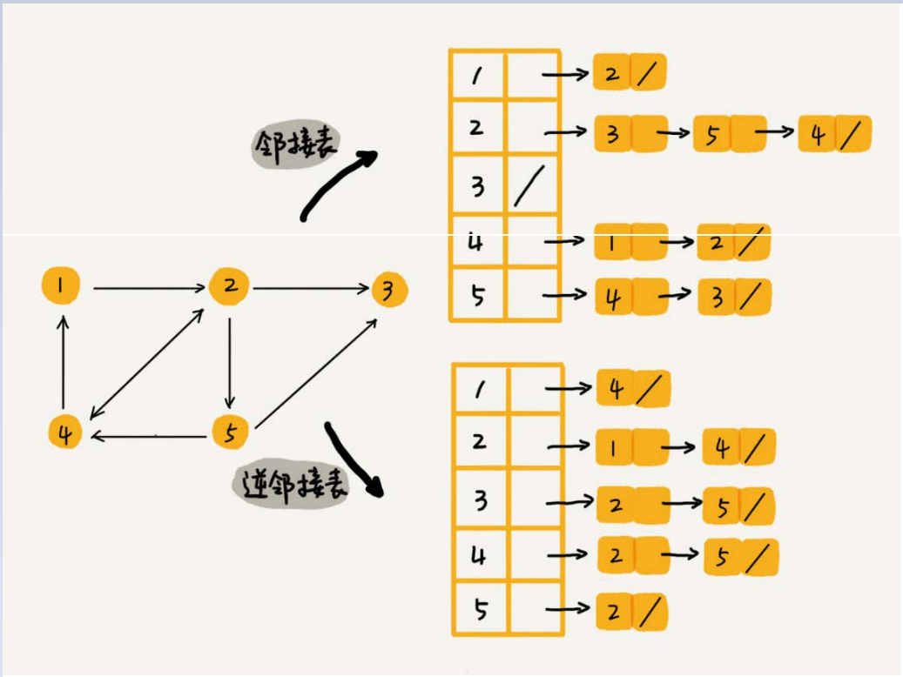
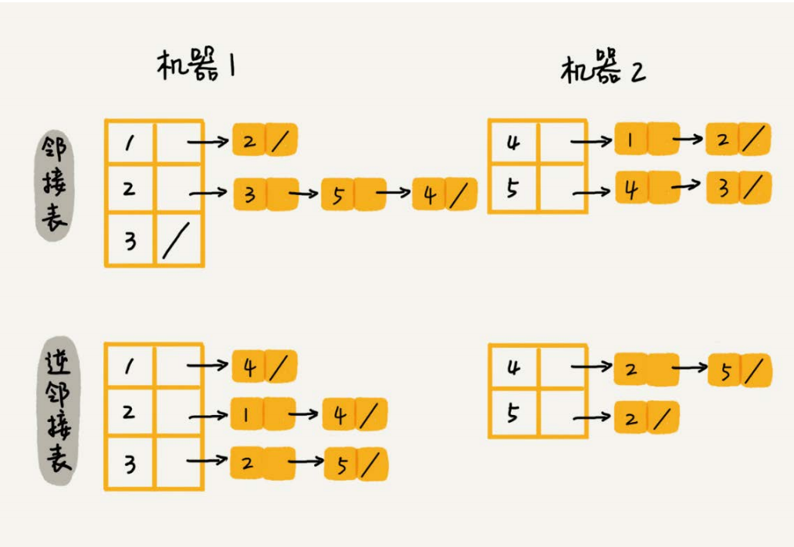

## 如何在内存中存储图这种数据结构

### 邻接矩阵 (Adjacency Matrix)

缺点: 但是比较浪费存储空间(稀疏图, 存储无向图)
优点: 简单直观, 很多图的运算可以转换成矩阵的运算

### 邻接表存储方法

在基于链表法解决冲突的散列表中，如果链过长，为了提高查找效率，我们可以将链表换成其他更加高效的数据结构，比如平衡二
叉查找树等。我们刚刚也讲到，邻接表长得很像散列。所以，我们也可以将邻接表同散列表一样进行“改进升级”。

### 关系型数据库

## 社交网络

关于如何存储一个图，前面我们讲到两种主要的存储方法，邻接矩阵和邻接表。因为社交网络是一张稀疏图，使用邻接矩阵存储比较浪费存储空间。所以，这里
我们采用邻接表来存储。
不过，用一个邻接表来存储这种有向图是不够的。我们去查找某个用户关注了哪些用户非常容易，但是如果要想知道某个用户都被哪些用户关注了，也就是用户
的粉丝列表，是非常困难的。
基于此，我们需要一个逆邻接表

### 大量数据

## 深度和广度优先搜索
