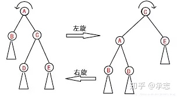
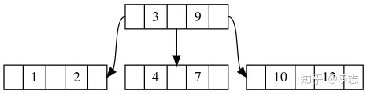
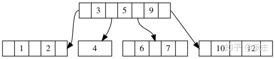

# 万字长文——详细阐述B-树中所有细节

[](https://www.zhihu.com/people/su-xiao-bai-3)

[承志](https://www.zhihu.com/people/su-xiao-bai-3)

技术公众号：TechFlow，B站：梁上唐前

已关注

25 人赞同了该文章

本文始发于个人公众号：**TechFlow，原创不易，求个关注**


本篇原计划在上周五发布，由于太过硬核所以才拖到了这周五。我相信大家应该能从标题当中体会到这个硬核。


周五的专题是大数据和分布式，我最初的打算是和大家分享一下LSM树在分布式存储引擎当中的应用。但是想要能够真正深入理解了LSM的精髓，以及它构思巧妙的点，必须要对传统的数据库的B树和B+树有所了解。所以才有了今天的文章。


虽然我自己完整地将B树写了一遍，但是我并不建议初学者这么干，强行啃太难的数据结构除了容易劝退之外基本上没有太大的帮助。所以，虽然我起了这么一个标题，但是我并不会在文章当中贴太多的代码。而且即使是面试FLAG，只要不作死在简历里写自己是ACMer，一般也不会碰到让手写各种树的面试题。因此，相比于亲自实现，我们能够理解原理更加重要。


即使你是初学者，对于数据结构了解不多，也请不要退出，我有信心让你能够理解清楚B树的运行原理。


## **二叉与二叉搜索树**


在详解原理之前，我们先复习一下简单的概念。


首先来看二叉树的概念，二叉树的概念本身很简单，除了根节点之外，每个节点最多有两个孩子。


比如这样一棵树就是一颗二叉树：


二叉树本身并没有太多用处，只是一个树形的数据结构而已，直到后来有大神想到了一个trick。如果我规定一颗二叉树上的元素拥有顺序，所有比它小的元素在它的左子树，比它大的元素在它的右子树，那么我们不就可以很快地查找某个元素了吗？


不得不说这是一个非常天才的想法，于是，二叉搜索树诞生了。


上图就是一个经典的二叉搜索树，比如我们要查找元素4，首先和根节点8进行比较。显然4 < 8，那么迭代到8的左子树3，4 > 3，于是往3的右子树走，走到6。4 小于6，于是走到了6的左子树，也就是4，我们找到了元素，结束。


在理想情况下，二叉树每多一层，可以存储的元素都增加一倍。也就是说n个元素的二叉搜索树，对应的树高为![[公式]](B树详细-imgs/equation)。所以我们查找元素、插入元素的时间也为![[公式]](https://www.zhihu.com/equation?tex=%5Clog%28n%29)。


不过这是理想情况，显然在实际使用当中很有可能情况并不那么理想。举个简单的例子，如果插入的数据按照递增或者递减的顺序出现，那么所有的元素会线性排列，树形结构会退化成链表。显然在这种情况下，查找和插入的效率会蜕化成![[公式]](B树详细-imgs/equation)。在算法领域可以接受一个数据结构不完美或者是绝大多数情况下可靠，但是不能接受可靠性未知。


为了解决二叉搜索树不平衡的问题，在此基础上提出了各种平衡树。比如数据结构课本上的AVL就是一颗经典的平衡树，平衡树的思路很朴素，就是在插入元素的时候进行判断，如果当前的元素的插入或删除会影响树的平衡性，那么则进行旋转操作，从而维持树的平衡。


正是因为引入了旋转的机制，才保证了二叉搜索树的性能，也因此大大提升了这个原本很简单的数据结构的难度。





上图就是一个经典的旋转操作，在增删改查操作当中，经常要用到旋转操作平衡整棵树，也因此对于程序员的逻辑和空间思维要求比较高。对初学者容易劝退。这里我们不深究旋转的细节，在B树当中不会用到旋转，我们只需要知道它是用来调整树的结构来重新构成平衡的就行了。


## **二叉和多叉**


二叉搜索树理解了，多叉搜索树也就顺理成章了，根本原理是一样的，唯一的不同是多叉搜索树允许节点中的元素数量超过1。也就是一个节点可以存储多个元素，并且会有多个子树分支。


在B树当中有一个非常巧妙的设计，就是每一个节点的孩子个数是元素的数量+1。并且和二叉搜索树一样，存在大小顺序的关联。





如图，根节点有两个元素3和9，并且有3个孩子节点，刚好对应了3个区间。分别是小于3的，在3和9中间的以及大于9的，那么根据我们要查找的元素的大小，我们很容易判断究竟应该选择哪一个分支。而且节点中的元素是有序的，我们可以使用二分查找进行高效搜索。


我们来思考一个问题，既然二叉搜索树也可以完成节点的高效增删改查，我们为什么又需要搞出这个多叉搜索树呢？和二叉搜索树相比，它究竟有什么得天独厚的优点呢？


我们光看是看不出来的，需要了解一下B树实际的应用场景。B树主要用在各大存储文件系统和数据库系统当中。在这些场景下数据总量很大，我们不可能将它们都存储在内存当中。所以为了解决这个问题，我们会在树节点当中存储孩子节点的在磁盘上的地址。在需要访问的时候通过磁盘加载将孩子节点的信息读取到内存当中。也就是说在数据库当中我们遍历树的时候也伴随着磁盘读取。


我们之前介绍MapReduce的时候曾经说过，磁盘的随机读写是非常耗时的。显然，树的深度越大，磁盘读写的次数也就越多，那么带来的IO开销也就越大。所以为了优化这个问题，才设计出了B树。由于B树每个节点存储的数据和孩子节点数都大于2，所以和二叉搜索树相比，它的树深要明显小得多。因此读写磁盘的次数也更少，带来的IO开销也就越小。这也是它适合用在文件引擎以及数据库引擎上的原因。


我们来看一张图，直观地感受一下：


从上面这个例子我们可以看出来，同样的元素，明显B树的树深更小。

## **B树的定义**


虽然B树是一棵多叉搜索树，但是并不意味着只要是多叉搜索树就是B树。B树对节点同样存在着一些限制，每个节点能够存储的元素以及孩子节点数量并不是随意的。


我们来看具体的定义：


1. B树中每个节点的元素数量和子树的数量都是有限的，除了根节点外，所有节点最多拥有M-1个元素，所有非叶子非根节点最多拥有M个子树（称为M阶B树）
2. 根节点至少拥有两个子树，除了根节点之外的非叶子节点拥有K个子树以及K-1个元素((M+1/2) < K < M)，元素按照递增或递减顺序排列
3. 所有叶子节点属于同一层


也就是说B树就是通过独特的机制来实现增删改查，使得增删改查之后的结果依然满足上面这三点。虽然说是增删改查，但是改和查的逻辑其实是一样的。所以其实只有三个核心的方法。


在介绍具体的机制之前，我们再强调一遍，从原理上来说B树并不复杂，并且不涉及树的旋转操作，也没有复杂的变换。


## **B树的查找**


我们按照老规矩，先从最简单的开始介绍。其实不论什么搜索树，最简单的部分几乎一定都是查找。因为查找操作不会改变树结构，我们只需要理解查找的逻辑即可。


B树的查找和二叉树的查找本质是一样的，可以把二叉树看成是B树的一种特殊情况。


查找操作的本质其实就是通过对当前节点元素的判断，来缩小查找的范围。我们前面已经介绍过了，B树当中一个节点对应的K个子树和它K-1个元素是对应的。我们只需要判断查找的key和当前节点所有元素的大小关系就可以判断数据的范围。


为了简化说明，我们先定义一下B树当中的节点：

```python
class Node:
    def __init__(self):
      self.keys = []
      self.childs = []
```


B树的一个节点当中有K-1个元素以及K个子树，我们用keys和childs来存储。并且我们知道，keys当中的元素是有序的。childs中的子树对应keys中元素分隔得到的区间。


我们假设我们要查找的元素是key，当前的节点是node。


首先我们查找node.keys当中大于等于key的位置，我们命名为pos。如果pos等于len(node.keys)或者node.keys[pos] != key，说明当前节点不是我们要找的，我们要继续搜索子树。


这个子树是什么呢？其实就是node.childs[pos]，因为我前面说了我们在node.keys当中查找第一个大于等于key的，而node.keys[pos] != key，那么显然node.keys[pos] > key或者是key比node.keys当中的所有元素都要大，这样pos会是len(node.keys)，也是node.childs[-1]，所以不论是哪种情况，我们访问node.childs[pos]都是正确的。所以我们递归调用，否则的话说明node就是目标，我们直接返回。


举个例子：


比如我们要搜索7，首先我们在根节点当中找到第一个大于等于7的位置，这个位置的元素是9不等于7，说明当前节点当中没有7，我们需要继续往子树递归查找。由于子树对应元素分割出来的区间，所以我们可以确定如果7存在子树当中，只会出现在9前面的子树中，所以我们往9的下标的子树，也就是node.childs[1]的子树方向递归。


我们来看下代码：

```python
def _query(self, node, key):
        """
        
        :param node: B树的节点
        :param key: 待查找的目标
        :return: True/False 表示是否找到， node表示对应的B树节点，以及key在node当中的下标
        """
        # 如果节点是叶子节点，那么说明它没有childs
        if node.is_leaf:
            # 判断是否存在元素
            if node.length == 0:
                return False, node, 0
            # 二分查找key的位置
            pos = bisect_left(node.keys, key)
            # 如果不在node当中，返回False
            if pos == node.length or node.keys[pos].key != key:
                return False, node, 0
            else:
                return True, node, pos
        else:
            # 如果不是叶子节点
            pos = bisect_left(node.keys, key)
            # 没找到的话就继续递归
            if pos != node.length and node.keys[pos].key == key:
                return True, node, pos
            return self._query(node.childs[pos], key)
```

我们用到了一个叫做bisect_left的函数，它源于Python当中的二分查找库bisect，可以代替我们实现二分查找，返回第一个大于等于key的位置，如果都比它小，则返回数组的长度。


## **B树的插入**


和查找相比，B树的插入要复杂一些。


B树的插入有一个原则，那就是所有的插入操作只发生在叶子节点。这点其实很容易想明白，因为如果要插入的key在非叶子节点，那么这就变成了修改操作了，我们直接修改原key对应的value。如果插入的key不在非叶子节点，那么显然我们可以一直查找到叶子节点。


比如这张图当中，3-9的根节点将整个区间分割成了小于3，3到9和大于9这三个区间。无论我们要插入的key是什么，要么落在区间边界，要么落在某个区间里。落在边界的情况就是key值出现在了非叶子节点的keys当中，我们直接修改它对应的value即可，如果出现在区间里，那么显然应该在叶子节点当中添加一个值。


但是往叶子节点当中添加数据有一个小问题，那就是B树对于所有节点当中元素的数量是有限制的，不允许无限添加。所以我们需要对节点中元素超过数量的情况做处理。


B树针对这个问题的解决方案非常巧妙，它的措施很简单，用一句话概括就是通过分裂节点来减少节点当中元素的数量。


有一个问题是我们分裂了节点之后，父节点当中的元素也应该增加才对，因为父节点的子树数量是和节点中元素的数量对应的。子节点分裂导致分支增加，那么显然父节点也应该增加一个元素才对。


的确如此，也是因为这个原因，所以叶子节点分裂之后，需要上传一个元素到父节点当中，来保证父节点中元素数量和子树数量保持合法。我们来看下面这个例子：


这是一个4阶的B树，我们先插入5，这时候中间叶子节点的元素数量达到3，这时还没有违反性质。我们再插入6：


这时叶子节点在连续插入两个元素之后数量大于等于M，那么我们需要将它一分为二，将中间节点上传给父节点。于是经过这个调整之后，父节点当中增加了一个元素，也增加了一个分支，保证了B树继续合法。


最后得到的结果如下：





但是你可能会问，那父节点当中上传了一个元素也可能导致父节点中元素数量超标啊，对于这个问题该怎么办呢？其实很简单，和你想的一样，我们继续分裂节点。


来看下面这个例子：


我们往其中插入13，会导致最后一个叶子节点数量超标，于是我们分裂节点，将中间元素11上传到父节点：


但是由于上传父节点也可能引起元素数量超标，所以我们要向上递归判断是否需要分裂节点的操作。此时父节点当中元素数量大于等于M，需要继续分裂：


分裂产生新生成的节点由于高度更高，代替了原本的根节点，成为了新的根节点。并且原来根节点的子树也发生了拆分，分别分配给新根节点的两个子树。也就是说我们在拆分节点的时候，除了要拆分keys之外，也需要拆分childs，并且将这些childs重新assign父指针。


## **B树的删除**


到这里就到了整个数据结构最难的部分了，它的难点并不在于算法本身，而在于情况初看起来比较多，显得比较复杂。但在这个问题下所有的变化都是有迹可循的，我们只需要把握住变化的根本原因以及目的，这些看起来复杂的变化都不再是问题。


### **所有删除的都是叶子节点**


首先，我们来理清楚第一个要点。无论我们当前删除的元素是什么，最终都会落实在叶子节点上，也就是说所有的情况都可以转化成删除叶子节点的问题。


我知道这听起来很荒谬，因为很有可能我们要删除的元素并不在叶子节点，而在中间的某棵子树的根节点，怎么能说都能变成叶子节点的删除呢？


做到这点并不难，只需要我们做一个很简单的转化。


我们举个例子，在下面这张图中，假如我们要删除元素11，而11在根节点上，显然我们要删除的位置并不在叶子节点。


但是为了避免删除非叶子节点的元素，我们可以先找到11的后继节点。这里的后继节点指的是在这棵树上，比当前元素大的最小的节点。在这个图当中，11的后继节点是12，我们将12赋值给11，递归往下调用，转变成删除12，如图2：


当然，我们选出来的后继节点仍然可能并不是叶子节点，这没有关系，我们只需要重复执行以上操作即可。因为我们可以保证后继节点出现的位置在树上的深度只会比当前元素更大，不会更小。而树深是有限的，也就是说最多经过有限次转化，我们就可以把删除操作转嫁到叶子节点身上。


这一点是后续所有推导的前提，我们必须要搞清楚。


### **后继节点的求法**


求后继节点是二叉搜索树当中非常常规的做法，思路本身很朴素，就是找到比某个key值大的最小的节点。本质上来说就是二分搜索当中的upper_bound。


但是在树形节点上做这个操作会多一点步骤，没有二分法那么直观。对于一个节点来说，如果当前节点没有元素大于key，那么只有一种可能：后继节点在最右侧的子树上。因为最右侧的子树大于节点中所有的元素，所以可能出现比key大的值。


举个例子：


比如我们要求11的后继，对于根节点而言没有元素大于11，那么如果这个后继存在，必然在最右侧的子树当中。如果我们要求的是15的后继，那么显然即使我们搜索了最右侧的子树，也找不到合法的后继。


如果当前节点存在大于key的元素，那么有两种可能，一种可能是后继出现在子树上，还有一种可能是后继就在这个节点当中。


还是上面的图，如果我们要找10的后继，我们在根节点当中找到了比10大的11，但是我们此时还没有搜索子树，所以没有办法判断最后的答案是11还是子树当中有更优的解。


所以为了解决这个问题，我们需要将11这个元素作为备胎，传递给子树。如果子树找到了更优的解，那么就返回最优解，否则说明备胎就是最优解，那么就返回备胎。


我们写下伪代码：

```python
def successor(node, key, backup):
    # 查找第一个大于key的元素的下标
    pos = binary_search(node.keys, key)
    # 如果是叶子节点，那么不用继续递归了
    if node.is_leaf:
        # 找到则返回，因为子树里的元素都比backup小
        if pos < len(node.keys):
            return node.keys[pos]
        else:
            return backup
    # 没找到则递归
    if pos == len(node.keys):
        return successor(node.childs[-1], key, backup)
    # 找到了，更新备胎
    backup = bt_node.keys[pos]
    # 可能还有更好的，继续递归，传入新的备胎
    return successor(node.childs[pos], key, backup)
```

### **删除之后的两种情况**


在理解了这个问题之后，我们就可以愉快地讨论节点上的元素情况了。


之前我们说过了，一棵合法的B树，它叶子节点上的元素应该是K-1个，其中M//2 <= K <= M。


由于B树存在最少节点数的限制，所以伴随着我们删除元素，很有可能打破这个限制。针对这一情况，我们进行分别讨论。


假设叶子节点当中元素数量很多，我们删除一个仍然可以保证它是合法的。这种情况很简单，没什么好说的，直接删除即可。


详情参考下图：


在上图当中，M=4，也就是说我们最多允许一个节点出现4个分支，一个节点最少拥有4/2 - 1，也就是一个元素。


假如我们要删除的元素是19，由于节点3当中元素众多，即使删除掉一个元素，依然符合节点的要求，那么就不做任何操作。但如果我们删除的是10，由于节点10只有一个元素，如果删除了，那么就会破坏节点的最小元素数量的限制。


在这种情况下，只有一个办法，就是先删除，再和其他节点借。


### **和兄弟节点借**


我们首先考虑和节点的兄弟节点借一个元素，这个思路很朴素。因为兄弟节点和当前节点的父亲节点相同，可以很方便地转移节点并保证树的性质。


显然对于一个叶子节点来说，它的兄弟节点最多只有两个，也就是它左侧的兄弟和右侧的兄弟。由于B树上的元素存在从左往右的递增性，我们认为右侧的是哥哥节点，左侧的是弟弟节点。其实借的顺序虽然会影响树的形状，但是并不会影响树的合法性。所以我们先和哥哥借再和弟弟借，或者是反过来都行。我个人是设置的先哥哥后弟弟的顺序。


还用之前的例子举例：


假设我们要删除节点10，节点10只有一个元素，删除了必然破坏合法性。这个时候我们先看下哥哥的情况，哥哥节点当中有3个元素，即使借走一个仍然可以满足要求，那么我们就和哥哥借。


借的方法很简单，由于哥哥节点当中所有的元素都大于当前节点，所以显然为了保证元素顺序，我们会借第一个元素，也就是13。但是13是大于父节点中的12的，所以我们不能直接把13塞到原来10的位置，而需要先将父节点的12挪下来，放到10的位置，再将13填到12的位置上去。如果你熟悉平衡树的话，你会发现这其实是一个左旋操作，如果你不熟悉的话，也不用纠结。


最后达到平衡态的样子如下：


同理，如果我们要删除的是23，由于它没有哥哥节点，只有弟弟节点，并且弟弟节点满足条件。那么我们就和弟弟节点借一个元素，逻辑和上面一样。我们先从父节点要一个元素下来，再从弟弟节点借一个元素放回父节点。得到的结果如下：


### **兄弟节点也是穷光蛋**


既然存在兄弟节点可以借那么显然也会存在兄弟节点借不了的情况，如果兄弟节点自身也是勉强达到条件，显然是借不了的。这种时候没办法，只能还是和父亲节点要。如果父亲节点稍稍富裕，给出了一个元素之后还是能满足条件，那么就从父亲节点出。但是这里需要注意，父亲节点给出去了一个元素，那么它的子树数量也应该随之减少，不然也会不满足B树的特性。为了达成这一点，可以通过合并两个子树来实现。


我们来看个例子，会更直观一些，比如在下图当中，我们继续删除10：


删除之后，会得到：


你会发现这个图很奇怪，除了比较丑之外，最大的问题就是它的根节点有两个元素，但是却有四颗子树，这显然违反了B树的性质。


违反性质的原因是因为原本属于根节点的元素9被子树借走了，所以为了解决这个问题，我们需要将邻近的两棵子树合并。也就是将[6, 7]和[9]子树合并，得到：


稍微想一下会发现这其实是添加节点时分裂的逆操作，所以从本质上来说我们添加元素时分裂节点输送一个元素进入父节点和删除的时候从父亲节点借走一个，然后合并两个子树是互为逆操作，本质是一回事。


到这里，我们还有最后一个问题没解决，当我们跟父节点借合并子树时同样会导致父节点中的元素数量减少，万一父节点减少了一个元素之后也不满足条件应该怎么办？你可能会觉得是不是跟子节点借？其实想一下就会知道这不可行。原因也很简单，因为即使我们能找到富裕的子节点，但是也没办法让子树的数量随着也增加1。


解决这个问题的方法也不难，我们只需要递归借节点的操作，让父节点去和它的兄弟以及父节点借元素就好了。在极端情况下，这很有可能导致树的高度发生变化，比如：


上图是一个阶数为5的B树，如果我们删除7，根据刚才的惯例，我们会跟父亲节点借元素6，并且和[1, 3]子树合并，得到：


但是这一借会导致父节点破坏了B树的最低元素要求，所以我们需要递归维护父节点。也就是让父节点去重复借元素的步骤，我们可以发现对于节点[10]来说，它没有富裕的兄弟节点，只能继续和父节点借，这一借会再一次导致合并的发生，最终我们得到的结果如下：


我们观察一下上面树结构的变化，可以发现只要是和父亲节点借元素，必然伴随着和兄弟节点合并的情况。而和兄弟节点合并，除了需要维护两个节点当中的元素之外，还需要维护各自的子树。尤其是如果我们在每个节点当中记录父亲节点以及在父亲节点当中的位置的话，这些都需要维护。这也是B树实现比理解困难的原因。


另外，删除和添加元素时都有可能引起根节点的变化，所以我们还需要做好判断，在更新树结构的同时更新根节点。


到这里，文章终于结束了，这篇文章洋洋洒洒一万余字，涉及这么多知识点，能坚持看到这里的你，一定非常出色。我写完这篇文章最大的感触是在学习B树之前，我也觉得它高不可攀，非常困难。但是当我一点点将其中每一个点揉碎了搞清楚，再来写文章，发现也就那么回事。


学习总是会经历一个雾里看花，逐渐到秋毫必现的阶段，只要我们耐得住性子，图尺寸之功，这些问题定然不在话下。


最后，如果对完整代码感兴趣的同学可以去我公号里找找。


今天的文章就是这些，如果觉得有所收获，请**顺手扫码给个关注**吧，你们的举手之劳对我来说很重要。

