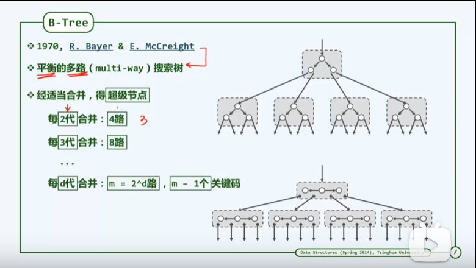

# B树

特性:
1. 树中每个节点至多有m棵子树, 至多含有m-1个关键字
理解:
B树简单理解成将二路搜索树合并得到的, 所以子树比关键字多1

2. 若根节点不是终端节点, 则至少有两颗子树

理解: 
只有在长高的时候会有两棵子树

3. 除了根节点外的所有非叶子节点至少有[m/2]棵子树, 即至少有[m/2] - 1 个关键字

理解: B树的插入只发生在叶子节点(不满足的话, 就成了修改操作了), 所以只有上溢的时候才会发生分裂, 此时分裂的产生的节点满足至少有[m/2] - 1 个关键字

4. 非叶子节点的构成 链表或者数组(向量), 或者用两个链表或者数组分别保存关键字和子树引用

5. 存在外部节点
