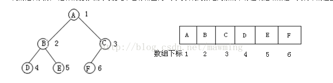

堆一般用完全二叉树来实现

度数: 一个树节点的度数就是这个树节点有多少子节点, 和树的深度意义不同

依据二叉树的性质，完全二叉树和满二叉树采用**顺序存储**比较合适



完全二叉树是效率很高的数据结构, 堆是一种完全二叉树或者近似完全二叉树, 所以效率极高, 像十分常用的排序算法, Dijkstra算法, Prim算法都要用到堆才能优化

二叉排序树的效率也要借助平衡性来提高, 而平衡性基于完全二叉树

## 完全二叉树

完全二叉树的定义(Complete Binary Tree)
若设二叉树的深度为h，除第 h 层外，其它各层 (1～h-1) 的结点数都达到最大个数，第 h 层所有的结点都连续集中在最左边，这就是完全二叉树。

## 完全二叉树的特点

叶子结点只可能在最大的两层上出现,对任意结点，若其右分支下的子孙最大层次为L，则其左分支下的子孙的最大层次必为L 或 L+1；

完全二叉树通常采用 数组而不是 链表存储,其 存储结构如下:
var tree:array[1..n]of longint;{n:integer;n>=1}

注意此时下标从1开始

奇数下标且大于1, 为右节点
偶数下标且小于n, 为左节点
对于节点i,
大于1, 父亲节点为 floor(i/2)
2i小于n

```text
对于tree[i] ，有如下特点：
（1）若i为奇数且i>1，那么tree的左兄弟为tree[i-1]；
（2）若i为偶数且i<n，那么tree的右兄弟为tree[i+1]；
（3）若i>1，tree的双亲为tree[i div 2]；
（4）若2*i<=n，那么tree的左孩子为tree[2*i]；若2*i+1<=n，那么tree的右孩子为tree[2*i+1]；
（5）若i>n div 2,那么tree[i]为 叶子结点（对应于（3））；
（6）若i<(n-1) div 2.那么tree[i]必有两个孩子（对应于（4））。
（7） 满二叉树一定是完全二叉树，完全二叉树不一定是满二叉树。
```

## 霍夫曼树

霍夫曼树：每个节点要吗没有子节点，要么有两个子节点
