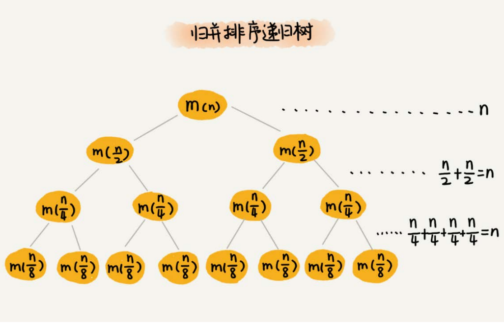

## 递推公式

归并排序涉及递归，时间复杂度的分析稍微有点复杂。我们正好借此机会来学习一下，如何分析递归代码的时间复杂度。
在递归那一节我们讲过，递归的适用场景是，一个问题a可以分解为多个子问题b、c，那求解问题a就可以分解为求解问题b、c。问题b、c解决之后，我们再
把b、c的结果合并成a的结果。
如果我们定义求解问题a的时间是T(a)，求解问题b、c的时间分别是T(b)和 T( c)，那我们就可以得到这样的递推关系式：
T(a) = T(b) + T(c) + K
其中K等于将两个子问题b、c的结果合并成问题a的结果所消耗的时间。
从刚刚的分析，我们可以得到一个重要的结论：不仅递归求解的问题可以写成递推公式，递归代码的时间复杂度也可以写成递推公式。
套用这个公式，我们来分析一下归并排序的时间复杂度。
我们假设对n个元素进行归并排序需要的时间是T(n)，那分解成两个子数组排序的时间都是T(n/2)。我们知道，merge()函数合并两个有序子数组的时间复杂度
是O(n)。所以，套用前面的公式，归并排序的时间复杂度的计算公式就是：
T(1) = C； n=1时，只需要常量级的执行时间，所以表示为C。
T(n) = 2*T(n/2) + n； n>1
通过这个公式，如何来求解T(n)呢？还不够直观？那我们再进一步分解一下计算过程。
T(n) = 2*T(n/2) + n
 = 2*(2*T(n/4) + n/2) + n = 4*T(n/4) + 2*n
 = 4*(2*T(n/8) + n/4) + 2*n = 8*T(n/8) + 3*n
 = 8*(2*T(n/16) + n/8) + 3*n = 16*T(n/16) + 4*n
 ......
 = 2^k *T(n/2^k) + k* n

......
通过这样一步一步分解推导，我们可以得到T(n) = 2^kT(n/2^k)+kn。当T(n/2^k)=T(1)时，也就是n/2^k=1，我们得到k=log2n 。我们将k值代入上面的公式，得
到T(n)=Cn+nlog2n 。如果我们用大O标记法来表示的话，T(n)就等于O(nlogn)。所以归并排序的时间复杂度是O(nlogn)。
从我们的原理分析和伪代码可以看出，归并排序的执行效率与要排序的原始数组的有序程度无关，所以其时间复杂度是非常稳定的，不管是最好情况、最坏情
况，还是平均情况，时间复杂度都是O(nlogn)。

## 递归树分析递归算法时间复杂度

画出算法递归树, 分析每一层的时间复杂度, 然后相加

