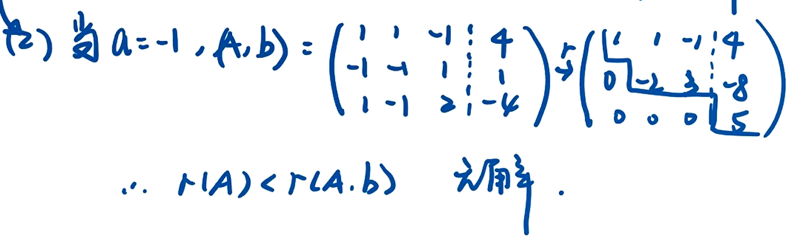
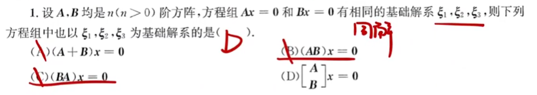
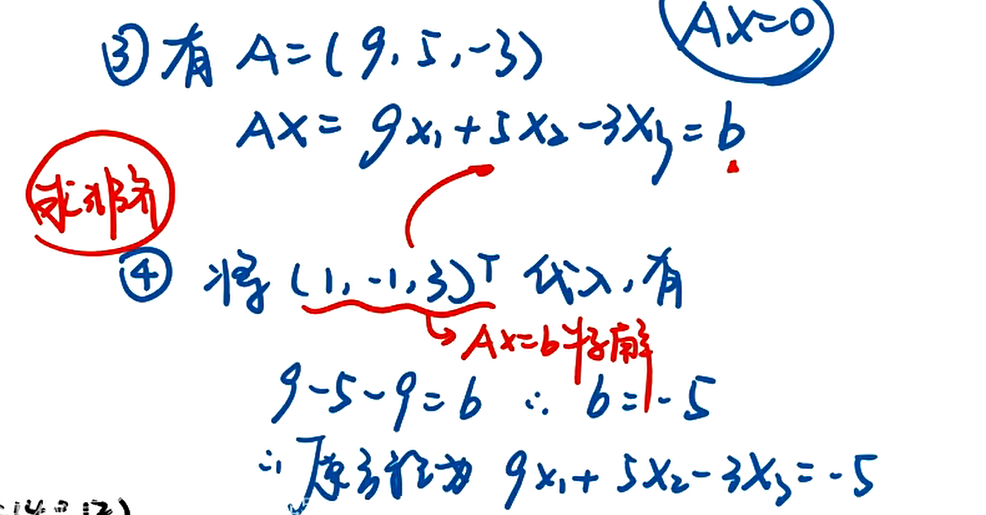

1. # 线性方程组

逻辑性, 充要条件考察

1. 解的判定
2. 线性方程组的计算
3. 线性方程组的结构, 性质

## 齐次线性方程组的基础解系

1. 初等行变换变成行最简(同解方程组)
   1. 行变换不改变;想一想（1）交换两行，相当于将方du程组中zhi两个方程交换位置。（2）一行乘一个数加到另一行相当一个方程乘一个数加上另一个方程 （3）一行乘一个非零数相当一个方程两边同乘一个非零数。这些变换都是可逆的。因此，方程组同解。

### 求解齐次线性方程

   

### 求解非齐次方程组

    

化成行最简之后, 取自由项为1, 其他的"反号顺抄", 对于特解, 自由项取0, 常数项"正号顺抄"

### 线性方程解的判定

对于矩阵的乘法, 相当于s个非齐次方程 

注意向量组线性标出的含义就是r(A) = r(A, b) = n, 我们说b可以由A唯一线性表出,  

### 含参数线性方程组的求解

如果系数矩阵是方阵可以求出对应的行列式

  

 

这一题用到了矩阵的秩的性质 r(A) + r(B) <= r(AB) + n, 其中A为m *n矩阵, B为n* s矩阵 

 

含参方程组中初等行变换的应用 

## 基础解系

3. AX=0的任两个基础解系等价

## 同解问题

$S_{A}是S_{B}的一部分, 说明B的解空间包含A, 举例子, A, B 均为三阶方阵, B的解空间为平面, A的解空间为直线, 此时A的秩小于B的秩$

解集小的秩大, 相当于约束少, 解越自由

大题先证明在使用

### $A为n阶矩阵, 对于齐次方程, A^{n}x = 0 和 A^{n+1}x = 0, 为充要条件$

一定注意上面命题成立的条件, $n阶矩阵, A^{n}x = 0 和 A^{n+1}x = 0, 同解$

### 基础解系

#### 找到非零向量

$基础解系n -r(A)个向量$

#### 转置

$(Ax)^{T}(Ax)=0 <=> Ax = 0, 其中(Ax)^{T}(Ax)是一个数$

### 同解问题

$A为列满秩的矩阵, r(AB) = r(B), 由r(AB) = r(A) + r(B) - n即可推导出来$

### 初等行变换为同解变换, 可逆矩阵A行向量和列向量线性无关, 即$Ax=0, 仅有零解$

### 通过通解求出原方程(基础解系=>原方程)

#### 通用解法

#### 特殊解法 (特征值法)

1. 基础解系是特征值为0对应的特征向量
2. 已知特征值和特征向量, 反求出对应的矩阵
3. 求矩阵的幂, $r(A)=1, A=\alpha\beta^{T}, A^{n}=l^{n-1}A, l=\alpha^{T}\beta=tr(A)$

#### 公共解

把方程组一的同解代入方程组二, 得到方程组一的通解系数的关系, 然后代入方程组一重组之后的结果就是公共解, r(方程组二)等于方程组基础解系的减量

## 灵活组

1. 抽象矩阵的乘法
2. 矩阵乘积的秩

