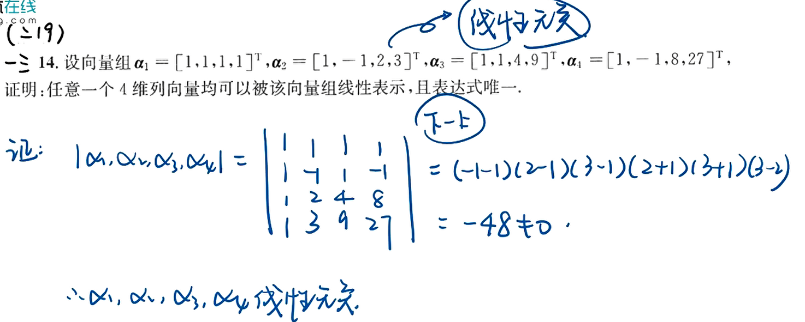
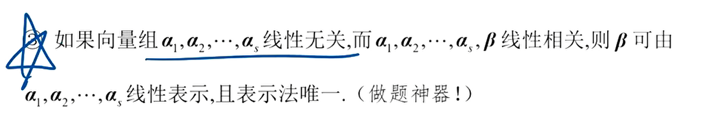
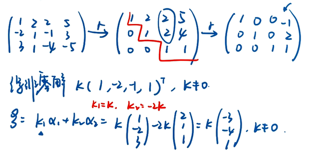
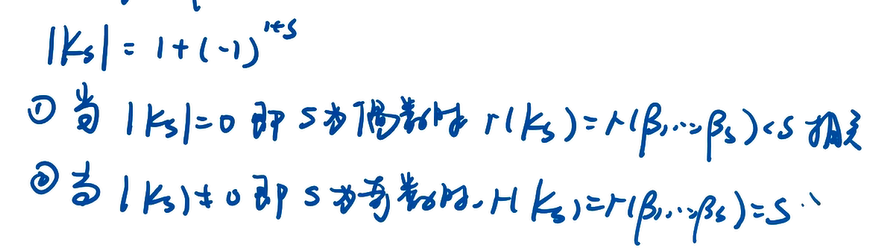
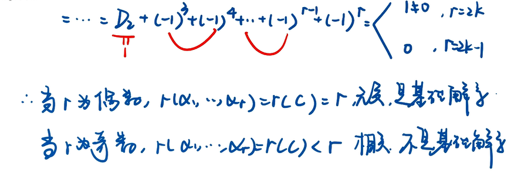

# 向量组

线性代数中反证法十分普遍

## 题型

建立直觉
秩
例子

直觉 "多余" <=> 可被替代

直觉:

1. A. 线性相关和线性无关都满足所有系数取0的情况, 但是附加的条件不一样, 相关是还有不全为0的系数, 线性无关是保证没有其他的系数
2. B. 成比例相关, 相关不一定成比例(线性组合之后成比例)
3. D. 极大无关组是线性无关的任一向量可由极大无关组线性表出
  

利用秩的概念, 所以对应的齐次方程有非零解, 可以想到有向量是多余的

直觉:

1. B. 向量组不含零向量, 向量组可以是相关也可以是无关, 含有零向量一定是相关的
2. D. 极大无关组, 整体无关可以推导出部分无关, 部分无关不能推导整体无关

直觉:

1. A B D. 多余的向量可以被极大无关组表示, 不是多余的向量属于极大无关组, 不能被其他向量组中其他向量线性表出
2. C. 可以被向量组部分标出, 也可以有全体表出

## 初等行变换不改变矩阵列向量的线性表出关系

## 等价

直觉:

1. 等价不一定向量的个数等价, 所以线性相关性不一定相等, 有一个可能有多余向量, 但是秩一定相等
2. 两个向量组等价两个向量组的秩相等, 也等于拼在一起的秩
3. 矩阵等价判别: 秩相等的同型矩阵即为等价

列满秩与矩阵乘积

矩阵的秩的公式:

1. $设A是m * n 阶矩阵, P, Q分别是m阶, n阶可逆矩阵, 则r(A)=r(PA)=r(AQ)=r(PAQ)$

基础解系:

1. 是解
2. 无关
3. $n - r(A) 个$

### 求出极大线性无关组, 表出其余向量

  

证明使用线性方程组证明

转置不改变行列式的值

## 向量组线性表出和向量组等价问题

线性表出是一个更强的要求, 线性无关比较弱
矩阵等价: 初等行变换之后能够变成另一个矩阵, 同型矩阵即秩相等即可

### 线性表出的存在性, 可以用初等列变换, 本质上是矩阵的秩, 具体到求列向量线性表示关系, 不能使用初等列表换, 因为会改变其线性表示关系

#### 例题24

## 向量组的线性相关性

### 例题2

### 例题2

线性无关: 向量中有一个分量无法被其他向量表示

### 例题三 (线性相关意味着多余, 零向量一定是多余的)

### 例题11

### 例题14 矩阵乘积的秩

$A乘以一个非零的向量等于0, 说明AX=0有非零解$

### 例题15

观察法: 含有很多1, 研究表达式

需要研究具体的表达式, 只能使用行变换

### 例题17

### 例题19

用A左乘, 使用基础解系的概念所以左乘之后会得到大量的0

### 例题26

定义法证明相关性
左乘一个矩阵, 得到大量的0, 只剩一个非零项, 从而证明线性无关

矩阵乘法的形式

这个题研究系数矩阵与另外一个向量的线性关系

### 例题28

0矩阵是所有的元素都是0

一个非0向量乘以他的转置不是零矩阵

## 向量组的秩, 极大线性无关组

矩阵的初等变换, 某一行和某一列的公因式直接约掉或者乘以一个数不会改变矩阵

注意区别行列式

## 方程组的解向量

记住规则, 原理左乘一个系数矩阵即可, 这里是左乘一个A

### 例题9

非齐次方程的特解相减得到齐次方程的解, 根据题目的条件得到基础解系的向量个数y
通过观察得出y个无关的解

### 例题21

研究线性方程组系数向量的线性关系, 不同于例题26

### 例题25

## C组

### 例题2

特值法, 找一个设r=3

### 例题3

### 例题4

### 例题5

$AB=-2B, CA^{T}=2C, 这里我们可以得出特征向量和特征值的结论$

计算量: 计算矩阵的逆:

1. 初等行变换
2. 行列式+伴随矩阵

### 例题7

$证明 r(A) = r(A^{T}A), 即证明(1)AX=0, A^{T}AX=0 为同解方程组$

### 例题9

1. 求特征值行列式的知识
2. 特征向量, 线性方程组求解

### 例题11

