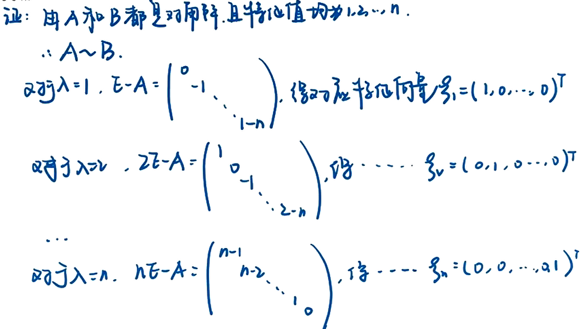
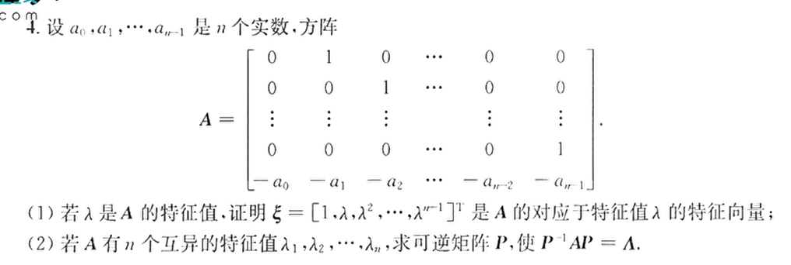
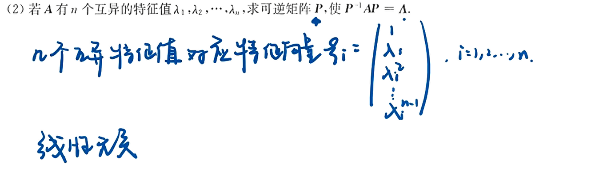
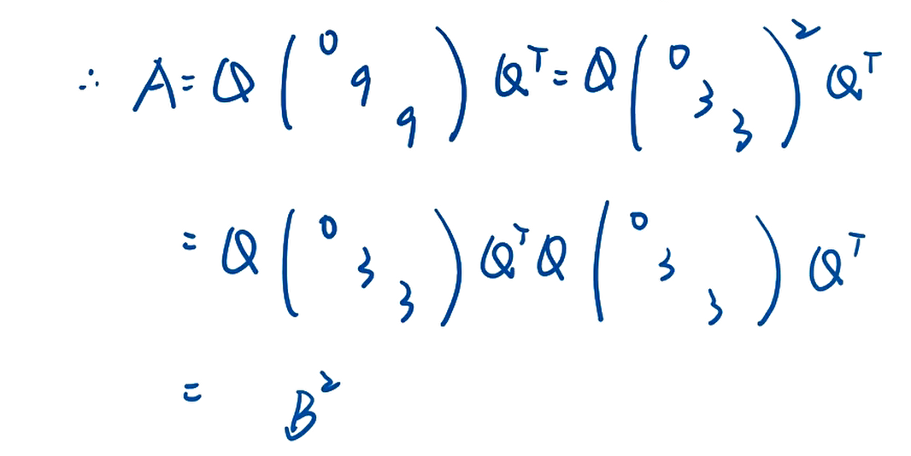

# 相似理论

相当于特征值相等

### 例题1

### 例题2

### 例题3

### 例题4

tr相等

### 例题5

## B组

方阵的相似对角化

### 例题2

小于0, 说明异号, 有两个特征值

### 例题6

求特征值方法

已知k重特征值, 特征值代入$\lambda E - A$可以通过判断这个系数矩阵得出系数矩阵的秩, 得出基础解系包含向量的个数, 即这个k重特征值有的无关的向量个数

### 例题10

$r(A) = r(0E -A)$

方法一

方法二

### 例题12

问题1不适合标注的方法

凑出

### 例题18

### 例题11

### 例题15

### 例题14

### 例题17

### 例题1

### 例题3

相似定义

### 例题4

### 例题9

注意行和相等中的特征值信息

### 例题7

### 例题5

## C组

### 例题2

### 例题3

### 例题4

### 例题5

 

### 例题6

