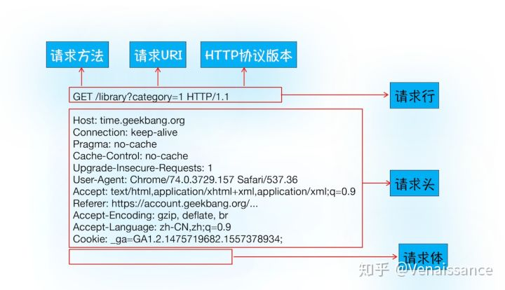
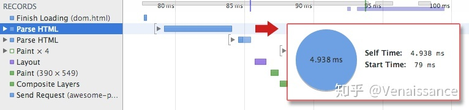

# [一次搞定前端“核心主线”——从输入URL到页面展示发生了什么](https://zhuanlan.zhihu.com/p/190320054)


如果说面试官**只能问一个问题**考察一个人前端知识的广度和深度的话，那**一定是从输入URL到页面展示发生了什么**。为什么这么说？因为从输入URL到页面展示就是前端的“**核心主线”**，搞清楚这个问题，就能**站在更高维度去理解前端**。今天就结合最近一段时间的学习和积累，争取把这条主线尽我所能地讲清楚，帮助大家的同时也帮助自己**一次搞定**从输入 URL 到页面展示到底发生了什么。

### 浏览器的多进程架构

在正式开始之前，我认为有必要以 Chrome 为例，介绍一下现代浏览器的多进程架构(multi-process architecture)，如下图所示：


其中主要的部分有：

- 浏览器进程 (Browser Process)，也叫主进程

- - UI 线程(UI Thread)，控制浏览器上的按钮和输入框等UI
  - 网络线程(NetWork Thread)，负责资源的下载
  - 存储线程(Storage Thread)，负责本地缓存文件的访问


- 渲染进程 (Renderer Process)，也叫浏览器内核

- - JS 引擎，负责执行 JavaScript，也是 JS 是单线程的由来
  - GUI 渲染线程，负责渲染资源，与 JS 引擎互斥（一个运行一个挂起）
  - 事件触发线程，管理事件循环 (鼠标点击、setTimeout、Mutation Observer、Ajax等)，按顺序把事件放到 JS 执行队列
  - 定时器线程，`setTimeout` 并不是 JS 的功能，只是浏览器开给 JS 的一个接口
  - 异步请求线程，处理 `AJAX` 请求，通过回调函数通知`事件触发进程`


- GPU进程，负责与 GPU 通信
- 第三方插件进程，就是我们安装的浏览器插件

说完浏览器的多进程架构，下面我们就正式开始讲**浏览器从输入URL到页面展示到底发生了什么**。

### 1. 构建请求

输入URL后，主进程中的 UI 线程接受到用户的 URL，判断用户输入的是 query 还是 URL。如果是 URL，把 URL 转发给网络线程，网络线程会构建请求行信息，构建好之后，浏览器就准备发起网络请求。

```js
// 请求方法是GET，路径为根路径，HTTP协议版本为1.1
GET / HTTP/1.1
```

### 2. 查找强缓存

浏览器在发起真正的网络请求前，会**先检查浏览器的强缓存，如果命中，直接返回对应资源文件的副本**。否则进入下一步。


### 2.1 什么是强缓存

浏览的缓存策略分为**强缓存**和**协商缓存**，他们之间的根本区别是**是否需要发请求**。简单来说，强缓存就是你的本地文件（保存在硬盘或者内存中），你可以**立马访问到**；协商缓存是需要发请求给服务器，问问资源是否有更新，**如果没有更新就访问本地缓存；如果更新，服务器会返回更新后的资源文件**。


### 2.2 强缓存的实现

在 HTTP/1.0 时代，强缓存是通过 HTTP 响应头中 **Expires** 字段实现的，Expires 的意思是过期，所以这个字段的内容就是一个**绝对的失效时间**，例如 `Expires:Wed, 05 Apr 2020 00:55:35 GMT`。浏览器通过这个失效时间和用户的**本地时间**相比较来判定是否读取缓存中的资源副本，这就带来一个很明显的问题，用户可以自己修改本地时间，使缓存失效。

所以 HTTP/1.1 中新加入了 **Cache-Control** 字段来解决这个问题，通过设置 `cache-control: max-age=XXX` ，可以实现缓存在 XXX 秒后过期（**相对时间**），这样就规避了用户可以自己篡改本地时间使缓存失效的问题。

在 `cache-control` 和 `Expires` 同时存在时，以 `cache-control` 优先。


### 3. DNS解析

发送真正网络请求首先需要进行 DNS 解析，目的就是**找到 URL 对应的服务器 IP 地址**。关于 DNS 解析的过程，我简单介绍一下，大致是先查找本地 DNS 缓存，找不到就问本地 DNS 服务器，再依次问根域 DNS 服务器，一级域名服务器，二级域名服务器，最后把找到的 IP 地址层层传递回来。这里再放一张图帮助大家更直观地理解。


### 4. 建立TCP连接

知道服务器的 IP 地址后，就可以跟服务器正式建立连接了，连接的方式分为两种，可靠的 TCP 和不可靠的 UDP，HTTP 协议是基于 TCP 的，所以需要跟服务器建立 TCP 连接。怎么建立呢？通过三次握手。三次握手的流程如下图所示。


那么大家有没有想过，为什么一定要三次握手，而不是两次或者一次呢？

是因为**浏览器和服务器都需要确认对方有正常的收发能力**。如果两次握手的话，客户端能知道服务端能收能发，但服务端只能知道客户端能发送数据，**并不知道客户端接受数据是没问题的**，大家把上图的第三次握手遮掉，想想看是不是这样？

### 5. 发送请求，收到响应

建立了 TCP 连接，浏览器就可以和服务器进行通信了，HTTP 中的数据就是在这个通信过程中传输的。下面是一个 HTTP 请求的完整示例。





服务器收到 HTTP 请求后，会返回给浏览器 HTTP 响应，下面是一个 HTTP 响应的完整示例。


服务器会通过响应行中的**状态码**告诉浏览器它的处理结果，常见的状态码有以下几类：

- 2XX：成功，最常见的是 200 OK
- 3XX：需要进一步操作，比如 301 永久重定向，302 临时重定向，304 未修改
- 4XX：请求出错，比如最常见的 404 未找到资源，还有 403 禁止请求
- 5XX：服务器出错，比如 500 服务器内部错误，502 网关错误

### 6.查找协商缓存

在上一步中如果 HTTP 响应行中的状态码为 304 (Not Modified 未修改)，内容为空时，那么就相当于告诉浏览器“**服务器上的资源跟你本地缓存的副本一样，从缓存中拿就行啦**”。这就是协商缓存的流程，**当强缓存过期**，或者 `cache-control` 设置 `no-cache` 时，就会进行协商缓存，浏览器会发送请求到服务器，根据响应头中的状态码判断是否要从缓存中读取。

### 6.1 协商缓存的实现

协商缓存是通过 HTTP/1.0 中的 **Last-Modified** 和 HTTP/1.1 中的 **E-Tag** 实现的。

Last-Modified 验证规则：浏览器第一次发送请求，服务器在响应头中带上 `Last-Modified`，并返回资源，浏览器下次发送相同请求时，会把之前收到的 `Last-Modified` 内容放到请求头中的 `If-Modified-Since` 字段，服务器收到后会跟请求资源的最后修改时间做对比，如果相同，返回 HTTP 304，如果不相同，返回HTTP 200，并返回最新的资源。详细的过程可以查看下图：


E-Tag 验证规则：验证过程跟 `Last-Modified` 类似，只不过是浏览器第一次收到的是 `etag`，第二次发送的是 `If-None-Match`。跟 `Last-Modified` 的区别是 `E-Tag` 的内容是资源的唯一标识符，`Last-Modified` 的内容是最后修改时间，且 E-Tag 优先级高于 Last-Modified。

想必你会好奇，既然功能一样，为什么 HTTP/1.1 要引入 E-Tag 实现协商缓存呢？

- 有些资源会被周期性的重写，但内容完全一样
- 有些资源可能被修改，但修改完全没必要让用户重新下载（修改注释或拼写）
- 有些资源的变化时间会小于一秒（比如实时监视器），所以 Last-Modified 的时间粒度不够了

这几种情况下，唯一标识资源的 E-Tag 就比 Last-Modified 管用啦。

### 7. 断开 TCP 连接

浏览器接受完服务器返回的资源后，需要断开 TCP 连接。断开 TCP 连接需要经历四次挥手。下图展示了四次挥手的过程。


那么为什么要四次挥手，而不是三次？

因为**多了服务端通知客户端数据发送完毕的第三次挥手**。大家想想，如果没有第三次挥手，而是客户端直接确认关闭连接的第四次挥手，客户端就无法收到服务器还没发完的数据，导致**数据丢失**。传输数据要有始有终，不得不佩服发明 TCP 协议的[罗伯特·卡恩](https://link.zhihu.com/?target=https%3A//www.wikiwand.com/zh-hans/%E7%BD%97%E4%BC%AF%E7%89%B9%C2%B7%E5%8D%A1%E6%81%A9)和[文顿·瑟夫](https://link.zhihu.com/?target=https%3A//www.wikiwand.com/zh-hans/%E6%96%87%E9%A0%93%C2%B7%E7%91%9F%E5%A4%AB)两位大佬，40多年前就发明出了如此严谨的数据传输协议。


### 8. 解析 HTML，构建 DOM 树 (Construction of a DOM)

完成上面的网络请求过程后，接下来就是浏览器的渲染进程解析和渲染资源的过程了。首先对于 HTML 文件，浏览器由它生成 DOM 树（一种浏览器可以理解的树形结构，全称是 Document Object Model）。

**那么浏览器具体是是如何构建 DOM 树的呢？通过以下四步。**


1. **转换 (Conversion)**。浏览器读取原始字节形式的 HTML，并按照指定的格式（例如 UTF-8）把这些字节翻译成单个字符。
2. **序列化 (Tokenizing)**。浏览器把第一步得到的字符串转换成不同的标记，例如 `<html>`, `<body>` 等，每个标记都有自己的含义和规则。
3. **词法分析 (Lexing)**。把这些标记转换为“对象”，来定义其属性和规则。
4. **构建 DOM (DOM construction)**。因为 HTML 标签有特定的包含规则，比如 html 包含 body，body 包含 div，我们又通过上一步生成的对象知道了标签之间的父子关系，所以就可以构建出 DOM 树。

每次浏览器处理 HTML 文件，都会经历上面的四个过程。在 HTML 比较复杂时，整个流程可能会比较费时。





### 9. 样式计算，构建 CSSOM 树 (Style calculation)

样式计算的目的是为了计算出上面 DOM 节点中每个元素的具体样式，这个阶段大体可以分成三步：

### 1. 把 CSS 转化为浏览器能够理解的结构 styleSheets

跟 HTML 文本一样，浏览器是无法直接理解纯文本的 CSS 样式，所以**渲染进程在接受到 CSS 文本时，会先执行一个转化操作，将 CSS 文本转化成浏览器能够理解的结构 styleSheets**。

在 Chrome 控制台中输入 `document.styleSheets` 就可以看到如下结构：


### 2. 转换样式表中的属性值，使其标准化


### 3. 计算出 DOM 树中每个节点的具体样式

样式的属性已经被标准化了，接下来就是要计算 DOM 树中每个节点的样式属性了，如何计算呢？

这里就会涉及到 CSS 的**继承规则**和**层叠规则**了。

**首先是 CSS 继承**，CSS 继承就是每**个 DOM 节点都会继承其父节点的样式**。下图能比较清晰地展示样式的继承过程：


**其次是样式层叠**，CSS 的全称就叫“层叠样式表”。关于层叠顺序，这里又可以引出 CSS 选择器的优先级：

- `内联style > id > class > 标签`
- `内联style > 内部style > 外部CSS文件`
- 一般来讲，越具体优先级越高，`!important` 的优先级最高，但是要**慎用**。

经过计算后就会生成 CSSOM (CSS Object Model) 树 ，大致如下图所示：


让我们回顾一下浏览器处理 CSS 的过程，其实**跟 HTML 是很类似的，从字节开始，翻译成字符、序列化、生成节点，最终生成 CSSOM (CSS Object Model)。**


### 10. 布局 (Layout)

我们虽然有 DOM 树和 DOM 树中每个节点的样式，但还不知道这些 DOM 元素的几何位置，所以接下来就需要计算出 DOM 树中可见元素的几何位置。我们把这个计算过程叫做布局。布局阶段可以分成两个子阶段，**创建布局树**和**布局计算**。

**布局树的构造过程**大概是这样：


我们可以观察到 DOM 树中所有 `display: none` 的节点都没有出现在布局树中。所以构建布局树的过程可以简单总结如下：

- **遍历 DOM 树中的所有可见节点**，并把这些节点加到布局树中
- **不可见节点会被布局树忽略**，如 `head` 标签下的全部内容，以及样式为 `display: none` 的元素

构建完布局树，接下来就是**计算布局树节点的实际坐标**了。至于具体的计算过程非常的复杂，我们暂且跳过，等待日后补充。

### 11. 生成图层树 (Dividing into layers)

有了布局树，而且还计算除了每个元素的具体位置信息，那么接下来可以开始绘制了吗？其实不是的。**在绘制之前，还有一个生成图层树 (Layer Tree) 的过程**。

为什么需要先生成图层树呢？**因为现代的前端页面有着非常复杂多样的效果，比如页面滚动、z-index 方向上的排序等，为了更加方便地实现这些效果，渲染进程还需要为特定的节点生成专用的图层，并生成一颗对应的图层树 (Layer Tree)。**布局树和图层树的对应关系大致如下：


那么问题来了，**需要什么样的条件，渲染进程才会为特定节点创建新的图层呢**？

### 1. 拥有层叠上下文属性的元素会被提升为单独一层

页面是二维平面，但层叠上下文能够让 HTML 具有三维概念。这些 HTML 元素会按照他们的优先级分布在垂直于二维平面的 z 轴上。具体的优先级顺序如下：

```
正z-index > z-index = 0 > inline > float > block > 负z-index > border > background
```


### 2. 需要裁剪的地方也会被创建为图层

裁剪的意思就是**要显示的内容超出它的容器**（比如 200 x 200 像素的 div 里面里面放着 1000 个字），另外如果出现滚动条，**滚动条也会被提升为单独的层**，类似下图这样。


### 12. 绘制 (Paint)

完成构建图层树之后，接下来就是渲染引擎对图层树中每个图层的绘制，具体的实现是渲染引擎会把一个图层的绘制拆分成很多小的**绘制指令**，然后再把这些指令按照顺序组成一个待绘制的列表，就像下图这样。


我们可以打开 Chrome 开发者工具的 Layers 标签，选择 "document" 层，实际体验下绘制列表的过程。给大家一个示意图作参考：


图中圈出来的就是 document 的绘制列表，拖动右侧的进度条就可以重现列表的绘制过程，是不是非常神奇呢？

### 13. 栅格化 (raster)

生成绘制列表后，会进行**栅格化**。**绘制列表只是用来记录绘制顺序和绘制指令的列表，而实际上绘制操作是由渲染引擎中的合成线程来完成的**。你可以结合下图来看下渲染主线程和合成线程之间的关系：


如上图所示，当图层的绘制列表准备好之后，主线程会把该绘制列表**提交（commit）**给合成线程，那么接下来合成线程是怎么工作的呢？这里需要先引入一个做过 H5 手机页面开发的都会比较熟悉的标签：

<meta name="viewport" content="width=device-width, initial-scale=1">

这里面的 viewport 就是用户可以实际看到的部分，中文翻译叫做**视口**。

**很多时候，页面的长度都是远大于屏幕高度的，所以图层都会比较大，但是通过视口，用户只能看到其中一部分内容，所以在这种情况下，要一次性绘制出所有图层内容的话，就会产生非常大的开销，而且也没有必要。**

基于这个原因，**合成线程会将图层划分为图块（tile），这些图块的大小通常是 256x256 或者 512x512**，如下图所示：


然后**合成线程会按照视口附近的图块来优先生成位图，实际生成位图的操作就是由栅格化来执行的。所谓的栅格化，是指将图块转换为位图。**而图块是栅格化执行的最小单位。渲染进程维护了一个栅格化的线程池，所有的图块栅格化都是在线程池内执行的，其运行方式如下图所示：


通常，**栅格化过程都会使用 GPU 来加速生成，使用 GPU 生成位图的过程叫快速栅格化，或者 GPU 栅格化，生成的位图被保存在 GPU 内存中。**

### 14. 合成与显示 (Composite and Display)

一旦所有图块都被光栅化，合成线程就会生成一个绘制图块的命令——“DrawQuad”，然后将该命令提交给浏览器进程。

浏览器进程里面有一个叫 viz 的组件，用来接收合成线程发过来的 DrawQuad 命令，然后根据 DrawQuad 命令，将其页面内容绘制到内存中，最后再将内存显示在屏幕上。这个过程可以用下图表示：


到这里，经过这一系列的阶段，编写好的 HTML、CSS、JavaScript 等文件，经过浏览器就会显示出漂亮的页面了。

### 渲染流水线总结

下面用一张图总结一下从收到服务器发来的资源后的整个渲染和显示过程，我们把这个过程称为**渲染流水线**。


结合上图，一个完整的渲染流程大致可总结为如下：

1. 渲染进程将 HTML 内容转换为能够读懂的 **DOM 树**结构。
2. 渲染引擎将 CSS 样式表转化为浏览器可以理解的 **styleSheets**，计算并生成 **CSSOM 树**。
3. 创建**布局树**，并计算元素的布局信息。
4. 对布局树进行分层，并生成**图层树**。
5. 为每个图层生成**绘制列表**，并将其提交到合成线程。
6. 合成线程将图层分成**图块**，并在**光栅化线程池**中将图块转换成位图。
7. 合成线程发送绘制图块命令 **DrawQuad** 给浏览器进程。
8. 浏览器进程根据 DrawQuad 消息**生成页面**，并**显示**到显示器上。

### 结语

完整的从输入URL到页面展示的全过程大概就是这样，其中的每一个过程都可以延伸出非常多的知识。如果其中某些部分大家想要理解地更加透彻，可以看看下面的参考链接。在不断打磨之后，最大的收获有两点：

1. 通过对某个领域**主线知识**的深入挖掘，我们就能**把离散的知识串起来，形成体系**
2. 其实学习任何领域都是一个把知识先变厚再变薄的过程，但**千万不能只有厚没有薄**

共勉。

------

### 参考链接

1. [Caching in HTTP](https://link.zhihu.com/?target=https%3A//www.w3.org/Protocols/rfc2616/rfc2616-sec13.html)
2. [Inside look at modern web browser (part 1)](https://link.zhihu.com/?target=https%3A//developers.google.com/web/updates/2018/09/inside-browser-part1)
3. [Inside look at modern web browser (part 3)](https://link.zhihu.com/?target=https%3A//developers.google.com/web/updates/2018/09/inside-browser-part3)
4. [Constructing the Object Model](https://link.zhihu.com/?target=https%3A//developers.google.com/web/fundamentals/performance/critical-rendering-path/constructing-the-object-model)
5. [面试官，不要再问我三次握手和四次挥手](https://link.zhihu.com/?target=https%3A//www.cnblogs.com/heyonggang/p/11634228.html)
6. [渲染流程（下）：HTML、CSS和JavaScript，是如何变成页面的？](https://link.zhihu.com/?target=https%3A//time.geekbang.org/column/article/118826)