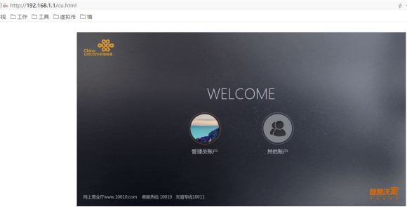
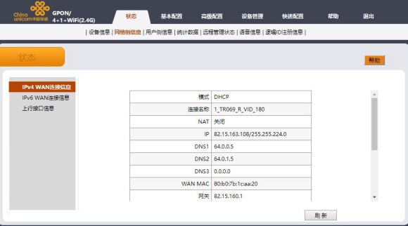
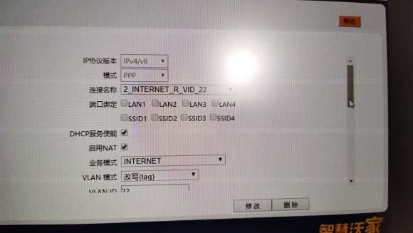
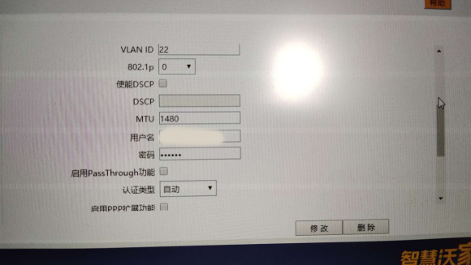
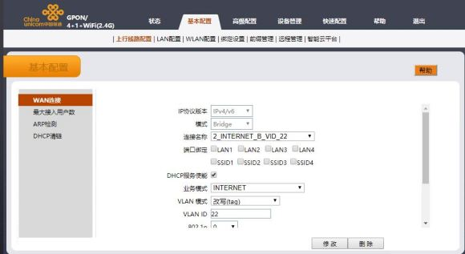
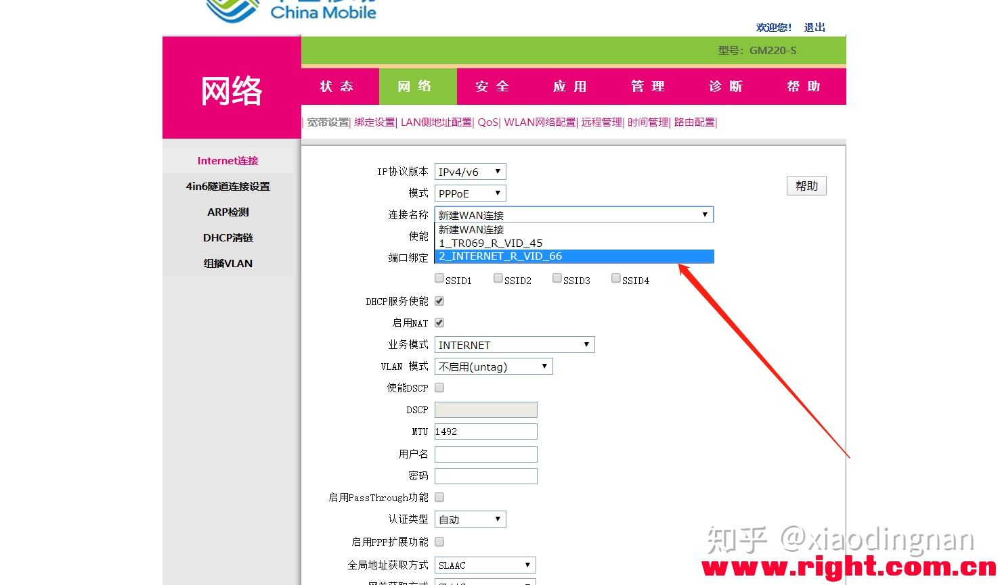
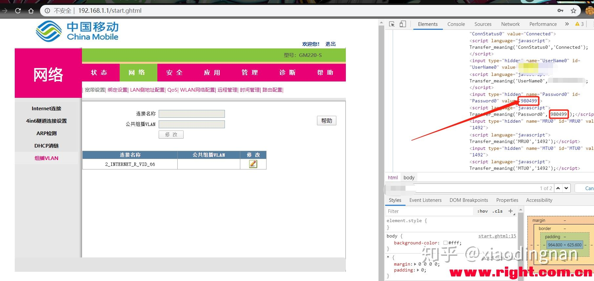

## 联通

1、首先需要进入管理员模式，地址是[http://192.168.1.1/cu.html](http://jump.bdimg.com/safecheck/index?url=x+Z5mMbGPAvQ1g2Bt+ru0YZbYVZllSoxrMQ5N5xDZsdS3cellNqVl8wZ6FQyPUluMs0mrMKEPJglfr9Gg+7M2TFPjHAHHOS57XC/DeZ07ManFhz466Mq1cVeGpQ5HO3eU9LI4CCJvs4wPGbuJnYGNA==)，选择管理员，账号密码可能是CUAdmin，我的密码被修改过，打联通电话查了一下才知道。

2、进入后在“状态-网络侧信息-IPv4 WAN连接信息”可以看到两个在用的连接信息，一个是“1_TR069_R_VID_180”另一个是“2_INTERNET_R_VID_22”,第一个TR069是联通远程管理光猫连接，不需要动，只需要删除第二个连接，并新建桥接连接。

3、选择“基本配置-上行线路配置-WAN连接”，协议类型选“IPv4/IPv6”，连接名称选“2_INTERNET_R_VID_22”，注意在这里需要记录几个关键信息，VLAN ID、用户名、密码，密码默认是123456，如果不是需要联系联通客服。记录好后，点击删除，把这个连接删除。

4、选择IPv4/IPv6，模式选“Bridge”，连接名称是“新建”，业务模式“INTERNET”，VLAN模式“改写（tag）”,VLAN ID是刚才记录的，其余不动，点创建，重启光猫，就可以用刚才的用户名密码进行路由器PPPOE连接。

如果后期需要管理光猫，用笔记本连接光猫其它接口，会自动获取192.168.1.x的地址。

## 移动

光猫超级密码用户名：admin

密码：属Cmcc10086#

广西地区的这个密码应该通用

重要宽带密码不记得看光猫上面写有一张纸条，我的由于按照师傅没带笔没给我写，可以在用超密登录之后点击网络---组播VLAN---按下F12---在按下Ctrl+F键---搜索自己的宽带账号手机号---在下面几行可就是你的宽带密码，或者10086客服修改

方法

1.先关闭WiFi功能

超级密码登录---网络---WLAN网络配置---取消勾选无线开关---确定

2.重要记住这个后面的两位数字（也可能是三位数字）

3.删除这个东西

网络---宽带设置---Internet连接---点击宽带名称---第二个（第一个删不了）---删除

4.新建桥模式

IP协议版本选择：ipv4/v6

模式选择：桥模式

端口绑定勾选：所有端口和SSID1VLAN 模式选择：改写(tag)

VLAN ID填写：我截图的那个你自己的，后面两个或者是三个数字

其他的默认

创建

[本贴来自恩山论坛](https://link.zhihu.com/?target=https%3A//www.right.com.cn/forum/thread-3788334-1-10.html)

## 电信

广东深圳电信设置光猫路由模式改桥接模式步骤：(中国电信设置光猫路由模式改桥接模式方法)

第一步：在光猫通电的情况下，把网线的一端接光猫的网口1，另一端接电脑的网口把电脑的本地连接地址设置为跟光猫同一个网段，这里设置为192.168.1.110

                广东深圳电信设置光猫路由模式改桥接模式步骤

第二步：在浏览器地址栏中输入光猫的地址192.168.1.1，进入光猫的登陆界面，输入超级用户名和密码，用户：telecomadmin 密码：nE7jA%5m ，然后点击登陆进入光猫设置界面第三步：进入光猫设置界面后，点击“网络”菜单，默认进入宽带设置界面

用户名 telecomadmin 密码 telecomadmin

                广东深圳电信设置光猫路由模式改桥接模式步骤

当你想把光猫设置为桥接模式时候，在用户名称那里选择 2_INTERNET_B_VID_41,下面的参数保持默认的情况，直接在左下角点击“保存”按钮就行了当你想把光猫设置为路由模式的时候，在用户名称那里同样选择 2_INTERNET_B_VID_41，然后进行参数的更改。

首先连接模式选择路由，之后会出现用户名和密码输入栏，在用户名那里输入宽带连接的账号，密码输入宽带的密码；其他参数保持不变，点击保存按钮，然后重新启动路由器就行了！
————————————————
版权声明：本文为CSDN博主「香港小蚂蚁」的原创文章，遵循CC 4.0 BY-SA版权协议，转载请附上原文出处链接及本声明。
原文链接：https://blog.csdn.net/weixin_35900818/article/details/112775955