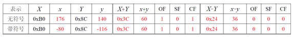

# [OF CF 标志位的判定](https://blog.csdn.net/a10201516595/article/details/103727065)

### OF:最高位进位⊕次高位进位（对带符号数才有意义）

最 高 位 进 位 ： 进 位 出 去 （ 溢 出 去 ） \color {green}{最高位进位：进位出去（溢出去）}最高位进位：进位出去（溢出去）

次 高 位 进 位 ： 进 位 到 最 高 位 （ 对 带 符 号 数 来 说 即 符 号 位 ） \color {green}{次高位进位：进位到最高位（对带符号数来说即符号位）}次高位进位：进位到最高位（对带符号数来说即符号位）

### CF: sub⊕C（⊕为异或，CF对无符号数才有意义）

作 减 法 则 s u b 为 1 \color {green}{作减法则sub为1}作减法则*s**u**b*为1

C 为 进 位 输 出 — — 最 高 位 有 无 进 位 出 去 （ 溢 出 去 ） \color {green}{C为进位输出——最高位有无进位出去（溢出去）}*C*为进位输出——最高位有无进位出去（溢出去）

### 举例：

假设n=8，机器数X和Y的真值分别为x和y

#### OF：

来看带符号那一行：

0xB0——1011 0000 （-80）
0x8C——1000 1100（-116）

X+Y：0011 1100 （60） 8 位 机 器 数 表 示 范 围 [ 127 , − 128 ] , 负 溢 出 后 加 上 2 n ， 这 题 中 即 加 上 256 \color {green}{8位机器数表示范围 [127,-128] , 负溢出后加上2^n，这题中即加上256}8位机器数表示范围[127,−128],负溢出后加上2*n*，这题中即加上256

− 80 − 116 + 256 = 60 \color {green}{-80-116+256=60}−80−116+256=60

> 关于溢出的处理，可以参照这个博客：[计算机内加减法的溢出处理](https://blog.csdn.net/a10201516595/article/details/102755328)

对 原 数 X （ 原 数 + 加 数 = 结 果 ） ： \color {red}{对原数X（原数+加数=结果）：}对原数*X*（原数+加数=结果）：

最 高 位 进 位 为 1 （ 最 高 位 1 + 1 ， 进 位 ） ， 次 高 位 没 有 进 位 （ 0 + 0 ） ， 1 ⊕ 0 = 1 ， 则 O F 为 1 \color {red}{最高位进位为1（最高位1+1，进位），次高位没有进位（0+0），1⊕0=1，则OF为1}最高位进位为1（最高位1+1，进位），次高位没有进位（0+0），1⊕0=1，则*O**F*为1

#### CF：

来看无符号那一行：

0xB0——1011 0000 （176）
0x8C——1000 1100（140）

X+Y：0011 1100 （60） 8 位 机 器 数 表 示 范 围 [ 127 , − 128 ] , 正 溢 出 后 减 去 2 n ， 这 题 中 即 减 去 上 256 \color {green}{8位机器数表示范围 [127,-128] , 正溢出后减去2^n，这题中即减去上256}8位机器数表示范围[127,−128],正溢出后减去2*n*，这题中即减去上256

对 原 数 X （ 原 数 + 加 数 = 结 果 ） ： \color {red}{对原数X（原数+加数=结果）：}对原数*X*（原数+加数=结果）：

加 法 ， s u b = 0 \color {red}{加法，sub=0}加法，*s**u**b*=0

最 高 位 进 位 （ 1 + 1 ， 溢 出 去 了 ） ， 进 位 输 出 C = 1 \color {red}{最高位进位（1+1，溢出去了），进位输出C=1}最高位进位（1+1，溢出去了），进位输出*C*=1

C F = s u b ⊕ C = 0 ⊕ 1 = 1 \color {red}{CF=sub⊕C=0⊕1=1}*C**F*=*s**u**b*⊕*C*=0⊕1=1

### 最 后 一 提 ： 计 算 机 对 带 / 无 符 号 数 的 机 器 码 统 一 处 理 \color {blue}{最后一提：计算机对带/无符号数的机器码统一处理}最后一提：计算机对带/无符号数的机器码统一处理

### O F ， Ｃ Ｆ 等 标 志 位 是 由 机 器 码 运 算 结 果 决 定 的 ， 是 否 为 带 符 号 数 并 不 影 响 \color {blue}{OF，ＣＦ等标志位是由机器码运算结果决定的，是否为带符号数并不影响}*O**F*，ＣＦ等标志位是由机器码运算结果决定的，是否为带符号数并不影响

### 所 以 ， 才 会 有 带 不 带 符 号 它 的 O F ， S F ， C F 都 一 样 \color {green}{所以，才会有带不带符号它的OF，SF，CF都一样}所以，才会有带不带符号它的*O**F*，*S**F*，*C**F*都一样

终极简单的判定方法：

求OF就把机器码转成带符号数然后运算，看有没有溢出

求CF同理，转成无符号数，然后运算看有没有溢出