前几回，在前面已经对[冒泡排序](https://zhuanlan.zhihu.com/p/122284534)、[直接插入排序](https://zhuanlan.zhihu.com/p/122293204)、[希尔排序](https://zhuanlan.zhihu.com/p/122632213)、[选择排序](https://zhuanlan.zhihu.com/p/123048793)、[快速排序](https://zhuanlan.zhihu.com/p/123416868)、[归并排序](https://zhuanlan.zhihu.com/p/124356219)做了说明分析。本回，将对堆排序进行相关说明分析。

---

## 一、排序算法系列目录说明

- 冒泡排序（Bubble Sort）
- 插入排序（Insertion Sort）
- 希尔排序（Shell Sort）
- 选择排序（Selection Sort）
- 快速排序（Quick Sort）
- 归并排序（Merge Sort）
- 堆排序（Heap Sort）
- 计数排序（Counting Sort）
- 桶排序（Bucket Sort）
- 基数排序（Radix Sort）

---

## 二、堆的相关概念

堆一般指的是二叉堆，顾名思义，二叉堆是完全二叉树或者近似完全二叉树

### 1\. 堆的性质

> ① 是一棵完全二叉树  
> ② 每个节点的值都大于或等于其子节点的值，为最大堆；反之为最小堆。

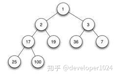

### 2\. 堆的存储

一般用数组来表示堆，下标为 i 的结点的父结点下标为\(i-1\)/2；其左右子结点分别为 \(2i + 1\)、\(2i + 2\)

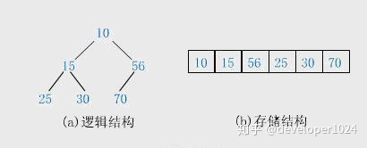

### 3\. 堆的操作

在堆的数据结构中，堆中的最大值总是位于根节点\(在优先队列中使用堆的话堆中的最小值位于根节点\)。堆中定义以下几种操作：

> ① **最大堆调整（Max\_Heapify）**：将堆的末端子节点作调整，使得子节点永远小于父节点  
> ② **创建最大堆（Build\_Max\_Heap）**：将堆所有数据重新排序  
> ③ **堆排序（HeapSort）**：移除位在第一个数据的根节点，并做最大堆调整的递归运算

---

## 三、堆排序（Heap Sort）

堆排序（Heapsort）是指利用堆这种数据结构所设计的一种排序算法。堆积是一个近似完全二叉树的结构，并同时满足堆积的性质：即子结点的键值或索引总是小于（或者大于）它的父节点。

### 1\. 基本思想

利用大顶堆\(小顶堆\)堆顶记录的是最大关键字\(最小关键字\)这一特性，使得每次从无序中选择最大记录\(最小记录\)变得简单。

> ① 将待排序的序列构造成一个最大堆，此时序列的最大值为根节点  
> ② 依次将根节点与待排序序列的最后一个元素交换  
> ③ 再维护从根节点到该元素的前一个节点为最大堆，如此往复，最终得到一个递增序列

### 2\. 实现逻辑

> ① 先将初始的R\[0…n-1\]建立成最大堆，此时是无序堆，而堆顶是最大元素。  
> ② 再将堆顶R\[0\]和无序区的最后一个记录R\[n-1\]交换，由此得到新的无序区R\[0…n-2\]和有序区R\[n-1\]，且满足R\[0…n-2\].keys ≤ R\[n-1\].key  
> ③ 由于交换后新的根R\[1\]可能违反堆性质，故应将当前无序区R\[1..n-1\]调整为堆。然后再次将R\[1..n-1\]中关键字最大的记录R\[1\]和该区间的最后一个记录R\[n-1\]交换，由此得到新的无序区R\[1..n-2\]和有序区R\[n-1..n\]，且仍满足关系R\[1..n-2\].keys≤R\[n-1..n\].keys，同样要将R\[1..n-2\]调整为堆。  
> ④ 直到无序区只有一个元素为止。

### 3\. 动图演示


堆排序算法的演示。首先，将元素进行重排，以匹配堆的条件。图中排序过程之前简单的绘出了堆树的结构。


  

**分步解析说明**：

实现堆排序需要解决两个问题：

> 1、如何由一个无序序列建成一个堆？  
> 2、如何在输出堆顶元素之后，调整剩余元素成为一个新的堆？

假设给定一个组无序数列\{100,5,3,11,6,8,7\}，带着问题，我们对其进行堆排序操作进行分步操作说明。

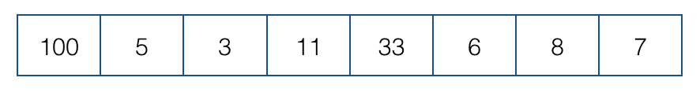

### 3.1 创建最大堆

①首先我们将数组我们将数组从上至下按顺序排列，转换成二叉树：一个无序堆。每一个三角关系都是一个堆，上面是父节点，下面两个分叉是子节点，两个子节点俗称左孩子、右孩子；

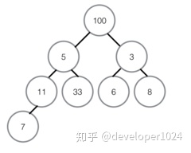

②转换成无序堆之后，我们要努力让这个无序堆变成最大堆\(或是最小堆\)，即每个堆里都实现父节点的值都大于任何一个子节点的值。


③从最后一个堆开始，即左下角那个没有右孩子的那个堆开始；首先对比左右孩子，由于这个堆没有右孩子，所以只能用左孩子，左孩子的值比父节点的值小所以不需要交换。如果发生交换，要检测子节点是否为其他堆的父节点，如果是，递归进行同样的操作。

④第二次对比红色三角形内的堆，取较大的子节点，右孩子8胜出，和父节点比较，右孩子8大于父节点3，升级做父节点，与3交换位置，3的位置没有子节点，这个堆建成最大堆。

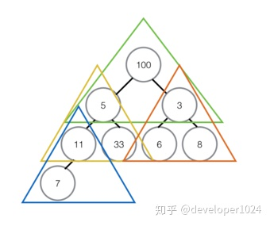

⑤对黄色三角形内堆进行排序，过程和上面一样，最终是右孩子33升为父节点，被交换的右孩子下面也没有子节点，所以直接结束对比。

⑥最顶部绿色的堆，堆顶100比左右孩子都大，所以不用交换，至此最大堆创建完成。

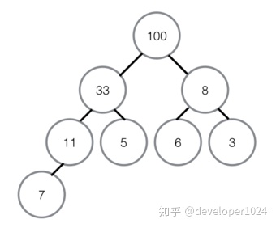

### 3.2 堆排序（最大堆调整）

①首先将堆顶元素100交换至最底部7的位置，7升至堆顶，100所在的底部位置即为有序区，有序区不参与之后的任何对比。

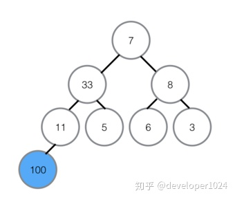

②在7升至顶部之后，对顶部重新做最大堆调整，左孩子33代替7的位置。

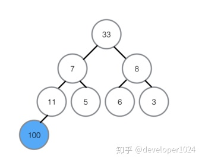

③在7被交换下来后，下面还有子节点，所以需要继续与子节点对比，左孩子11比7大，所以11与7交换位置，交换位置后7下面为有序区，不参与对比，所以本轮结束，无序区再次形成一个最大堆。

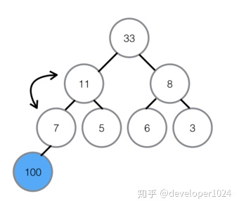

④将最大堆堆顶33交换至堆末尾，扩大有序区；

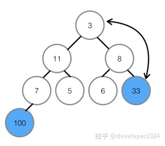

⑤不断建立最大堆，并且扩大有序区，最终全部有序。

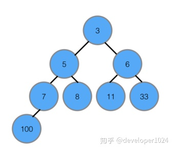

### 4\. 复杂度分析

- 平均时间复杂度：O\(nlogn\)
- 最佳时间复杂度：O\(nlogn\)
- 最差时间复杂度：O\(nlogn\)
- 稳定性：不稳定

堆排序其实也是一种选择排序，是一种树形选择排序。只不过直接选择排序中，为了从R\[1…n\]中选择最大记录，需比较n-1次，然后从R\[1…n-2\]中选择最大记录需比较n-2次。事实上这n-2次比较中有很多已经在前面的n-1次比较中已经做过，而树形选择排序恰好利用树形的特点保存了部分前面的比较结果，因此可以减少比较次数。对于n个关键字序列，最坏情况下每个节点需比较log2\(n\)次，因此其最坏情况下时间复杂度为nlogn。堆排序为不稳定排序，不适合记录较少的排序。

### 5\. 代码实现

**C版本：**

```c
#include <stdio.h>
#include <stdlib.h>
void swap(int* a, int* b) {
    int temp = *b;
    *b = *a;
    *a = temp;
}
void max_heapify(int arr[], int start, int end) {
    //建立父节点指标和子节点指标
    int dad = start;
    int son = dad * 2 + 1;
    while (son <= end) { //若子节点指标在范围内才做比较
        if (son + 1 <= end && arr[son] < arr[son + 1]) //先比较两个子节点大小，选择最大的
            son++;
        if (arr[dad] > arr[son]) //如果父节点大于子节点代表调整完毕，直接跳出函数
            return;
        else { //否则交换父子内容再继续子节点和孙节点比较
            swap(&arr[dad], &arr[son]);
            dad = son;
            son = dad * 2 + 1;
        }
    }
}
void heap_sort(int arr[], int len) {
    int i;
    //初始化，i从最后一个父节点开始调整
    for (i = len / 2 - 1; i >= 0; i--)
        max_heapify(arr, i, len - 1);
    //先将第一个元素和已排好元素前一位做交换，再从新调整，直到排序完毕
    for (i = len - 1; i > 0; i--) {
        swap(&arr[0], &arr[i]);
        max_heapify(arr, 0, i - 1);
    }
}
int main() {
    int arr[] = { 3, 5, 3, 0, 8, 6, 1, 5, 8, 6, 2, 4, 9, 4, 7, 0, 1, 8, 9, 7, 3, 1, 2, 5, 9, 7, 4, 0, 2, 6 };
    int len = (int) sizeof(arr) / sizeof(*arr);
    heap_sort(arr, len);
    int i;
    for (i = 0; i < len; i++)
        printf("%d ", arr[i]);
    printf("\n");
    return 0;
}
```

**C++版本：**

```cpp
#include <iostream>
#include <algorithm>
using namespace std;
void max_heapify(int arr[], int start, int end) {
    //建立父节点指标和子节点指标
    int dad = start;
    int son = dad * 2 + 1;
    while (son <= end) { //若子节点指标在范围内才做比较
        if (son + 1 <= end && arr[son] < arr[son + 1]) //先比较两个子节点大小，选择最大的
            son++;
        if (arr[dad] > arr[son]) //如果父节点大于子节点代表调整完毕，直接跳出函数
            return;
        else { //否则交换父子内容再继续子节点和孙节点比较
            swap(arr[dad], arr[son]);
            dad = son;
            son = dad * 2 + 1;
        }
    }
}
void heap_sort(int arr[], int len) {
    //初始化，i从最后一个父节点开始调整
    for (int i = len / 2 - 1; i >= 0; i--)
        max_heapify(arr, i, len - 1);
    //先将第一个元素和已经排好的元素前一位做交换，再从新调整(刚调整的元素之前的元素)，直到排序完毕
    for (int i = len - 1; i > 0; i--) {
        swap(arr[0], arr[i]);
        max_heapify(arr, 0, i - 1);
    }
}
int main() {
    int arr[] = { 3, 5, 3, 0, 8, 6, 1, 5, 8, 6, 2, 4, 9, 4, 7, 0, 1, 8, 9, 7, 3, 1, 2, 5, 9, 7, 4, 0, 2, 6 };
    int len = (int) sizeof(arr) / sizeof(*arr);
    heap_sort(arr, len);
    for (int i = 0; i < len; i++)
        cout << arr[i] << ' ';
    cout << endl;
    return 0;
}
```

**Java版本：**

```java
import java.util.Arrays;
public class HeapSort {

    private int[] arr;

    public HeapSort(int[] arr){
        this.arr = arr;
    }

    /**
     * 堆排序的主要入口方法，共两步。
     */
    public void sort(){
        /*
         *  第一步：将数组堆化
         *  beginIndex = 第一个非叶子节点。
         *  从第一个非叶子节点开始即可。无需从最后一个叶子节点开始。
         *  叶子节点可以看作已符合堆要求的节点，根节点就是它自己且自己以下值为最大。
         */
        int len = arr.length - 1;
        int beginIndex = (len - 1) >> 1;
        for(int i = beginIndex; i >= 0; i--){
            maxHeapify(i, len);
        }

        /*
         * 第二步：对堆化数据排序
         * 每次都是移出最顶层的根节点A[0]，与最尾部节点位置调换，同时遍历长度 - 1。
         * 然后从新整理被换到根节点的末尾元素，使其符合堆的特性。
         * 直至未排序的堆长度为 0。
         */
        for(int i = len; i > 0; i--){
            swap(0, i);
            maxHeapify(0, i - 1);
        }
    }

    private void swap(int i,int j){
        int temp = arr[i];
        arr[i] = arr[j];
        arr[j] = temp;
    }

    /**
     * 调整索引为 index 处的数据，使其符合堆的特性。
     *
     * @param index 需要堆化处理的数据的索引
     * @param len 未排序的堆（数组）的长度
     */
    private void maxHeapify(int index,int len){
        int li = (index << 1) + 1; // 左子节点索引
        int ri = li + 1;           // 右子节点索引
        int cMax = li;             // 子节点值最大索引，默认左子节点。

        if(li > len) return;       // 左子节点索引超出计算范围，直接返回。
        if(ri <= len && arr[ri] > arr[li]) // 先判断左右子节点，哪个较大。
            cMax = ri;
        if(arr[cMax] > arr[index]){
            swap(cMax, index);      // 如果父节点被子节点调换，
            maxHeapify(cMax, len);  // 则需要继续判断换下后的父节点是否符合堆的特性。
        }
    }

    /**
     * 测试用例
     *
     * 输出：
     * [0, 0, 0, 1, 1, 1, 2, 2, 2, 3, 3, 3, 4, 4, 4, 5, 5, 5, 6, 6, 6, 7, 7, 7, 8, 8, 8, 9, 9, 9]
     */
    public static void main(String[] args) {
        int[] arr = new int[]{3,5,3,0,8,6,1,5,8,6,2,4,9,4,7,0,1,8,9,7,3,1,2,5,9,7,4,0,2,6};        
        new HeapSort(arr).sort();        
        System.out.println(Arrays.toString(arr));
    }
```

---

## 四、总结

堆是一种很好做调整的结构，在算法题里面使用频度很高。常用于想知道最大值或最小值的情况，比如优先级队列，作业调度等场景。

堆排序相看似比较复杂（建堆的过程，堆调整的过程，堆排序等等），需要好好推敲揣摩理清思路。堆排序操作过程中其运行时间主要耗费在建初始堆和调整建新堆时进行的反复“筛选”上。

下一篇预告：**计数排序（Counting Sort）**。欲知详情，且听下回分解。

---

**PS**: 更多资源，欢迎关注微信公众号：**developer1024**

