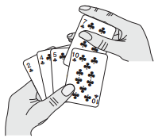
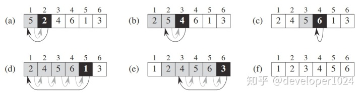
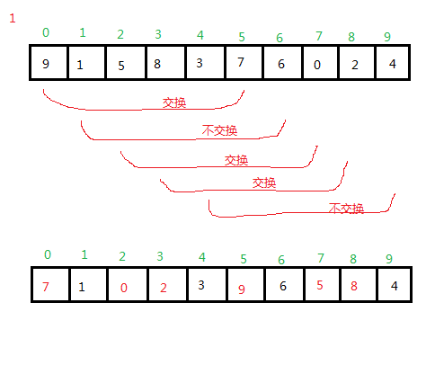
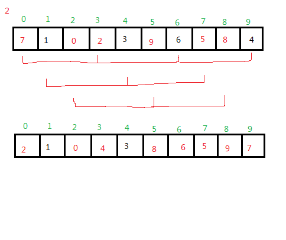
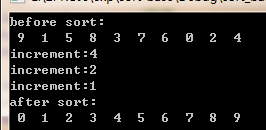

# 插入排序

---

## 一、排序算法系列目录说明

- 冒泡排序（Bubble Sort）
- 插入排序（Insertion Sort）
- 希尔排序（Shell Sort）
- 选择排序（Selection Sort）
- 快速排序（Quick Sort）
- 归并排序（Merge Sort）
- 堆排序（Heap Sort）
- 计数排序（Counting Sort）
- 桶排序（Bucket Sort）
- 基数排序（Radix Sort）

---

## 二、插入排序（Insertion Sort）

_插入排序（Insertion-Sort）_的算法描述是一种简单直观的排序算法。打过扑克牌的应该都会明白（当然，如果你说你打扑克牌摸牌的时候从来不按牌的大小整理牌，那我只能呵呵了）

### 1\. 基本思想

插入排序的工作原理是通过构建有序序列，对于未排序数据，在已排序序列中从后向前扫描，找到相应位置并插入。插入排序在实现上，通常采用in-place排序（即只需用到O\(1\)的额外空间的排序），因而在从后向前扫描过程中，需要反复把已排序元素逐步向后挪位，为最新元素提供插入空间。

趣味解释：



插入排序操作类似于摸牌并将其从大到小排列。每次摸到一张牌后，根据其点数插入到确切位置。

如上图：表示的是摸到草花7后进行插入的过程。忽略最右边的草花10，相当于一开始7在最右边，然后逐个与左边的排相比较\(当然左边的牌早已排好顺序\)，将其放置在合适的位置。当摸到草花10后重复上述过程即可。

而实际中，如何将插入牌的这个过程应用到实际排序操作中呢？具体我们以一组数字来说操作说明：



例如我们有一组数字：｛5，2，4，6，1，3｝，我们要将这组数字从小到大进行排列。 我们从第二个数字开始，将其认为是新增加的数字，这样第二个数字只需与其左边的第一个数字比较后排好序；在第三个数字，认为前两个已经排好序的数字为手里整理好的牌，那么只需将第三个数字与前两个数字比较即可；以此类推，直到最后一个数字与前面的所有数字比较结束，插入排序完成。

### 2\. 实现逻辑

> ① 从第一个元素开始，该元素可以认为已经被排序  
> ② 取出下一个元素，在已经排序的元素序列中从后向前扫描  
> ③如果该元素（已排序）大于新元素，将该元素移到下一位置  
> ④ 重复步骤③，直到找到已排序的元素小于或者等于新元素的位置  
> ⑤将新元素插入到该位置后  
> ⑥ 重复步骤②\~⑤

### 3\. 动图演示


插入排序

## **4**. 性能分析

> 平均时间复杂度：O\(N\^2\)  
> 最差时间复杂度：O\(N\^2\)  
> 空间复杂度：O\(1\)  
> 排序方式：In-place  
> 稳定性：稳定

如果插入排序的目标是把n个元素的序列升序排列，那么采用插入排序存在最好情况和最坏情况：

> \(1\) 最好情况：序列已经是升序排列，在这种情况下，需要进行的比较操作需\(n-1\)次即可。  
> \(2\) 最坏情况：序列是降序排列，那么此时需要进行的比较共有n\(n-1\)/2次。

插入排序的赋值操作是比较操作的次数减去\(n-1\)次。平均来说插入排序算法复杂度为O\(N\^2\)。

最优的空间复杂度为开始元素已排序，则空间复杂度为 0；

最差的空间复杂度为开始元素为逆排序，则空间复杂度最坏时为 O\(N\);

平均的空间复杂度为O\(1\)

```text
注：
n：数据规模
k：”桶”的个数
In-place：占用常数内存，不占用额外内存
Out-place：占用额外内存
```

### 5\. 代码实现

```cpp
// 插入排序
void InsertSort(int arr[], int len){
    // 检查数据合法性
    if(arr == NULL || len <= 0){
        return;
    }
    for(int i = 1; i < len; i++){
        int tmp = arr[i];
        int j;
        for(j = i-1; j >= 0; j--){
            //如果比tmp大把值往后移动一位
            if(arr[j] > tmp){
               arr[j+1] = arr[j];
            }
            else{
               break;
            }
        }
        arr[j+1] = tmp;
    }
}
```

### 6\. 算法优化改进

### 6.1 改进方法①

场景分析：

直接插入排序每次往前插入时，是按顺序依次往前查找，数据量较大时，必然比较耗时，效率低。

改进思路： 在往前找合适的插入位置时采用二分查找的方式，即折半插入。

二分插入排序相对直接插入排序而言：平均性能更快，时间复杂度降至O\(NlogN\)，排序是稳定的，但排序的比较次数与初始序列无关，相比直接插入排序，在速度上有一定提升。逻辑步骤：

> ① 从第一个元素开始，该元素可以认为已经被排序  
> ② 取出下一个元素，在已经排序的元素序列中二分查找到第一个比它大的数的位置  
> ③将新元素插入到该位置后  
> ④ 重复上述两步

改进代码：

```cpp
// 插入排序改进：二分插入排序
void BinaryInsertSort(int arr[], int len)   
{   
    int key, left, right, middle;   
    for (int i=1; i<len; i++)   
    {   
        key = a[i];   
        left = 0;   
        right = i-1;   
        while (left<=right)   
        {   
            middle = (left+right)/2;   
            if (a[middle]>key)   
                right = middle-1;   
            else   
                left = middle+1;   
        }   

        for(int j=i-1; j>=left; j--)   
        {   
            a[j+1] = a[j];   
        }   

        a[left] = key;          
    }   
}
```

### 6.2 改进方法②

场景分析：

\(1\) 插入排序对几乎已排好序的数据操作时，效率很高，可以达到线性排序的效率。

\(2\) 插入排序在每次往前插入时只能将数据移动一位，效率比较低。

改进思路：

先将整个待排元素序列分割成若干个子序列（由相隔某个“增量”的元素组成的）分别进行直接插入排序，然后依次缩减增量再进行排序，待整个序列中的元素基本有序（增量足够小）时，再对全体元素进行一次直接插入排序。

改进思路二的方法实际上就是希尔排序。在这里只给出思路，在后续系列《算法：排序算法之希尔排序》中再做具体讲解说明。

---

### 三、总结

插入排序不适合对于数据量比较大的排序应用。但是，如果需要排序的数据量很小，例如，量级小于千，那么插入排序还是一个不错的选择。尤其当数据基本有序时，采用插入排序可以明显减少数据交换和数据移动次数，进而提升排序效率。 在STL的sort算法和stdlib的qsort算法中，都将插入排序作为快速排序的补充，用于少量元素的排序。

---


# [算法学习记录-排序——希尔排序](https://www.cnblogs.com/jsgnadsj/p/3458054.html)

希尔排序:

 

　　直接插入排序在在本身数量比较少的时候情况下效率很高，如果待排数的数量很多，其效率不是很理想。

　　回想一下直接插入排序过程，排序过程中，我们可以设置一条线，左边是排好序的，右边则是一个一个等待排序，

如果最小的那个值在最右边，那么排这个最小值的时候，需要将所有元素向右边移动一位。

　　是否能够减少这样的移位呢？

　　我们不希望它是一步一步的移动，而是大步大步的移动。希尔排序就被发明出来了，它也是当时打破效率

O（n2）的算法之一。希尔排序算法通过设置一个间隔，对同样间隔的数的集合进行插入排序，此数集合中的元素

移位的长度是以间隔的长度为准，这样就实现了大步位移。但是最后需要对元素集合进行一次直接插入排序，所以

最后的间隔一定是1。

下面举一个例子：

第一趟希尔排序，间隔为4



第二趟排序：间隔是2



第三趟 间隔为1，即 直接插入排序法：

。。。

。。

。

　

有人问，这个间隔怎么确定，这是个数学难题，至今没有解答。但是通过大量的实验，还是有个经验值。

 

> 减小间隔
>
> ​    上面已经演示了以4为初始间隔对包含10个数据项的数组进行排序的情况。对于更大的数组开始的间隔也应该更大。然后间隔不断减小，直到间隔变成1。
>
> ​    举例来说，含有1000个数据项的数组可能先以364为增量，然后以121为增量，以40为增量，以13为增量，以4为增量，最后以 1为增量进行希尔排序。用来形成间隔的数列被称为间隔序列。这里所表示的间隔序列由Knuth提出，此序列是很常用的。数列以逆向形式从1开始，通过递归表达式
>
> ​    h=3*b+1
>
> ​    来产生，初始值为1。
>
>    
>
> ​    在排序算法中，首先在一个短小的循环中使用序列的生成公式来计算出最初的间隔。h值最初被赋为1，然后应用公式h=3*h+1生成序列1,4,13,40,121,364，等等。当间隔大于数组大小的时候，这个过程停止。对于一个含有1000个数据项的数组，序列的第七个数字，1093就太大了。因此，使用序列的第六个数字作为最大的数字来开始这个排序过程，作364-增量排序。然后，每完成一次排序全程的外部循环，用前面提供的此公式倒推式来减小间隔：
>
> ​    h=(h-1)/3
>
> ​    这个倒推的公式生成逆置的序列364,121,40,13,4,1。从364开始，以每一个数字作为增量进行排序。当数组用1-增量排序后，算法结束。
>
>  
>
> ​    希尔排序比插入排序快很多，它是基于什么原因呢？当h值大的时候，数据项每一趟排序需要移动元素的个数很少，但数据项移动的距离很长。这是非常有效率的。当h减小时，每一趟排序需要移动的元素的个数增多，但是此时数据项已经接近于它们排序后最终的位置，这对于插入排序可以更有效率。正是这两种情况的结合才使希尔排序效率那么高。
>
> ​    注意后期的排序过程不撤销前期排序所做的工作。例如，已经完成了以40-增量的排序的数组，在经过以13-增量的排序后仍然保持了以40-增量的排序的结果。如果不是这样的话，希尔排序就无法实现排序的目的。

 

 

> 其他间隔序列
>
> ​    选择间隔序列可以称得上是一种魔法。至此只讨论了用公式h=h*3+1生成间隔序列，但是应用其他间隔序列也取得了不同程序的成功，只是一个绝对的条件，就是逐渐减小的间隔最后一定要等于1，因此最后一趟排序是一次普通的插入排序。
>
> ​    在希尔的原稿中，他建议初始的间距为N/2，简单地把每一趟排序分成了两半。因此，对于N=100的数组逐渐减小的间隔序列为50,25,12,6,3,1。这个方法的好处是不需要在不开始排序前为找到初始的间隔而计算序列；而只需要用2整除N。但是，这被证明并不是最好的数列。尽管对于大多数的数据来说这个方法还是比插入排序效果好，但是这种方法有时会使运行时间降到O(N2)，这并不比插入排序的效率更高。
>
> ​    这个方法的一个变形是用2.2而非2来整除每一个间隔。对于N=100的数组来说，会产生序列45,20,9,4,1。这比用2整除显著改善了效果，因为这样避免了某些导致时间复杂度为O(N2)的最坏情况的发生。不论N为何值，都需要一些额外的代码来保证序列的最后取值为1。这产生了和清单中所列的Knuth序列差不多的结果。
>
> ​    递减数列的另一个可能是
>
> if(h<5)
>
>   h=1;
>
> else
>
>   h=(5*h-1)/11;
>
> ​    间隔序列中的数字互质通常被认为很重要：也就是说，除了1之外它们没有公约数。这个约束条件使每一趟排序更有可能保持前一趟排序已排好的效果。希尔最初以N/2为间隔的低效性就是归咎于它没有遵守这个准则。
>
> ​    或许还可以设计出像如上讲述的间隔序列一样好的间隔序列。但是不管这个间隔序列是什么，都应该能够快速地计算，而不会降低算法的执行速度。

 

这就是希尔算法的思想：

先将整个待排记录序列分割成为若干子序列分别进行直接插入排序，待整个序列中的记录“基本有序”时，在对全体进行一次直接插入排序。

 

代码：

因为希尔排序就是有增量的直接插入排序，所以将原先直接插入代码修改一下，把步进长度改为增量即可。

[](javascript:void(0);)

```
 1 void shellSort(myDataType *ary,int len)
 2 {
 3     int i,j;
 4     int increment = len;//增量
 5     myDataType key;
 6     while(increment > 1)//最后在增量为1并且是执行了情况下停止。
 7     {
 8         increment = increment/3 + 1;//根据公式
 9         //printf("increment:%d\n",increment);
10         for (i=increment;i<len;i++)//从[0]开始，对相距增量步长的元素集合进行修改。
11         {
12             key = ary[i];
13             //以下和直接插入排序类似。
14             j=i-increment;
15             while(j >= 0)
16             {
17                 if (key < ary[j] )
18                 {
19                     myDataType temp = ary[j];
20                     ary[j] = key;
21                     ary[j+increment] = temp;
22                 }
23                 j=j-increment;
24             }
25         }
26     }
27 }
```

[](javascript:void(0);)

 

完整代码:

[](javascript:void(0);)

```
 1 #include "stdafx.h"
 2 
 3 
 4 typedef int myDataType;
 5 myDataType src_ary[10] = {9,1,5,8,3,7,6,0,2,4};
 6 
 7 void prt_ary(myDataType *ary,int len)
 8 {
 9     int i=0;
10     while(i < len)
11     {
12         printf(" %d ",ary[i++]);
13     }
14     printf("\n");
15 }
16 void shellSort(myDataType *ary,int len)
17 {
18     int i,j;
19     int increment = len;//增量
20     myDataType key;
21     while(increment > 1)//最后在增量为1并且是执行了情况下停止。
22     {
23         increment = increment/3 + 1;//根据公式
24         //printf("increment:%d\n",increment);
25         for (i=increment;i<len;i++)//从[0]开始，对相距增量步长的元素集合进行修改。
26         {
27             key = ary[i];
28             //以下和直接插入排序类似。
29             j=i-increment;
30             while(j >= 0)
31             {
32                 if (key < ary[j] )
33                 {
34                     myDataType temp = ary[j];
35                     ary[j] = key;
36                     ary[j+increment] = temp;
37                 }
38                 j=j-increment;
39             }
40         }
41     }
42 }
43 
44 
45 int _tmain(int argc, _TCHAR* argv[])
46 {
47     printf("before sort:\n");
48     prt_ary(src_ary,10);
49 
50     //bubble_sort(src_ary,10);
51     //bubble_sort_modify1(src_ary,10);
52     //bubble_sort_opt(src_ary,10);
53     //selectionSort(src_ary,10);
54     //insertionSort(src_ary,10);
55     shellSort(src_ary,10);
56     
57     printf("after sort:\n");
58     prt_ary(src_ary,10);
59 
60 
61 
62     getchar();
63     return 0;
64 }
```

[](javascript:void(0);)


结果：



